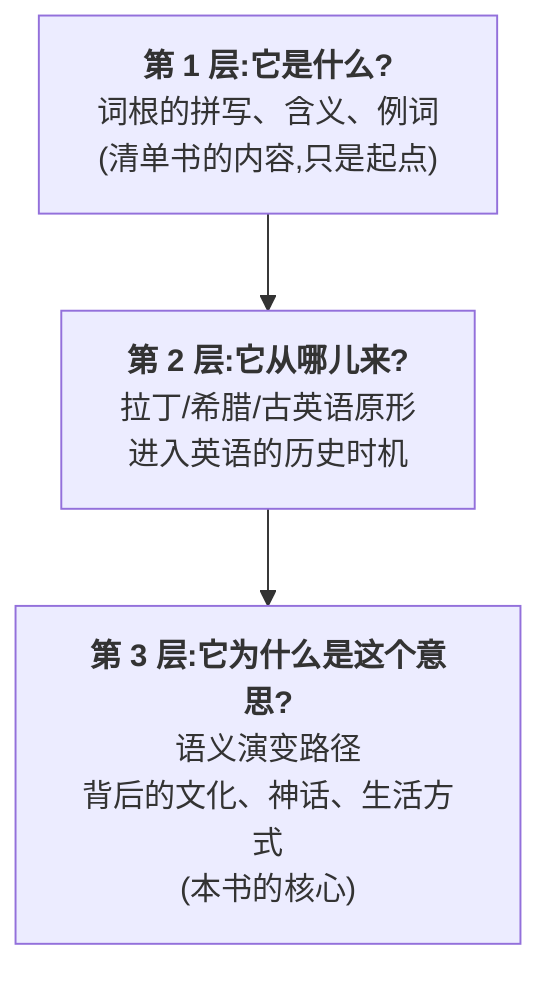
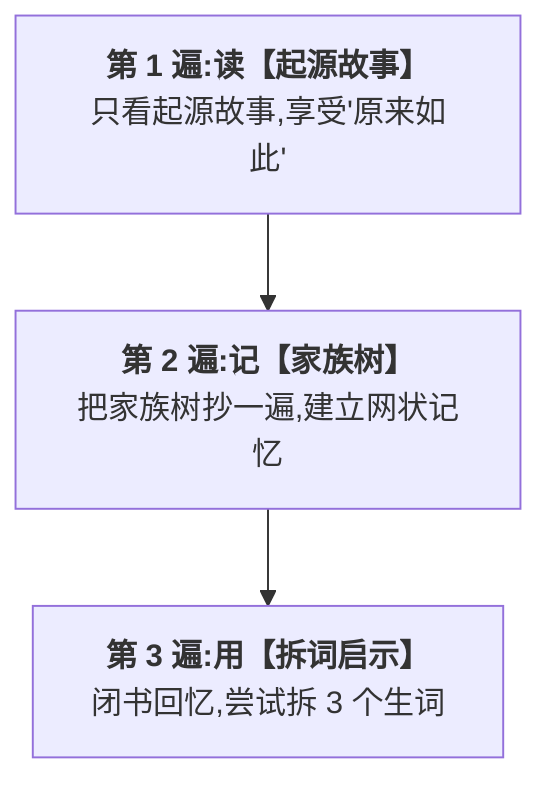

# 前言:为什么要从"起源"学词根

> 放心,这不是一份披着书皮的拉丁语刑法条文。词根当然要讲准,但没有哪条规定说,讲准以后必须板着脸。

## 一个让我改变写法的故事

我本来想给你写一本规规矩矩的词根词缀手册:按字母排序,词根 + 含义 + 例词,整整齐齐,像超市货架一样一尘不染,也像超市货架一样让人只想拿了东西赶紧走。

直到我读到 `salary`(薪水)这个词的两种讲法。

一种是**流行的故事**:古罗马士兵直接领取盐,或领取专门购买盐的津贴,因此有了 *salarium*。这个故事很有画面,却没有可靠的古代证据。

另一种是**较稳妥的结论**:**拉丁语 *salarium* 与 *sal*(盐)有词源关系**,但"盐"究竟指盐本身、运盐费用、还是某种与盐相关的职务津贴,古代文献没有给出明确答案——它怎样从"与盐有关的给付"发展成一般津贴,细节并不确定。英语后来经法语借入这个词,形成今天的 `salary`。

这次查证让我记住了一串与盐有关的词,也记住了更重要的一课:**好记的故事不一定是真实的历史**。

- **salt** 盐(与拉丁 *sal* 同源的日耳曼词)
- **salad** 沙拉(经法语、意大利语追溯到拉丁 *salata* "加盐的")
- **salami** 萨拉米香肠(意大利语,与腌盐有关)
- **salary** 薪水(来自与盐有关的拉丁 *salarium*,具体语义路径仍有争议)

**一个经过辨正的故事,既能锚定词族,也能训练我们分辨证据和传说。**

那一刻我意识到:**词根词缀书最大的失败,就是把迷人的故事拆解成了枯燥的清单。** 一个词根从来不是一串字母,它背后是一个民族的生活方式、一段历史、一个神话、一次战争、一位皇帝的命令。

所以这本书决定做一件稍微不那么像说明书的事:把故事还给词根,把打瞌睡的风险留给别的书。

---

## 为什么"故事"比"清单"有效

人类通常更容易记住有因果、有冲突的叙述,而不是孤零零的项目清单。换句话说,大脑喜欢追剧情,不太喜欢替表格加班。

| 维度 | 清单记忆 | 故事记忆 |
| ------ | ------ | ------ |
| 典型形态 | `salary = 薪水` | `sal → salarium → salary` |
| 特点 | 抽象符号 | 有路径、有证据边界 |
| 保持时间 | 约 2 天 | 数月 |

故事之所以有效,因为它提供了三样清单无法提供的东西:

1. **画面**——具体场景能把抽象形式固定在记忆里
2. **路径**——你看到词形和词义怎样逐步变化,而不是只背结论
3. **校验**——你会追问哪些部分有文献支持,哪些只是后人的解释

> 这本书的每一条词根,都努力给你一个"原来如此"的瞬间。

---

## 这本书探究的三个层次

对每一个词根词缀,我会带你挖到三层:

举三个例子让你感受这三层:

### 例 1:`disaster`(灾难)

| 层次 | 内容 |
| ------ | ------ |
| 第 1 层 | dis- + aster,意思是"灾难" |
| 第 2 层 | 意大利语 disastro,来自拉丁 dis- (坏) + 希腊 astron (星星) |
| 第 3 层 | **古人相信星象决定命运,星位不对就是"灾星"**——所以 dis-aster 字面义是"坏星"。占星术的迷信,凝固成了这个词 |

下次你写 `disaster`,脑子里会闪过一颗"灾星"。

### 例 2:`muscle`(肌肉)

| 层次 | 内容 |
| ------ | ------ |
| 第 1 层 | 拉丁词根 mus (老鼠),意思是"肌肉" |
| 第 2 层 | 拉丁 musculus,是 mus (老鼠) 的指小词 |
| 第 3 层 | **古罗马人看胳膊上起伏的肌肉,觉得像一只在皮肤下蠕动的小老鼠**——于是叫它"小老鼠"(musculus)。这个奇特的联想,穿越两千年,变成今天的 muscle |

所以 `muscle` 和 `mouse`(老鼠)是亲戚,都来自印欧语系词根 *mus-。你也理解了为什么肌肉学叫 `myology`(希腊文 my- 也是"老鼠")。

### 例 3:`companion`(同伴)

| 层次 | 内容 |
| ------ | ------ |
| 第 1 层 | com- + pan + -ion,意思是"同伴" |
| 第 2 层 | 拉丁 com- (一起) + panis (面包) |
| 第 3 层 | **"同伴"字面义是"和你一起分面包吃的人"**。在古罗马,能和你分一块面包的人,就是最亲近的人。这个词凝固了古人对"友谊"最朴素也最动人的定义:共享食物 |

> 读完这三个故事,`disaster`、`muscle`、`companion` 这三个词,你大概一辈子忘不掉了。这就是起源的力量。

---

## 一种诚实的态度:词源不都是故事

必须坦白一件事:**不是所有词根都有精彩的故事**。

有些词根的来历很平淡:"它来自拉丁语 X,X 来自原始印欧语 *Y,意思是 Z"。没有神话,没有皇帝,没有战争。

更麻烦的是,**很多广为流传的词源故事其实是假的**——叫做"**民间词源(folk etymology)**"。比如:

> **民间说法**:`sincere`(真诚的)来自拉丁 `sine cera` "没有蜡"——据说罗马石匠用蜡填补大理石雕像的瑕疵,"没有蜡"就是"无瑕疵的、真诚的"。
>
> **真实词源**:这个词确实来自拉丁 `sincerus`,但"没有蜡"的解释**没有古代文献证据**,是后人附会的。`sincerus` 的更可能词源与原始印欧语词根有关,表"整体的、未混合的",但学者意见不一。

本书的态度:

- **真实故事优先** —— 凡是有据可查的,我讲真实的
- **传说明确标注** —— 凡是流行但可疑的,明确告诉你"这是传说",必要时仅作为文化背景保留
- **争议如实呈现** —— 学术界有分歧的,我列出主流观点,不装确定

我不会为了让故事好听而编造词源。**故事性服务于真实性,而不是反过来。**

---

## 这本书不能做什么

诚实地说清楚边界:

1. **不能让你不背单词** —— 故事能帮你记词根,但具体单词的搭配、用法、辨析,还得在阅读中积累
2. **不能拆解所有英语词** —— 借词(`tsunami`)、复合词(`blackbird`)、缩略词(`radar`)不在拆词法范围内
3. **不能保证词源 100% 准确** —— 词源学本身是严谨但有限的学科,有些词的来源至今无法确定。我会标注不确定性

---

## 怎么读这本书

三种读法,按需选择:

| 读法 | 怎么读 | 适合谁 |
| ------ | ------ | ------ |
| **顺序读法**(推荐) | 从前言 → 第 1 卷(阅读准备)→ 按文明源流顺序读完,像读一部历史书 | 第一次系统学习的人 |
| **主题读法** | 对某个文明感兴趣,直接跳到那一卷(如只读"希腊之光") | 已有基础、按兴趣深入 |
| **查阅读法** | 遇到生词想查词根,用附录索引反向定位到对应章节 | 临时查词、查漏补缺 |

每一章的篇幅控制在**一个完整的起源故事 + 一组同根词** —— 适合每天睡前读一两章,像读故事集。

### 书中的板块标签

每个词根的故事都按固定板块展开,用方括号标签标注,方便你快速定位:

| 标签 | 内容 |
| ------ | ------ |
| 【起源故事】 | 词根/词缀的来历,本书核心 |
| 【家族树】 | 可视化的同根词族(Mermaid 图) |
| 【代表词深讲】 | 精选 2-3 个词,讲演变故事 |
| 【词源辨正】 | 民间词源 / 学术争议 / 易错点 |
| 【拆词启示】 | 这条词根如何帮你拆解/记忆英语词 |
| 【思考题】 | 章末练习,答案在附录 D |

### 三层阅读法

每一条词根,建议读三遍:

---

## 致读者

如果你曾经背词根词缀背到崩溃,觉得它是一堆无意义的字母组合——我希望这本书能让你改观。

词根不是字母,是**凝固的历史**。每一根背后,都有一群人、一段文明、一种生活方式在说话。

当你知道 `salary` 与盐词族有关但"士兵领盐"缺乏证据,也理解 `companion` 和 `disaster` 的历史构造——你不只是在背单词,还在学习怎样重建、核验一条词源路径。

这才是词根词缀本该有的样子。

准备好了吗?我们从"英语的曾祖父"——印欧语系——开始。

---

*下一章 → [第 1 章 印欧语系:英语的曾祖父](../01-阅读准备/第01章-印欧语系.md)*
