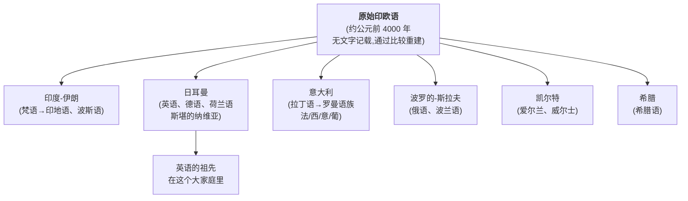
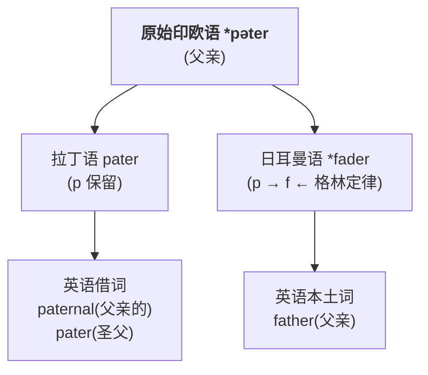
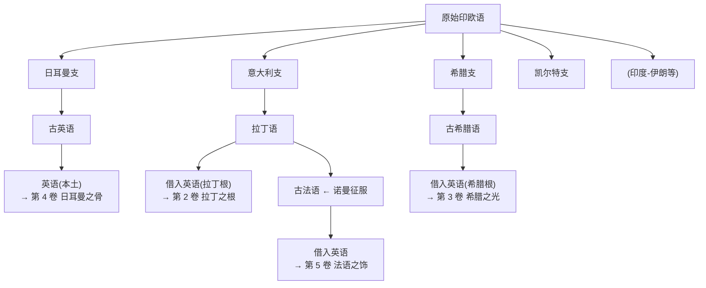
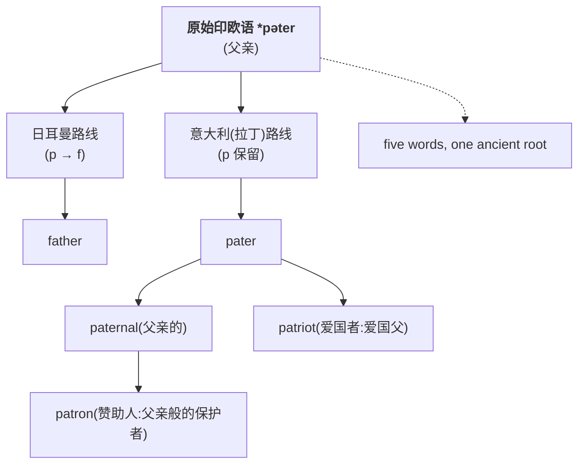

# 第 1 章 印欧语系:英语的曾祖父

> 六千年前的祖先没有留下录音、字幕或云端备份。语言学家接手的,基本是一桩证据散落全球的历史悬案。

在读任何一个具体的词根之前,我们先建立一个宏大的坐标系:**英语,从哪里来?**

答案会出乎很多人意料——英语的"曾祖父",不是不列颠岛上的原住民语言,而是一门**约六千年前、没有直接文字记录、今天无人能听到其原始发音**的语言。它叫**原始印欧语(Proto-Indo-European)**,简称 PIE;这里的 pie 不能吃,但能喂饱一整本词源书。

这一章,我要讲清楚三件事:

1. 这门"幽灵语言"是怎么被发现的
2. 它为什么能解释英语里大量"看似无关"的词为什么是亲戚
3. 这个发现如何改变了我们学词根的方式

---

## 1.1 一个六千年的谜:为什么"妈妈"全世界都叫 ma

先做个小游戏。请用下面这些语言说"妈妈"。这大概是语言学里最温柔的一次点名:

| 语言 | "妈妈" |
| ------ | ------- |
| 英语 | mother |
| 德语 | Mutter |
| 法语 | mère |
| 西班牙语 | madre |
| 拉丁语 | mater |
| 古希腊语 | mētēr (mētēr) |
| 梵语(古印度) | mātṛ |
| 俄语 | мать (mat') |
| …… | …… |

你会发现:**表中这些印欧语言的"母亲"一词,常出现 ma-/mat-/mēt- 一类相似形式。** 世界其他语系也常有含 m 音的亲属称谓,其中一部分可能与婴儿容易发出的声音有关;不能仅凭一个 `ma` 音就证明语言同源。

这不是巧合,也不是各民族互相借词。真相只有一个:

> **表中这些有系统音义对应的语言,都属于印欧语系,可追溯到重建的原始印欧语。**

大约五六千年前,这门语言可能由黑海—里海草原一带的史前群体使用。原乡和扩散模型仍有争论;草原假说得到较多语言学、考古学和古 DNA 研究支持。此后的人口迁徙、社会接触与语言替换,使相关语言逐步扩展到欧洲和亚洲多地。

经过数千年的分化与接触,原始印欧语的后裔形成了今天的**印欧语系(Indo-European languages)**。具体语言数量会随语言/方言划分和统计口径变化,无需记成一个固定数字。

---

## 1.2 一个天才的发现:琼斯法官的演讲

"印欧语系"这个概念不是自古以来就有的。它的发现,源于 **1786 年,印度加尔各答,一位英国法官的一次演讲**。

### 一个会太多语言的人

**威廉·琼斯爵士(Sir William Jones)**,白天是英国东印度公司派驻加尔各答的最高法院法官,晚上是孟加拉亚洲学会的创始人。*(传说)* 他是个语言怪兽——据说一生学过 28 种语言,希腊语、拉丁语、波斯语、阿拉伯语、希伯来语张口就来,到印度后又迷上了梵语。这个"28 种"的数字来自他朋友的追忆,可能注水,但他确实是那个时代欧洲最博学的脑袋之一。

1786 年 2 月 2 日,在孟加拉亚洲学会的一次演讲上,琼斯抛出了后来被称为"印欧语系奠基宣言"的一段话:

> *"梵语的结构比希腊语更完美,比拉丁语更丰富,比二者都更精致;然而在动词词根和语法形式上,它们如此相似,绝不可能是偶然产生的——这种相似如此强烈,以至于任何语言学家在仔细考察后都会得出结论:它们来自某个共同的源头。"*

一句话,炸开了语言学界。

### 为什么"梵语"的发现如此震撼欧洲

要理解琼斯这句话的分量,得回到 18 世纪的认知背景:欧洲人当时**根本不知道自己的语言和印度有什么关系**。拉丁语、希腊语是"我们的古典",希伯来语被当作人类最初的语言,印度?那是地图边缘一片朦胧的异域。

然后琼斯当众念出梵语的 `pitar`(父亲)、`matar`(母亲)、`bhratar`(兄弟),欧洲学者一听——这不就是我们的 `pater`、`mater`、`frater` 吗?音对得上,义对得上,变格也对得上。

这意味着一件骇人的事:**从冰岛的雷克雅未克到印度的恒河边,从英伦三岛到孟加拉湾,操着这些语言的人,六千年前是同一拨人。** 欧洲人和印度人是一家人——这个认知彻底改写了欧洲人对自身的理解。

### 一百年后的"逆向工程"

琼斯指出了方向,但真正"复原"那门母语的工作,花了一百多年。此后欧洲涌现出一代代语言学家(施莱格尔、拉斯克、葆朴、格林——对,就是下一节要讲的格林),他们用**比较法(comparative method)**:把梵语、希腊语、拉丁语、哥特语、古英语的同源词排成表格,像刑侦比对指纹一样,一点点倒推出那门没人听过、没人写过的六千年前母语。

重建出来的词根前面要加星号(如 `*pəter`、`*kerd-`),按学术惯例表示:**"这是推出来的,不是从碑上抄的。"** 这就是为什么你会在本书里反复看到带星号的词——每一个星号,都是语言学家在证据不足时诚实的标记。

---

## 1.3 关键证据:同源词(cognates)

证明这些语言同源的,是一组组**同源词(cognates)**——发音和意义都对应、来自同一个原始词根的词。

请看这张表,注意 `p / t / k` 在不同语言里的对应规律:

### 父亲

| 语言 | 词 | 原始印欧语 |
| ------ | ---- | ---- |
| 梵语 | pitár- | *ph₂tḗr |
| 古希腊语 | patēr | *ph₂tḗr |
| 拉丁语 | pater | *ph₂tḗr |
| 古英语 | fæder → father | (*p → *f,日耳曼语音变) |
| 原始印欧语 | *ph₂tḗr | |

→ 英语 `father`、拉丁 `pater`、希腊 `patēr`、梵语 `pitar` **是同一个词**。

### 三

| 语言 | 词 |
| ------ | ---- |
| 梵语 | trayas |
| 古希腊语 | treis |
| 拉丁语 | tres |
| 古英语 | þrēo → three |

→ 英语 `three`、拉丁 `tres`、希腊 `treis` 是同一个词。

### 为什么英语的 p 变成了 f?

回到上面那张表的最后一行:古英语的 father,前面的 f 是哪来的?拉丁 pater 明明是 p,希腊 patēr 也是 p,梵语 pitar 还是 p——凭什么到了英语,就偷偷换成了 f?

这是日耳曼语族独有的"叛逆"。而破解它的人,是 19 世纪德国学者**雅各布·格林**(Jacob Grimm)。

是的,**就是那个格林兄弟中的哥哥**。白天,他在书桌前比对日耳曼语和拉丁语的音变,写下了影响语言学两百年的《德语语法》;晚上,他和弟弟威廉一起搜集民间故事,编出了《白雪公主》《小红帽》《汉泽尔与格莱特》——也就是后来整个迪士尼帝国的精神源头。一个人同时是冷峻的语言学家和浪漫的童话采集者,这种反差本身就值得一本书。

格林在比较了上百组词之后,发现了一条规律:

> **格林定律(Grimm's Law)**:原始印欧语的三个清塞音,在日耳曼语族里发生了系统性的音变:
>
> | 原始印欧语 | 日耳曼语(含英语) | 例子 |
> | ----------- | ------------------ | ------ |
> | *p | **f** | pater → father;pisces(鱼)→ fish |
> | *t | **th** | tres → three;tu(你)→ thou |
> | *k | **h** | kan-(唱)→ hen;cor(心)→ heart |
> | *b | **p** | — |
> | *d | **t** | dent-(齿)→ tooth |
> | *g | **k** | genus(种类)→ kin |
> | *kw | **wh** | kwis(谁)→ who |

> **学习启示**:这就是为什么英语里同一个意思经常有"成对的词"——一个是日耳曼本土(短、口语),一个是拉丁/希腊借词(长、书面):
>
> - `father`(本土)vs `paternal`(拉丁)
> - `tooth`(本土)vs `dental`(拉丁)
> - `heart`(本土)vs `cardiac`(希腊)
> - `three`(本土)vs `triple`(拉丁)
>
> **它们都是六千年前同一对词根的子孙,只是走了不同的演变路线。**

---

## 1.4 原始印欧人的世界:词根如何凝固他们的生活

原始印欧语没有留下任何文字。但语言学家从它的后代语言里,反向重建出一部分词汇。这些词不是冷冰冰的字母——它们是六千年前那群人生活的化石:他们养什么、信什么、怎么数数,都凝固在词根里。

### 他们骑马

原始印欧语重建的 `*ekwos`(马)一路演化:拉丁语 *equus* → 英语 `equine`(马的)、`equestrian`(骑手的)。罗马的骑士阶层叫 *equites*——字面就是"有马的人",马在当时等于今天的跑车加军衔。同一个根在古英语里也曾有过 *eoh* 这个词,可惜后来消失了,把"马"的地盘让给了来自另一个词根的 *horse*。

### 他们信奉一位天空之父

这是全书最美的词源之一。重建词根 `*dyews` 原意是"光明、天空",后来演变成那位"天空之父"神:

- 拉丁 *deus*(神)、*Jupiter*(尤皮特)——后者字面拆开是 *dyeu-piter*,就是"天空之父"
- 希腊 *Zeus*(宙斯)——众神之王,住在奥林匹斯山顶
- 英语 `divine`(神圣的)、`Tuesday`——星期二,字面是 Tiw's day,纪念北欧战神 Tiw,而 Tiw 又和宙斯同根

**宙斯、尤皮特、北欧的 Tiw,本是同一个天空之父在不同语言里的化身。** 一个词根,六千年的迁徙,分裂出整片大陆的天空神。

### 他们会数到一百

重建词根 `*dkm̥tom`(百)留下了两条血脉:拉丁 *centum* → 英语 `cent-`(百分之一、century 百年);古英语 *hund* → 现代 `hundred`。同一个意思,英语里硬是保留了两套写法,只因为它们一千年前走了不同的路。

### 他们有一套完整的亲属称谓

父、母、兄弟、姐妹——这些词在几乎所有印欧语分支里都能找到对应(前面那张 `*ph₂tḗr` 的表就是证据)。亲属词是语言里最顽固的一类,因为它们天天在嘴边用,几乎不会被替换。这也是为什么我们能靠"妈妈"这个词的发音,反推六千年前那群人怎么称呼母亲。

> 词汇是凝固的历史,但不是史前生活的直接录像。下面每一组重建词都需要结合音变规律、早期文献和考古 DNA 才能站得住——具体的学术限定,见本章末"避坑提示"。

---

## 1.5 这本书后面的卷宗:四个孩子

原始印欧语分出来的子子孙孙很多,但**对英语词汇有直接、大量贡献的,只有四个分支**:

这四个分支,就是这本书后面四卷的来源:

| 卷 | 来源 | 进入英语的故事 | 带来什么 |
| ---- | ------ | -------------- | --------- |
| **第 2 卷 拉丁之根** | 古罗马的拉丁语 | 罗马统治不列颠、基督教传入、文艺复兴直接借词 | 学术、法律、医学词根 |
| **第 3 卷 希腊之光** | 古希腊语 | 文艺复兴时学者直接从希腊文献借词 | 科学、哲学、医学词根 |
| **第 4 卷 日耳曼之骨** | 古英语(盎格鲁-撒克逊) | 公元 5 世纪日耳曼部落渡海定居不列颠 | 日常最核心的词 |
| **第 5 卷 法语之饰** | 诺曼法语等 | 1066 年后英语、法语和拉丁语长期接触 | 多来源近义词及语体分化 |

---

## 1.6 一个关键认知:为什么学词根要懂印欧语系

你可能会问:"我只想背英语词根,为什么要绕这么大的圈子讲原始印欧语?"

答案:**因为它能让你看穿英语词汇的"亲属关系",记忆效率提升数倍。**

举个例子。请看这五个词:

> `father`(父亲)、`paternal`(父亲的)、`patriot`(爱国者)、`patron`(赞助人)、`patriarch`(家长)

表面看,`father` 和 `paternal` 没关系。但一旦你知道它们都来自原始印欧语 *pəter(父),并且经过了"格林定律"的 *p→f 转换:

五个词,一根同源。这种"亲属关系"的认知,**让你从"记 5 个孤立的词"变成"记 1 个家族网络"**——这就是词根词缀学习的最高境界。

---

## 1.7 避坑提示

本章为了讲故事,把一些复杂问题简化了。下面这些限定值得你记住:

- **琼斯不是印欧语系的"唯一发现者"**。在他之前,施莱格尔等人已有相似观察;琼斯的贡献是公开、有力地系统阐述了这一假说,引爆了后续研究。他"会 28 种语言"的传说来自友人追忆,具体数字未必准确。
- **原始印欧语的"原乡"和扩散路径仍有争议**。目前草原假说(Kurgan hypothesis)支持较多,但安纳托利亚农业扩散假说等也有学者主张。本书不站在任何一方的绝对立场上。
- **重建词根是推演,不是实证**。带星号的 `*pəter`、`*dyews` 是语言学家从后代语言倒推的最可能形式,并非从古代文献直接抄录。具体音值(怎么发音)学界也有分歧。
- **单个词根不能"证明"一整套社会制度**。说原始印欧人"养马"是基于 `*ekwos` 的重建 + 考古马拉战车证据共同支撑的假说,而不是一个词就能定案。神话、宗教、亲属制度的还原,都需要语言、考古、古 DNA 多重证据互证。
- **格林定律不是万能公式**。它解释了大部分日耳曼语音变,但也有例外(后来由弗纳定律补充)。遇到不规则的词,不能硬套。

---

## 1.8 本章小结

### 你应该带走的三个画面

1. **英语有一个 6000 岁的曾祖父**——原始印欧语,一门没有文字但被语言学家"重建"出来的幽灵语言。
2. **从冰岛到印度的语言,大多是亲戚**——梵语、希腊语、拉丁语、英语,同根同源,这是 1786 年琼斯法官的天才发现。
3. **格林定律解释了英语为何有"p/f 双词"**——`father` 和 `paternal` 同根,只是日耳曼支走了 *p→f 的路。

### 一个最重要的认知

> **学词根不是背字母组合,而是在看一个家族树。**
> 每条词根都是六千年家族史的一个分支,理解了家族,词汇自然成网。

---

### 思考题(答案见附录 D)

1. 用格林定律,解释为什么英语的 `two`(二)和拉丁语的 `duo`、希腊语的 `duo` 是亲戚?
2. `tooth`(牙齿)和 `dental`(牙的)看起来毫无关系,但它们其实同根。试着用格林定律解释(*d → *t)。
3. 思考:为什么英语 `hound`(猎犬)和拉丁 `canis`、希腊 `kyōn` 同根?(提示:*k → *h)

---

*下一章 → [第 2 章 英语词汇的五次关键输入](./第02章-英语词汇的五次关键输入.md)*
