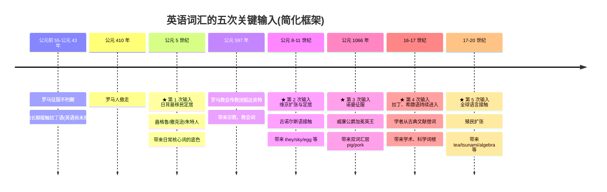
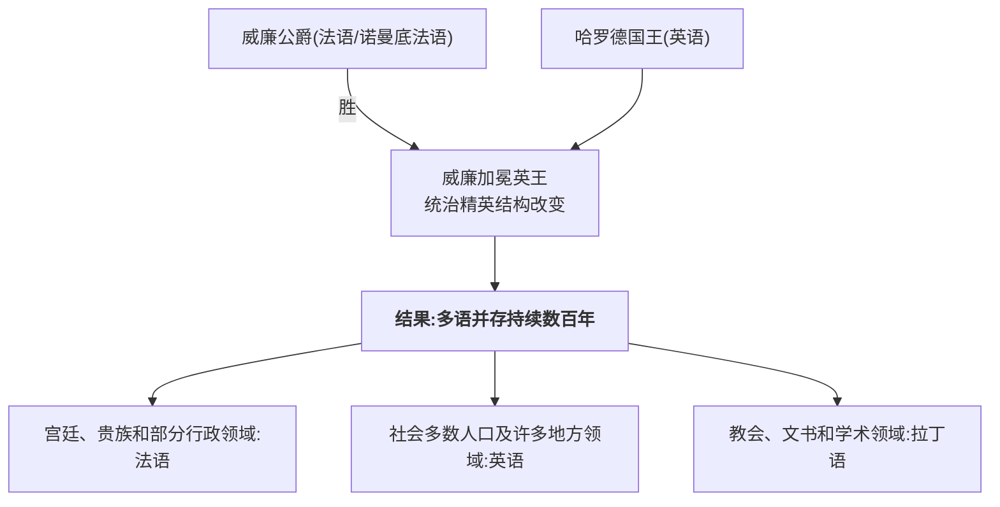
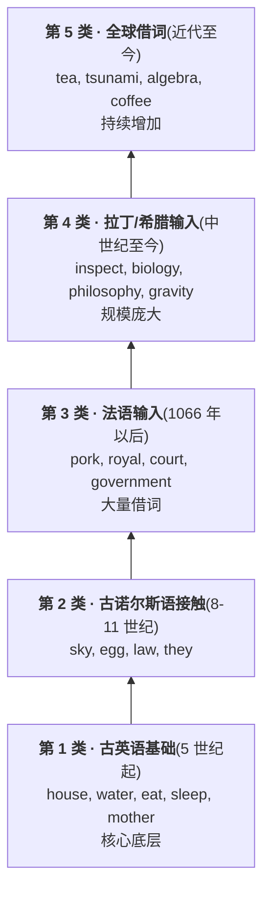
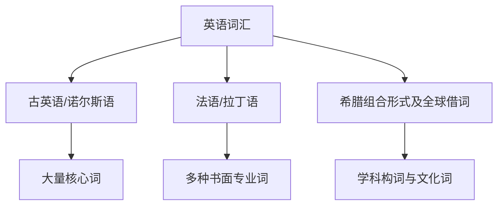

# 第 2 章 英语词汇的五次关键输入

> 英语词汇很像一套历史悠久的合租房:日耳曼语打了地基,北欧人搬来家具,法语占过客厅,拉丁语和希腊语长期往书房塞资料,后来全世界都寄来了快递。

第 1 章我们站在六千年的尺度上,看了英语的"曾祖父"原始印欧语。

这一章我们把镜头拉近,看**英语本身**——这门语言在不列颠岛上约 1500 年的历史中,如何经历**五次关键输入**并不断重组,最终形成今天庞大的词汇库。整个过程不像一次整洁的系统升级,更像边运行边装插件。

这五次输入不是彼此隔绝的地层,也不是英语词汇的全部来源。它们是一套便于入门的历史框架:古英语奠定语法和核心词汇,古诺尔斯语与古英语深度接触,法语改变许多社会领域的词汇,古典语言持续提供书面和专业资源,近代英语又从全球语言中借词。

---

## 2.1 先看全景,免得在历史里迷路

五个★标出本章采用的五个观察窗口。具体年代和边界并不整齐,下面按主要阶段展开。

---

## 2.2 第一次输入(公元 5 世纪):日耳曼移民定居

### 故事:雇主变成房东

公元 410 年,罗马军团从不列颠撤走——那道守了三百多年的边境线说不要就不要了。罗马人留下的,是空荡的城堡、一段段笔直的石板路,和一群失去保护的不列颠原住民。北边的皮克特人趁机南下劫掠,留在岛上的不列颠首领们急得像热锅上的蚂蚁。

于是,据 8 世纪学者比德在《英吉利教会史》里的记载,出现了一个后来被反复讲述的故事:*(传说)*一位名叫沃尔蒂格恩的不列颠首领想了个"妙招"——既然打不过北边的劫匪,那就**花钱请外援**。他从海峡对岸请来三船日耳曼战士:金发的**盎格鲁人**、彪悍的**撒克逊人**、住在日德兰半岛的**朱特人**。

请来的佣兵倒是能打,可问题是:打完仗,他们不肯走了。

*(传说)* 这些"受雇的保镖"反客为主,写信回老家喊亲戚:"快来!这里的土地肥,人好欺负,连路都是现成的!"于是渡海的船一拨接一拨,新来的日耳曼人从沿海据点慢慢向内陆推进,驱逐、融合、联姻、打仗——一两百年后,不列颠岛的南部和中部已经被这群新主人改了名字。后世常说的"**七国时代**(Heptarchy)"和"**公元 449 年**"是简化的概括,适合定位年代,但整个迁徙远比一个日期复杂得多。

这三拨新主人的老家分别是:

- **盎格鲁人(Angles)**:来自今天德国—丹麦边境的 **Angeln** 半岛
- **撒克逊人(Saxons)**:来自今天德国北部
- **朱特人(Jutes)**:来自今天丹麦日德兰半岛

他们说的语言属于**西日耳曼语支**,这就是 **古英语(Old English)** 的母体——后面所有故事的地基。

> **England 这个名字**
>
> "盎格鲁人的土地"古英语叫 **Engla land**,后来变成 **England**。而 **English** 来自古英语 *englisc*——"盎格鲁人的(语言)"。
>
> **Angles** /ˈæŋɡəlz/ 的名称可能与今石勒苏益格的 **Angeln** 地区有关;再向前是否与"钩、弯曲"有关并无定论。一个有点讽刺的细节:**盎格鲁人后来在老家反而消失了,却在陌生岛屿上留下了自己的名字——整个英格兰,都是用这群渡海佣兵命名的。**

### 第一次输入带来了什么

英语中大量最高频、最日常的词来自古英语。它们构成语言的"地基":

- 基础动词:`be, have, do, go, come, make, eat, drink, sleep`
- 基础名词:`man, woman, child, house, water, fire, day, night`
- 代词/介词/连词:`I, you, he, of, in, on, and, but`
- 身体部位:`hand, foot, eye, ear, heart`

不过不能说最高频词"几乎 100%"都来自古英语:`they` 等高频词来自古诺尔斯语,历史接触同样进入了核心词汇。

### 这一层词的特性

1. **短**(1-2 个音节)
2. **多为自由词根**(本身就是一个完整的词)
3. **常有不规则变化**:`go-went-gone`、`child-children`、`tooth-teeth`(这些不规则,正是古英语屈折变化的化石)

> **这一类词中有许多你已经会了**——它们是日常核心词,不需要主要依靠"词根"学习。本书第 4 卷"日耳曼之骨"会讲它们的故事,但作为背景知识,不是学习重点。

---

## 2.3 第二次输入(公元 8-11 世纪):古诺尔斯语接触

### 故事:龙首船出现在海岸上

公元 **793 年 6 月 8 日**,英格兰东北海岸外的**林迪斯法恩(Lindisfarne)**小岛上,一切如常。这是一座修道院,修士们抄经、祈祷、养羊,以为世界末日离自己很远。

直到海面上漂来几艘**船头雕着龙头的长船(longship)**。

林迪斯法恩被劫了。修士被杀,圣物被抢,祭坛被掀翻。消息传到欧洲大陆,查理大帝的宫廷学者阿尔昆写下这样的话:"我们和我们的祖先在这个国家住了近三百五十年,从未见过这样的恐怖——异教徒从海上来了,把上帝的圣所糟蹋成血泊。"

**这就是维京时代的开场炮。** 从这一刻起,将近三百年里,龙首船会反复出现在不列颠、爱尔兰、法兰西的海岸和河面上。

> **为什么长船这么可怕?** 维京的 **longship(长船)** 吃水浅、能张帆又能划桨,船头那只龙头既是装饰,也是吓退海怪的护身符。更要命的是,它能从海上**直接驶入内陆河流**——你退到河边以为安全了,抬头一看,龙首船已经追到了家门口。

### 从抢劫到占地

林迪斯法恩之后,维京人从**"抢劫"升级为"占地"**。他们不再只是夏天来抢一票就走,而是开始过冬、建寨、娶妻生子。英格兰北部和东部逐渐被说**古诺尔斯语(Old Norse)** /oʊld nɔrs/ 的丹麦人和挪威人占据,这片区域后来被叫做 **Danelaw** /ˈdeɪnˌlɔ/(丹麦法区)——字面就是"丹麦法律管的地方"。至于这场三百年拉锯里两位最有故事的国王——烤糊蛋糕的阿尔弗雷德、命令潮水的克努特——留到第 21 章慢慢讲。

### 这次接触带来了什么

维京人和盎格鲁-撒克逊人在**丹麦法区**长期杂居。奇妙的是,他们说的两种语言——古英语和古诺尔斯语——是近亲,基本能听懂对方。结果是双向渗透,而不是谁取代谁。

这次接触不仅留下 `sky`、`egg`、`law`、`window`(本义"风眼")、`husband`(本义"家主")等日常词,还干了一件更深的事:让 `they`、`them`、`their` 这一组**第三人称复数代词**进入英语核心语法——你知道代词有多顽固,能挤掉本土代词上位,说明这次接触有多深。某些词的具体传播路径仍有争议,但这种深度接触是确凿的。第 21 章将进一步讨论这种双向渗透。

---

## 2.4 第三次输入(1066 年以后):诺曼征服与法语接触

### 故事:改变英语的一天

1066 年的英格兰,运气差到像是被命运点名了。

年初,国王"忏悔者"爱德华驾崩,没留子嗣。王位立刻遭到三方争夺:英格兰贵族哈罗德被推上王座,但海峡对岸的诺曼底公爵**威廉**说"爱德华早就答应把王位给我",而挪威国王哈拉尔也凑上来声称"我也有份"。

哈罗德还没坐热王座,**北边先出事**。9 月,挪威国王哈拉尔率维京大军在约克附近登陆。哈罗德不得不率军从伦敦**急行军北上**,在 **9 月 25 日的斯坦福桥战役**中击杀哈拉尔,把维京人赶下了海——这是末代维京人对英格兰的最后一次大规模冲击。

刚打完这场硬仗,信使又追上来:**威廉公爵已经在南边的苏塞克斯登陆了。** 哈罗德只能带着疲惫之师**掉头急行军南下**,几乎一周内赶回英格兰另一端。这就是 1066 年的残酷之处:**北边刚打完维京人,南边又来了诺曼人,中间几乎没有喘息。**

### 1066 年 10 月 14 日:黑斯廷斯

决战发生在不列颠南部的**黑斯廷斯(Hastings)**。哈罗德的军队守在山脊上,排成盾墙;威廉的诺曼骑士带着弓箭手和骑兵,从坡下往上攻。战斗从清晨打到黄昏,几度反复——*(传说)* 有一阵子威廉被打得节节败退,诺曼军中甚至传出"公爵阵亡了"的谣言,威廉不得不摘下头盔、当面狂吼"**看我!我还活着!**"才稳住军心。

最后,哈罗德死了。**巴约挂毯(Bayeux Tapestry)**——这件将近 70 米长的刺绣是 11 世纪留下的真实史料——上面绣着一个战士被箭**贯穿眼睛**的画面,旁边的拉丁文写着"哈罗德国王被杀"。几百年来,人们普遍相信哈罗德就是被这一箭穿眼而亡(也有学者认为挂毯上那个战士的指认并不唯一)。但无论如何,**盎格鲁-撒克逊英格兰在这一天画上了句号。**

圣诞节那天,威廉在西敏寺加冕为英王**威廉一世**。从此法语母语的诺曼贵族统治英语母语的撒克逊平民,**长达三百年**。

这场征服是英语社会史和词汇史最重要的转折点之一——下面那对 pig / pork,就是从这一天埋下的伏笔。

诺曼法语及后来的英法语在宫廷、贵族、行政和法律领域影响很大,拉丁语继续用于教会与文书,英语则始终由社会多数人使用。数百年里,英格兰呈现一幅奇景:**城堡里说法语,教堂里说拉丁语,田埂上和市集里说英语。** 三种语言各占一块地盘,没有一道整齐的上下阶层边界,但确实给英语带来大量法语词。

### 第三次输入带来了什么

#### (1) 双词汇层:同一个意思,两个词

最有名的画面是这样的:撒克逊猪倌在泥地里用英语养猪,叫它 **pig**;猪被送进城堡的厨房,诺曼贵族用法语点这道菜,叫它 **porc**。同一个动物,活着是英语,上了餐桌是法语——阶级差异,**就这样凝固成了词汇的差异**。

| 古英语(农民养) | 法语(贵族吃) | 今天 |
| ---------------- | -------------- | ------ |
| **pig** 猪 | **pork** /pɔrk/ 猪肉 | porc(法) |
| **cow** 牛 | **beef** /bif/ 牛肉 | boeuf(法) |

> **为什么会有这样的双层?** 诺曼征服后的社会分工是常见解释:本族动物名用于日常饲养,法语词后来专指肉食。具体词义分化经历了较长过程(`pork`、`beef` 早期也能指动物),不能把整套对应压缩成"贵族一句话定下的规矩"。这里先认两组脸,完整对照和历史限定留到第 24 章。

#### (2) 正式 vs 口语:成对同义词

由于借入领域、使用历史和语体习惯不同,一些法语或拉丁来源词比相近的古英语词更正式。它是常见倾向,不是由词源自动决定的规则:

| 古英语(较日常) | 法语/拉丁来源词(有些语境较正式) |
| -------------- | ------------ |
| ask 问 | **inquire** /ˌɪnˈkwaɪr/ 询问 |
| buy 买 | **purchase** /ˈpɜrtʃəs/ 购买 |
| kingly 国王的 | **royal** /ˈrɔɪəl/ 王室的 |

> **学习启示**:正式程度要根据真实语料、搭配和语境判断。词源能解释一部分语体差异,但长词不必然更正式,本族词也不必然更口语。第 20、22、25 章会分别从日耳曼词特性、速查和写作语体继续展开,这里不把后面的表提前搬完。

---

## 2.5 第四次输入(中世纪至近代):拉丁、希腊语词汇

### 故事

前三拨房客好歹是带着行李亲自登门的;第四拨不一样——拉丁语和希腊语是被学者们用书本"搬运"进来的,动静不大,行李却最沉。

拉丁语在整个中世纪都是西欧教会、教育和学术的重要语言。文艺复兴及近代科学发展又扩大了从拉丁语、希腊语直接借词或利用古典组合形式造词的规模。

这些词有的在中世纪经法语进入,有的近代直接借入,还有些是在现代语言中用古典成分新造。常见特点包括:

1. **不同程度保留古典词形**
2. **多是书面/学术词**
3. **来自拉丁/希腊的"黏着词根"**——拆开后不能单独用,必须配缀

### 第四次输入带来了什么

英语的书面语和专业词汇中有大量拉丁、希腊来源成分,但不能把所有长词或难词都归于一次文艺复兴浪潮。

| 词根 | 来源 | 派生的英语词 |
| ------ | ------ | ------------ |
| `specere`(拉丁:看) | 拉丁/法语路线 | inspect, respect, spectator |
| `ducere`(拉丁:引导) | 拉丁/法语路线 | conduct, produce, introduce |
| `log-`(希腊:言辞、论说) | 希腊/拉丁路线及现代造词 | logic, psychology, biology |
| `graph-`(希腊:写) | 古典组合形式 | photograph, biography |

> **这一类古典成分是本书的"主战场"**。本书第 2 卷(拉丁之根)和第 3 卷(希腊之光),主要讲这些成分的来源和构词方式。

### 为什么这一类词往往较长、较"难"

因为文艺复兴学者借词时,**整词搬入,连拉丁/希腊的前缀后缀一起带进来**。所以你看到的不是 `spect`,而是 `in-spect-ation`、`re-spect-ive`、`intro-spect-ion`——前缀+词根+后缀,层层叠加。

这种"层叠"正是本书要讲的**词根词缀拼装的源头**。

---

## 2.6 第五次输入(近代至今):全球借词

### 故事:每一个词都是一段远洋旅程

大英帝国的殖民扩张,把英语带到了全世界;同时,**全世界也把词借给了英语**。这是英语词汇来源最杂、也最有故事的一浪。挑几个词,你看看它们走过多少路:

**algebra** /ˈældʒəbrə/(代数)。9 世纪的巴格达,**"智慧之家(Bayt al-Ḥikmah)"**——这是阿拔斯王朝的国家级学术中心,翻译家们把希腊、波斯、印度的典籍潮水般译成阿拉伯语。其中有一位波斯数学家,叫**花拉子密(al-Khwārizmī)**。他写了一本系统解方程的著作,书名叫 ***al-Jabr wa-l-Muqābala***——"还原与对消"。几百年后,这本书传到欧洲,**al-Jabr** 这个词被原样借入拉丁语再进入英语,变成了 **algebra**。而花拉子密自己的名字,经过一系列音变,变成了另一个我们天天在用的词:**algorithm** /ˈælɡəˌrɪðəm/(算法)。一个人,送了英语两个词。

**coffee(咖啡)。** *(传说)* 这个词的源头可以追到也门南端的**摩卡港(Mocha)**——中世纪阿拉伯世界最重要的咖啡出口港。也门的苏菲修士喝咖啡熬夜祈祷,商人则把它装船运出红海。之后,咖啡经**奥斯曼帝国**传遍伊斯兰世界(伊斯坦布尔的咖啡馆一度被视为煽动言论的温床,被苏丹短暂查禁),再由威尼斯商人传入欧洲,最后一路喝到伦敦——英语里 **coffee** 这个词的拼写,就凝固了它从阿拉伯语 *qahwa* 经土耳其语 *kahve* 一路借来的语音痕迹。一杯咖啡,半部世界贸易史。

**typhoon** /taɪˈfun/(台风)和 **ketchup** /ˈkɛtʃəp/(番茄酱):两个"多源传说"。这两个词特别好玩,因为它们身上**同时叠了好几条语音线索**,学者至今还在吵:

- **typhoon**:最早进入欧洲时,词形同时沾着**希腊语**(*tuphōn*,旋风怪物)和**阿拉伯语**(*ṭūfān*,大风暴)的影子;后来到了远东,又可能被汉语粤语的"**大风**"(*daaih fung*)重新"染"过一遍。三种语言,像三个人接力,共同把这个词塑成了今天的 typhoon。
- **ketchup**:今天蘸薯条的红酱,其祖先却是一种**闽南语的鱼酱**——*(待考证)* 学界主流说法是它源自闽南语 *"kê-tsiap"*（鳀鱼酱一类），经东南亚贸易语言进入英语,再传到美洲,被加进番茄,才变成今天你认识的番茄酱。从福建鱼酱到麦当劳小红盒,这条路也够远的。

每一个借词背后,都是一段漂洋过海的旅程。英语从**数百种语言**借过词,具体数量取决于如何区分语言、方言和中介来源,下面这张表只是沧海一粟:

| 来源 | 借词 | 本义 |
| ------ | ------ | ------ |
| **阿拉伯语** | algebra | al-jabr "复原、复位"(来自花拉子密著作标题) |
| | alcohol | al-kuḥl "粉末"(原指化妆品粉) |
| | coffee | qahwa(一种饮料名称) |
| **闽南语(经荷兰语)** | tea | *tê* 一类读音,经海上贸易进入欧洲语言 |
| **来源交织** | typhoon | 早期欧洲词形与希腊语、阿拉伯语有关,后来可能又受汉语"大风"影响 |
| | ketchup | 可能经东南亚贸易语言追溯到闽南语鱼酱名称,路径有争议 |
| **日语** | tsunami /tsuˈnɑmi/ | 津波(港湾的波) |
| | karaoke /ˌkæriˈoʊki/ | kara(空)+ oke(管弦乐) |
| **印地语/乌尔都语,词源上来自波斯语** | pajamas /pəˈdʒɑməz/ | *pāy-jāma*(腿衣) |
| **印地语** | shampoo /ʃæmˈpu/ | *chāmpo*(按压、按摩) |
| **他加禄语** | boondocks /ˈbunˌdɑks/ | *bundok*(山),美国军人在菲律宾接触后带入英语 |

> **注意**:整词借入英语,不等于它在来源语言中不可分析。`algebra`、`tsunami` /tsuˈnɑmi/ 等词不能按英语或拉丁、希腊词缀硬拆,但可以研究其来源语言内部的结构。

---

## 2.7 五次关键输入总览

五拨房客陆续搬进来,现在该点个名、拍张合照了。下面这张表就是英语词汇的"全家福"——拍完你会发现,最安静的那个反而占了最大的沙发。

> 这是来源框架,不是词长、语体或规则性的硬性等级。

### 五类输入的常见特征

| 层 | 来源 | 风格 | 词长 | 例 |
| ---- | ------ | ------ | ------ | ---- |
| 1 古英语 | 西日耳曼 | 语法词与日常核心词很多 | 多较短 | eat, house, mother |
| 2 古诺尔斯语 | 北日耳曼 | 日常词及部分代词 | 多较短 | sky, law, they |
| 3 法语 | 罗曼 | 法律、行政、饮食等领域突出 | 不定 | royal, court, pork |
| 4 拉丁/希腊 | 古典语言 | 书面、学术和专业构词资源丰富 | 常可分析 | inspect, philosophy |
| 5 全球借词 | 各地 | 文化、物产和技术词 | 不定 | tea, tsunami |

---

## 2.8 一个关键认知:多来源共存,边界会重叠

这些来源并非互相替代,而是在长期使用中重叠、分化。下面各组是**语义相关词**,并非严格同义词。

同一个意思,四拨房客各写了一张标签贴在冰箱上——谁也没撕掉谁的,于是英语的冰箱门就越来越花:

### "看"

| 层 | 词 | 用法 |
| ---- | ---- | ---- |
| 古英语 | **see** | 日常最常用 |
| 法语 | **view** | 较正式 |
| 拉丁 | **inspect / observe** | 学术、检查 |
| 希腊 | **scope** /skoʊp/(telescope) | 仪器 |

### "心"

| 层 | 词 | 用法 |
| ---- | ---- | ---- |
| 古英语 | **heart** | 日常 |
| 法语 | **courage** /ˈkɜrədʒ/ | 抽象义 |
| 拉丁 | **cordial** /ˈkɔrdʒəl/ | 抽象义(都来自 cor "心") |
| 希腊 | **cardio-** | 医学(cardiology 心脏病学) |

### "水"

| 层 | 词 | 用法 |
| ---- | ---- | ---- |
| 古英语 | **water** | 日常 |
| 拉丁 | **aquatic / aquarium** | 较正式 |
| 希腊 | **hydro-** | 科学(hydrogen 氢) |

> **学习启示**:
>
> - 短而高频的词经常来自古英语或古诺尔斯语,但必须逐词确认
> - 许多书面、专业词包含拉丁或希腊成分,可尝试识别其历史组合形式
> - 这就是为什么本书的"词根"内容,主要集中在第 2、3 卷(拉丁、希腊)

---

## 2.9 史实与传说

- **传说归传说,年表归年表。** "公元 449 年"和"七国时代"是方便记忆的标签,不是精确到年的史实;本章凡标注 *(传说)* 的细节,反映的历史背景是真的,但细节不能当纪录片看。黑斯廷斯战役及相关传说见第 23 章,`pig/pork` 的长期分化见第 24 章。
- **借词词源经常"多源交织"。** `typhoon` /ˌtaɪˈfun/、`ketchup` /ˈkɛtʃəp/ 同时沾着多种语言的痕迹,硬归给一个源头,就像争论一道混合咖喱到底算印度菜还是英国菜。

---

## 2.10 为什么这段历史对学习者重要

读完这一章,你应该建立一个**心智模型**:

1. **英语词汇来自多轮接触**——古英语是基础,古诺尔斯语、法语、拉丁语、希腊语和全球语言又不断加入并重组。
2. **1066 年是重要转折点,但不是单一解释钥匙**——`pig/pork` 等分化来自长期的社会语言接触,不能压缩成整齐的阶级故事。
3. **词源提示的是概率,不是规则**——来源、长度、正式程度和词义相关,却不能彼此直接等同。

---

### 【思考题】(答案见附录 A)

1. `kingly / royal / regal` 三个词都表示"国王的",它们分别来自哪一层?(提示:第一个日耳曼、第二个法语、第三个拉丁)
2. 为什么 `cow`(牛)和 `beef` /bif/(牛肉)成对出现,且一个是短词、一个是长词?
3. `tea` 最终来自哪一类汉语读音,又经过哪种欧洲语言进入英语?

---

*下一篇 → [第 2 卷 拉丁之根:第 3 章 从台伯河到泰晤士河](../02-拉丁之根/第03章-拉丁语如何进入英语.md)*
