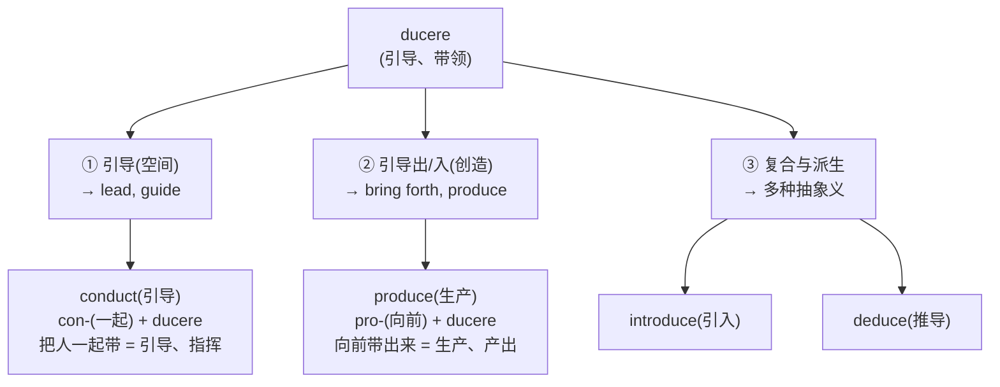
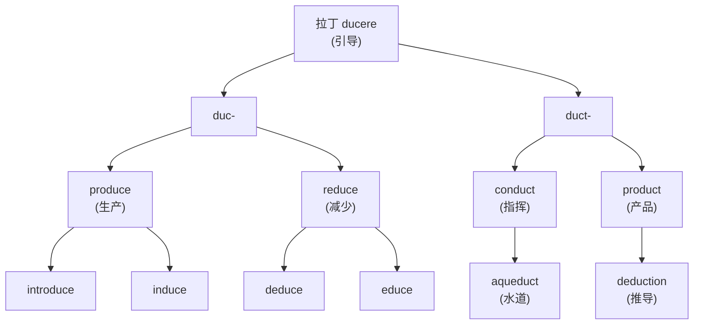
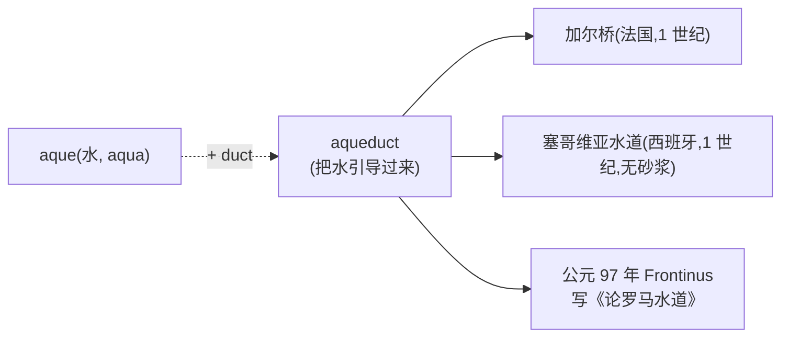
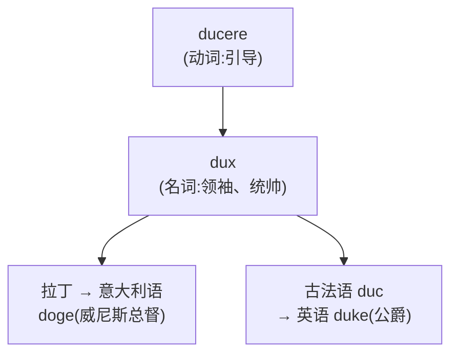

# 第 5 章 罗马人的"引导":ducere 家族

> 学 `ducere` 有个省心办法:把前缀当导航,把词根当司机。方向看对了,词义通常就不会把你拉去隔壁城市。

> **词根**:`duc-` / `duct-`
> **含义**:引导、带领、拉(to lead, to guide, to bring)
> **起源**:拉丁动词 ***ducere***("引导、带领"),来自原始印欧语 *deuk-("带领")

ducere 家族是英语里**高频的拉丁词根家族之一**。它生成的词出现在教育(`educate`)、生产(`produce`)、传导(`conduct`)、介绍(`introduce`)、减少(`reduce`)等大量核心词里,一位司机同时跑教育、工业和社交三条线。

更妙的是,ducere 的派生逻辑**相当清晰**——前缀通常告诉你"引导到哪里去",理解了方向,词义就容易浮现。偶尔有历史语义绕路,也别怪司机,那是路线用了两千年。

---

## 【起源故事】罗马人怎么"引导"

### 一个军事动作的延伸

公元前 3 世纪,高卢边境。罗马将军翻身上马,长矛指向前方旷野。身后是黑压压三个军团、几千头驮畜、几百辆辎重车。他举起手,长矛一指——整个队列开始向前蠕动。这个动作,拉丁语叫 ***ducere exercitum***:**带领军队**。

同一天,几百公里外,坎帕尼亚的某个农庄。黄昏,牧人挥着鞭子,把白天散在山坡上的羊**一只只牵回羊圈**。这个动作,拉丁语也叫 ***ducere***:**牵引牲口**。

将军和牧人,八竿子打不着,却共享同一个动词。因为 ***ducere*** 的核心画面就一个:**有人/东西在前面,有人/东西在后面,中间靠'引导'这个动作把它们连起来拽着走。** 它来自原始印欧语 *deuk-(带领),经过两千年还在英语里每天被人念叨。

> **ducere 的原始画面**:引导者在前面,被引导的人/物跟在后面,中间靠 ducere(引导)的动作牵引。像父母牵着孩子过马路,也像牧人拽着羊回家。

从这个"引导、带领"的核心义,派生出三个主要方向:



### ducere 的核心智慧:把"引导"的方向决定词义

ducere 家族最大的特点,是它的派生词**高度依赖前缀的方向**。前缀告诉你引导的方向,词义就清楚了:

| 前缀 | 方向义 | 派生词 | 推义 |
| ------ | ------ | ------ | ------ |
| `con-`(共同) | 引导到一起 | conduct | 引导、指挥 |
| `pro-`(向前) | 引导向前 | produce | 生产 |
| `e-`/`ex-`(向外) | 引导向外 | educe | 引出 |
| `re-`(回) | 引导回原处 | reduce | 减少、引回 |
| `in-`(入) | 引导进入 | induce | 诱导 |
| `de-`(向下) | 向下引导 | deduce | 推断 |
| `se-`(分开) | 引导开 | seduce | 引诱开 |
| `intro-`(向内) | 引导向内 | introduce | 介绍:引入 |

> **学法**:ducere 家族是这本书里**最适合用前缀导航**的一族。看到 `duce/duct` 开头的词,先看前缀指着哪个方向——`con-`(一起)、`pro-`(向前)、`re-`(回)、`in-`(进入)、`de-`(向下)、`se-`(分开)——方向对了,词义通常八九不离十。当然,两千年下来语义也会绕路(具体绕弯的案例见章末"避坑提示")。

### ducere 的两种拼写变体

| 词干 | 形态类型 | 例词 |
| ------ | ------ | ------ |
| `duc-` | 现在时词干 | produce, reduce, induce, educe |
| `duct-` | 过去分词词干 | conduct, product, deduct, aqueduct |

规律:

- 加 `-e`(动词后缀)的词,多用 `duc-`
- 加其他名词/形容词后缀的词,多用 `duct-`

---

## 【家族树】ducere 的子孙



> 注:`doctor`(医生/博士)和 `doctrine`(学说)来自另一拉丁动词 *docere*(教),其更早来源通常重建为 *dek-,不要与 *ducere* 的 *deuk- 合并。第 13 章将单独讲解。

---

## 【代表词深讲】四个词的故事

### 词 1:`educate`(教育)

**历史来源**:英语经中古英语和拉丁语借入 *educare*(养育、训练、教育)。

**故事**:

`educate` 直接来自拉丁 *educare*,核心义很朴素:**养育、训练、教育**。罗马人对一个孩子的 *educare*,包括喂他吃饭、教他规矩、训练他用武、领他读经典——一个"养大并调教成人"的过程。

但这里有个流传极广的**美丽误会**,值得单独说。

拉丁语里恰好有**两个长得很像的动词**:*educare*(养育、教育)和 *educere*(引出、带出)。两者词源上确实沾亲带故,但不是一回事,英语也分别继承了它们——`educate` ← *educare*,`educe` ← *educere*。然而正是这点"长得像",在后世催生了一个迷人的解释:

> *(流行误解 / 美丽的教育哲学)* "教育的真谛,是把孩子内在的潜能**引出来**(educere = e- '向外' + ducere '引导'),而不是把知识硬塞进去。"

这段话你可能在每一本教育学入门书里都见过——它优雅、深刻、动人心弦,被苏格拉底的"产婆术"、蒙台梭利、卢梭《爱弥儿》一路背书。唯一的问题是:**它不是 `educate` 的原始词源**。`educate` 老老实实来自 *educare*(养育),那个"把潜能引出来"的画面,是后人对 *educere* 的发挥,再被顺手嫁接到了长得一模一样的 `educate` 身上。

```mermaid
flowchart TD
    A["educare<br/>养育、训练、教育"] --> E1["→ educate"]
    B["educere<br/>带出、引出"] --> E2["→ educe"]
    B -.->|被后人借题发挥| N["\"引出潜能\"<br/>成为流行教育哲学<br/>但不是 educate 的原始词源"]
```

> **怎么看待这个误会?** 别急着拆穿它——它是个**精彩的民间教育哲学**,只是不该被当成词源学的结论。下次有人对你说"education 就是 leading out",你可以微微一笑:"理念我赞同,词源上呢,它其实更接近'把孩子养大'。"

**同根派生**:`education`(教育)、`educator`(教育者)、`educated`(受过教育的)

> **两个长得很像的兄弟,别搞混**:
>
> - *educare*:养育、训练、教育 → 英语 `educate`
> - *educere*:带出、引出 → 英语 `educe`(罕用,意为"引出、推断")
>
> 一字之差,意思大不相同。教育哲学家爱把两者黏在一起讲故事,语言学家却要把它们分开放进两个抽屉。

---

### 词 2:`produce`(生产)

**拆解**:`pro-`(向前)+ `duc`(引导)+ `-e`(动词后缀)= 向前引导

**故事**:

`produce` 字面义是"**向前引导出来**"。

想象古罗马的农民把田里的庄稼**从地里引导出来,摆到面前**——这就是 `pro-`(向前)+ `ducere`(引导)的画面。后来词义泛化成一切"产出、生产"。

> **produce 的画面**:田地(内部)里的庄稼(潜藏)──向前引导出来──> 市场(外部)的产品(显现)。produce = 向前带出来。

**派生词**:

- `product`(产品:被带出来的东西)
- `production`(生产)
- `productive`(多产的)
- `reproduce`(再生产:re- + produce)
- `by-product`(副产品)

---

### 词 3:`reduce`(减少)

**拆解**:`re-`(回)+ `duc`(引导)+ `-e`(动词后缀)= 引导回原处

**故事**:

`reduce` 字面义是"**引导回去**"。

这个词的画面是:把一个东西**从扩大的状态引回到原来的、较小的状态**。比如把军队从战地引回营地,把开出的酒量引回到原来瓶里——核心是"回到更小的状态",所以引申为"减少、缩减"。

> **reduce 的画面**:扩大状态引回到原来的、较小的状态——核心是"回到更小的状态",所以引申为"减少、缩减"。

**派生词**:

- `reduction`(减少)
- `reducible`(可减少的)
- `irreducible`(不可减少的)

> **小插曲**(化学里的 `reduction` 还原反应):化学上把"得到电子、氧化数降低"叫 reduction,这词不是凭空冒出来的——历史上炼金术士把矿石"还原"成金属,字面就是"把氧化物**引回**到金属单质"。`re-`(回)+ `ducere`(引导),把金属从矿石的牢笼里**引回家**。后来化学家扩展了定义(改成"得电子"),但词还是那个古老的词。

---

### 词 4:`introduce`(介绍)

**拆解**:`intro-`(向内)+ `duc`(引导)+ `-e`(动词后缀)= 引导向内

**故事**:

`introduce` 字面义是"**引导进入**"。

古罗马社交场合,把一个客人**引导进入**宴会厅,介绍给其他客人——这个动作就是 *introducere*。今天 `introduce` 仍保留两层义:把人介绍给彼此,或把某物引入某个领域(`introduce a new law` 引入新法律)。

**派生词**:

- `introduction`(介绍、导论:书的开头,把读者"引入"主题)
- `introductory`(介绍的、开篇的)

---

## 【番外·高潮】aqueduct:罗马人把山"引"进城

前面四个词都偏抽象。但 ducere 家族里有一个词,**至今还立在欧洲的大地上**,两千岁高龄,依然在水里倒映着罗马的影子——它就是 **`aqueduct`(罗马水道、渡槽)**。

**拆解**:`aque`(水,*aqua* 的变体)+ `duct`(引导)= **把水引导过来**。

### 一座水道,养活一座百万人口的城市

罗马城在帝国鼎盛期有上百万人口——比同时代的长安、巴格达都毫不逊色。这么多人怎么喝水?靠井?挖不了那么多。靠河?台伯河又浑又脏。罗马人的答案是:**把山泉水从几十公里外,用石头水道一路"引"进城**。

到公元 3 世纪,罗马城已经修了 **11 条水道**,每天向城里输送的水量估计 **超过 100 万立方米**——足够给每个市民一天分发 1000 升水(现代罗马人均日用水也不过 200 多升)。这些水流进公共浴场、喷泉、富人别墅的私家水管,甚至皇帝宫廷里能转动的水力机关。罗马人用石头和水,搭出了人类历史上第一个超大规模的市政供水系统。

### 这些水道,今天还在

最惊人的是,它们很多**还立着**:

- **法国加尔桥(Pont du Gard)**:公元 1 世纪,三层拱桥横跨加尔东河,高 49 米,堪称古代工程学的炫技之作。今天你站在桥下抬头看,依然会被那串完美对称的石拱震住。
- **西班牙塞哥维亚水道(Segovia Aqueduct)**:同样是 1 世纪,全长 813 米,166 个拱,最高处 28 米,**没有用一滴砂浆**——全靠石头本身的重量咬合。塞哥维亚人喝这条水道引来的水,一直喝到 1970 年代。
- **罗马本土**:克劳狄水道(Claudia)、玛尔齐亚水道(Marcia)的废墟今天仍矗立在罗马郊外,残柱断拱,直插天空。

### 公元 97 年,一位较真的水务官

罗马人对水道有多认真?公元 97 年,罗马的水务官 **塞克斯图斯·尤利乌斯·弗龙蒂努斯(Sextus Julius Frontinus)** 写了一本书,**《论罗马水道》(De Aquis Urbis Romae)**。他逐条列出每条水道的长度、流量、出处、修建年代,还痛斥私人用户私接水管偷水:"这些人比敌人还可恶!"——这大概是历史上第一本"水务审计报告"。今天的市政工程师翻开它,会发现两千年前的同行已经把账目记得明明白白。



> **金句**:今天我们拧开水龙头就有水,觉得很平常。其实这份"平常",是罗马人两千年前用石头和重力,把一座山"引"进城的结果。

**同根亲戚**:`viaduct`(高架桥,*via* 路 + *duct* 引导——把路引导过山谷)、`aqueduct` 的近亲 *aqueous*(水的)。`duct` 本身也是个独立词(管道、导管),所有"引导水/气/电的通道",都归这个家族管。

---

## 【词源辨正】ducere 和 duke(公爵)是亲戚吗

**答案:是。**

`duke`(公爵)来自拉丁 *dux*(领袖、统帅),与 *ducere* 同族——它表示**带领者**,不是"被引导者"。



所以 `duke` 字面义是"**引导者**"。欧洲的公爵(duchy)就是"由公爵领导"的领地。

### 番外:威尼斯总督(Doge)与"婚海礼"

ducere 这条血脉里,还有一位**最浪漫的"引导者"**——威尼斯总督,**Doge**。

`Doge` 这个词来自威尼斯方言,从拉丁 *dux*(领袖)变来,字面就是"**引导威尼斯共和国的那个人**"。从公元 7 世纪到 1797 年拿破仑废掉这个共和国,一千多年里,威尼斯的元首都叫 Doge。*(顺便说一句,加密货币圈那个"狗狗币"也叫 Dogecoin——但那个 Doge 来自一只柴犬的表情包 meme,和威尼斯总督只是"撞了名字",词源上毫无关系。)*

而 Doge 最有名的一件事,是一场持续了近八百年的仪式:**婚海礼**(意大利语 *Sposalizio del Mare*,英语 *Marriage of the Sea*)。

每年升天节(*Festa della Sensa*,复活节后第七个周日),威尼斯总督登上他专属的金碧辉煌的大船——**Bucintoro(布钦托罗号)**,在舰队、贵族、神职人员的簇拥下驶出利多海峡,进入亚得里亚海的辽阔水域。船行至海中央,总督举起一枚**金戒指**,郑重地把它扔进大海,同时念出那句流传了几个世纪的誓词:

> ***"Desponsamus te, mare, in signum veri perpetuique dominii."***
> **"我们与你结婚,哦大海,以此作为我们真实而永恒的统治之印。"**

*(仪式,真实历史)* 从大约公元 1000 年 Doge Pietro II Orseolo 第一次率舰队出海,到 1797 年威尼斯共和国灭亡,这场"婚礼"年年举行,风雨无阻。它宣告一件浪漫得有点霸道的事:**威尼斯共和国认为,亚得里亚海是它的"新娘",它是这片海的主人。**

> **金句**:别的国家向大海宣战,威尼斯向大海求婚。这一求,就是八百年。

ducere 的"引导"走到这里,从将军牵马、牧人赶羊,一路引到了一个海上共和国对自己领土的诗意宣誓——**一个动词,引出了一座城邦的命运**。

**同根兄弟**:`duct`(管道,引导水/气的通道)、`duchess`(女公爵)、`duchy`(公爵领地)、`Doge`(威尼斯总督)

---

## 【拆词启示】ducere 家族如何帮你记忆

学会这一根,这些词都能秒拆:

| 词 | 拆解 | 推义 |
| ---- | ------ | ------ |
| `conduct` | con- + duct | 引导到一起 → 指挥、传导 |
| `produce` | pro- + duce | 向前引导 → 生产 |
| `reduce` | re- + duce | 引导回 → 减少 |
| `educate` | 拉丁 educare | 养育、训练 → 教育(引出潜能是美丽误会) |
| `introduce` | intro- + duce | 向内引导 → 介绍 |
| `deduce` | de- + duce | 向下引导 → 推断(从一般到特殊) |
| `induce` | in- + duce | 引导进入 → 诱导 |
| `seduce` | se- + duce | 引导分开 → 引诱 |
| `aqueduct` | aque(水)+ duct | 引导水的 → 水道、渡槽 |
| `viaduct` | via(路)+ duct | 引导路的 → 高架桥 |

> **核心启示**:ducere 家族是这本书里最"听话"的一族——前缀指哪儿,词义多半就跟到哪儿。偶尔遇到两千年语义绕路的情况(见章末"避坑提示"),再单独记一下即可。

---

## 【避坑提示】

ducere 家族虽然"好拆",该留心的地方也得留心:

- **`educate` 来自 *educare*(养育),不是 *educere*(引出)**。"教育 = 引出潜能"是一段优美但流传过广的民间解释,不该当成 `educate` 的原始词源。详见本章"词 1"。
- **`ducere` 与 `docere`(教)不是一家**。*docere* → `doctor`(医生/博士)、`doctrine`(学说),它的原始印欧语根通常重建为 *dek-;而 *ducere* ← *deuk-。一字之差,源不同,不要把两家人合并成一家。*docere* 在第 13 章单独讲。
- **前缀 = 方向,不等于全部词义**。`conduct` 的"传导(电/热)"是从"引导"延伸出来的引申义,`seduce` 的"性诱惑"是"把人从正道上引开"的窄化——这些都要逐词记一下中间那一跳。
- **化学里的 `reduction`(还原)是术语演变**,不是把氧化物"引回"单质这一动作的字面翻译。词源提供画面,术语定义有自己的演化史。
- **`aqueduct` 流量"100 万立方米/天"是学者的估算区间**,不同文献给出的数字有出入(从 60 万到 100 多万不等)。本书取较常引用的上限,作为数量级感受即可。
- **婚海礼的"金戒指扔海"是真实仪式,但起止年份、誓词具体措辞各版本略有出入**。1000 年左右开始说、1797 年共和国灭亡停办,是主流叙事。

---

## 本章小结

### 你应该带走的三个画面

1. **ducere = 用手牵引、带领**——核心画面是"引导"。
2. **前缀 + ducere 常表示不同方向的引导**——pro-(生产)、e-(引出)、re-(减少)、intro-(介绍)。
3. **duc/duct 是同一根的两种拼写**——加动词后缀多用 duc,加名词后缀多用 duct。

### 记忆锚点

> **在 `ducere` 词族中,`duc/duct` 可先用"引导、带领"作记忆锚点;前缀图只是理解路径,不是逐字翻译公式。**

---

### 【思考题】(答案见附录 D)

1. `aqueduct`(渡槽)怎么拆?为什么"引导水的"等于渡槽?
2. `seduce`(引诱)字面义是"引导分开"——为什么引诱等于"引开"?(提示:把人从正道上引开)
3. `deduce`(推断)字面义是"向下引导"——为什么推断等于"向下"?(提示:从普遍原则向下推导到具体)

---

*下一章 → [第 6 章 罗马人的"投掷":jacere 家族](./第06章-jacere家族.md)*
