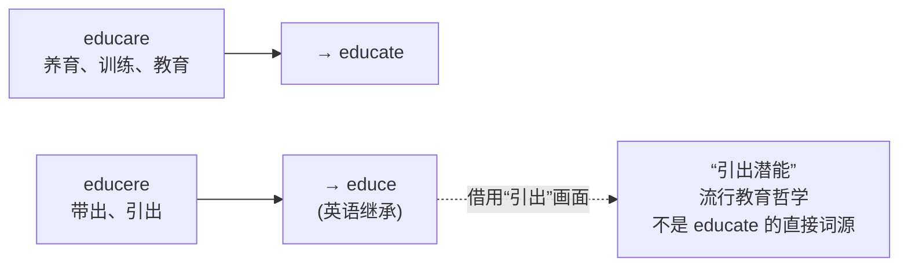
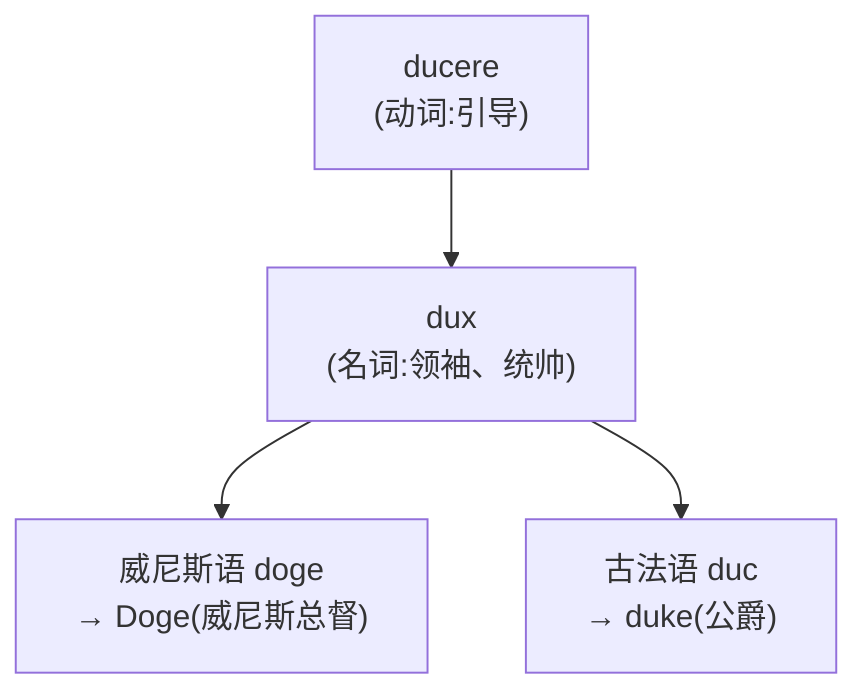

# 第 5 章 罗马人的引导：ducere家族

> 学 `ducere` 有个省心办法:把前缀当导航,把词根当司机。方向看对了,词义通常就不会把你拉去隔壁城市。

> **词根**:`duc-` / `duct-`
> **含义**:引导、带领、拉(to lead, to guide, to bring)
> **起源**:拉丁动词 ***ducere***("引导、带领"),来自原始印欧语 *deuk-("带领")

ducere 家族是英语里**高频的拉丁词根家族之一**。它生成的词出现在教育(`educate` /ˈɛdʒəˌkeɪt/)、生产(`produce` /prəˈdus/)、传导(`conduct` /kənˈdʌkt/)、介绍(`introduce` /ˌɪntrəˈdus/)、减少(`reduce` /rəˈdus/)等大量核心词里,一位司机同时跑教育、工业和社交三条线。

更妙的是,ducere 的派生逻辑**相当清晰**:前缀通常告诉你"引导到哪里去",理解了方向,词义就容易浮现。偶尔有历史语义绕路,也别怪司机,那是路线用了两千年。

---

## 【起源故事】罗马人怎么"引导"

### 一个军事动作的延伸

公元前 3 世纪,高卢边境。罗马将军翻身上马,长矛指向前方旷野。身后是黑压压三个军团、几千头驮畜、几百辆辎重车。他举起手,长矛一指,整个队列开始向前蠕动。这个动作,拉丁语叫 ***ducere exercitum***:**带领军队**。

同一天,几百公里外,坎帕尼亚的某个农庄。黄昏,牧人挥着鞭子,把白天散在山坡上的羊**一只只牵回羊圈**。这个动作,拉丁语也叫 ***ducere***:**牵引牲口**。

将军和牧人,八竿子打不着,却共享同一个动词。因为 ***ducere*** 的核心画面就一个:**有人或东西在前面,有人或东西在后面,中间靠"引导"这个动作把它们连起来拽着走。** 它来自原始印欧语 *deuk-(带领),经过两千年还在英语里每天被人念叨。

> **ducere 的原始画面**:引导者在前面,被引导的人或物跟在后面。像父母牵着孩子过马路,也像牧人拽着羊回家。

## 【家族树】ducere 的子孙

ducere 家族最大的特点,是它的派生词**高度依赖前缀的方向**。八个前缀,八条线路,司机还是同一个:

| 前缀 | 方向义 | 派生词 | 推义 |
| ------ | ------ | ------ | ------ |
| `con-`(共同) | 引导到一起 | conduct | 引导、指挥 |
| `pro-`(向前) | 引导向前 | produce | 生产 |
| `e-`/`ex-`(向外) | 引导向外 | educe | 引出 |
| `re-`(回) | 引导回原处 | reduce | 减少、引回 |
| `in-`(入) | 引导进入 | induce /ˌɪnˈdus/ | 诱导 |
| `de-`(向下) | 向下引导 | deduce /dɪˈdus/ | 推断 |
| `se-`(分开) | 引导开 | seduce /sɪˈdus/ | 引诱开 |
| `intro-`(向内) | 引导向内 | introduce | 介绍、引入 |

> **学法**:看到 `duce/duct` 开头的词,先看前缀指着哪个方向。方向对了,词义通常八九不离十。当然,两千年下来语义也会绕路,导航负责告诉你从哪儿出发,可没承诺终点永远不修路。

### ducere 的两种拼写变体

| 词干 | 形态类型 | 例词 |
| ------ | ------ | ------ |
| `duc-` | 现在时词干 | produce, reduce, induce, educe |
| `duct-` | 过去分词词干 | conduct, product, deduct /dɪˈdʌkt/, aqueduct /ˈækwəˌdʌkt/ |

一般来说,加 `-e` 的动词多用 `duc-`,加其他名词、形容词后缀的词多用 `duct-`。注意这是识词线索,不是交通法规:`conduct` 明明是动词,照样开着 `duct-` 上路。

> **别认错司机**:`doctor` /ˈdɑktər/(医生、博士)和 `doctrine` /ˈdɑktrən/(学说)来自另一个拉丁动词 *docere*(教)。两家门牌号像,姓不一样,别并户。

---

## 【代表词深讲】四个词的故事

### 词 1:`educate` /ˈɛdʒəˌkeɪt/(教育)

`educate` 直接来自拉丁 *educare*,核心义很朴素:**养育、训练、教育**。罗马人对一个孩子的 *educare*,包括喂他吃饭、教他规矩、训练他用武、领他读经典,也就是一个"养大并调教成人"的过程。

但这里有个流传极广的**美丽误会**,值得单独说。

拉丁语里恰好有两个长得很像的动词:*educare*(养育、教育)和 *educere*(引出、带出)。英语也分别继承了它们:`educate` 来自 *educare*,`educe` 来自 *educere*。然而正是这点"长得像",在后世催生了一个迷人的解释:

> *(流行误解 / 美丽的教育哲学)* "教育的真谛,是把孩子内在的潜能**引出来**(educere = e- '向外' + ducere '引导'),而不是把知识硬塞进去。"

这段话优雅、深刻、动人心弦,唯一的问题是:**它不是 `educate` 的直接词源**。`educate` 老老实实来自 *educare*(养育),那个"把潜能引出来"的画面,是后人对 *educere* 的发挥,再被顺手嫁接到了长得很像的 `educate` 身上。

> **怎么看待这个误会?** 别急着拆穿它。它是个**精彩的教育哲学**,只是不该被当成词源学结论。下次有人说"education 就是 leading out",你可以微微一笑:"理念我赞同。词源上呢,它其实更接近把孩子养大。"

**同根派生**:`education`(教育)、`educator` /ˈɛdʒəˌkeɪtər/(教育者)、`educated` /ˈɛdʒəˌkeɪtɪd/(受过教育的)

---

### 词 2:`produce` /prəˈdus/(生产)

**拆解**:`pro-`(向前)+ `duc`(引导)+ `-e`(动词后缀)= 向前引导

`produce` 字面义是"**向前引导出来**"。

想象古罗马的农民把田里的庄稼**从地里引导出来,摆到面前**。这就是 `pro-`(向前)+ `ducere`(引导)的画面。后来词义泛化成一切"产出、生产"。

> **produce 的画面**:田地里的庄稼,一路被领到市场上。`product` /ˈprɑdəkt/ 是被带出来的东西,`production` 是往外带的过程,`productive` /prəˈdʌktɪv/ 则表示这块地很会往外带东西。

---

### 词 3:`reduce` /rəˈdus/(减少)

**拆解**:`re-`(回)+ `duc`(引导)+ `-e`(动词后缀)= 引导回原处

`reduce` 字面义是"**引导回去**"。把一个东西从扩大的状态引回原来的、较小的状态,词义就从"带回"走到了"减少、缩减"。比如把军队从战地引回营地,或者试图把已经倒进杯里的酒引回瓶里。前一个叫撤军,后一个通常叫后悔。

**同根派生**:`reduction` /rɪˈdʌkʃən/(减少)、`reducible` /rɪˈdusəbəl/(可减少的)、`irreducible`(不可减少的)

> **小插曲**:化学里的 `reduction` 叫"还原"。早期炼金术士把矿石还原成金属,仿佛把金属从矿石的牢笼里**引回家**。现代化学已经把定义扩展为"得到电子、氧化数降低",考试时请听化学老师的,不要只听两千年前的司机。

---

### 词 4:`introduce` /ˌɪntrəˈdus/(介绍)

**拆解**:`intro-`(向内)+ `duc`(引导)+ `-e`(动词后缀)= 引导向内

古罗马社交场合,把一个客人**引导进入**宴会厅,介绍给其他客人,这个动作就是 *introducere*。今天 `introduce` 仍保留两层义:把人介绍给彼此,或把某物引入某个领域(`introduce a new law` 引入新法律)。

书的 `introduction` /ˌɪntrəˈdʌkʃən/(导论)也很懂待客之道:先在门口迎接读者,再把他领进主题。至于读者进门后有没有迷路,那是正文的责任。

---

## 【番外·高潮】aqueduct:罗马人把山"引"进城

前面四个词都偏抽象。但 ducere 家族里有一个词,**至今还立在欧洲的大地上**,两千岁高龄,依然在水里倒映着罗马的影子。它就是 **`aqueduct` /ˈækwəˌdʌkt/(罗马水道、渡槽)**。

**拆解**:`aque`(水,*aqua* 的变体)+ `duct`(引导)= **把水引导过来**。

### 一座水道,养活一座百万人口的城市

罗马城在帝国鼎盛期有上百万人口。这么多人怎么喝水?靠井?挖不了那么多。靠河?台伯河又浑又脏。罗马人的答案是:**把山泉水从几十公里外,用石头水道一路"引"进城**。

到公元 3 世纪,罗马城已经修了 11 条水道。水流进公共浴场、喷泉、富人别墅的私家水管,甚至皇帝宫廷里的水力机关。别人修路让人走,罗马人修路让水走,而且水还不用发工资。

### 这些水道,今天还在

- **法国加尔桥(Pont du Gard)**:公元 1 世纪,三层拱桥横跨河谷,高 49 米。今天站在桥下抬头看,依然会被那串完美对称的石拱震住。
- **西班牙塞哥维亚水道(Segovia Aqueduct)**:同样建于罗马时代,166 个拱,最高处约 28 米,没有使用砂浆,全靠巨石本身的重量咬合。石头彼此沉默了两千年,合作得比不少项目组还好。
- **罗马本土**:克劳狄水道、玛尔齐亚水道的残柱断拱,今天仍站在罗马郊外,替这个词根做着露天广告。

### 公元 97 年,一位较真的水务官

罗马人对水道有多认真?公元 97 年,水务官 **塞克斯图斯·尤利乌斯·弗龙蒂努斯(Sextus Julius Frontinus)** 写下《论罗马水道》。他逐条记录水道的长度、流量、出处和修建年代,还痛斥私人用户私接水管偷水。这大概是历史上最早的一批"水务审计报告":两千年前的同行不仅会修管道,也已经开始为跑冒滴漏头疼。

> **金句**:今天我们拧开水龙头就有水,觉得很平常。其实这份"平常",是罗马人两千年前用石头和重力,把一座山"引"进城的结果。

**同根亲戚**:`viaduct` /ˈvaɪədəkt/(高架桥,*via* 路 + *duct* 引导,把路引过山谷)。`duct` 本身也是个独立词(管道、导管),所有"引导水、气的通道",都归这个家族管。

---

## 【词源辨正】ducere 和 duke(公爵)是亲戚吗

**答案:是。**

`duke` /duk/(公爵)来自拉丁 *dux*(领袖、统帅),与 *ducere* 同族。它表示**带领者**,不是"被引导者"。

所以 `duke` 字面义是"**引导者**"。欧洲的公爵领地 `duchy` /ˈdʌtʃi/,也就是由这位"引导者"带队的地盘。

### 番外:威尼斯总督与"婚海礼"

ducere 这条血脉里,还有一位**最浪漫的引导者**:威尼斯总督 **Doge** /doʊdʒ/。这个词从拉丁 *dux* 变来,字面就是"引导威尼斯共和国的那个人"。顺便说一句,狗狗币的 Doge 来自柴犬表情包,只是和总督撞了名字,不代表总督上班时也会汪汪叫。

Doge 最有名的一件事,是一场持续了数百年的仪式:**婚海礼**。每年升天节,总督登上金碧辉煌的礼船,在舰队、贵族和神职人员簇拥下驶入亚得里亚海。到了海中央,他把一枚金戒指扔进水里,郑重宣告:

> **"我们与你结婚,哦大海,以此作为我们真实而永恒的统治之印。"**

从中世纪到 1797 年威尼斯共和国灭亡,这场婚礼年年举行。它宣告一件浪漫得有点霸道的事:威尼斯认为亚得里亚海是它的"新娘",它是这片海的主人。

> **金句**:别的国家向大海宣战,威尼斯向大海求婚。这一求,就是几百年。

ducere 的"引导"走到这里,从将军牵马、牧人赶羊,一路引到一个海上共和国对领土的诗意宣誓。**一个动词,引出了一座城邦的命运。**

---

## 【拆词启示】ducere 家族如何帮你记忆

前面深讲了四条线路,还有三位常用乘客值得认脸:`conduct` 把人带到一起,后来负责指挥与传导;`deduce` 顺着前提往下带,成了推断;`seduce` 把人从原路引开,最后走到了引诱。司机还是那个司机,只是乘客下车的地方越来越有历史感。

---

## 【易错辨析】导航也有边界

- **前缀只是起点,不是全部词义**。`conduct` 的"传导电、热"、`seduce` 的"性诱惑",都是方向义绕了两千年后的样子。导航负责指出从哪儿出发,词典负责最后拍板;尤其遇到专业术语时,别让一位古罗马司机替现代化学家签字。

---

## 本章小结

1. **ducere = 用手牵引、带领**,核心画面是"引导"。
2. **前缀 + ducere 常表示不同方向的引导**:`pro-` 向前、`re-` 带回、`intro-` 领进门、`se-` 引开。
3. **duc/duct 是同一根的两种拼写**,看见它们,先找是谁在前面带路。

### 记忆锚点

> **duc/duct = 领路**:`pro` 往前领(生产),`re` 往回领(减少),`intro` 领进门(介绍),`aqua` 把水领进城(渡槽)。司机只负责带路,至于两千年后开到哪里,还得看语义沿途经历了什么。

---

### 【思考题】(答案见附录 A)

1. **(破除误解)** 一句广为流传的话说:"教育的本义,就是把孩子内在的潜能**引出来**(e- 向外 + ducere 引导),而不是硬塞知识。"这话优雅动人,可本章指出它有一个词源学破绽。破绽在哪里?面对这类"美丽的误解",恰当的态度应该是什么?
2. **(讲证据)** `doctor`、`doctrine` 看着都带 `doc/duc` 的影子,却不属于 ducere 家族;`duke`(公爵)拼写和 `duce` 差得更远,反而是正牌亲戚。请说明这两个判断各自的依据。由此看,判断一个词是否属于某词族,**不能只靠什么、应该靠什么**?
3. **(迁移应用)** 给你一个本章没讲的词 `abduct` /æbˈdʌkt/(绑架):用"前缀方向 + 司机"的方法,`ab-`(离开)+ `duct`(引导),先推出它的字面义。再想一想-同样是"引导离开",为什么 `abduct` 专指"强行掳走人",而不能泛指一切"带走"?这暴露了"方向导航法"的什么边界?

---

*下一章 → [第 6 章 罗马人的投掷：jacere家族](./第06章-罗马人的投掷：jacere家族.md)*
