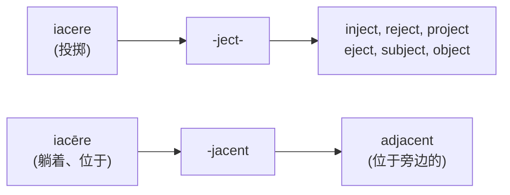
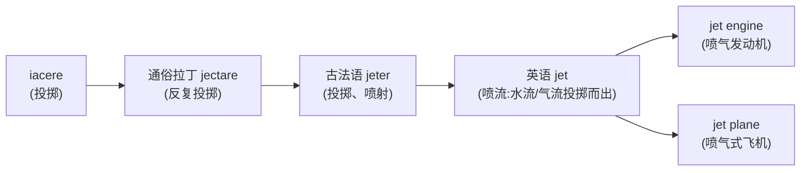

# 第 6 章 罗马人的投掷：jacere家族

> 罗马人负责"扔",英语负责接。两千年后,我们接到了一篮子 `inject` /ɪnˈdʒɛkt/、`reject` /rɪˈdʒɛkt/ 和 `project`。

> **词根**:`jac-` / `ject-`
> **含义**:投、掷、扔、抛(to throw, to cast, to hurl)
> **起源**:拉丁动词 ***iacere***("投掷";传统英语词源拼作 *jacere*)。另有拼写相近但不同的 ***iacēre***("躺着")

jacere 家族生成了 `inject`(注射)、`reject`(拒绝)、`project`(投射/项目)、`eject` /ɪˈdʒɛkt/(弹出)、`subject` /səbˈdʒɛkt/(主题/使服从)、`object` /ˈɑbdʒɛkt/(物体/反对)——这些动词全是高频学术词。

这个家族的妙处在于:**每一次"投掷"的方向都不一样**,而方向常常决定词义。认前缀就像看抛物线,先判断东西往哪儿飞。

---

## 【起源故事】罗马人怎么"投"

### 一个充满画面感的动作

在古罗马生活里,***jacere*** 是一个非常具体的动作:**用力把东西抛出去**。罗马士兵投标枪、农民撒种子、主人扔垃圾——都是 *jacere*。古罗马没有垃圾分类词汇表,但投掷动作已经相当齐全。

这里必须区分两个拉丁动词。表示"投掷"的是第三变位的 *iacere*;表示"躺着"的是第二变位的 *iacēre*,长元音通常在普通拼写中不标出,所以两者看起来都像 `jacere`。它们不是同一个动词的主动义和状态义。

| 拉丁动词 | 含义 | 画面 / 来源 |
| ------ | ------ | ------ |
| iacere(投掷) | 投、掷 | 古罗马士兵投标枪 |
| iacēre(躺着) | 躺着、位于 | adjacent /əˈdʒeɪsənt/ "位于旁边" |

> **提示** 英语里的 `-ject-` 词族主要来自"投掷"动词;`adjacent` /əˈdʒeɪsənt/ 则来自"躺着、位于"动词。拼写相似不能代替词源区分。

---

## 【家族树】jacere 的子孙

和 ducere 一样,jacere 的派生词高度依赖前缀方向。但 jacere 更激进——**前缀方向几乎等于词义**:

| 前缀 | 方向画面 | 派生词 |
| ------ | ------ | ------ |
| `in-`(进入) | 投进去 | inject(注射) |
| `re-`(回) | 投回来 | reject(拒绝) |
| `pro-`(向前) | 投向前方 | project(投射/项目) |
| `e-`/`ex-`(向外) | 投出去 | eject(弹出) |
| `sub-`(向下) | 投向下 | subject(使服从) |
| `ob-`(对向) | 投向对方 | object(反对/物体) |
| `de-`(向下) | 丢下去 | dejected /dɪˈdʒɛktɪd/(沮丧:被丢下) |
| `inter-`(之间) | 投在中间 | interject /ˌɪntərˈdʒɛkt/(插话) |

### 两个词族为什么容易混淆

**记忆口诀**:**看到 ject,就是"投"**。绝大多数 jacere 家族词都是 ject 形式。

---

## 【代表词深讲】四个词的故事

### 词 1:`reject` /rɪˈdʒɛkt/(拒绝)

**拆解**:`re-`(回)+ `ject`(投)= 投回去

**故事**:

`reject` 字面义是"**投回去**"。

想象古罗马市场上,买家检查货物后不满意,**把东西扔回卖家面前**——"我不要"。这个"扔回"的动作,凝固成"拒绝、不接受"。

它留下的常用名词是 `rejection` /rɪˈdʒɛkʃən/(拒绝)。货被扔回去一次,名词就不用再回来排两行队。

---

### 词 2:`inject` /ɪnˈdʒɛkt/(注射)

**拆解**:`in-`(进入)+ `ject`(投)= 投进去

**故事**:

`inject` 字面义是"**投进去**"。

这个词的画面非常直观——把药液**投进(注入)身体**。17 世纪医学发展后,这个词被专门用来指"用针管注射药物"。今天它泛指一切"注入"。

`injection` /ɪnˈdʒɛkʃən/ 是注射这件事,`injector` /ɪnˈdʒɛktər/ 是负责把东西投进去的装置。

> **提示** **延伸**:`inject` 的引申义很常用,如 `inject money into the economy`(向经济注入资金)、`inject humor into a speech`(给演讲注入幽默)。

---

### 词 3:`project`(项目 / 投射)

**拆解**:`pro-`(向前)+ `ject`(投)= 投向前方

**故事**:

`project` 是 jacere 家族里**词义最多**的一个,因为它有两个相关但不同的用法:

**用法 A:`project`(动词,投射)** —— 字面义"投向前方"。

**用法 B:`project`(名词,项目)** —— "向前投掷出去的东西"。

为什么"项目"也叫 project?这个词义来自拉丁 *proiectum* "投掷出去的事物",引申为"**计划着向前推进的事业**"。所以一个"项目"就是"被投掷到未来、需要一步步完成的事"。

这条路线还生出 `projection` /prɑˈdʒɛkʃən/(投射、投影)、`projector` /prɑˈdʒɛktər/(投影仪)和 `projectile` /prɑˈdʒɛktəl/(抛射物)。一个负责投,一个负责投影,最后一个干脆就是被投出去的东西。

---

### 词 4:`dejected` /dɪˈdʒɛktɪd/(沮丧的)

**拆解**:`de-`(向下)+ `ject`(投)+ `-ed` = 被投下去的

**故事**:

`dejected` 字面义是"**被丢下去**"。

这是 jacere 家族里最戏剧性的一个词。想象一个古罗马人精神饱满、昂首挺胸,突然遭遇失败——他的精神像被**扔到地上**,从此低头丧气。这种"精神被丢下去"的状态,就是 *dejectus*,凝固成"沮丧、灰心"。

> **提示** **对照记忆**:`dejected`(沮丧,向下投)↔ `elated` /ɪˈleɪtɪd/(兴奋,向上抬)。情绪的高低,在拉丁词根里就是物理的高低。

---

## 【词源辨正】jet(喷气式飞机)和 jacere 同根吗

**答案:是,而且这是 jacere 家族里最戏剧性的远房亲戚。**

`jet` /dʒɛt/(喷气式飞机、喷流)来自法语 *jeter* "投掷、扔",其更早来源与拉丁 *iacere* 及反复动词 *iactare* 有关。

所以 `jet` 字面义是"**被投掷出来的东西**"——喷出的气流、喷出的水流都是"投掷物"。喷气式飞机(jet)就是"靠投掷气体前进的飞机"。

**同根兄弟**:`jet`(喷气)、`jettison` /ˈdʒɛtɪsən/(抛弃货物:把货扔下船)、`jetsam`(抛弃的货物)

---

## 【拆词启示】jacere 家族如何帮你记忆

前面四位主角不再来排第二次队。其余常用词看方向即可:`eject` 往外投,所以弹出;`subject` 往下投,所以使服从;`object` 往对面投,所以反对;`interject` 往话语中间投,所以插话;`trajectory` 则是投射物走过的弹道。五个词排成一句话,拉丁语老师照样可以鼓掌。

---

## 本章小结

1. **iacere = 投掷、扔**——核心画面是士兵投标枪、把东西丢出去;不要和 *iacēre* "躺着"混淆。
2. **前缀 + ject = 不同方向的投掷**——in-(注射)、re-(拒绝)、pro-(项目)、de-(沮丧)。
3. **jet(喷气)也是 jacere 后裔**——经法语 jeter 而来,字面"投掷物"。

### 记忆锚点

> **ject = 扔**:in 往里扔(注射),e 往外扔(弹出),re 扔回去(拒绝),pro 往前扔(项目),de 往下扔(沮丧)——一个动作,五种扔法。

---

### 【思考题】(答案见附录 A)

1. **(讲证据)** `adjacent` /əˈdʒeɪsənt/(邻近的)看着像 `-ject-` 投掷家族,本章却说它是外人。它到底来自哪个拉丁动词?你能用什么线索判断一个 `jac/ject` 词属于"投"还是"躺"这两支?
2. **(破除误解)** 本章说 jacere"前缀方向几乎等于词义",比 ducere 还听话。可 `dejected`(沮丧)、`subject`(使服从/主题)真能只靠"往下投""往对面投"直接得到吗?用这两个词说明:"方向≈词义"什么时候成立、什么时候只是记忆的起点。
3. **(迁移应用)** 给你一个没讲的词 `conjecture` /kənˈdʒɛktʃər/(推测):`con-`(一起)+ `ject`(投)+ `-ure`。先推出字面义,并解释"把东西一起投掷"怎么会变成"推测"。最后判断：你给出的这条解释,是"合理假设"还是"已证词源"?该怎么把它坐实?

---

*下一章 → [第 7 章 罗马人的抓住：capere家族](./第07章-罗马人的抓住：capere家族.md)*
