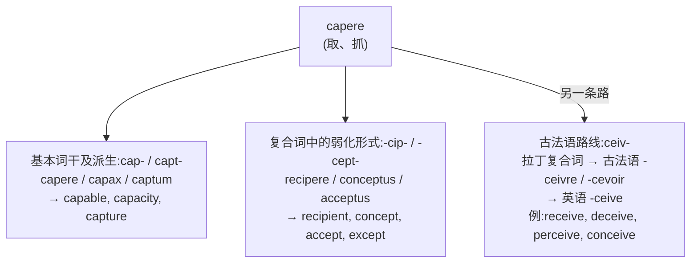
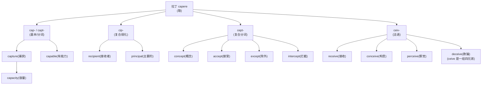
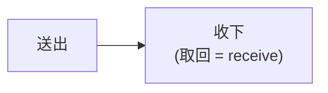
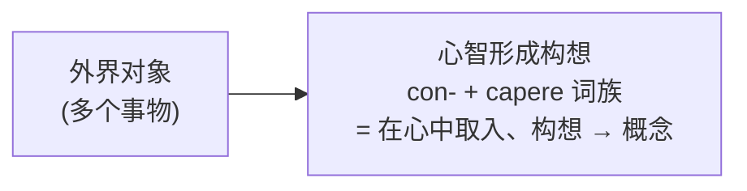
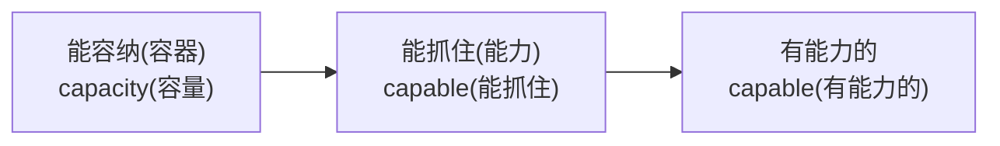
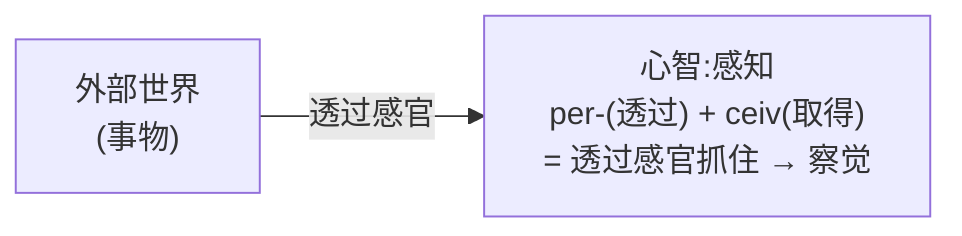
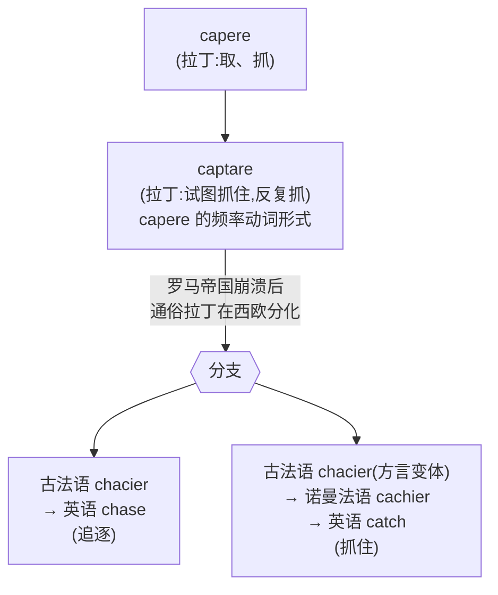

# 第 7 章 罗马人的"抓住":capere 家族

> 这一章的学习目标很直接:抓住 `capere`,别让它带着五套拼写从你的词汇量里溜走。

> **词根**:`cap-` / `capt-` / `cip-` / `cept-` / `ceiv-`
> **含义**:抓、取、拿、容纳、接收(to take, to seize, to hold, to receive)
> **起源**:拉丁动词 ***capere***("取、抓、容纳")

capere 家族是全书变体较多的词族之一——英语中常见 `cap/capt/cip/cept/ceiv` 等形态。它的家族成员很多:`capture`(捕获)、`receive`(接收)、`accept`(接受)、`concept`(概念)、`capable`(有能力的)、`except`(除外)、`perceive`(察觉)、`deceive`(欺骗)……

学透这一根,就能成组理解一批高频词。它脸多,但不是五个词根开会,而是同一家族换了几套历史造型。

---

## 【起源故事】为什么 capere 有四种拼写

### 拉丁词形变化、复合变化与法语传递

`cap- / capt- / cip- / cept- / ceiv-` 属于同一历史词族,但不能都用"时态分裂"解释。拉丁动词的基本形式是 *capio, capere, cepi, captum*;进入复合词后还会发生元音弱化,法语传递又带来新的拼写。

因此,英语中的不同面孔来自三种机制:**拉丁语不同词干、复合词内部变化、法语语音和拼写演变**。别用一条"字母魔法公式"硬套全部形式;历史语言学不发万能扳手。

### 主要形式的对照记忆

| 变体 | 来源 | 例子 |
| ------ | ------ | ------ |
| `cap-` / `capt-` | 基本词干及分词派生 | **cap**able 有能力的、**cap**acity 容量、**capt**ure 捕获 |
| `cip-` | 复合词中的元音弱化 | re**cip**ient 接收者、in**cip**ient 初期的、prin**cip**al 主要的 |
| `cept-` | 复合词的分词形式 | con**cept** 概念、ac**cept** 接受、ex**cept** 除外、inter**cept** 拦截 |
| `ceiv-` | capere 经古法语 | re**ceiv**e 接收、de**ceiv**e 欺骗、per**ceiv**e 察觉、con**ceiv**e 构思 |

> **提示** **记忆口诀**:**cap/capt/cip/cept/ceiv 属于"抓、取、容纳"词族**。核心义可作线索,具体词义仍需结合历史形式。

---

## 【起源故事续】capere 的三层含义

capere 之所以派生能力这么强,是因为它**本身就有三个相关但不同的含义**:

| 层次 | 含义 | 例词 | 画面 |
| ------ | ------ | ------ | ------ |
| ① | 抓、取(主动抓取) | capture 捕获、accept 接受 | 用手抓过来 |
| ② | 容纳、能装下(能抓住的量) | capacity 容量、capable 有能力的 | 能"抓住"多少 |
| ③ | 接收、感知(被动接收) | receive 接收、perceive 感知 | 东西被抓到心智里 |

这三层义,分别发展出 capere 家族的三大支系。

---

## 【家族树】capere 的子孙

---

## 【代表词深讲】四个词的故事

### 词 1:`receive`(接收)

**拆解**:`re-`(回)+ `ceiv`(取)+ `-e`(动词后缀)= 取回

**故事**:

`receive` 字面义是"**取回来**"。

古罗马人送出礼物、信件、商品,对方**把它取回、收下**——这就是 *recipere*。今天 `receive` 仍保留这个核心义:把送来的东西收下。

**派生词**:

- `receipt`(收据、收条)
- `receiver`(接收者、接收器)
- `reception`(接待、接收)

> **提示** **有意思的细节**:`recipe`(食谱、配方)也是同根!来自拉丁 *recipe* "取"——医生开处方时写 "Recipe"(取下列药材),后来变成"食谱"。

---

### 词 2:`concept`(概念)

**历史构造**:拉丁 *concipere/conceptum*,由 `con-` 与 *capere* 词族构成,表示"取入、构想、孕育"。

**故事**:

`concept` 由"在心中取入、构想"发展为"概念"。可以用"心智把对象纳入一个想法"帮助记忆,但不能简单译成"完全抓住"。

拉丁 *conceptum* 也可表示"被构想之物"。英语后来用它表示心智形成的抽象观念。

**派生词**:

- `conception`(概念、构思)
- `conceptual`(概念的)
- `conceptualize`(概念化)
- `misconception`(误解:错误抓住)

---

### 词 3:`capable`(有能力的)

**历史构形**:经法语和拉丁 *capabilis* 进入英语;*capabilis* 来自 *capere*(取、容纳)词族

**故事**:

`capable` 早期有"能够容纳、足以承受"等意义,后来发展为"有能力的"。现代学习时可以识别 `cap-` 与 `-able`,但它不是把现代英语单词 `cap` 临时接上 `-able` 造出的词。

这个词的核心是 capere 的第二层义——**容量**。一个容器能装多少水,叫它的 `capacity`(容量);一个人能"装下"多少任务、能力,叫他 `capable`(有能力的)。

**派生词**:

- `capability`(能力)
- `incapable`(无能力的)
- `capacity`(容量)

---

### 词 4:`perceive`(察觉)

**拆解**:`per-`(透过)+ `ceiv`(取)= 透过……取得

**故事**:

`perceive` 字面义是"**透过……取得/抓住**"。

这个词的画面是:**透过感官或心智,把外部事物"抓住"到自己内部**。眼睛看到、耳朵听到、心智理解——都是"透过某种媒介抓住信息"。所以 `perceive` 是"察觉、感知"。

**派生词**:

- `perception`(感知、察觉)
- `perceptive`(敏锐的)
- `imperceptible`(难以察觉的)

> **提示** **对照记忆**:`perceive`(察觉)vs `conceive`(构思)vs `deceive`(欺骗)vs `receive`(接收)——四个 `-ceive` 兄弟,前缀不同,词义分明。

---

## 【词源辨正】capere 和 catch / chase 是亲戚吗

**答案:是,这是 capere 最让人意外的远房亲戚。**

`catch`(抓住)和 `chase`(追逐)看起来完全是英语本土词,但其实它们**都来自 capere**,经过了一条漫长曲折的路:

所以 `catch`、`chase`、`capture`、`receive` **全都来自拉丁 capere**。一个拉丁动词,在两千年里走出了多种路线,在英语里留下了多个看似无关的子孙。

> **注意** **注意区分**:`catch` 和 `chase` 在英语里形式相似、义也相关(都是"抓"),但用法有别——`catch` 强调"抓住结果",`chase` 强调"追逐过程"。

---

## 【拆词启示】capere 家族如何帮你记忆

| 词 | 拆解 | 推义 |
| ---- | ------ | ------ |
| `capture` | capt + -ure | 抓住 → 捕获 |
| `capable` | 经拉丁 *capabilis* | 能容纳、足以承受 → 有能力的 |
| `capacity` | cap + -acity | 能容纳的量 → 容量 |
| `accept` | ac-(ad-)+ cept | 抓向自己 → 接受 |
| `except` | ex-(出)+ cept | 抓出去 → 除外 |
| `intercept` | inter-(中间)+ cept | 中间抓住 → 拦截 |
| `concept` | 拉丁 conceptum | 在心中构想 → 概念 |
| `receive` | re-(回)+ ceiv + e | 取回 → 接收 |
| `perceive` | per-(透过)+ ceiv + e | 透过抓住 → 察觉 |
| `deceive` | de-(离开)+ ceiv + e | 抓走 → 欺骗 |
| `conceive` | con-(共同)+ ceiv + e | 一起抓住 → 构思 |
| `recipient` | re- + cip + -ent | 取回者 → 接收者 |
| `principal` | prin-(primus 第一)+ cip + -al | 抓第一 → 主要的 |

---

## 本章小结

### 你应该带走的三个画面

1. **capere = 抓、取、容纳**——三层义:主动抓取(capture)、能容纳(capacity)、被动接收(receive)。
2. **cap/capt/cip/cept/ceiv 属于同一历史词族**——差异来自不同词干、复合弱化和法语传递,不只是时态。
3. **catch 和 chase 也是 capere 远亲**——经过通俗拉丁 → 古法语 → 英语的漫长演变。

### 记忆锚点

> **cap/capt/cip/cept/ceiv 属于"抓、取、容纳"词族。** 先识别词族,再核对整词的历史意义。

---

### 【思考题】(答案见附录 D)

1. `except`(除外)字面是"抓出去",为什么等于"除外"?(提示:把某物从整体里抓出去)
2. `intercept`(拦截)字面是"中间抓住",为什么引申为拦截?(提示:东西在传递过程中被抓)
3. `recipe`(食谱)和 `receive` 同根,为什么"取"变成了"食谱"?(提示:医生处方开头写"取下列药材")

---

*下一章 → [第 8 章 罗马人的"拉拽":trahere 家族](./第08章-trahere家族.md)*
