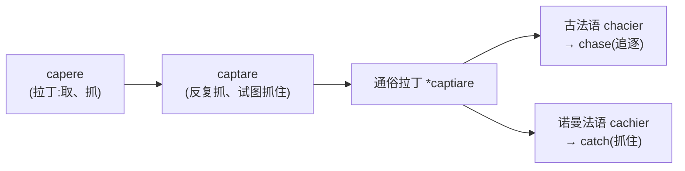

# 第 7 章 罗马人的抓住：capere家族

> 这一章的学习目标很直接:抓住 `capere`,别让它带着五套拼写从你的词汇量里溜走。

> **词根**:`cap-` / `capt-` / `cip-` / `cept-` / `ceiv-`
> **含义**:抓、取、拿、容纳、接收(to take, to seize, to hold, to receive)
> **起源**:拉丁动词 ***capere***("取、抓、容纳")

capere 家族是全书变体较多的词族之一。它生成了 `capture` /ˈkæptʃər/(捕获)、`receive` /rəˈsiv/(接收)、`accept` /ækˈsɛpt/(接受)、`concept` /ˈkɑnsɛpt/(概念)、`capable` /ˈkeɪpəbəl/(有能力的)、`perceive` /pərˈsiv/(察觉)等一大群高频词。

这些词看起来像五户人家,其实祖上都姓 capere。它们不是五个词根开会,只是同一家族换了几套历史造型。

---

## 【起源故事】为什么 capere 有五套拼写

### 拉丁词形变化、复合变化与法语传递

拉丁动词的基本形式有 *capio, capere, cepi, captum*。它进入复合词后,内部元音还会发生变化;后来一些词又取道法语进入英语,语音和拼写被继续加工。capere 从罗马走到伦敦,沿途过了好几次海关,护照照片自然越换越不像本人。

因此,`cap- / capt- / cip- / cept- / ceiv-` 来自三种机制:**拉丁语的不同词干、复合词内部的元音变化、法语传递造成的拼写演变**。历史语言学不发万能扳手,不能拿一条"字母变化公式"硬拧所有单词。

---

## 【家族树】capere 的子孙

五张脸、一位祖先,不再画一棵枝繁叶茂到看不清门牌号的树,把家族工牌放在一张表里认:

| 变体 | 怎么来的 | 代表词 |
| ------ | ------ | ------ |
| `cap-` / `capt-` | 基本词干及分词派生 | **cap**able、**cap**acity、**capt**ure |
| `cip-` | 复合词中的元音弱化 | re**cip**ient、in**cip**ient /ɪnˈsɪpiənt/ |
| `cept-` | 复合词的分词形式 | con**cept**、ac**cept**、ex**cept**、inter**cept** |
| `ceiv-` | 拉丁复合词经古法语进入英语 | re**ceiv**e、de**ceiv**e、per**ceiv**e、con**ceiv**e |

> **记忆口诀**:`cap/capt/cip/cept/ceiv` 都在"抓、取、容纳"这间屋里住过。认亲时先看核心义,真要分家产,还得查具体词史。

---

## 【起源故事续】capere 的三层含义

capere 不只会扑上去"抓住",它还会把东西装下、收下,甚至送进脑子里。三层含义像同一只手换了三个工作岗位:

| 工作岗位 | 含义 | 例词 | 画面 |
| ------ | ------ | ------ | ------ |
| 外勤抓捕 | 抓、取 | capture、accept | 把东西抓到手里 |
| 仓库管理员 | 容纳、承受 | capacity、capable | 看看能装下多少 |
| 心智收件员 | 接收、感知 | receive、perceive | 把信息收进来 |

后面的词义再抽象,也大多能从这三个岗位找到值班记录。

---

## 【代表词深讲】四个词的故事

### 词 1:`receive` /rəˈsiv/(接收)

**门口签收,药房开单**

`receive` /rəˈsiv/(接收)来自拉丁 *recipere*,核心画面是把送来的东西**取回、收下**。古罗马人收信、收礼、收货,今天的人收快递、收邮件、收验证码,两千年过去,门口那只手一直没下班。

它的亲戚很好认:`receipt` /rɪˈsit/ 是"我确实收到了"的证据,`receiver` /rɪˈsivər/ 是负责收的人或设备,`reception` /rɪˈsɛpʃən/ 则是把接收这件事发展成一个场面。

最会跨界的是 `recipe` /ˈrɛsəpi/(食谱、配方)。拉丁语 *recipe* 原本是医生处方上的命令:"**取**下列药材。"后来药方走进厨房,医生的"取三钱"慢慢变成厨师的"取三勺"。锅里换了东西,动词还在掌勺。

> **一词两份工作**:`receive` 负责收进来,`recipe` 负责告诉你取什么。一个站门口,一个站灶台,祖上用的是同一只手。

### 词 2:`concept` /ˈkɑnsɛpt/(概念)

**脑子也会伸手**

`concept` /ˈkɑnsɛpt/(概念)来自拉丁 *concipere/conceptum*,早期有"取入、构想、孕育"等含义。心智把外界许多对象收进来,抓住它们的共同之处,形成一个抽象观念,这就是 `concept`。

当然,脑子里并没有一只真的手。"在心中抓住"只是记忆画面,不是让你把 `concept` 生硬翻译成"完全抓住"。抽象词一旦长大,通常就不肯每天回家向词根报到。

`conception` /kənˈsɛpʃən/ 是构想或观念,`conceptual` /kənˈsɛptʃuəl/ 是概念层面的,`misconception` /mɪskənˈsɛpʃən/ 则是抓错了东西还攥得特别紧,也就是误解。

### 词 3:`capable` /ˈkeɪpəbəl/(有能力的)

**能力原来先看容量**

`capable` /ˈkeɪpəbəl/(有能力的)经法语和拉丁 *capabilis* 进入英语。它早期有"能够容纳、足以承受"等意思,后来才发展为今天常见的"有能力的"。

这条语义路线并不陌生。一个容器能装多少水,叫它的 `capacity` /kəˈpæsəti/(容量);一个人能装下多少任务、责任和意外会议,决定了他是否 `capable`。只不过容器满了会溢出来,人满了通常还会收到一句:"这个很急,再帮忙看一下。"

现代学习时可以用 `cap-` 和 `-able` 帮助识别,但别以为这是英语拿单词 `cap` 临时粘上 `-able` 造出来的。它在进入英语以前,履历已经写了好几页。

### 词 4:`perceive` /pərˈsiv/(察觉)

**把世界收进意识**

`perceive` /pərˈsiv/(察觉)来自拉丁 *percipere*,表示取得、领会、感知。它的画面是:**感官和心智把外部信息接住,送进意识。** 眼睛看到、耳朵听到、心里忽然明白,都是这位心智收件员签收成功。

`-ceive` 四兄弟经常一起出现,但各有各的工位:

| 单词 | 今日岗位 | 记忆画面 |
| ------ | ------ | ------ |
| `receive` /rəˈsiv/ | 接收 | 把东西收进手里 |
| `perceive` /pərˈsiv/ | 察觉 | 把信息收进意识 |
| `conceive` /kənˈsiv/ | 构思 | 在心里形成想法 |
| `deceive` /dɪˈsiv/ | 欺骗 | 把判断带离正路 |

这张表是记忆地图,不是逐字翻译许可证。前缀能告诉你大致从哪儿出发,两千年的语义演变负责把终点搬到别处。

---

## 【词源辨正】capere 和 catch / chase 是亲戚吗

**答案:是。** `catch` /kætʃ/(抓住)和 `chase` /tʃeɪs/(追逐)看起来像英语本土居民,翻开族谱却能一路查回拉丁 *capere*。

同一场抓捕戏,`chase` 负责前八十分钟的追逐,`catch` 负责最后五分钟的抓住。一个强调过程,一个强调结果;如果始终没有 catch,那前面的 chase 多半只能等续集。

所以 `catch`、`chase`、`capture`、`receive` 都与 capere 有历史关系。一个拉丁动词走了几条不同路线,再回到英语里见面时,彼此差点没认出来。

---

## 【拆词启示】capere 家族如何帮你记忆

三个 `-cept` 高频词,不必再开三场发布会,看一部前缀动作片就够了:

- **`accept` /ækˈsɛpt/(接受)**:`ad-`(向)+ `cept`,把东西抓向自己。别人递来邀请,你伸手接住,事情就从此与你有关。
- **`except`(除外)**:`ex-`(向外)+ `cept`,从整体里抓出去。名单上人人有份,唯独某人被拎到门外,他就成了例外。
- **`intercept` /ˌɪntərˈsɛpt/(拦截)**:`inter-`(在中间)+ `cept`,东西传到半路被抓住。球场上叫截球,通信里叫截获,剧情片里通常意味着有人要倒霉。

这三兄弟最适合放在一起看:一个往怀里收,一个往门外送,一个专门蹲在路中间。

---

## 本章小结

1. **capere 的核心是抓、取、容纳**,后来扩展到接收和感知。
2. **cap/capt/cip/cept/ceiv 是同一历史词族的不同面孔**,差异来自拉丁词形、复合变化和法语传递。
3. **词根负责提供起点,现代词义还要逐词确认**。抓住线索很好,抓住一个字面解释死活不放就不太好了。

### 记忆锚点

> **五张脸,一只手**:`cap` 能装(`capacity`),`capt` 能抓(`capture`),`cip` 能收(`recipient`),`cept` 能接(`accept`),`ceiv` 经法语换装(`receive`)。认出哪张脸,先想"抓取、容纳、接收"。

---

### 【思考题】(答案见附录 A)

1. **(破除误解)** 本章说 `cap/capt/cip/cept/ceiv` 这五套拼写"不能用一条字母变化公式硬拧出来"。它们究竟来自哪三种机制?为什么不能简单概括成"a 在复合词里一律变 i"?举一个反例。
2. **(讲证据)** `catch`、`chase` 看着是英语土产,本章却断定它们和 `capere` 同源;而第 4 章却说 `see` 和 `spect` 只能算"语义同源"、不能断言同根。同样是"意思相近",为什么 `catch` 能被确认同根,`see`/`spect` 不能?差别在哪里?
3. **(迁移应用)** 给你一个没讲的词 `anticipate` /ænˈtɪsəˌpeɪt/(预期):`ante-`(之前)+ `cip`(取)+ `-ate`。先推出字面义、说明它怎么变成"预期"。再指出-只靠拆字,你会漏掉这个词在现代用法里的哪一层意思?

---

*下一章 → [第 8 章 罗马人的拉拽：trahere家族](./第08章-罗马人的拉拽：trahere家族.md)*
