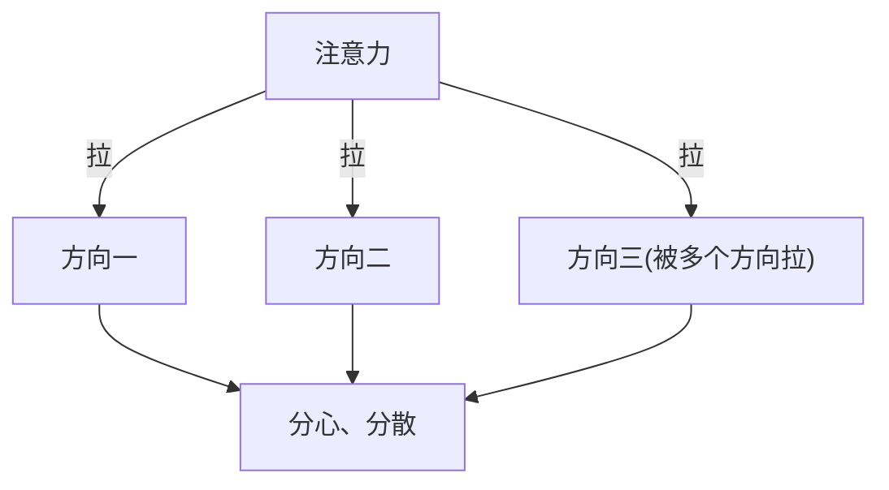
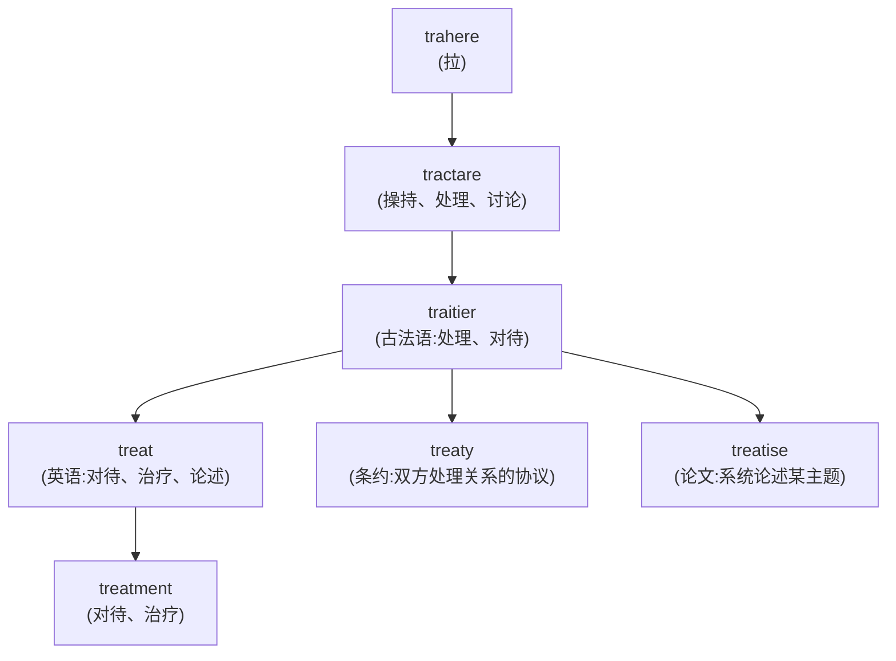
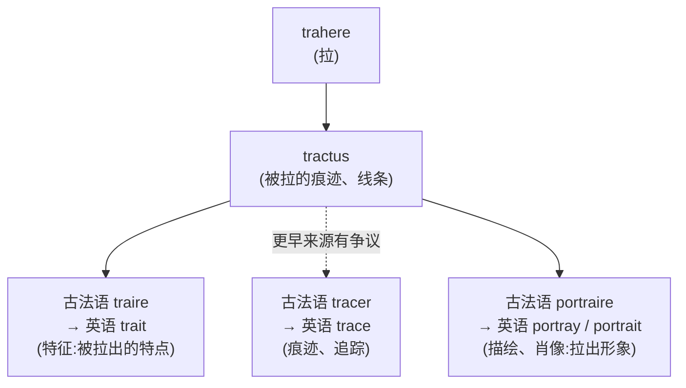

# 第 8 章 罗马人的拉拽：trahere家族

> 一个"拉"字,把拖拉机、吸引力和合同拽到了同一张桌上。先别报警,它们确实有历史关系。

> **词根**:`tract-` / `trah-` / `treat-`
> **含义**:拉、拽、拖(to pull, to drag, to draw)
> **起源**:拉丁动词 ***trahere***("拉、拽、拖"),过去分词 ***tractus***

trahere 家族生成了 `attract` /əˈtrækt/(吸引)、`distract` /dɪˈstrækt/(分散)、`tractor` /ˈtræktər/(拖拉机)、`extract` /ɪkˈstrækt/(提取)、`contract` /ˈkɑnˌtrækt/(合同)、`retract` /rɪˈtrækt/(撤回)等高频词。

这个家族最有趣的,是它**从物理的"拉拽"演变出抽象的"吸引/处理"**——词义被一路拖进抽象世界,但绳子还看得见。

---

## 【起源故事】罗马人怎么"拉"

### 一个充满力量的动作

在古罗马生活里,***trahere*** 是一个**需要用力的动作**——拉车、拽重物、拖动俘虏。它的核心画面是:**施力把一个东西从一个地方拖到另一个地方**。如果读着都觉得胳膊酸,说明画面已经记住了。

从这个"拉拽"的核心义,衍生出三个抽象方向:

| 延伸方向 | 抽象义 | 例词 | 画面 |
| ------ | ------ | ------ | ------ |
| ① 拉(物理) | pull, drag | tractor(拖拉机):拖动农具的机器 extract(提取):ex-(出)+ tract → 拉出来 | 物理拖动 |
| ② 吸引(抽象) | draw toward | attract(吸引):at-(向)+ tract → 拉向自己 → 物理的"拉"变成抽象的"吸引" | 拉向自己 |
| ③ 操持、处理 | treat | 拉丁 tractare 已有"处理、操持"义,经法语进入英语 treatment(治疗):被处理的过程 | 处理、操持 |

---

## 【家族树】trahere 的子孙

| 形式 | 说明 | 例 |
| ------ | ------ | ------ |
| 现在时词干:`trah-` | 很少直接出现在英语里 | — |
| 过去分词词干:`tract-` | 绝大多数英语派生词 | attract, distract, extract, contract, tractor |
| 古法语路线:`treat-` | 经古法语 traitier 进入英语 | treat, treatment, treaty /ˈtriti/ |

---

## 【代表词深讲】四个词的故事

### 词 1:`attract` /əˈtrækt/(吸引)

**拆解**:`at-`(ad- 朝向)+ `tract`(拉)= 拉向自己

**故事**:

`attract` 字面义是"**拉向自己**"。

这个词的画面非常直观:你用力把一个东西**拉到自己身边**。从物理的"拉",引申为抽象的"吸引"——磁铁吸引铁屑、美貌吸引目光、魅力吸引人心,本质都是"把别的东西拉向自己"。

**派生词**:

- `attraction` /əˈtrækʃən/(吸引、吸引力)
- `attractive` /əˈtræktɪv/(有吸引力的)
- `attractor`(吸引子)

---

### 词 2:`distract` /dɪˈstrækt/(分散注意力)

**拆解**:`dis-`(分开)+ `tract`(拉)= 拉向不同方向

**故事**:

`distract` 字面义是"**拉向不同方向**"。

想象一匹马被两个人**从不同方向拉扯**——它不知道往哪走,陷入混乱。心智也是一样:当注意力被多个事物**朝不同方向拉扯**,就会"分心、分散"。

**派生词**:

- `distraction` /dɪˈstrækʃən/(分心、消遣)
- `distracted` /dɪˈstræktɪd/(心烦意乱的)
- `distracting` /dɪˈstræktɪŋ/(令人分心的)

---

### 词 3:`contract` /ˈkɑnˌtrækt/(合同 / 收缩)

**拆解**:`con-`(共同、一起)+ `tract`(拉)= 拉到一起

**故事**:

`contract` 有两个看起来无关的意思,但都来自同一个"拉到一起"的画面:

**意思 A:`contract`(合同)** —— 两个或多方把各自的承诺**拉到一起**,达成协议。这种"把双方意图拉拢成一致"的行为,就是订立合同。

**意思 B:`contract`(收缩)** —— 物体各部分**被拉到一起**,体积变小。金属冷缩、肌肉收缩,都是"拉到一起"。

| | 意思 A:合同 | 意思 B:收缩 |
| ------ | ------ | ------ |
| 画面 | 甲方意图 + 乙方意图 → 拉到一起 | 大物体 → 小物体(拉到一起) |
| 结果 | 合同(拉到一起 = 一致) | 收缩(拉到一起 = 缩小) |

**派生词**:

- `contraction` /kənˈtrækʃən/(收缩、缩写)
- `contractor` /ˈkɑnˌtræktər/(承包商:订立合同的人)
- `contractual` /kənˈtræktʃuəl/(合同的)

---

### 词 4:`treat` /trit/(对待、治疗)—— 经法语的远亲

**历史路径**:拉丁 *trahere*(拉)→ 反复/加强形式 *tractare*(处理、操持)→ 法语 → 英语 `treat`

**故事**:

`treat` 是 trahere 家族里**走得最远**的一个——它经过古法语 *traitier*,最终变成英语的 `treat`。

拉丁 *tractare* 在构形上是 *trahere* 的反复/加强形式,实际使用中已有"触摸、操持、处理、讨论"等意义。它经法语进入英语后发展出"对待、论述、款待、治疗"等义。理解构形可以看见亲缘,却不能把整段语义史简化成"反复拉一个病人"。

> **提示** **同根三兄弟**:
>
> - `treat`(对待、治疗):处理人
> - `treaty` /ˈtriti/(条约):国与国之间的"处理协议"
> - `treatise` /ˈtritɪs/(论文):学者对某主题的"系统处理"
>
> 它们都经法语的"处理、商谈、论述"词族而来,再在英语中发生分化。

---

## 【词源辨正】portrait /ˈpɔrtrət/(肖像)和 trahere 同根吗

**答案:`portrait / portray` 可以确认;`trace` 要单独打问号。**

`portrait` /ˈpɔrtrət/(肖像)、`portray` /pɔrˈtreɪ/(描绘)经法语词族可追溯到拉丁 *protrahere*(拉出、展现),与 `trahere` 的关系较明确。`trait` 也走相近的法语路线。`trace` /treɪs/(痕迹、追踪)常被放进这张家谱,但它更早的来源仍有争议,不能让它凭一张长得像亲戚的脸就直接坐主桌。

`portrait` 经法语追溯到表示"描绘、刻画"的词,再与拉丁 *protrahere*(拉出、展现)相连。这里的关键语义是"把形象呈现出来";"把线条拉到画布上"可以助记,却不是它的历史字面定义。

---

## 【拆词启示】trahere 家族如何帮你记忆

前缀决定拉的方向,方向决定词义——同一条绳子,十个前缀拽出十个意思,这效率放在创业圈叫"一鱼十吃"。

| 词 | 拆解 | 推义 |
| ---- | ------ | ------ |
| `extract` /ɪkˈstrækt/ | ex- + tract | 拉出 → 提取 |
| `retract` /rɪˈtrækt/ | re- + tract | 拉回 → 撤回 |
| `subtract` /səbˈtrækt/ | sub- + tract | 从下拉走 → 减去 |
| `tractor` /ˈtræktər/ | tract + -or | 拉的东西 → 拖拉机 |
| `traction` /ˈtrækʃən/ | tract + -ion | 拉 → 牵引(力) |
| `treaty` /ˈtriti/ | 整体借自古法语 *traité / traitié* | 从处理、商谈发展为协定、条约 |

---

## 本章小结

1. **trahere = 拉、拽、拖**——核心画面是用力拖动重物。
2. **物理的"拉"发展出抽象词义**——attract 由"拉向"发展为"吸引";treat 则经 *tractare* 的"操持、处理"义和法语路线进入英语。
3. **contract 一词两义**——合同和收缩,都来自"拉到一起"。

### 记忆锚点

> **tract = 拉**:at 拉过来(吸引),dis 拉散(分心),ex 拉出来(提取),re 拉回去(收回),con 拉到一起(合同,也是收缩)——tractor 则是专职拉地的机器。

---

### 【思考题】(答案见附录 A)

1. `contract` 有"合同"和"收缩"两个看似无关的意思,本章说它们都来自"拉到一起"。请分别说明这两支怎么长出来。再想一步:如果你只知道"contract = 拉到一起",能**提前预测**它一定会有这两个意思吗?这说明词根解释给你的是"解释力"还是"预测力"?
2. `trait`、`portrait` 看着和“拉”毫无关系,为什么仍能归进 trahere?`trace` 又为什么只能画一条“来源有争议”的虚线?本章说“把线条拉到画布上”能助记却不是历史字面定义——助记画面、可靠派生链和争议词源,差别在哪?
3. 给你 `abstract` /ˈæbstrækt/(抽象的;摘要):`ab-`(离开)+ `tract`(拉)。先推字面义,解释"从具体中拉离"怎么得到"抽象",以及名词"摘要"从何而来。再回答：这个词有 ˈabstract / abˈstract 的重音差异,拆字能告诉你这一点吗?为什么?

---

*下一章 → [第 9 章 罗马人的心灵：cor, mens, animus](./第09章-罗马人的心灵：cor,%20mens,%20animus.md)*
