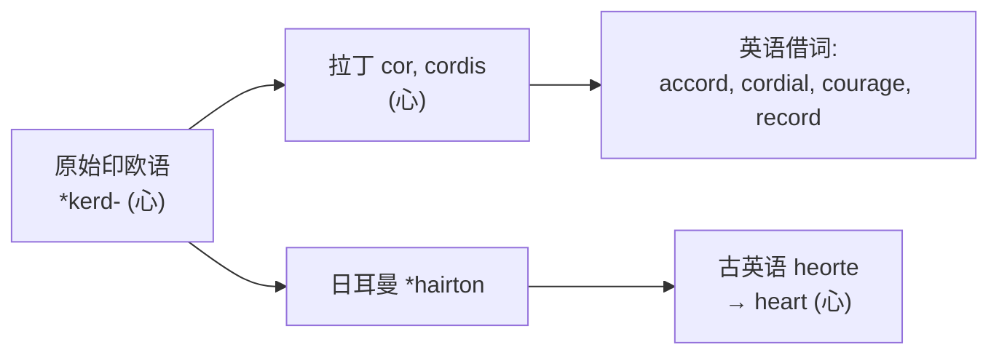
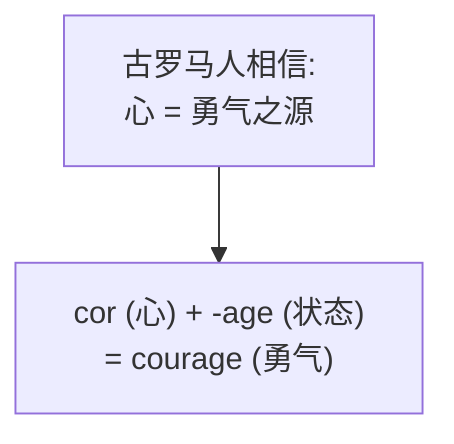
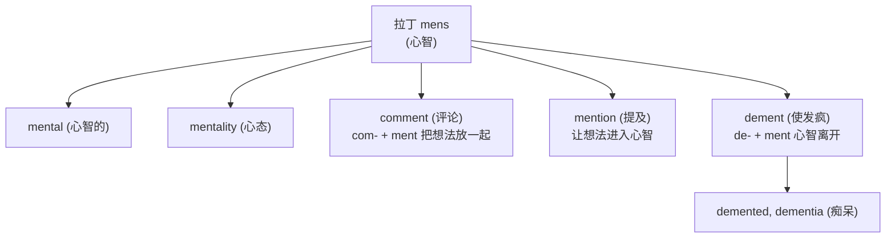
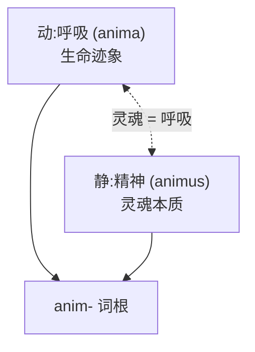
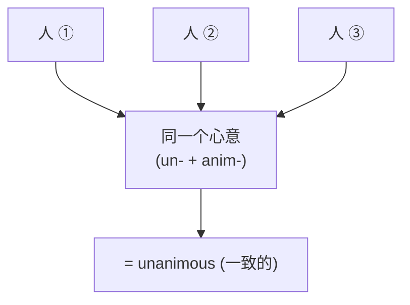

# 第 9 章 罗马人的"心灵":cor / mens / animus

> 古罗马人没有把所有内心戏塞进一个词:情感归 `cor`,思考归 `mens`,生命精神归 `animus`。分工之细,足够成立一个心灵项目组——三个员工各管一摊,谁都不加班,但谁也不替谁干活。

前面几章都是动作词根(看、引导、投、抓、拉),胳膊累得够呛。这一章我们换种角度,**让动作歇一歇,请心灵项目组的三位员工出场**。

先来认识一下这三位。把镜头拉到清晨的罗马广场,你会同时撞见他们三个在上班:

——**心(`cor`)员工**蹲在元老院门口,正听执政官慷慨陈词。台上那一句"为罗马而战",台下老兵拍着新兵的肩膀喊 *corage!*。士兵临阵前互相鼓劲,用的就是心。情感、热血、勇气,都归这位管。

——**脑(`mens`)员工**在广场另一头的账房里,正掰着手指替主人算账。他能记得去年哪笔债没收、记得三年前哪个客户赖过账,他还会在你耳边提醒"今天该去神庙还愿了"。思考、记忆、盘算,都归他。

——**气(`animus`)员工**在广场尽头的临终卧榻边,静静看着一位老人胸口最后一次起伏。胸膛起,人在;停了,魂走。呼吸、生命、灵魂,都归他。

三个员工,三种活,一个不抢另一个的工位。这就是古罗马人对"心灵"的理解——**他们不信一个统一的"内心",他们信三件不同的事**:一颗会跳的心、一颗会算的脑、一口会断的气。

为什么要单独讲心灵词根?因为它们最能体现词根的**文化性**——古罗马人对"心灵"的理解,凝固在三个不同的词里,每一个都透露着他们独特的世界观:

| 词根 | 含义 | 例词 |
| ---- | ---- | ---- |
| `cor`(心) | 情感、勇气 | cordial, courage |
| `mens`(心智) | 思考、理性 | mental, comment |
| `animus`(精神) | 灵魂、生命气息 | unanimous, magnanimous |

为便于记忆,可以把这三个员工概括成三层:**心(情感)、脑(理智)、气(灵魂)**。这是学习模型,不是一张能覆盖所有拉丁语境的古罗马心理学诊断表——真要较真,拉丁语里 *cor* 也兼管过记忆和理智,*animus* 也兼管过勇气,三位员工的工位偶尔会重叠。但我们先按主流分工记,后面讲词再说例外。

---

## 词根 1:`cor` / `cord-`(心、情感)

### 【起源故事】

拉丁语 ***cor***(心),来自原始印欧语 *kerd-(心)。注意:**它的英语本土亲戚是 `heart`**——经过格林定律(*k→h,*d→d),原始印欧语的 *kerd 在日耳曼语里变成了 `heart`。所以这条血脉很特别:它**一分为二**,一支走拉丁路线(变成 `cor`,后来生出 cordial、courage、record),一支走日耳曼路线(变成 `heart`,后来在英语里坐稳了"心"的本族词位置)。两支隔着两千年再见面,谁也没认出谁是亲戚——但骨子里,`heart` 和 `cordial` 共享同一个曾祖父。

> **提示** **这就是 `heart` 和 `cordial` 是亲戚的原因**——它们都来自原始印欧语 *kerd-,一个走了拉丁路线,一个走了日耳曼路线。

### 【代表词深讲】

**`cordial`(热诚的、衷心的)** —— 字面义"**心的**"。

回到那场元老院演说。执政官说完最后一句"为罗马!",台下一位老元老站起来,走到台前,握住他的双手,久久不放。他什么也没说——但那一刻,握手的力道、眼眶里的湿润、压低的嗓音,全部从胸腔里直冲上来。这就是罗马人说的 *cordialis*:**从心底里冒出来的**。

罗马人很早就发现了一件事:真正动人的情感,从来不是从脑子里挤出来的,而是从胸口涌上来的。所以"衷心的"才叫 cordial——`cordial greeting`(衷心的问候)字面就是"从心底发出的问候",而不是"经过大脑思考觉得该这么问候"。今天你收到一张写着 "cordial regards" 的贺卡,请脑补那位老元老握手不放的画面。

---

**`courage`(勇气)** —— 经古法语 *corage* 追溯到拉丁 *cor*(心)词族,字面义是**心里有的东西**。

一个罗马士兵,出征前站在营门口,盔甲还没扣紧,腿肚子在打颤。他怎么给自己壮胆?不是深呼吸,不是默念口诀——他**把手按在胸口**,感觉心跳,"**心里有的东西**"还在。这种"心里有"的东西,中世纪骑士叫它 *coraggio*,后来法语叫 *courage*,最后落脚成英语的 courage。

英文里有个老说法叫 **`take heart`(鼓起勇气)**,直译就是"把心拿起来"。中文也讲"振作起来、提一口气"——东西方不约而同地,都把勇气的开关装在了胸口。所以下次有人说 "Don't lose heart"(别灰心),字面是"别把心丢了"——**心一丢,勇气也就跟着没了**。courage 就是这么来的。

---

**`record`(记录)** —— `re-`(回、再)+ `cord`(心)= **重新放回心里**。

这个词最妙的地方在于:**在没有纸笔、没有手机、甚至羊皮纸都金贵的年代,"记在心里"是真功夫**。

*(传说)* 公元前 63 年,西塞罗在西庇太神庙前连讲四个小时,滔滔不绝,指控喀提林阴谋叛国。没有提词器,没有讲稿,**整篇演说全部装在心里**。他靠的不是小抄,而是古希腊罗马演说家必修的"记忆术"——把每个论点"放"进记忆宫殿的每个房间,讲到一个,就从一个房间里"取出来",再"放回心里"。西塞罗能倒背如流地复述昨日的辩论,法庭上谁也辩不过他。这就是 *recordari*:**能把一件事情 re(再)cord(放回心里)的人**,才算真正"记录"了它。

后来,纸笔多了,"记录"这件事从心里搬到了纸上——但词根把那段"用心记忆"的老历史死死钉住:`record` 至今保留着"记录"和"回想"两层意思。在古罗马,你脑子里存得下,才算真记录;**你存不下的东西,等于从来没发生过**。

> 一个有趣的对照:今天我们对着手机拍一段视频就说"我记录了",罗马人会觉得这说法可疑——**你只是把画面存进了机器,你又没把它装进心里**。从"放回心里"到"存进硬盘",这个词漂移了两千年。

---

**`accord`(一致、协议)** —— `ac-`(ad- 朝向)+ `cord`(心)= **心朝向同一处**。

元老院里两派人吵了半天,谁也不让谁。突然有个人站起来说了句公道话,两边都点头——所有人的心,慢慢"朝向同一处"拧了。这种"心往一处想"的状态,就是 *accordare*,后来凝固成 accord(一致、协议)。所以"达成协议"叫 reach an accord,字面是"我们的心终于走到一起了"。比"双方签字画押"温情多了,对吧?

---

## 词根 2:`mens` / `ment-`(心智、思考)

### 【起源故事】

拉丁语 ***mens***(心智、思想),来自原始印欧语 *men-(思考)。注意:**它的英语本土亲戚是 `mind`**——同一个印欧词根 *men-,拉丁一支长成了 mens,日耳曼一支长成了 mind。所以英语里同时有 mental(来自拉丁)和 mind(来自本族),哥俩一个穿西装一个穿便装,但翻开族谱是亲的。

`mental`、`mentality` 明确来自 mens 这个名词;`comment`、`mention` 等则通过相关的拉丁词族追溯到"思考、记住"这一更早语义群。

> **注意** **不要混淆**:英语名词后缀 `-ment` 经法语追溯到拉丁后缀 *-mentum*,与 `mens` 不是同一个语素。因此 `development`、`movement`、`agreement` 不能解释成"心智活动的产物"。字母 `ment` 相同,不等于词源相同。

### 【代表词深讲】

**`mental`(心智的)** —— 直接来自 mens,指"和心智、思考相关的"。

这个最直白:凡是从脑子里出来的、跟思考沾边的,都贴 mens 的标签。`mental health`(心理健康)管的不是心脏,是脑子;`mental effort`(脑力)花的不是体力,是脑力;`mental arithmetic`(心算)算的不是心情,是数字。罗马人把脑子的活儿单独拎出来归一个词根,这件事本身就说明他们已经分清了"心管情绪,脑管思考"。两千年前的分工意识,比你想象的清楚。

---

**`dementia`(痴呆)** —— `de-`(离开)+ `ment`(心智)+ `-ia`(病症)= **心智离开了**。

这个词是 mens 家族里**最精准也最残酷**的一个。

想象罗马广场的一角,午后阳光斜斜地照着。一位白发老人拄着拐杖,慢慢踱过来。他停在喷泉边,望着来往的人群——忽然,一个中年男子快步上前,喊他"父亲"。老人抬起头,眯起眼,看了很久,眼神里没有一丝认出来的光。他问:"你是谁?"

他的儿子站在原地,没有说话。

这就是 dementia。罗马人用一个简单到残忍的公式描述这件事:**心智 de(离开)ment(那个人)了**。人还在,身子还在广场上晒太阳,但他的 mens——那个会算账的、会认人的、会想起昨天吃过什么的脑子——已经悄悄走了。`-ia` 是医学后缀,标明这是一种病症;但真正让人心里一沉的,是那个 `de-`:**离开**。不是丢失,不是损坏,是**离开**——好像心智是只猫,自己从身体里溜了出去,再也找不回来。

所以 dementia 不是"变笨了",是"心智走了"。**人站在那儿,心智却已经不在那儿了**。这是古罗马人给这种病起名字时,最让人不忍细想的一笔。

---

**`comment`(评论)** —— 来自拉丁 *commentum / commentari* 一组表示"构思、注解"的词,更早与"思考"词族有关。

一位罗马文士坐在书桌前,捧着前人的手稿,眉头紧锁。他不是在抄写——他**在思考怎么解释这段话**。读完一段,他在边上写下自己的见解;再读一段,再写一段。这种"把思考结果一条条记下来"的注解行为,就是 *commentari*。今天你在网上给帖子留言、给论文写 review,做的事跟那位文士一模一样——**先思考,再下笔,把心智的产物留给别人**。可以用"表达经过思考的意见"帮助记忆,但要注意现代拼写不要机械切成 `com- + ment`。

---

**`mention`(提及)** —— 让某个想法**进入心智**。

这个词很轻:宴会上有人随口提了一嘴"听说老加图昨晚又骂人了",整桌人的注意力唰地一下被拽过去。**一个想法进入了所有人的 mens(心智)**——哪怕只是一闪而过,哪怕没说几句。这就是 mention:轻、短、点到为止,但确确实实在你脑子里亮了一下。古法语 *mention*,来自拉丁 *mentionem*。

---

## 词根 3:`animus` / `anim-`(精神、生命气息)

### 【起源故事】

这是三个心灵词根里**最有画面感**的一个。拉丁语 ***animus***(精神、灵魂)和 ***anima***(呼吸、生命)同根,来自原始印欧语 *ane-(呼吸)。

古罗马人对"灵魂"的理解,简单到让人心惊:**灵魂 = 呼吸**。一个人还活着,是因为他还在呼吸;胸口的起伏一旦停下来,**那口带灵魂的气就从嘴里飞走了,人就只剩下一具空壳**。

走进一场罗马葬礼。床榻上躺着一位老人,家人围在四周,屏住呼吸盯着他的胸口。胸口起伏……起伏……最后一沉,**不动了**。家中的长子俯下身,把脸贴近老人的嘴——感觉不到一丝气流。他抬起头,眼眶通红,只说了一个词:**"Animam excessit."(灵魂离开了。)** 字面意思就是:**那口气,走了。**

罗马人判断一个人死亡,不看心电图,不看脑电波——他们看**呼吸**。气在,魂在;气断,魂走。所以"精神"和"呼吸"在拉丁语里共用一个词根,不是巧合,而是这套生死观的直接结晶。

### 【代表词深讲】

**`animal`(动物)** —— 来自拉丁 *animal / animalis*(有生命的存在、动物),与 *anima*(气息、生命、灵魂)同族。

那么,罗马人怎么定义"动物"?答案朴素得可爱——**会呼吸的东西**。

一个罗马小孩指着田里的牛问父亲"这是什么",父亲不会说"这是哺乳纲偶蹄目"——他会说"这是 *animal*,会喘气的活物"。一只在跑、在叫、在喘气的牛是 animal;一棵长在那儿不喘气的橄榄树,就不是。罗马人用"呼吸"这条朴素的界线,把会动、会喘的活物从万物里圈了出来。当然,这是帮你记词的画面,不是古罗马的生物分类学——严谨地说,他们并没有拿"呼吸"一条标准把动物和植物严格分开。

---

**`animate`(使有生命)** —— `anim`(呼吸/精神)+ `-ate`= **赋予呼吸**。

这个场景对今天的人再熟悉不过:皮克斯的画师在电脑前,给一只画出来的小恐龙加上眨眼、加上呼吸起伏的胸口——它突然就"活"了。让没有生命的东西"呼吸起来",就是 animate(使生动、做动画)。你做出来的东西一旦看起来会喘气,观众就当它活着——这就是 anima 在 21 世纪还活在影棚里的方式。所以"动画"叫 animation,**让静止的东西呼吸起来,这门手艺从古罗马到现在没变过**。

---

**`unanimous`(一致的)** —— `un-`(一)+ `anim`(精神/心意)+ `-ous`= **心意合一**。

这是 animus 家族里**最壮观的场面词**。回到元老院——

几百名元老,平时为一条法案能吵上三天三夜。今天却反常:执政官刚念完提案,全场沉默了一瞬,然后,**一个人点头,两个人点头,一排点头,最后整座元老院齐刷刷点头**。没有反对,没有弃权,没有阴阳怪气。为什么?因为这一刻,**所有人的 animus(心意)合成了一个**——几百颗心,拧成了一股气。

这就是 *unanimus*:**un(一)+ anim(灵魂)**。它不是"票数相近",不是"勉强过半",而是**所有人共用同一个灵魂**。所以英文里 a unanimous vote 是最高级别的同意——比分一致更高,那是心意相通。中文"众口一词"还差点意思,因为 unanimous 强调的不是嘴,是心。

---

**`magnanimous`(宽宏大量的)** —— `magn-`(大)+ `anim`(精神)+ `-ous`= **精神大**。

这个词最能体现拉丁构词的精妙。一个"精神大"的人长什么样?他被人冒犯,不还手,因为他"装得下";他赢了对手,不羞辱,因为他"容得下";他听见闲言碎语,一笑而过,因为他"懒得计较"。他的灵魂是 *magnus*(大)的——大到能装下别人的小。

恺撒就是这样被人称道的:他宽恕了曾经站到庞培那边的政敌,*(传说)* 还留下那句"宽恕所有人"。罗马人最佩服这种**精神大的人**——你踩他一脚,他不弯腰跟你理论,因为他抬头看的是更大的事。所以 magnanimous 不是"傻大方",是**灵魂的尺寸不一样**。一个心胸狭窄的人,字面意思就是"灵魂太小,装不下事"。

---

**`animosity`(敌意)** —— 同根,但意义转向了负面。

注意这条血脉的转弯:**同一个 animus(精神),既能聚成 unanimous 的同心,也能烧成 animosity 的敌意**。当一个人的"精神"全部倾注在"恨"上,那股劲儿就不再叫 courage,叫 animosity。animosity 不是普通的不喜欢,是**那种让你咬牙、让你失眠、让你盯着对方后脑勺发狠的强烈敌对精神**。同一个灵魂,可以朝光明走,也可以朝阴暗走——词根不挑方向,看你怎么用它。

---

## 【词源辨正】三词根的印欧亲戚

心灵词根最能体现印欧语系的"亲属关系"——同一件事(心、脑、气),三种语言各说各的,但翻开族谱都是一家。下面这张表,就是一场跨越两千年的亲戚相认大会:

| 词根 | 拉丁 | 古英语 | 希腊 |
| ---- | ---- | ---- | ---- |
| 心(情感) | cor / cordial | heart / hearty | kardia / cardiac |
| 心智(理智) | mens / mental | mind / mindful | menos / ─ |
| 精神/气(灵魂) | animus / animal | ─ / ─ | anemos / ─(风) |

注意 **heart / cor / kardia** 是一组经典的印欧同源词——它们都来自原始印欧语 *kerd-。这就是为什么英语同时有 `heart`(本土)、`cardiac`(希腊)、`cordial`(拉丁)三个"心"的词:**同一颗心,三个民族各自养大,长得不像,但血脉同源**。今天你去医院看心脏病,挂的是 cardiac 科(希腊);写贺卡祝人"衷心问候",用 cordial(拉丁);捂着胸口说"my heart",用的是本族最老的词。三套"心"在英语里和平共处,各有各的活儿——这就是印欧语系两千年前分家后留下的遗产。

---

## 【拆词启示】心灵词根如何帮你记忆

三个员工的工牌汇总如下——认脸不如认工牌,认词不如认词根。

| 词 | 拆解 | 推义 |
| ---- | ------ | ------ |
| `cordial` | cord + -ial | 心的 → 衷心的 |
| `courage` | cour(cor) + -age | 心的状态 → 勇气 |
| `accord` | ac- + cord | 心朝一处 → 一致 |
| `record` | re- + cord | 放回心里 → 记录 |
| `mental` | ment + -al | 心智的 → 精神的 |
| `comment` | 拉丁 commentari | 构思、注解 → 评论 |
| `dementia` | de- + ment + -ia | 心智离开 → 痴呆 |
| `animal` | anim + -al | 会呼吸的 → 动物 |
| `animate` | anim + -ate | 赋予呼吸 → 使生动 |
| `unanimous` | un + anim + -ous | 心意合一 → 一致的 |
| `magnanimous` | magn + anim + -ous | 精神大 → 宽宏的 |

---

## 本章小结

### 你应该带走的三个画面

1. **心灵项目组三位员工各管一摊**——cor 是那颗会跳、会鼓劲、会涌起勇气的心(情感);mens 是那颗会算、会记、会"离开"的脑(理智);animus 是那口会断、会停、会带走灵魂的气(生命)。
2. **heart / cordial / cardiac 是亲戚**——都来自原始印欧语 *kerd-,走不同语言路线,在英语里和平共处。
3. **`mens/ment-` 与后缀 `-ment` 必须区分**——前者属于"心智、思考"词族,后者来自拉丁名词后缀 *-mentum*。字母一样,血缘不一样。

### 记忆锚点

> **cor = 心,mens = 脑,anim = 气**。看心灵词,先分清它讲的是哪一层——一个会跳,一个会算,一个会断。

---

### 【思考题】(答案见附录 D)

1. `encourage`(鼓励)拆开是 en- + courage,为什么"使有勇气"等于鼓励?(提示:把"心里有的东西"再往心里灌一点)
2. `unanimous`(一致)字面是"心意合一",想象一下元老院几百人齐刷刷点头的场面——为什么这是最高级别的同意?
3. `record`(记录)字面是"放回心里",为什么这等于记录?(提示:在没有提词器的年代,西塞罗靠什么连讲四个小时?)

---

*下一章 → [第 10 章 罗马人的"死亡":mors 家族](./第10章-mors家族.md)*
