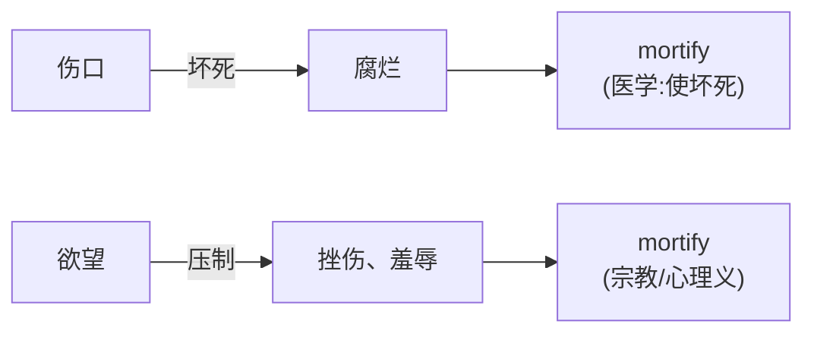
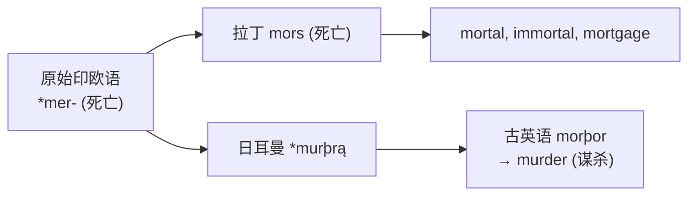

# 第 10 章 罗马人的死亡：mors家族

> 别被标题吓跑。`mors` 虽然表示"死亡",它的词族却活得相当旺盛,甚至还在银行按揭部门长期任职。

> **词根**:`mort-`
> **含义**:死亡(death)
> **起源**:拉丁名词 ***mors***(死亡),属格 ***mortis***(属格形式 mort- 进入英语),来自原始印欧语 *mer-(死亡、消失)

mors 家族是拉丁词根里**很有戏剧性**的一支。它生成的词——`mortal` /ˈmɔrtəl/(必死的)、`immortal` /ˌɪˈmɔrtəl/(不朽的)、`mortgage` /ˈmɔrɡɪdʒ/(抵押)、`morbid` /ˈmɔrbɪd/(病态的)、`mortify` /ˈmɔrtəˌfaɪ/(使羞辱)——背后常能看到死亡或衰败的语义痕迹。

这一章你会发现:**围绕"死亡"的拉丁词族,如何进入今天一批看似无关的英语词。** 学完不保证长生不老,但大概率能认出 `mort-`。

---

## 【起源故事】拉丁 mors 与印欧语 *mer-

### 一个比拉丁更古老的词根

拉丁 ***mors***(死亡)来自原始印欧语 *mer-(死亡、消失)。这一词根在多个印欧语分支中留下了可比较的后裔:

> **提示** **最有意思的远房亲戚**:`murder` /ˈmɜrdər/(谋杀)也来自原始印欧语 *mer-!它经过日耳曼路线,在古英语里变成 *morþor*,后来变成 `murder`。所以 `mortal` /ˈmɔrtəl/ 和 `murder` 是亲戚,都来自"死"这个原始概念。

### 拉丁 mors 在古罗马的特殊地位

在古罗马文化里,"死亡"不只是生理事件,也是**法律、宗教、哲学**的重要议题。这些语境有助于理解拉丁死亡词族后来进入欧洲语言时承载的意义:

| 角度 | 命题 | 对应词 |
| ---- | ---- | ---- |
| ① 生物学 | 人都会死 | `mortal` /ˈmɔrtəl/(必死的) |
| ② 宗教 | 神不会死 | `immortal` /ˌɪˈmɔrtəl/(不朽的) |
| ③ 法律 | "死抵押"与"活抵押"对照 | `mortgage` /ˈmɔrɡɪdʒ/(抵押贷款) |

第三个角度尤其精彩——它解释了为什么"抵押贷款"里藏着一个"死"字。

---

## 【家族树】mors 的子孙

一个"死"字,养活了殡葬师、银行按揭部和羞愧得想钻地缝的社恐患者——这家族的就业面,比活着的词根还宽。

> 注:`morbid` /ˈmɔrbɪd/(病态的)来自拉丁 *morbus*(疾病),它和 *mors*(死亡)**是否同根有争议**。一些学者认为 *morbus* 与 mors 同源(病 = 走向死),另一些认为它们只是形似。本书标注: 词源关系有争议。

---

## 【代表词深讲】四个词的故事

### 词 1:`mortal` /ˈmɔrtəl/(必死的)

**拆解**:`mort-`(死)+ `-al`(形容词)= 会死的

**故事**:

`mortal` 字面义是"**会死的**"。

这个词承载了古罗马-希腊哲学的一个核心区分:**人(mortal)与神(immortal)的对立**。希腊罗马神话反复强调:人会死,神不朽。这种"必死性"是人类的本质特征——人之所以为人,正因为他会死。

正因如此,希腊英雄一生追求的是 **immortal glory(不朽的荣耀)**。阿喀琉斯在特洛伊战场上选择短暂而辉煌的一生,为的是死后名声不朽;奥林匹克竞技的冠军、史诗里传唱的英雄,都是凡人向"不朽"发起的一次次冲锋。**人终有一死(mortal),于是拼命去够一点 immortal 的东西**——这便是 `mortal/immortal` 这对词背后最深的张力:正因为会死,才渴望不朽。

> 希腊罗马神话和文学常把会死的凡人同不朽的神对举。这里适合用来理解 `mortal/immortal` 的语义反差,不应把它写成亚里士多德《论灵魂》中的一句简单二分结论。

**派生词**:

- `mortality` /mɔrˈtæləti/(必死性、死亡率)
- `immortal`(不朽的)
- `immortality` /ˌɪmɔrˈtælɪti/(不朽、永生)
- `mortician` /mɔrˈtɪʃən/(殡葬师:处理死者的人)

---

### 词 2:`mortgage` /ˈmɔrɡɪdʒ/(抵押贷款)—— 全书最戏剧性的词源

**拆解**:`mort-`(死)+ `gage` /ɡeɪdʒ/(抵押)= **死抵押**

**故事**:

`mortgage` 由古法语 *mort*(死)+ *gage*(质押、担保)组成,字面就是 **"死的质押"——死抵押**。下次你在银行签按揭合同,签下的其实是一份"死"的契约。

为什么贷款和"死"有关?流行说法讲得最有画面感,也最让人过目不忘:

> 抵押物(mortgage 里的那块地、那栋房子)始终处于一种 **"死"的状态**——它的命运被钉死在两头之中的一头。
>
> - **如果借款人还清贷款**:这块地从此对债权人"死了"——债权人再无任何权利,只能撒手。
> - **如果借款人违约断供**:这块地反过来对债务人"死了"——被收走、被拍卖,从此与你无关。
>
> **无论哪一边,都有一方对它"死了"。** 这就是"死抵押"二字最锋利的含义:这块抵押物的归宿,注定是一场单向的"死亡"。

这个画面的戏剧性在于:一纸契约,看似只是借钱还钱,字里却藏着一具"会死的物"。中世纪诺曼底的土地上,借贷双方心照不宣——你押给我的是一块"活地"还是"死地",全看最后那一笔钱还不还得清。还清,它对我死去;赖账,它对你死去。"mortgage"这两个字,把整个博弈压缩进一个"死"字里,这大概也是法律文书里最有文学张力的一次命名。

---

### 词 3:`mortify` /ˈmɔrtəˌfaɪ/(使羞辱、使坏死)

**拆解**:`mort-`(死)+ `-ify`(使……)= 使死

**故事**:

`mortify` 字面义是"**使……死**"。它一步步从"杀死"走向了"羞死人":

**医学层面**:`mortify` 在中世纪医学里指"组织坏死、腐烂"——身体某部分"死掉",这是最直白的字面义:使肉体死。

**宗教层面**:基督教语境用它表示"治死、克制肉体欲望",即通过禁食、苦修把欲望"处死"。这里的"死"对象换成了欲望。

**心理层面**:由"压制、挫伤"再发展出"使受辱、使极度难堪"。现代 `mortified` /ˈmɔrtəfaɪd/ 表示**羞愧得无地自容**——画面是:脸涨得通红,恨不得当场找个地缝钻进去、恨不得自己立刻"死掉"。这就是"羞得想死"的助记画面:羞辱感强烈到让人觉得死了算了。

**派生词**:

- `mortification` /ˌmɔrtəfɪˈkeɪʃən/(羞辱、坏死)
- `mortifying`(令人羞愧的)

> **提示** **生活场景**:`"I was mortified when my phone rang during the concert."`(音乐会上手机响了,我羞愧得想找个地缝钻进去)——这就是 mortified 的日常用法。

---

### 词 4:`moribund` /ˈmɔrəˌbʌnd/(垂死的、即将灭亡的)

**历史构形**:拉丁 *mori*(死)+ `-bundus`(表示正处于或倾向于某动作的形容词成分)

**故事**:

`moribund` 字面义是"**正在死亡的过程中**"。

这个词常用于形容**正在衰落、即将灭亡**的事物——一个垂死的王朝、一个垂死的产业、一种垂死的文化。它比 `dying` /ˈdaɪɪŋ/ 更书面、更带悲凉感。

> **moribund 的画面**:还活着,但已经在死——活力一点点流失(▓▓▓▓▓▓ → ▓▓▓ → ▓)。可用于一个垂死的产业 / 语言 / 王朝。

---

## 【词源辨正】murder 和 mortal 真的同根吗

**答案:是,都来自原始印欧语 *mer-(死亡)。**

所以 `mortal` /ˈmɔrtəl/(必死的)和 `murder` /ˈmɜrdər/(谋杀)是远房亲戚,都来自"死"这个最原始的概念。一个走了拉丁路线,进入学术词;一个走了日耳曼路线,进入法律词。

---

## 【拆词启示】mors 家族如何帮你记忆

| 词 | 拆解 | 推义 |
| ---- | ------ | ------ |
| `immortal` /ˌɪˈmɔrtəl/ | im- + mort + -al | 不会死 → 不朽的 |
| `mortality` /mɔrˈtæləti/ | mort + -ality | 死的特性 → 死亡率 |
| `mortician` /mɔrˈtɪʃən/ | mort + -ician | 处理死者的人 → 殡葬师 |
| `amortize` /ˈæmərˌtaɪz/ | 经法语 *amortir/amortiss-* "使消灭、逐渐清偿" | 分期摊销或偿还 |
| `rigor mortis` | (拉丁)rigor + mortis | 死亡僵硬 → 尸僵 |

> **提示** **amortize 的记忆画面**:它经法语表示"使消灭、逐渐清偿"的词进入英语。把分期还款想成"让债务逐步消失"有助记忆,但"每期死一点"是现代比喻,不是独立的古代命名故事。

---

## 【易错辨析】

- **mortgage 的"两头都会死"是最流行的助记说法,但法史学界更倾向于"活抵押 vs 死抵押"的对照解释**——活抵押(vivum vadium)的收益冲减本金,死抵押(mortgage)的收益不冲减。先记画面,再补这层修正,两不耽误。
- **`morbid` /ˈmɔrbɪd/ 来自拉丁 *morbus*(疾病),和 *mors*(死亡)是否同根有争议**。本书把它们当可能的远亲,但不绑死——毕竟人家自己也没签过亲子鉴定。
- **`mortify` /ˈmɔrtəˌfaɪ/ 的"羞愧得想死"是助记画面,不是历史原义**。它从医学"使坏死"走到宗教"治死欲望"再到"使极度难堪"，记住演变路径即可。

---

## 本章小结

1. **mort = 死**——在本章所列的拉丁 `mort-` 词族中,"死亡、消灭"是共同的历史核心。
2. **mortgage(抵押)= 死抵押**——抵押物对还清的债权人"死",对违约的债务人也"死",总有一方对它"死了"。(这是助记说法,法史上的严格解释见"易错辨析"。)
3. **murder 和 mortal 同根**——都来自原始印欧语 *mer-(死亡),走不同语言路线。

### 记忆锚点

> **mort = 死**:mortal 会死的,immortal 不死的,mortgage 死抵押,mortify 治死欲望→羞愧,amortize 让债务慢慢"死"掉。

---

### 【思考题】(答案见附录 A)

1. **(破除误解)** `mortgage` 常被解释成"还清了地对债权人死、违约了地对债务人死,两头都会死",很好记。但本章说这不是法史学界更认可的解释。更严谨的说法(活抵押 vs 死抵押)是什么?为什么"好记的故事"和"可靠的解释"会不一样,遇到这种情况该怎么办?
2. **(讲证据)** 本章对 `murder`/`mortal` 敢直接说"同根",对 `morbid` 却只说"可能远亲、有争议"——两个词都带 `mor-`,为什么把握程度不同?这种"证据足就下结论、不足就标存疑"的做法,体现了什么态度?
3. **(迁移应用)** `mortal` 既表示"凡人的、终有一死的",又能在 `mortal wound`(致命伤)、`mortal enemy`(不共戴天的敌人)里表示"致命的/你死我活的"。用"死"这个核心义解释这两支怎么来的;再说：词根能解释这种一词多义,为什么却不能替你决定一句话里该取哪个义?

---

*下一章 → [第 11 章 罗马人的站立：stare家族](./第11章-罗马人的站立：stare家族.md)*
