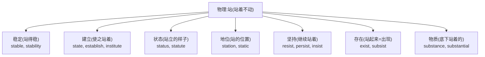
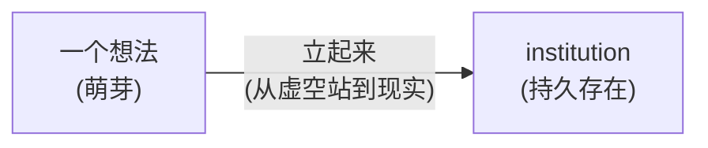
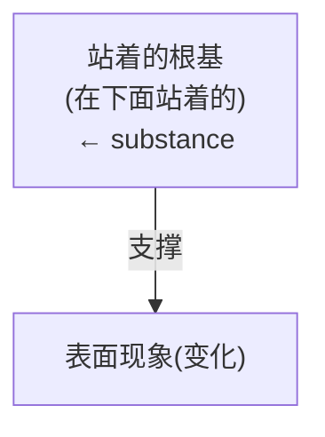
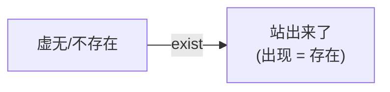
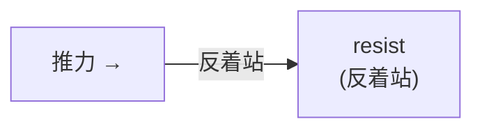
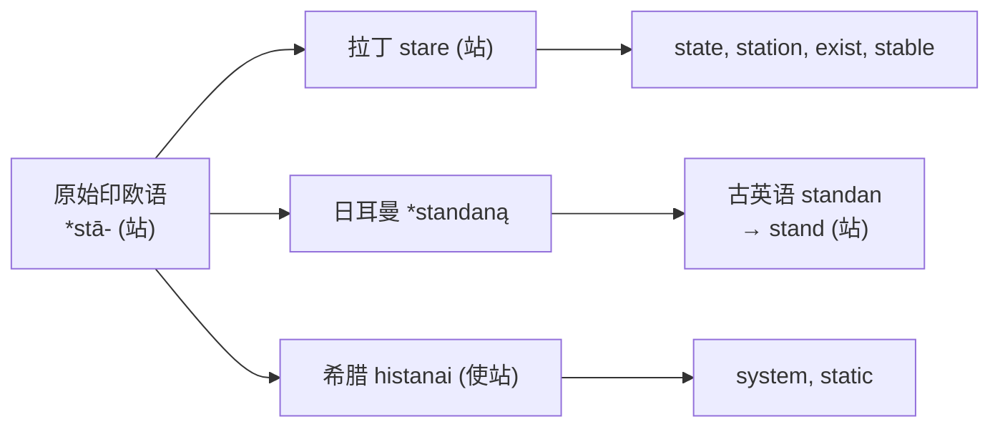

# 第 11 章 罗马人的"站立":stare 家族

> `stare` 的本职是"站",英语却让它站进了国家、车站、状态、机构和宪法。这个词根的职业发展,显然没打算坐下。

> **词根**:`stat-` / `stit-` / `stant-` / `sta-`
> **含义**:站、站立、使站立、放置(to stand, to set, to place)
> **起源**:拉丁动词 ***stare***(站),来自原始印欧语 *stā-(站)

stare 家族是**英语里派生能力很强**的拉丁词根家族之一。具体数量会随词源口径而变化,但常见成员已经排成一条长队:`state`(国家)、`station`(车站)、`status` /ˈstætəs/(地位)、`stable` /ˈsteɪbəl/(稳定的)、`institution` /ˌɪnstɪˈtuʃən/(机构)、`constitution` /ˌkɑnstəˈtuʃən/(宪法)、`substance` /ˈsʌbstəns/(物质)、`exist` /ɪɡˈzɪst/(存在)、`resist` /rɪˈzɪst/(抵抗)……

为什么这一根派生能力这么强?因为**"站立"是一个极其基础的物理动作**,从它引申出"建立、稳定、存在、状态、坚持"等大量抽象义。一个简单动作就这样搭起了政治、法律和哲学词汇中的不少脚手架。

---

## 【起源故事】从物理的"站"到抽象的"立"

### 一个动作的语义爆炸

清晨,罗马广场还沾着露水。一个士兵把长矛往地上一顿,枪尾杵在石板上,纹丝不动——这是 **stare**(站)。执政官的侍从官举着束棒(fasces),笔直地站在主人身侧,谁也不看——这也是 stare。神庙门口,一个来还愿的农夫直挺挺地候着,等祭司开口——还是 stare。

一个动作,三处场景。但罗马人不会满足于把 *stare* 只当成肌肉的事。他们的脑子一旦转起来,这个最基础的"站",就朝四面八方伸出了触角:

七条引申路径,起点都是同一个画面:有人或什么东西,**直挺挺地立在那里**。罗马人讨论"国家""存在""稳定"这些听起来最玄乎的概念时,脑子里浮现的从来不是抽象符号,而是这个看得见、摸得着的动作——有人站着,稳稳地,不动。

### stare 的拼写变体

stare 的变体非常多,因为拉丁动词在不同形式下词干变化大,英语把各种形式都借了进来:

| 词根变体 | 来源 | 例词 |
| ---- | ---- | ---- |
| `stat-` | 基本形式 | state, status, station, static /ˈstætɪk/, statistic /stəˈtɪstɪk/ |
| `stit-` | 词干变体 | institute, constitution, substitute, restitution /ˌrɛstəˈtuʃən/ |
| `stant-` | 词干变体 | constant, instant, distant, substance |
| `sta-` | 简化形式 | stable, establish |
| `sist-` | 来自 stare 的另一种形式 sistere | exist, consist /kənˈsɪst/, persist /pərˈsɪst/, resist, assist |

**记忆口诀**:**stat/stit/stant/sta/sist 都属于拉丁"站立、使站立"词族**。英语本族词 `stand`、`stay` 与它们有更早的印欧亲缘,但不是拉丁 *stare* 直接派生出的英语借词。

---

## 【家族树】stare 的子孙(部分)

一个"站"字派生出国家、宪法、物质和存在——这职业跨度,相当于一个保安转行当了哲学教授,还兼任宪法起草委员。

```mermaid
flowchart TD
    stare["拉丁 stare (站)"]
    stare --> stat["stat-"]
    stare --> stit["stit-"]
    stare --> stant["stant-"]
    stare --> sta["sta-"]
    stare --> sist["sist-"]

    stat --> statew["state (国家)"]
    stat --> statusw["status (地位)"]
    stat --> stationw["station (车站)"]
    stat --> staticw["static (静态)"]
    stat --> statw["statistic (统计)"]

    stit --> instw["institute (机构)"]
    stit --> constw["constitution (宪法)"]

    stant --> conw["constant (恒定的)"]
    stant --> instw2["instant (即刻)"]
    stant --> subsw["substance (物质)"]

    sta --> stabw["stable (稳定)"]
    sta --> estw["establish (建立)"]

    sist --> exw["exist (存在)"]
    sist --> perw["persist (坚持)"]
    sist --> consw["consist (组成)"]
    sist --> insw["insist (坚持)"]
    sist --> asw["assist (帮助)"]
```

---

## 【代表词深讲】五个词的故事(因为这一根太重要)

### 词 1:`state`(国家、状态)

**历史路径**:拉丁 *stare*(站立)→ *status*(位置、状态)→ 法语/英语 `state`

**故事**:

黄昏时分,罗马广场中央立着一尊铜像——某位早已作古的执政官,大理石的脚踩在底座上,一立就是几百年。罗马人管这种"立着的东西"叫 ***statua***(英语 `statue` /ˈstæˌtʃu/ 雕像);管它立在那儿这个事实叫 ***status** /ˈstætəs/*(英语 `status` 状态、地位);管它所站的那块地、那个固定位置叫 ***statio***(英语 `station` 车站、岗位)。一尊雕像,派生出三个英语词——因为它们共享同一个画面:**有东西,稳稳地,站着**。

而最大的"站立者",是 `state` 本身。一个国家凭什么算个国家?罗马人的回答藏在词里:它得**站起来**。一帮人散着、乱着、各过各的,那不叫国家;一旦他们立起法律、立起政府、立起一面共同的旗帜——这堆人就"立"成了一个 **state**(国家)。

`state` 经法语追溯到拉丁 *status*(站立的位置、状况、状态),与 *stare* 同族。英语后来发展出"情形、身份、政体、国家"等意义;把它直接译成"站立着的东西"会把拉丁名词和英语词义都说得过窄。

这个词演化出两个主要意思:

| 义 | 画面 | 例 |
| ---- | ---- | ---- |
| 状态 | 某个事物"站"成的样子 | state of affairs(事态) |
| 国家 | 一群人"站"成的政体("立国") | the State(国家) |

> 中文说"立国",英语说 establish a state——动的是同一个念头:**让一群人和一套规矩,稳稳地站起来**。所以罗马广场上那尊青铜执政官、骑士铜像下钉着的"位置"、万民所立的"国家",在词源里是同一棵树上的果子。

---

### 词 2:`institution` /ˌɪnstɪˈtuʃən/(机构、制度)

**历史路径**:拉丁 *instituere*(设立、建立、教导)→ *institutio*→ 英语 `institution`

**故事**:

罗马城外有一块荒地,杂草丛生。某天,一群元老带着测量员、带着石匠来了。他们插下界碑,立起第一根柱子,然后一根接一根,把一座神庙或议事厅从地上"立"了起来。这个"立起来"的动作,拉丁语叫 ***instituere***(in- 向内 + statuere 使站立)。等柱子立完、规矩立完、人马入驻,这块荒地上就多了一个会持续几百年的东西——`institution`。

大学、医院、教会、婚姻、议会——这些一听就沉甸甸的词,在词源里全是同一件事:**有人把某种做法或组织,从无到有地"立起来",让它站得住、活得久**。`institute` /ˈɪnstəˌtut/(动词:设立)是那个立柱子的动作,`institution`(名词:机构)是立完之后那座矗立的建筑。

`institute` 的历史核心是"设立、建立",后来可指被建立的制度或机构。`stit/stat` 能帮助识别亲缘,但 `-ution` 不是可随意附加的现代英语后缀。

**派生词**:

- `institute`(动词:设立;名词:研究所)
- `institutional` /ˌɪnstɪˈtuʃənəl/(机构的)
- `institutionalize` /ˌɪnstɪˈtuʃənəˌlaɪz/(使制度化)

---

### 词 3:`substance` /ˈsʌbstəns/(物质、本质)

**拆解**:`sub-`(在下面)+ `stant`(站)+ `-ce`= **在下面站着的**

**故事**:

一位古希腊哲学家——就说是亚里士多德那一派吧——把学生带到庭院里一棵老橡树前。秋深了,叶子一片片往下掉,橡子噼里啪啦砸在土里。

"看着这棵树。"他说,"叶子会落,果实会烂,树皮会裂。每年都在变。可你为什么还管它叫'同一棵橡树'?"

他蹲下身,拍拍脚下的泥土:"因为底下有东西,一直站着,没动过。叶子换了一茬又一茬,这个'底下站着的根基'没换。它才是这棵树真正的东西——它的 *substantia*(英语 `substance`)。"

`sub-`(在下面)+ `stant`(站):字面就是"**在下面站着、撑着上面那一堆变化的东西**"。罗马哲学家把这个画面借去翻译希腊哲学的 *ousia*、亚里士多德的"第一实体":所有看得见、摸得着、会变化的属性(颜色、形状、重量)都浮在表面,真正托住它们的,是那个站在最底下、沉默不动的根基。

> **提示** **哲学应用**:`substance` 常译"实体"或"本体",对应希腊哲学中的 *ousia*。亚里士多德讨论具体事物的构成时,更典型的配对是 `form`(形式)和 `matter`(质料),不能把 `substance` 直接等同于 `matter`。

---

### 词 4:`exist` /ɪɡˈzɪst/(存在)

**拆解**:`ex-`(出)+ `sist`(站)= 站出来

**故事**:

清晨,罗马诗人兼哲学家卢克莱修在自己的庭院里踱步。他写过一部《物性论》,通篇在追问一件事:这世上的一切,凭什么说它"存在"?

他低头,看见一块昨天还光秃秃的泥地上,钻出了一株嫩苗——顶破土壳,直直地立了起来。他盯着那株嫩苗,忽然像抓住什么似的,喃喃自语:

"看,它刚才还不在这世上。现在它从虚无里**站出来了**——立在那儿,看得见,摸得着。这就是'存在'。"

`ex-`(出)+ `sist`(站):一个东西怎么算"存在"?古罗马人给出的画面,不是某个玄乎的定义,而是这个——**它从虚无中"站出来",变得可见**。存在,就是站出来。

> **金句**:**一个东西怎么算"存在"?古罗马人的画面是——它从虚无中"站出来",变得可见。**

这棵嫩苗是整个 stare 家族里最闪光的一刻。"站"这个再普通不过的动作,被罗马人拿来回答哲学里最难的那个问题——什么是"有",什么是"无"。一株破土的小苗,顶住了整个西方形而上学的重量。

> **提示** 这就是为什么 `existence` /ɛɡˈzɪstəns/(存在)和 `stand`(站)、`state`(状态)同根——**古罗马人把"存在"理解为"站立"**。一个东西存在,就是它"立在那里"。

**派生词**:

- `existence`(存在)
- `existent` /ɛɡˈzɪstənt/(存在的)
- `coexist` /ˌkoʊɪɡˈzɪst/(共存)
- `existential` /ˌɛɡˌzɪˈstɛnʃəl/(存在的,存在主义的)

---

### 词 5:`resist` /rɪˈzɪst/(抵抗)

**拆解**:`re-`(回、对抗)+ `sist`(站)= 反着站

**故事**:

公元前 73 年,意大利南郊。罗马军团压了上来——铁甲、长矛、龟甲阵,一排排朝奴隶的破烂营地碾压过去。对面站着的,是斯巴达克斯和他那支由角斗士、逃奴、牧人凑起来的队伍。按规矩,这种乌合之众早该四散奔逃。

可他们没退。罗马人往前推一步,他们就顶着盾,原地不动,直直地**对着罗马人站着**。这一站,就是三年——把当时世界上最强的战争机器,拖得焦头烂额。

这就是 ***resistere***:**你推我,我不但不退,反而反着方向、对着你站**。`re-`(回、对抗)+ `sist`(站)。今天我们说 "resist temptation"(抵抗诱惑)、"resist invasion"(抵抗入侵),脑子里浮现的还是同一幅画面——有人或什么东西压过来,你双脚钉在地上,脸朝着它,不动。

**派生词**:

- `resistance` /rɪˈzɪstəns/(抵抗、阻力)
- `resistant` /rɪˈzɪstənt/(有抵抗力的)
- `irresistible` /ˌɪrɪˈzɪstəbəl/(不可抗拒的)

#### 四个 sist 兄弟:同是"站",站法不同

`resist` 不是孤零零一个词。拉丁语 *sistere*(使站立)配上前缀,长出了一组兄弟姐妹——四个都是"站",但站的姿势不一样,意思就不一样。给每个一个画面,你就忘不掉了:

- **`insist` /ɪnˈsɪst/(坚持)**:*in-* 往里。一个人抱着柱子,身子往门里挤,嘴上喊"**我就是站在这儿不走**"——往里站,就是坚持己见、执意要求。
- **`persist` /pərˈsɪst/(坚持、持续)**:*per-* 一直、从头到尾。一个人从黎明站到天黑,从头站到尾,雷打不动——一直站,就是持续、不肯放弃。
- **`consist` /kənˈsɪst/(由……组成)**:*con-* 一起。几个朋友肩并肩站成一排,合起来就成了一个团队——站在一起,就是"由这些构成"。
- **`assist` /əˈsɪst/(帮助)**:*as-*(*ad-*)到旁边。一个人蹲在路边喘气,另一个人**站到他身边**扶一把——站在旁边伸手,就是帮助。

> **提示** **同根兄弟**(都用 sist- 形式):一组五个 `-sist` 兄弟,都是"站",但前缀方向决定意义。

---

## 【词源辨正】stand 和 stare 是亲戚吗

**答案:是,非常近的亲戚。**

`stand`(站,英语本土词)来自古英语 *standan*,来自原始印欧语 *stā-(站)——**和拉丁 stare 完全同根**。

所以英语里 `stand`(本土)和 `state` / `exist` /ɪɡˈzɪst/ / `stable` /ˈsteɪbəl/(拉丁)是同根兄弟。这就是为什么它们都和"站、立、稳"相关。

---

## 【拆词启示】stare 家族如何帮你记忆

十五个词,五种拼写变体,全是同一个"站"——要是词根界有劳模评选,stare 至少能拿个"最佳变装奖"。

| 词 | 拆解 | 推义 |
| ---- | ------ | ------ |
| `state` | stat + -e | 站立的 → 国家/状态 |
| `status` /ˈstætəs/ | stat + -us | 站的位置 → 地位 |
| `stable` /ˈsteɪbəl/ | sta + -able | 能站的 → 稳定的 |
| `station` | stat + -ion | 站的地方 → 车站 |
| `static` /ˈstætɪk/ | stat + -ic | 站着不动 → 静态的 |
| `statistic` /stəˈtɪstɪk/ | stat + -istic | (国家统计的)→ 统计 |
| `institution` /ˌɪnstɪˈtuʃən/ | in- + stit + -ution | 使站立 → 机构 |
| `constitution` /ˌkɑnstəˈtuʃən/ | con- + stit + -ution | 一起立起 → 宪法 |
| `substance` /ˈsʌbstəns/ | sub- + stant + -ce | 下面站的 → 物质/本质 |
| `exist` /ɪɡˈzɪst/ | ex- + sist | 站出来 → 存在 |
| `resist` /rɪˈzɪst/ | re- + sist | 反着站 → 抵抗 |
| `persist` /pərˈsɪst/ | per- + sist | 一直站 → 坚持 |
| `consist` /kənˈsɪst/ | con- + sist | 站一起 → 组成 |
| `assist` /əˈsɪst/ | as- + sist | 站旁边 → 帮助 |
| `establish` /ɪˈstæblɪʃ/ | e- + stab + lish | 使稳固 → 建立 |

---

## 【史实与传说】

- **"卢克莱修看嫩苗悟 exist"是本书搭的助记场景** *(传说)*。词源脉络可靠,但卢克莱修本人没留下这段庭院顿悟的记载——他讨论存在靠的是长篇哲理诗,不是蹲在花盆边发呆。
- **`substance` /ˈsʌbstəns/ 译希腊 *ousia* 是学界共识**,但"哲学家指着橡树讲解"是简化版画面。亚里士多德原文严密得多(也枯燥得多),且 `substance` 不等于 `matter`(质料)。
- **斯巴达克斯起义是真的**,但用 `resistere` 命名他们的姿态是词源助记——斯巴达克斯当年可没喊过"我们在 resist"，他忙着打仗呢。

---

## 本章小结

1. **stare = 站**——本章所列 `stat/sta/stit/stant/sist` 词族共享"站立、使建立"这一历史核心;相同字母串不自动证明同源。
2. **"站立"演化出最抽象的概念**——state(立国)、exist(站出)、substance(底下站着)、resist(反着站)。
3. **stand 和 state 是亲戚**——都来自原始印欧语 *stā-(站)。

### 记忆锚点

> **stat = 站,四种站姿**:constant 一直站(恒定),instant 站跟前(立刻),distant 站得远(遥远),statue 站成了石头(雕像)。

---

### 【思考题】(答案见附录 A)

1. `persist` /pərˈsɪst/(坚持)字面是"一直站着",想象一个人在风暴中站着不倒的画面。
2. `constitution` /ˌkɑnstəˈtuʃən/(宪法)字面是"一起立起来",为什么国家根本大法叫"立起来"?(提示:国家被"立"在它之上)
3. `substance` /ˈsʌbstəns/(本质)字面是"底下站着的",想想这个词如何体现"本质"的含义?(提示:支撑表面的根基)

---

*下一章 → [第 12 章 罗马人的"法律":lex / jus](./第12章-lex-jus家族.md)*
