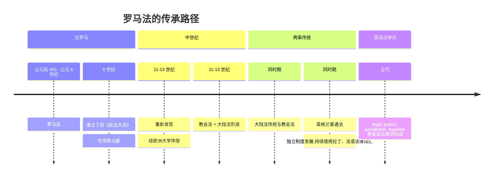
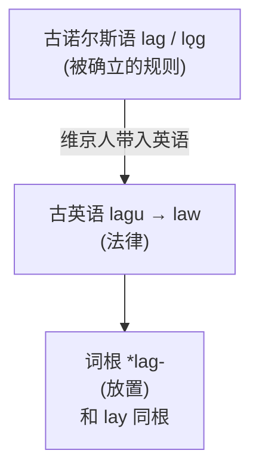

# 第 12 章 罗马人的法律：lex, jus

> 词根法庭现在开庭:`lex` 负责成文规则,`jus` 负责法、权利与正义。请读者保持安静,但可以对例词提出合理质疑。

> **词根**:`lex` / `legis-`(法律)和 `jus` / `jur-`(法、权利、宣誓)
> **含义**:法律、正义、宣誓(law, justice, oath)
> **起源**:拉丁名词 ***lex***(法律)、***jus***(正义、法权)、动词 ***jurare***(宣誓)

这一章讲两个常见的拉丁法律词族。罗马法深刻影响了欧洲大陆法和教会法;英格兰普通法走的是不同制度路线,但其法律词汇仍通过拉丁语和法语吸收了大量相关词。**词汇借用不等于制度直接继承**,否则背会 `jury` /ˈdʒʊri/ 就自动通过司法考试了。

---

## 词根 1:`lex` / `legis-`(法律)

### 【起源故事】

拉丁语 ***lex***(法律),属格是 ***legis***。许多词源资料把它与拉丁 *legere* "收集、选择、读取"联系起来,但更早关系并非完全确定,也有学者考虑相反的语义发展方向。

因此,"法律是被收集、选定的规则"可以作为记忆联想,不能写成已经证实的历史语义。联想可以帮忙记忆,但不能穿上西装冒充证据。

> **提示** **几个外形相近、可能有更早亲缘的家族**:
>
> - `lex` / `leg-`(法律):legal, legislate
> - `leg-`(选、读):lect, legible /ˈlɛdʒəbəl/, legend, intellect /ˈɪntəˌlɛkt/
> - `log-`(希腊版):logic, dialogue
>
> 不应把这三个家族简单合并成一个现代英语词根,更不能用"选出来的话就是阅读"一类故事代替语音和文献证据。

### 【代表词深讲】

**`legal`(法律的)** —— 来自 lex 的形容词形式 *legalis*。"和法律相关的"。

**`legislate` /ˈlɛdʒɪˌsleɪt/(立法)** —— 英语动词由 `legislation` /ˌlɛdʒəˈsleɪʃən/ 反向形成;后者追溯到拉丁 *legis* "法律的"和 *latio* "提出、带来"。可以理解为"提出法律",但现代英语中没有一个可自由使用、表示"携带"的 `-late` 后缀。

**`legitimate` /lɪˈdʒɪtəmət/(合法的)** —— 来自 *legitimus* "合乎法律的"。一个合法的政府、一个合法的孩子,都是"合乎法律"的。

**`privilege` /ˈprɪvəlɪdʒ/(特权)** —— `priv-`(私人)+ `leg-`(法律)= **私人法律**。一种只针对某个人的特殊法律,就是特权。这个词完美展示了拉丁构词的精妙:特权 = 私人的法律。

---

## 易混词族:`līs` / `līt-`(诉讼、争端)

`litigation` /ˌlɪtəˈɡeɪʃən/、`litigate` /ˈlɪtɪˌɡeɪt/ 追溯到拉丁 ***līs***,属格 ***lītis***,意思是"诉讼、争端"。它与 `lex / legis-` 不是同一个词,不能把 `lis-` 放在 `lex` 的变体表里。

---

## 词根 2:`jus` / `jur-`(正义、法权、宣誓)

### 【起源故事】

拉丁语 ***jus***(正义、法权),是古罗马法学最核心的概念。罗马法学家 Celsus 留下名言:*"Jus est ars boni et aequi"*(法律是关于善与公正的艺术;也常译作“善良与公平的艺术”)。

这个词族在英语里保留了两组常见形态:`jus-/just-` 多见于 `justice/just`,`jur-` 多见于 `jury` /ˈdʒʊri/、`juror`、`perjury` /ˈpɜrdʒəri/ 和 `jurisdiction` /ˌdʒʊrɪsˈdɪkʃən/。拉丁 ***jurare***(宣誓)是从 *jus/juris* 词族形成的动词;誓言与法定权利、法律程序相连,但"把自己绑在正义上"只是助记隐喻。

### 【代表词深讲】

**`justice` /ˈdʒʌstəs/(正义、司法)** —— 经法语追溯到拉丁 *justitia*,而 *justitia* 来自 *justus*(正当的、合乎法的),同属 *jus/juris* 词族。不能把现代英语 `-ice` 当作可自由表示"……的事"的后缀。

**`jury` /ˈdʒʊri/(陪审团)** —— 来自 jurare(宣誓)。陪审团成员**先宣誓**,然后审理案件。所以 jury 字面义是"**宣誓者团体**"。

> **jury 的画面**:12 个公民先宣誓(jurare)说真话,再审理案件。
>
> jury = 宣誓者

**`jurisdiction` /ˌdʒʊrɪsˈdɪkʃən/(司法权、管辖范围)** —— `juris`(法权)+ `dict`(说)= **说法权**。一个法庭有权"就法律事务发言",就是它的管辖范围。

**`jurist` /ˈdʒʊrɪst/(法学家)** —— 研究法律、懂法律的人。

**`injure` /ˈɪndʒər/(伤害)** —— `in-`(不)+ `jur`(正义)= **不正义**。对一个人做不正义的事,就是伤害他。所以 injury(伤害)字面义是"不正义的行为"。

> **提示** 这个词源能帮助理解 `injury` /ˈɪndʒəri/ 为什么既可指身体损害,也可指法律上的权利受损。但现代各义由长期使用形成,不能概括成所有古罗马人对伤害的统一哲学定义。

**`perjury` /ˈpɜrdʒəri/(伪证)** —— `per-`(彻底、背离)+ `jur`(宣誓)= **彻底背离宣誓**。在法庭上宣了誓还说谎,就是伪证罪。

---

## 【家族树】lex 和 jus 的子孙

法庭里其实坐着三家人。门牌相近,案卷却不能串错:

| 词族 | 核心含义 | 代表词 |
| ---- | ---- | ------ |
| `lex` / `legis-` | 法律、制定法 | legal, legislate, legitimate |
| `līs` / `līt-` | 诉讼、争端 | litigate, litigation |
| `jus` / `jur-` | 正义、法权、宣誓 | justice, jury, jurisdiction, perjury |

---

## 【历史背景】罗马法如何塑造英语法律词汇

接下来是一段法律史速览——放心,比真正的法律课短得多,而且不考试。

罗马法对欧洲法律传统影响深远,同时拉丁语长期充当教会、教育和法律书写语言。英语法律词汇因此大量吸收拉丁语和法语成分,但英国普通法并不是从罗马法沿一条直线发展而来:

> **提示** 英美法中的拉丁词汇和短语反映了法律教育、文书传统和跨制度交流。词是拉丁来源,不意味着陪审团、契约或不动产制度都直接从罗马法继承。

---

## 【词源辨正】law 和 lex 是亲戚吗

**答案:不是,虽然它们意思相同。**

`law`(法律)经古诺尔斯语 *lag/lǫg* "被放置、确立的事物/规则"进入英语——与英语 `lay` /leɪ/(放置)有日耳曼语亲缘。

> **有趣对比**:`lex/legal` 说成文法,`law` 的祖先说"被放置的规矩",`jus/justice` 说正义。三套词各带一张历史底片,但别把底片当成古人的统一法律哲学。

---

## 【拆词启示】lex, jus 家族如何帮你记忆

`lex` 写法条,`jus` 判是非,`līt-` 管诉讼。顺手再认四位:`legislature` 是立法机构,`illegal` 是违法,`jurist` 是法学家,`litigation` 是诉讼程序。分工明确到连打架都知道该告谁。

---

## 本章小结

1. **lex/legis 管成文法,jus/jur 管法权与宣誓,līs/līt- 管诉讼**。
2. **jury 是宣誓者,injure 是做不正义之事,privilege 是私人法律**。

### 记忆锚点

> **legis = 法律,jus/jur = 法与权利,lit = 诉讼。三个词族要分开。**

---

### 【思考题】(答案见附录 A)

1. `legal`(法律的)、`legible`(易读的)、`legend`(传说)都带 `leg-`,`privilege` 里也有 `leg`。它们是同一个词根吗?本章为什么强调不能把"法律 lex/leg-""选读 leg-""希腊 log-"合并成一个词根?你打算怎么避免"看到 leg 就当法律"这类错误?
2. `law` 和 `lex` 意思完全一样,本章却说它们不是亲戚。`law` 到底从哪来?为什么"意思相同"再一次不能作同根的证据——这和 see/spect、cow/beef 是同一个道理吗?
3. 给你一个没讲的词 `conjure` /ˈkʌndʒər/(念咒召唤、变魔术;旧义"恳求"):`con-`(一起)+ `jur`(宣誓)。先推字面义;再想：一个跟"宣誓"有关的词,怎么会跑去表示"念咒召唤"?你这条解释是推测还是定论,该怎么确认?

---

*下一章 → [第 13 章 拉丁词根速查补遗](./第13章-拉丁词根速查补遗.md)*
