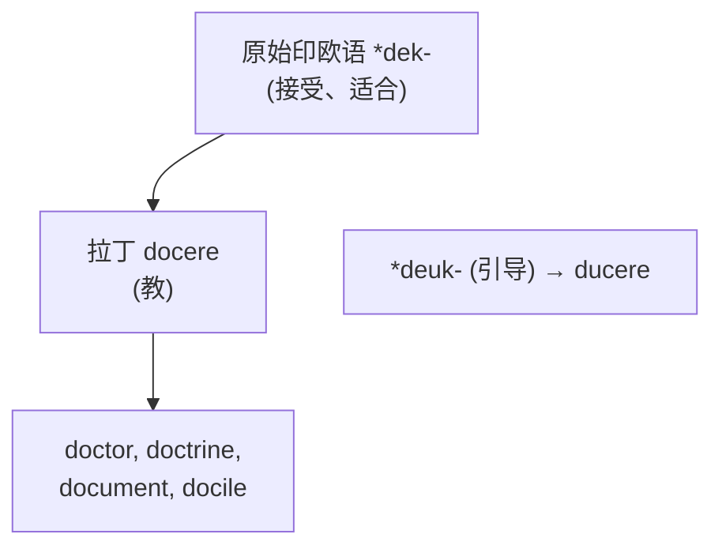
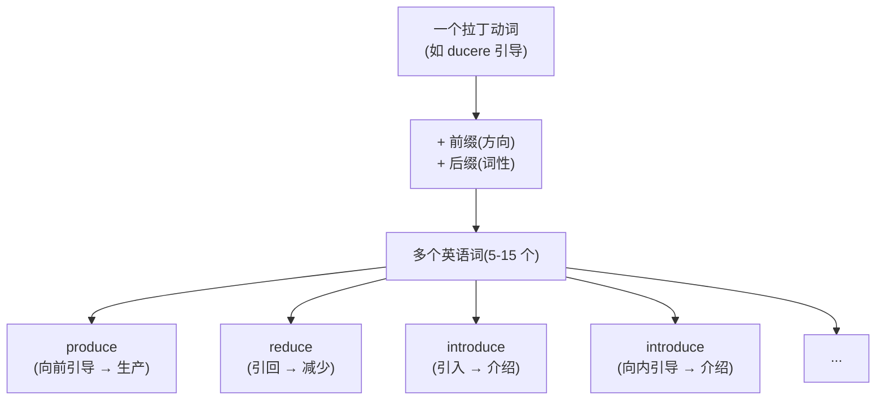

# 第 13 章 拉丁词根速查补遗

> "速查"不是把词根塞进停车场,而是给前面的大章节补一只工具箱。需要哪把扳手,就翻到哪一格。

前面九章(第 4-12 章)我们深讲了拉丁词根的九大家族:specere(看)、ducere(引导)、jacere(投)、capere(抓)、trahere(拉)、cor/mens/animus(心灵)、mors(死)、stare(站)、lex/jus(法律)。

但拉丁词根的世界远不止这九个。这一章把**其他高频拉丁词根**压缩成更紧凑的"故事 + 家族 + 拆词"格式。篇幅瘦身,证据不能跟着缩水;每个词根不再单章展开,核心的【起源故事】和【拆词启示】仍然保留。

> 本章收录约 20 个词根,覆盖 `docere`(教)、`mittere`(送)、`scribere`(写)、`audire`(听)、`venire`(来)、`pellere` / `puls-`(推)、`fluere`(流)、`frangere`(破)、`fundere`(倾倒)、`gradi`(走)、`tenere`(持)、`vendere`(卖)等。

---

## 13.1 docere / doc- / doct-(教)

**起源**:拉丁动词 ***docere***(教、指示),通常追溯到原始印欧语 *dek-(接受、合适)。它与 `ducere` 的 *deuk-(引导)不是同一个重建词根。

【代表词】:

- `doctor`(医生、博士):拉丁语本义是"教师、教导者"。中世纪大学把它发展为高级学位称号;英语中的"医生"义来自医学博士这一称号。
- `doctrine`(学说):被教导的一套理论。
- `document`(文件):本义"教导的工具"——一份用来证明、说明的文件。
- `docile`(温顺的):容易被教导的。

【记忆锚点】:**doc = 教。doctor 是"教者",document 是"教具",doctrine 是"教义"。**

---

## 13.2 mittere / miss-(送、发、放)

**起源**:拉丁动词 ***mittere***(送、派遣、放走)。这个词根派生能力极强,前缀决定"送到哪里":

| 前缀 | 含义 | 代表词 | 词义 |
| ---- | ---- | ------ | ------ |
| `e-` | 出 | emit | 发出、发射 |
| `trans-` | | transmit | 传输 |
| `sub-` | 下 | submit | 提交、屈服 |
| `ad-` | 向 | admit | 承认、准许进入 |
| `per-` | 透 | permit | 允许 |
| `dis-` | 离 | dismiss | 解散、打发走 |
| `com-` | 共 | commit | 承诺、委托 |
| `inter-` | | intermittent | 间歇的(中间被送走) |
| `miss-` | | mission | 任务(派遣出去做的事) |

【代表词故事】:

- `mission`(使命、传教):本义"被派遣的任务"。基督教传教士(missionary)就是"被派出去传教的人"。
- `promise`(承诺):`pro-`(向前)+ `miss`(送)= **把话送向前**——把承诺"发出去"给别人。
- `compromise`(妥协):`com-`(共同)+ `pro-`(前)+ `miss`(送)= **共同向前送**——双方各让一步,达成共同承诺。

【记忆锚点】:**本节所列的拉丁 `mit/miss` 词族可用"送、放出"串联;英语本族词 `miss`(错过)不属于这条拉丁构词链。**

---

## 13.3 scribere / scrip-(写)

**起源**:拉丁动词 ***scribere***(写、刻)。在纸张普及前,罗马人写字是用尖笔**在蜡板上刻**,所以 scribere 带有"刻划"的物理感。

| 前缀 | 含义 | 代表词 | 词义 |
| ---- | ---- | ------ | ------ |
| `pre-` | 前 | prescribe | 开处方(提前写) |
| `sub-` | 下 | subscribe | 订阅(在下面签名) |
| `de-` | 从 | describe | 描述(写下来) |
| `manu-` | 手 | manuscript | 手稿(手写的) |
| `post-` | 后 | postscript | 附言(写完后) |

【代表词故事】:

- `script`(脚本):被写下的文字。`scripture`(经文):专指宗教圣典。
- `scribe`(抄写员):古代专门负责抄写的人——在印刷术发明前,知识靠 scribe 一笔笔抄。
- `prescribe`(开处方):医生提前写下用药指示。注意 `proscription`(禁止)和 `prescription`(处方)的对照。

【记忆锚点】:**本节所列的 `scrib/scrip` 词族可用"写、记录"串联;看到相似字母串时仍要先确认它是否真来自拉丁 *scribere*。**

---

## 13.4 audire / audi-(听)

**起源**:拉丁动词 ***audire***(听),来自原始印欧语 *au-(感知)。

| 前缀 | 含义 | 代表词 | 词义 |
| ---- | ---- | ------ | ------ |
| `ob-` | 对着 | obey | 服从(对着听) |
| `in-` | 向 | inaudible | 听不见的 |
| `re-` | 回 | audit (aud-) | 审计(听账目) |

【代表词故事】:

- `audience`(观众、听众):来"听"的人。注意:英语的 audience 既指听众,也指观众——因为古罗马 theatrical 演出,观众主要是"听"。
- `obey`(服从):来自 *ob-audire*(对着听)——用心听别人的话并照做,就是服从。**`obey` 和 `audience` 是同根兄弟**!
- `audit`(审计):本义"听账目"——古代审计就是大声朗读账本,审计员"听"数字核对。

【记忆锚点】:**audi = 听。audience 是听众,obey 是"听话照做",audit 是"听账"。**

---

## 13.5 venire / vent-(来)

**起源**:拉丁动词 ***venire***(来),来自原始印欧语 *gʷem-(来)。英语本土的 `come` 也来自同一原始印欧语词根。

| 前缀 | 含义 | 代表词 | 词义 |
| ---- | ---- | ------ | ------ |
| `inter-` | 之间 | intervene | 介入(来到中间) |
| `con-` | 一起 | convene | 召集(来到一起) |
| `in-` | 入 | invent | 发明(想出来) |
| `ad-` | 向 | advent | 到来(向某处来) |
| `e-` | 出 | event | 事件(出来的事) |
| `re-` | 回 | revenue | 收入(回来的钱) |
| `pro-` | 前 | prevent | 预防(先来到) |

【代表词故事】:

- `convention`(大会、惯例):人们"来到一起"形成的事——既指大会,也指"约定俗成"。
- `invent`(发明):经拉丁 *invenire*(遇到、发现)及其词族发展而来,后来由"发现、构想"走向"发明"。它与 *venire*(来)同族,但"把创意召唤到现实"只是现代助记。
- `intervene`(介入):`inter-`(中间)+ `venire`(来)= 来到中间——插手别人之间。

【记忆锚点】:**vent / ven = 来。event 是"出来的事",revenue 是"回来的钱",convention 是"来到一起"。**

---

## 13.6 pellere / puls-(推、驱)

**起源**:拉丁动词 ***pellere***(推、驱赶),过去分词 ***pulsus**。

| 前缀 | 含义 | 代表词 | 词义 |
| ---- | ---- | ------ | ------ |
| `ex-` | 出 | expel, expulsion | 驱逐 |
| `re-` | 回 | repel, repulse | 击退 |
| `com-` | 一起 | compel | 强迫 |
| `pro-` | 前 | propel | 推进 |
| `dis-` | 离 | dispel | 驱散 |
| `im-` | 入 | impulse | 冲动(内在推力) |

【代表词故事】:

- `compel`(强迫):`com-`(加强)+ `pel`(推)= 用力推。强迫就是"把人推着走"。
- `impulse`(冲动):`im-`(内)+ `pulse`= 内部的推力——欲望、本能推着你行动。
- `repel`(击退):`re-`(回)+ `pel`= 推回去。

【记忆锚点】:**pel / puls = 推。compel 是"硬推",impulse 是"内推",repel 是"推回"。**

---

## 13.7 fluere / flux-(流)

**起源**:拉丁动词 ***fluere***(流),来自原始印欧语 *bhleug-(流出)。

| 前缀 | 含义 | 代表词 | 词义 |
| ---- | ---- | ------ | ------ |
| `in-` | 入 | influx | 涌入 |
| `in-` | 入 | influence | 影响(流入) |
| `con-` | 一起 | confluence | 汇流 |
| `inter-` | 间 | interfluve | 水流间 |
| `super-` | 上 | superfluous | 多余的(流出来了) |

【代表词故事】:

- `influence`(影响):`in-`(入)+ `flu`(流)= **流入**。古罗马占星术认为,星辰的力量"流入"人体,影响人的命运——这就是 influence 的起源,带着占星术的痕迹。
- `fluent`(流利):语言"像水一样流出来"。
- `superfluous`(多余的):`super-`(上)+ `flu`(流)= **流到上面、溢出来**——多余得溢出了。

【记忆锚点】:**flu / flux = 流。influence 是"流入",fluent 是"流利",superfluous 是"溢出"。**

---

## 13.8 其他高频拉丁词根速查

| 词根 | 含义 | 代表词 | 故事锚点 |
| ------ | ------ | -------- | --------- |
| `frangere` / `fract-` | 打破 | fraction, fracture, fragile, infringe | fraction = 破开的一份 |
| `fundere` / `fus-` | 倾倒、熔铸 | confuse, diffuse, refuse, transfuse | confuse = 倒在一起(混) |
| `gradi` / `gress-` | 走、步 | progress, congress, aggressive, grade | progress = 向前走 |
| `tenere` / `tent-` / `tin-` | 持、握 | contain, retain, sustain, tenant | contain = 一起握住 |
| `vendere` / `vend-` | 卖 | vendor, vend, vending | vender = venum(卖)+ dere(给) |
| `vocare` / `voc-` / `vok-` | 叫、唤 | invoke, evoke, provoke, voice | provoke = 向前唤(激怒) |
| `pangere` / `pact-` | 固定、同意 | pact, compact, impact | pact = 固定的协议 |
| `rapere` / `rap-` / `rapt-` | 抓、夺 | rapid, rapture, rape, ravish | rapture = 被抓走(狂喜) |
| `sequi` / `secut-` | 跟随 | sequence, consequent, execute, pursue | execute = 跟随到底 |
| `vertere` / `vers-` | 转 | reverse, convert, diverse, universe | universe = 全转(万物) |
| `pendere` / `pens-` | 悬挂、称重 | suspend, depend, ponder, expense | depend = 挂在上面 |
| `scrutari` / `scrut-` | 检查 | scrutiny, scrutinize | 本义"翻捡破布"(找东西) |

### 几个特别值得记的故事

**`rapture`(狂喜)** —— `rap-`(抓)+ `-ture`= **被抓住**。宗教语境里,rapture 指"灵魂被神抓走"——肉身被夺,灵魂升天,所以是狂喜。

**`universe`(宇宙)** —— `uni-`(一)+ `vers`(转)= **一切转成一个整体**。古罗马人对"宇宙"的理解:万物被"转"成一个统一体。

**`expense`(花费)** —— `ex-`(出)+ `pens`(称重)= **称出(钱)**。古罗马交易用金银,**称重**付款——expense 字面是"称出去的钱"。

**`scrutiny`(仔细审查)** —— 来自拉丁 *scrutari* "翻捡",本义是**在破布堆里翻找东西**。今天指仔细检查,但词源带着"翻垃圾"的朴素画面。

---

## 本章小结

本章把第 4-12 章未单独成章的高频拉丁词根补齐。加上前面九章,你已经掌握了**拉丁词根的核心阵容**(约 30 大家族,生成数百个英语高频词)。

### 一个回顾性的认知

读完整个第 2 卷,你应该建立这样一个心智模型:

> **拉丁词族的实用方法**:前缀常提供历史方向线索。先识别有证据的词根和前缀,再用整词语义核对,不要把相似字母强行拆成语素。

---

### 【思考题】(答案见附录 D)

1. `compromise`(妥协)拆开是 com- + pro- + miss,为什么"共同向前送"等于妥协?
2. `prescribe`(开处方)和 `proscribe`(禁止)只差一个前缀,字面义分别是什么?
3. `influence`(影响)字面是"流入",想想星辰力量"流入"人体的占星术起源,如何理解这个词的隐喻。

---

## 第 2 卷结束语

第 2 卷「拉丁之根」到此结束。这一卷你学到的核心:

-  拉丁语分三波进入英语(大陆接触、基督教、文艺复兴)
-  九大词根家族(spec/duc/jac/cap/tract/cor/mort/stat/lex-jus)的起源故事
-  20+ 补遗词根(doc/miss/scrib/audi/ven/pel/flu...)
-  变体现象(cap/capt/cip/cept/ceiv)的来历和应对
-  前缀常为历史词义提供方向线索,但不能机械推出全部现代词义

**下一卷,我们进入第 3 卷「希腊之光」**——古希腊语给欧洲思想和国际科学术语留下了大量组合形式。我们将同时注意:现代科学词汇也大量使用拉丁语、现代语言、人名和缩略构词,不能把科学语言归结为单一来源。

---

*下一卷 → [第 14 章 希腊语为什么成了"科学语"](../03-希腊之光/第14章-希腊语为什么成了科学语.md)*
