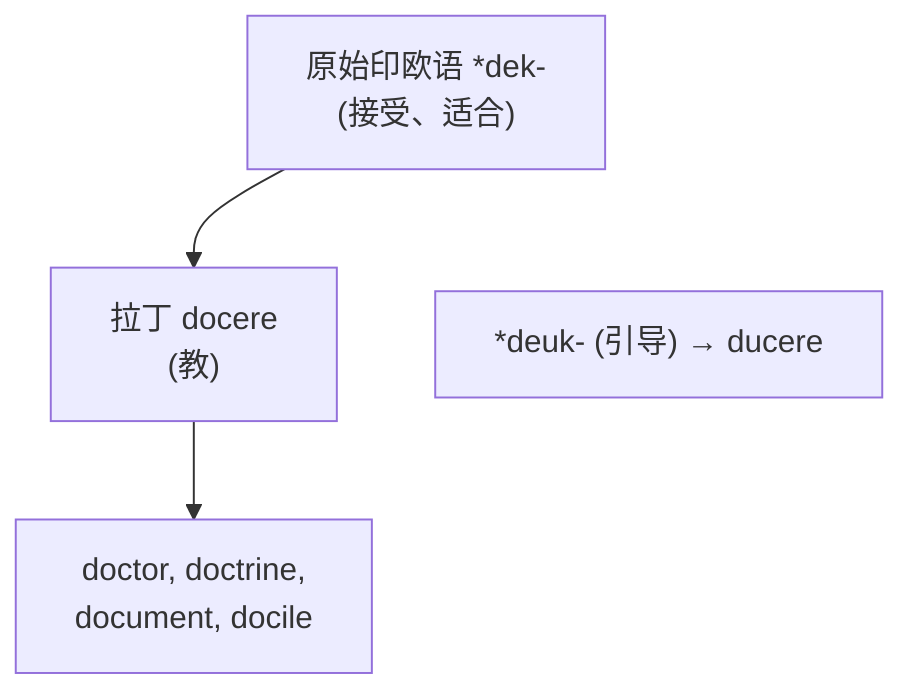
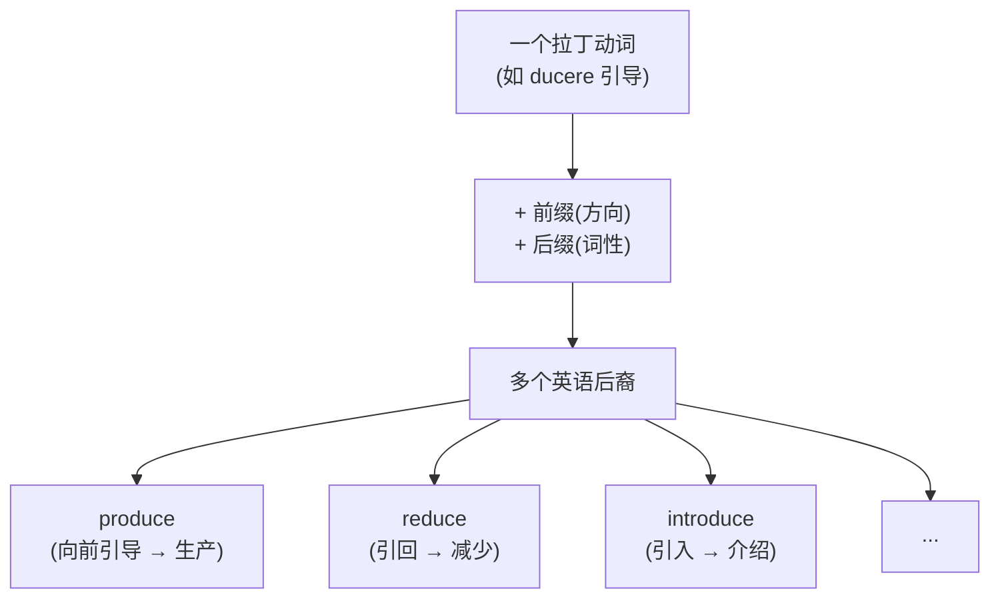

# 第 13 章 拉丁词根速查补遗

> "速查"不是把词根塞进停车场,而是给前面的大章节补一只工具箱。需要哪把扳手,就翻到哪一格。

前面九章(第 4-12 章)我们深讲了拉丁词根的九大家族:specere(看)、ducere(引导)、jacere(投)、capere(抓)、trahere(拉)、cor/mens/animus(心灵)、mors(死)、stare(站)、lex/jus(法律)。

但拉丁词根的世界远不止这九个。这一章把**其他高频拉丁词根**压缩成更紧凑的"故事 + 家族 + 拆词"格式。篇幅瘦身,证据不能跟着缩水;每个词根不再单章展开,但历史线索和拆词边界仍然保留。

> 本章收录二十来个词根家族,覆盖 `docere`(教导、说明)、`mittere`(送出、派遣、放行)、`scribere`(书写、记录)、`audire`(听取、聆听)、`venire`(来到、发生)、`pellere` / `puls-`(推动、驱赶)、`fluere`(流动、连续变化)、`ponere` / `pos-`(放置、摆放)、`ferre`(携带、搬运)、`frangere`(打破、折断)、`fundere`(倾倒、灌注)、`gradi`(迈步、行进)、`tenere`(持有、保持)、`vendere`(出售)等。

## 怎样阅读本章的"核心含义"

每个词根都分三层理解:

1. **历史动作或概念**,如 *mittere* 的"送出、放行"。
2. **常见引申方向**,如"送走"发展为解散,"让通过"发展为允许。
3. **现代整词义**,如 `dismiss` /dɪsˈmɪs/ 是"解散、驳回",不能只译成"离开 + 送"。

本章各小节标题把**英语词族中可识别的历史词形**放在前面,括号里再标出对应的**拉丁动词不定式**。例如 `fer- / lat- 词族(拉丁动词 ferre)` 中,*ferre* 是拉丁动词不定式,`fer- / lat-` 才是后代混进英语单词时常露出的脸。它们是一家人,但不是三个可以并排贴上“词根”标签的字母块。

全章表格统一使用四列:**词根词缀组成或历史词形 → 核心含义与记忆画面 → 代表词 → 现代词义与使用边界**。前半章一行追踪一个词,13.10 一行概括一个家族;镜头远近不同,仪表盘还是同一块。

---

## 13.1 doc- / doct- 词族(拉丁动词 docere):教导、说明与传授

先讲个反差:今天你喊 `doctor` /ˈdɑktər/ 的那位,多半穿白大褂、拿听诊器。可这个词最初的岗位是**站在讲台上**的——doctor 的本义是"教导者",跟手术刀毫无关系。

**起源**:拉丁动词 ***docere***(教、指示),通常追溯到原始印欧语 *dek-(接受、合适)。它与 `ducere` 的 *deuk-(引导)不是同一个重建词根。

**核心语义**:`doc-/doct-` 不只表示课堂上的"教",还包括把知识展示给别人、形成一套教导,以及用材料说明或证明某事。

【代表词深讲】:

- `doctor`(医生、博士):拉丁语本义是"教师、教导者"。中世纪大学把它发展为高级学位称号;英语中的"医生"义来自医学博士这一称号。
- `doctrine` /ˈdɑktrən/(学说):一套被系统传授的教导或理论。
- `document` /ˈdɑkjəmɛnt/(文件):经拉丁 *documentum*"教训、例证、证明"发展为能够说明、证明事实的书面材料,不宜只译成"教具"。
- `docile` /ˈdɑsəl/(温顺的、易驾驭的):早期核心是"容易受教",后来侧重顺从、容易管理。

【记忆锚点】:**`doc/doct` 的共同点是"把知识或证据展示给人":doctor 原是教导者,doctrine 是教导体系,document 是说明或证明材料。**

---

## 13.2 mit- / miss- 词族(拉丁动词 mittere):送出、派遣与放行

要是罗马开快递公司,商标非 mittere 莫属。信要"送",军队要"派",任务要"交办",连导弹(missile)都是被"射出去"的——全归这一根管。

**起源**:拉丁动词 ***mittere***(送、派遣、放走)。这个词根派生能力很强,前缀经常提示"送、放"的方向或关系:

**核心语义**:*mittere* 的范围包括"送出、派人去、放开、让通过"。`mit-` 多见于动词词形,`miss-` 多见于拉丁分词、名词及其后裔;两者不是可以在现代英语中任意互换的拼写。

| 词根词缀组成或历史词形 | 核心含义与记忆画面 | 代表词 | 现代词义与使用边界 |
| ------------------------ | -------------------- | -------- | ------------------------ |
| `e-` + `mit-` | 把光、热或物质从源头送出去 | `emit` /ɪˈmɪt/ | 发出光、热、声音或物质 |
| `trans-` + `mit-` | 把信息从这一端送过媒介,抵达另一端 | `transmit` /trænzˈmɪt/ | 传送信息、信号或疾病 |
| `sub-` + `mit-` | 把文件放到权威面前候审;把自己置于其支配之下 | `submit` /səbˈmɪt/ | 提交供审查;也表示屈服 |
| `ad-` + `mit-` | 给人开门让他进入;也给事实开门,不再把它挡在嘴外 | `admit` /ədˈmɪt/ | 准许进入;进一步表示承认事实 |
| `per-` + `mit-` | 像关卡放行,让人或行为获得通过 | `permit` /pərˈmɪt/ | 允许、许可 |
| `dis-` + `miss-` | 把人送出房间;也把意见或案件从案头打发走 | `dismiss` /dɪsˈmɪs/ | 解散、让离开;也可指驳回意见或案件 |
| `com-` + `mit-` | 把自己、资源或责任整个交进去,不再只伸一只脚试水 | `commit` /kəˈmɪt/ | 承诺、投入、委托;也可指实施某行为 |
| `inter-` + `mit-` | 动作进行一阵又停一阵,中间留下空档 | `intermittent` /ˌɪntərˈmɪtənt/ | 断断续续的、间歇发生的 |
| 拉丁 *missio* | 人被派出去,同时也领走一项必须完成的任务 | `mission` /ˈmɪʃən/ | 使命、任务;也指传教或军事行动 |

【代表词深讲】:

- `mission`(使命、任务、传教):经拉丁 *missio*"派遣"而来,可以指被派出去完成的任务,也可指执行任务的人员或行动。
- `promise` /ˈprɑmɪs/(承诺):追溯到拉丁 *promittere*"向前送出、保证"。"把话送出去"可以助记,但现代"承诺"义来自完整拉丁词长期形成的用法。
- `compromise` /ˈkɑmprəˌmaɪz/(妥协):来自拉丁 *compromissum*,原指双方共同承诺把争议交给仲裁并接受裁决,后来发展为通过相互让步达成协议。它不是简单由三个现代英语词块现场拼出的"共同向前送"。

【记忆锚点】:**`mit/miss` 的历史核心是"送、放、派":transmit 是送过界,permit 是让通过,dismiss 是送走。英语本族词 `miss`(错过)不属于这条拉丁构词链。**

---

## 13.3 scrib- / scrip- 词族(拉丁动词 scribere):书写、刻写与记录

别把 scribere 想象成握钢笔的优雅动作。纸普及之前,罗马人写字是拿尖笔**往蜡板上刻**——这根字的骨子里,带着一道划痕。

**起源**:拉丁动词 ***scribere***(写、刻)。它的早期语义保留着"划下痕迹"的物理感;至于蜡板,上段那位尖笔已经替我们演示过了,不必再刻第二遍。

**核心语义**:`scrib-/scrip-` 表示把内容写下、刻下或正式记录。`scrib-` 常见于动词词族,`scrip-` 常见于分词、名词词族,现代词义还受法律、出版和行政传统影响。

| 词根词缀组成或历史词形 | 核心含义与记忆画面 | 代表词 | 现代词义与使用边界 |
| ------------------------ | -------------------- | -------- | ------------------------ |
| `pre-` + `scrib-` | 权威预先把要求写好:医生写用药指示,制度写行为规则 | `prescribe` /prəˈskraɪb/ | 医生开处方;也可指正式规定 |
| `sub-` + `scrib-` | 在声明下面签名表示同意;后来把名字留进长期名单 | `subscribe` /səbˈskraɪb/ | 签名同意;后来发展出订阅、认购 |
| `de-` + `scrib-` | 用文字把事物的轮廓和特征画出来 | `describe` /dɪˈskraɪb/ | 用语言描写事物的特征 |
| `manu-` + `scrip-` | 一页页亲手写成的稿子,印刷机还没来接班 | `manuscript` /ˈmænjəˌskrɪpt/ | 手稿;现代也指尚未出版的书稿 |
| `post-` + `script` | 正文收工后又想起一句,只好在末尾加个小尾巴 | `postscript` /ˈpoʊˌskrɪpt/ | 信件或文章末尾的附言 |

【代表词深讲】:

- `script`(脚本):被写下的文字。`scripture` /ˈskrɪptʃər/(经文):专指宗教圣典。
- `scribe` /skraɪb/(抄写员):古代专门负责抄写的人——在印刷术发明前,知识靠 scribe 一笔笔抄。
- `prescribe`(开处方、规定):医生写下用药指示只是常见专业义;这个词也可表示由权威正式规定。
- `proscribe` /proʊˈskraɪb/(禁止、取缔):追溯到拉丁 *proscribere*"公开张贴、公布名单",后来表示宣布某人为法外之人或正式禁止。它与 `prescribe` 不能只靠 `pre-/pro-` 的现代单字义区分。

【记忆锚点】:**`scrib/scrip` 的共同动作是"把内容留下来":describe 用文字呈现,subscribe 以签名确认,manuscript 是写成的稿件。**

---

## 13.4 audi- / audit- 词族(拉丁动词 audire):听取、聆听与听觉

从一个"听"字能走出多远?走进剧院,你是 audience(听众);走进会计事务所,你在做 audit(审计);甚至走到"服从"——obey /oʊˈbeɪ/ 的字面意思,不过是"朝着某人听"。

**起源**:拉丁动词 ***audire***(听),来自原始印欧语 *au-(感知)。

**核心语义**:`audi-/audit-` 围绕"听见、听取、让人听"展开,由此发展出听众、音频、听觉和审计等词义。

| 词根词缀组成或历史词形 | 核心含义与记忆画面 | 代表词 | 现代词义与使用边界 |
| ------------------------ | -------------------- | -------- | ------------------------ |
| `audi-` | 声音进入耳朵,于是有了音频和听觉这一整套设备 | `audio`, `auditory` /ˈɔdɪˌtɔri/ | 音频;听觉的 |
| `audient-` | 一群人坐下来听;后来舞台加了画面,他们也成了观众 | `audience` /ˈɑdiəns/ | 听众;后来也泛指观看演出或节目的人 |
| 否定 `in-` + `audible` /ˈɑdəbəl/ | 声音没跨过耳朵的门槛,再努力也只剩嘴型 | `inaudible` /ˌɪˈnɔdəbəl/ | 声音太小或不清楚,听不见 |
| `ob-` + `audire` | 把耳朵转向命令;听进去之后,行动也跟着过去 | `obey` /oʊˈbeɪ/ | 经拉丁、法语路线发展为服从、遵从 |
| `audit-` | 账目被逐项读出,审查者边听边核对有没有谁偷偷加戏 | `audit` /ˈɔdɪt/ | 审计、审核;现已不限于口头听账 |

【代表词深讲】:

- `audience`(听众、观众):来自"听取、聆听"词族,先可指听取行为、接见或听众,后来扩大到戏剧、电影和电视节目的观众;不必用"古罗马观众主要靠听"来解释。
- `obey`(服从):经古法语追溯到拉丁 *oboedire*,与 *audire*"听"同族。由"听从"发展为遵从命令。
- `audit`(审计):拉丁 *auditus* 与"听取"有关。账目口头宣读和核查的行政实践有助于理解其专业化,现代审计当然包括书面、数据和系统检查。

【记忆锚点】:**`audi/audit` 从"听取"出发:audience 是来听或观看的人,obey 是听从,audit 是听取并核查。**

---

## 13.5 ven- / vent- 词族(拉丁动词 venire):来到、到达与发生

venire 只干一件事:**来**。但"来"能来出花样——来到中间(intervene /ˌɪntərˈvin/)是干预,来到一起(convene /kənˈvin/)是开会,钱"流回来"(revenue)就成了收入。

**起源**:拉丁动词 ***venire***(来),来自原始印欧语 *gʷem-(来)。英语本土的 `come` 也来自同一原始印欧语词根。

**核心语义**:`ven-/vent-` 的基本动作是"来、到达"。抽象化以后,某事"来到"可以表示发生,人"来到一起"可以表示集会或约定,比别人"先到"可以表示阻止。

| 词根词缀组成或历史词形 | 核心含义与记忆画面 | 代表词 | 现代词义与使用边界 |
| ------------------------ | -------------------- | -------- | ------------------------ |
| `inter-` + `ven-` | 一脚站到双方中间,从围观群众升级为干预者 | `intervene` /ˌɪntərˈvin/ | 介入、干预 |
| `con-` + `ven-` | 人们从四面八方来到一起,会议这才有得开 | `convene` /kənˈvin/ | 集合、召集会议 |
| `in-` + `ven-` | 先是偶然碰见、发现,后来连尚不存在的东西也被"找"了出来 | `invent` /ɪnˈvɛnt/ | 由发现、构想发展为发明 |
| `ad-` + `vent-` | 某人或某个时代走上舞台,它的到来变成一个新开端 | `advent` /ˈædˌvɛnt/ | 到来、出现 |
| `e-/ex-` + `vent-` | 某件事从可能性里走出来,正式发生在现实中 | `event` | 发生的事情、事件 |
| 古法语 *revenue*,来自 *revenir* | 收益离家转了一圈,又回到主人或国库手里 | `revenue` /ˈrɛvəˌnu/ | 原指返回的收益,现指收入;不是 `re-` 与现代词 `venue` 的现场拼装 |
| 拉丁 *praevenire*(`prae-` + `venire`) | 比麻烦先到一步,提前堵在它的必经之路上 | `prevent` /prɪˈvɛnt/ | 由预先行动、抢在前面发展为预防、阻止 |

【代表词深讲】:

- `convention` /kənˈvɛnʃən/(大会、惯例、约定):经拉丁 *conventio* 表示会合、协议;由"共同达成的做法"发展出惯例义。
- `invent`(发明):经拉丁 *invenire*(遇到、发现)及其词族发展而来,后来由"发现、构想"走向"发明"。它与 *venire*(来)同族,但"把创意召唤到现实"只是现代助记。
- `intervene`(介入):`inter-`(中间)+ `venire`(来)= 来到中间——插手别人之间。

【记忆锚点】:**`ven/vent` 的核心是"来到":intervene 是来到中间,convene 是来到一起,event 是发生、出现的事情。**

---

## 13.6 pell- / puls- 词族(拉丁动词 pellere):推动、驱赶与撞击

pellere 是纯出力气的一根:**推**。你的脉搏(pulse)是心脏一下下把血往外推;冲动(impulse /ˈɪmpʌls/)是心里有东西在推你;把人推出门(expel /ɪkˈspɛl/),就是开除。

**起源**:拉丁动词 ***pellere***(推、驱赶),过去分词 ***pulsus**。

**核心语义**:`pell-/puls-` 包含施力推动、把人赶走和反复撞击。物理推力进一步引申为迫使、冲动、脉搏等概念。

| 词根词缀组成或历史词形 | 核心含义与记忆画面 | 代表词 | 现代词义与使用边界 |
| ------------------------ | -------------------- | -------- | ------------------------ |
| `ex-` + `pell/puls` | 把人推出门、把东西排出体外,总之请它离开现场 | `expel`, `expulsion` /ɪkˈspʌlʃən/ | 驱逐、排出 |
| `re-` + `pell/puls` | 把迎面而来的东西推回去;厌恶感也会把人往后推 | `repel` /rɪˈpɛl/, `repulse` /rɪˈpʌls/ | 击退;也可表示令人反感 |
| 加强作用的 `com-` + `pell` | 外力一直推着人走,想原地不动都不行 | `compel` /kəmˈpɛl/ | 强迫某人行动 |
| `pro-` + `pell` | 力量在后面持续推,物体于是向前跑 | `propel` /prəˈpɛl/ | 推进、驱动 |
| `dis-` + `pell` | 把聚成一团的烟雾、恐惧或疑虑推散 | `dispel` /dɪˈspɛl/ | 驱散疑虑、恐惧、烟雾等 |
| 拉丁 *impellere* / *impulsus* | 一股突然的推力让身体或念头立刻行动 | `impulse` /ˈɪmpʌls/ | 冲量;引申为促使行动的冲动,不宜把 `im-` 固定解释成"内" |
| `pulsus` | 心脏一次次推送血液,留下规律的击打和跳动 | `pulse` /pʌls/ | 脉搏、规律的搏动或脉冲 |

【代表词深讲】:

- `compel`(强迫):`com-`(加强)+ `pel`(推)= 用力推。强迫就是"把人推着走"。
- `impulse`(冲动):历史画面是某种力量推着你行动。今天把它想成"心里有人猛按了一下购买键"很好记,但那个按键属于现代助记,不是拉丁语内部结构。
- `repel`(击退):`re-`(回)+ `pel`= 推回去。

【记忆锚点】:**`pell/puls` 是施加推力:propel 向前推,repel 推回,compel 用力迫使,impulse 是推动行动的冲力。**

---

## 13.7 flu- / flux- 词族(拉丁动词 fluere):流动、汇入与连续变化

*fluere* 是“流动、流淌”的动词,不由水独家承包。液体会流,语言、人口、力量和状态也能沿着比喻路线流起来。说话流利(fluent /ˈfluənt/),像话顺畅淌出;多余(superfluous /suˈpɜrfluəs/),像东西多到漫出边;而最浪漫的是影响(influence)——中世纪占星传统曾把它想成星辰之力“流”入人间。

**起源**:拉丁动词 ***fluere***(流),通常追溯到原始印欧语 *bhleu-(膨起、涌出、溢流)。

**核心语义**:`flu-/flux-` 表示液体流动,也可比喻语言、人口、力量或状态持续移动。`flux` /flʌks/ 尤其常表示流量或不断变化的状态。

| 词根词缀组成或历史词形 | 核心含义与记忆画面 | 代表词 | 现代词义与使用边界 |
| ------------------------ | -------------------- | -------- | ------------------------ |
| `in-` + `flux` | 人、钱或货物像涨水一样大批涌进来 | `influx` /ˈɪnflʌks/ | 人、资金或事物大量涌入 |
| `in-` + `flu` /flu/ | 中世纪想象星辰之力流入人间,进去以后还悄悄改变局面 | `influence` /ˈɪnfluəns/ | 从占星术中的"流入之力"发展为影响 |
| `con-` + `flu` | 两条河流到同一点汇合;抽象因素也能在这里碰头 | `confluence` /ˈkɑnfluəns/ | 河流汇合处;也可指因素汇合 |
| 拉丁 *affluere*(`ad-` + `fluere`) | 资源像水一样不断流进家门,多得显出丰盛 | `affluent` | 由流入、丰盛发展为富裕的;别把富人想成真的在客厅里发洪水 |
| `super-` + `flu` | 东西多到越过容器边缘,需要之外还在往外溢 | `superfluous` /suˈpɜrfluəs/ | 超出需要的、多余的 |
| `fluere` 的派生形式 | 液体流动没有阻塞;话语顺畅时也像一路绿灯 | `fluid` /ˈfluəd/, `fluent` /ˈfluənt/ | 流体;流畅、流利的 |

【代表词深讲】:

- `influence`(影响):`in-`(入)+ `flu`(流)= **流入**。中世纪占星术曾把天体作用设想成"流入"人间的力量;这个概念后来一般化为现代"影响"。
- `fluent`(流利):语言"像水一样流出来"。
- `superfluous`(多余的):`super-`(上)+ `flu`(流)= **流到上面、溢出来**——多余得溢出了。

【记忆锚点】:**`flu/flux` 既可指水的流动,也可指抽象事物连续移动:influx 是流入,fluent 是表达流畅,superfluous 是多到溢出。**

---

## 13.8 pon- / pos- / posit- 词族(拉丁动词 ponere):放置、摆开与设定

ponere 是一根撑起半个学术英语的顶梁柱:它的后代遍布 IELTS 高频词表。原因很简单——"放"这个动作太百搭了。放到一起是 compose,放到对面是 oppose,放到下面是 deposit,放到外面是 expose,摆到面前是 propose。同一根骨头,被前缀拽向四面八方,撑出了一整张家族合影。

**起源**:拉丁动词 ***ponere***(放置、摆放),过去分词是 ***positus***。英语里的 `pon-`、`posit-` 和 `pos-/pose` 确实在"放置"这张家族合影里,但进门路线不只一条:有的来自拉丁复合词,有的经过法语 *poser* 一类形式,还发生过彼此影响。**这几套拼写是历史留下的亲戚关系,不是任你切换的变装按钮。**

**核心语义**:`ponere` 的物理动作是"把某物放到某处"。抽象化以后,"放到一起"变成组成,"放在公开场合"变成暴露,"放在面前"变成提出或对抗。记住"放"这个画面,整张家族表就活了。

| 词根词缀组成或历史词形 | 核心含义与记忆画面 | 代表词 | 现代词义与使用边界 |
| ------------------------ | -------------------- | -------- | ------------------------ |
| `com-` + `pos-` | 把零件或音符放到一起形成整体;把乱跑的情绪重新排好座位 | `compose` /kəmˈpoʊz/ | 组成、构成;也指作曲、使镇定 |
| `op-` + `pos-` | 把立场摆到对面,双方从同桌吃饭变成隔桌交锋 | `oppose` /əˈpoʊz/ | 反对、对抗;这个拆分用于辨认和助记,实际词形还经过法语并受拉丁语影响 |
| `ex-` + `pos-` | 把东西拿到遮盖之外,藏着的内容就暴露了 | `expose` /ɪkˈspoʊz/ | 暴露、揭露;也指接触体验 |
| `de-` + `pos-` | 把钱放进保管处;河流把泥沙放下,两者都留下了沉积 | `deposit` /dɪˈpɑzɪt/ | 存放、存款、沉积物 |
| `pro-` + `pos-` | 把想法摆到众人面前请他们考虑;求婚则把人生方案递给一个人 | `propose` /prəˈpoʊz/ | 提议、求婚;不是"提前把东西藏好" |
| `sup-` + `pos-` | 先把一个假设垫在推理下面,再往上搭结论 | `suppose` /səˈpoʊz/ | 假定、猜想;"暗暗设定"只能算助记画面 |
| `im-` + `pos-` | 把规则、税或负担压到别人身上,对方通常没有点"拒收" | `impose` /ɪmˈpoʊz/ | 强加、征收(税) |
| `dis-` + `pos-` | 先把东西分开放好、安排妥当;再进一步决定如何处理或丢弃 | `dispose` /dɪˈspoʊz/ | 处理、排列;丢弃 |
| `posit-` + `-ion` | 某物被放在哪里,就是位置;人被放在哪个岗位,就是职位 | `position` /pəˈzɪʃən/ | 位置、立场、职位 |
| `posit-` + `-ive` | 一项判断被明确放下、正式确认;其他词义还要沿各自历史继续走 | `positive` /ˈpɑzətɪv/ | 确定的、肯定的;"积极的"和数学上的"正的"是在不同语境中继续发展的词义 |

【代表词深讲】:

- `compose`(组成):它经古法语 *composer* 进入英语,同时受到拉丁 *componere/compositus* 一族影响。"把零件放到一起"仍是很好用的画面:作曲是安排音符,compose oneself 是把四处乱跑的情绪叫回来坐好。只是这算最好记的那层秘密,不是整部词源户口簿。
- `positive`(肯定的、积极的、正的):它来自拉丁 *positivus*,背后是 *positus*"被放下、被确定"。"明确规定下来的"帮助它走向确定、肯定;后来在日常评价、数学和科学语境中又长出积极、正值等不同用法。几条路彼此有关,却不是"放一下就自动变乐观"。

【记忆锚点】:**`pon/pos/posit` 这一大家族共享"放"的历史底色:compose 可记成放到一起,oppose 是置于对面,expose 是放到外面,deposit 是放下,propose 是摆到面前。见到这些词形,可以先问"往哪儿放",再拿整词历史来核对。**

---

## 13.9 fer- / lat- 词族(拉丁动词 ferre):携带、承受与搬运

ferre 是一根朴素的扁担:它的全部动作就是"带、搬、承受"。但一根扁担也能搬出一座图书馆——`transfer` /trænsˈfɜr/ 是搬到另一边,`refer` /rɪˈfɜr/ 是把话题带回来,`differ` /ˈdɪfɜr/ 是分开走,`offer` /ˈɔfər/ 是递到面前。前缀提供方向线索,ferre 负责那一下"扛起来"。

**起源**:拉丁动词 ***ferre***(携带、承受、搬运),过去分词是看起来不太像亲生的 ***latus***。这个词根极其古老,来自原始印欧语 ***bher-**(携带),英语本族词 `bear` /bɛr/(承受、生育)也出自这一古老来源——一个穿日耳曼草鞋,一个穿拉丁皮靴,族谱隔得很远,扁担倒是同一款。

**核心语义**:`ferre` 的核心是"带、搬、承受"。物理搬运引申为传递信息(refer)、承受痛苦(suffer)、置于优先位置(prefer)和产生差异(differ)。多数时候,**前缀能提供历史方向线索,fer 则贡献"携带"这个动作底色**;但现代词义仍要查整词的行程单。

| 词根词缀组成或历史词形 | 核心含义与记忆画面 | 代表词 | 现代词义与使用边界 |
| ------------------------ | -------------------- | -------- | ------------------------ |
| `trans-` + `fer` | 把人、物或权利搬过边界,原来的位置随之空出来 | `transfer` /trænsˈfɜr/ | 转移、转让、换乘 |
| `re-` + `fer` | 把问题带回某个人、某段文字或某个来源,请它们接手说明 | `refer` /rɪˈfɜr/ | 提及、参考;把问题带回来 |
| `dif-` + `fer` | 两样东西各自被带向不同方向,走着走着就不一样了 | `differ` /ˈdɪfɜr/ | 不同、有区别 |
| `of-` + `fer` | 把物品、价格或帮助递到别人面前,等对方接不接受 | `offer` /ˈɔfər/ | 提出、提供、出价 |
| 拉丁 *praeferre* | 把某个选项带到队伍最前面,等于给它优先席 | `prefer` /prɪˈfɜr/ | 更喜欢、优先选择;不是抢先搬走战利品 |
| 拉丁 *inferre* | 把证据带进推理,再提出一个结论;最后这一步靠历史用法,不是方向自动生成 | `infer` /ɪnˈfɜr/ | 经"提出、引入结论"等用法发展为推断,不能只靠方向图推出现代义 |
| `con-` + `fer` | 把意见带到一起可以商谈;权威把学位或荣誉正式交给某人则是授予 | `confer` /kənˈfɜr/ | 商谈、授予(学位等) |
| `suf-` + `fer` | 人在重压下面仍扛着不倒,于是有了承受和遭受 | `suffer` /ˈsʌfər/ | 忍受、遭受 |
| 拉丁 *fertilis*,来自 *ferre* 词族 | 土地能够承载作物、结出果实,于是显得肥沃而多产 | `fertile` /ˈfɜrtl/ | 肥沃的、多产的;不宜当成现代英语里的 `fer- + -ile` 现场构词 |
| *latus*,拉丁 *ferre* 的过去分词 | 不搬原句的外壳,只把意思运过语言边界 | `translate` | 由转移、转述发展为翻译;`lat-` 是这个不规则家族容易失联的一位成员 |

【代表词深讲】:

- `prefer`(更喜欢):拉丁 *praeferre* 是"带到前面、置于优先位置"。在一排选项里把某个请到第一排,就是更看重它;不是趁大家没注意先搬回家。
- `infer`(推断):拉丁 *inferre* 本可表示"带入、引入",后来经过提出、引出结论等用法发展为现代的推断。它与 `imply`(暗示)在现代逻辑里常成一对:说话者 imply,听者 infer;但这对搭档是工作关系,不是词源上的双胞胎。
- `suffer`(忍受):`suf-`(=sub,下面)+ `fer`(搬)= 在底下扛着。扛着痛苦往下走,就是受苦。

【记忆锚点】:**`fer` 的核心是"带、搬、承受":transfer 搬过界,refer 带回来,differ 分开,offer 递到面前,prefer 置于前列。它那位不太像本人的过去分词 `latus` 还藏在 translate 等词里;英语本族的 `bear` 则是远房同源亲戚。**

---

## 13.10 其他高频拉丁词族速查

前面九位选手已经各自讲完了故事,接下来这十二个家族就没那么多废话了——它们排成一张大表,像自助餐台一样等你自取。不过别被表格吓退:每一行都藏着一个微型故事,值得你慢慢嚼。

这一表的"核心含义"同时列出物理动作和主要抽象引申。"代表词"给出理解路径,不是要求逐字翻译。第一列中,反引号内是英语词族中可识别的历史词形,括号内是对应的拉丁动词不定式;有些词形来自现在时系统,有些来自过去分词系统,不能在现代英语中自由替换。

| 词根词缀组成或历史词形 | 核心含义与记忆画面 | 代表词 | 现代词义与使用边界 |
| ------------------------ | -------------------- | -------- | ------------------------ |
| `frag- / fract-`(*frangere*) | 打破、折断;引申到碎片、裂缝、脆弱和违反规则 | `fraction` /ˈfrækʃən/:整体破开后分出一份;`fracture` /ˈfræktʃər/:骨头或材料断裂;`fragile` /ˈfrædʒəl/:稍碰就可能破;`infringe` /ˌɪnˈfrɪndʒ/:越过并破坏权利或规则的边界 | 共同画面是"完整体被破开",但 `infringe` 的现代义经历过法律语境的发展,不能只译成"打破" |
| `fus-`(*fundere*) | 倾倒、灌注、熔铸;引申到混合、扩散和输送液体 | `infuse` /ɪnˈfjuz/:往里注入;`diffuse` /dɪˈfjuz/:向四周散开;`transfuse` /trænsˈfjuz/:把液体输送过去;`confuse` /kənˈfjuz/:各种东西倒在一起,边界乱成一锅 | "倒向不同方向"能串起前三个词;`confuse` 的混乱义是历史引申,英语名词 `fund` /fʌnd/"基金"也不属于这一家 |
| `grad- / gress-`(*gradi*) | 迈步、行走;引申到前进、后退、阶段和等级 | `progress`:一步步向前;`regress` /rɪˈɡrɛs/:掉头往回走;`congress` /ˈkɑŋɡrəs/:人们走到一起举行代表会议;`grade` /ɡreɪd/:把进程分成一阶阶等级 | `congress` 历史上有相遇、会合之意,现代不能拿它代替普通的 meeting;`grad-` 和 `gress-` 也不是自由替换规则 |
| `ten- / tent- / tain-`(*tenere*) | 握住、保持、占有;引申到容纳、维持和承担 | `contain`:把东西留在容器里面;`retain` /rɪˈteɪn/:抓住不让它离开;`sustain` /səˈsteɪn/:从下面托住,让状态继续;`tenant` /ˈtɛnənt/:依法持有并使用房屋的人 | "持有"不限于用手握,也可指空间容纳、法律占有或状态维持 |
| `vend-`(*vendere*) | 出售、拿去卖;与商品交易和卖方有关 | `vendor` /ˈvɛndər/:把货拿来卖的人;`vend`:执行出售这个动作;`vending machine` /ˈvɛndɪŋ/:机器替卖家站柜台 | 拉丁 *vendere* 通常分析为与 *venum dare*"拿去出售"有关;不是 `ven-`"来"的普通派生 |
| `voc- / voke-`(*vocare*) | 呼叫、发声、命名;引申到召唤、撤销和激起 | `invoke` /ˌɪnˈvoʊk/:呼请某种权威或规则入场;`revoke` /rɪˈvoʊk/:把先前发出的许可叫回来;`provoke` /prəˈvoʊk/:把反应招惹出来;`vocal` /ˈvoʊkəl/:与声音有关 | "呼叫"能提供共同底色,但撤销和激起都经过完整拉丁复合词的语义发展,不是前缀加一声喊就自动生成 |
| `pact-`(*pangere*) | 固定、钉牢;由"固定下来"引申到约定和契约 | `pact`:把双方承诺钉死成协定;`compact` /ˈkɑmpækt/:压到一起可表示紧密,固定下来的约定又可表示契约;`impact` /ˌɪmˈpækt/:一物撞上另一物,把力量砸进去 | "钉牢、压紧、撞上"来自相关历史形式,不是一个现代义在三件衣服之间随便换 |
| `rap- / rapt-`(*rapere*) | 抓住、夺走、迅速带走;引申到被强烈情绪攫住 | `rapture` /ˈræptʃər/:精神像被强烈体验整个抓走;`rapacious` /rəˈpæʃɪs/:见到利益就伸手攫取;`rapid` /ˈræpəd/:快得像一下被卷走 | `rapture` 的情绪义经宗教和文学发展;画面负责记忆,不等于三个词都在表演同一次物理抢夺 |
| `sequ- / secut-`(*sequi*) | 跟随、接续;引申到顺序、结果和贯彻执行 | `sequence` /ˈsikwəns/:后一项跟着前一项排队;`consequence` /ˈkɑnsəkwəns/:结果跟在原因后面;`execute` /ˈɛksəˌkjut/:把指令一路跟进到底;`pursue` /pərˈsu/:紧跟目标不放 | "跟随"能串联顺序与结果;执行和追求义还包含"持续跟进"这一步 |
| `vert- / vers-`(*vertere*) | 转动、改变方向;引申到转化、反向和不同朝向 | `convert` /kənˈvɜrt/:转成另一种状态;`reverse`:转回相反方向;`diverse` /daɪˈvɜrs/:各自转向不同方向;`universe` /ˈjunəˌvɜrs/:经拉丁"合为一个整体"的词义发展为宇宙 | 前三个词可借"转向"搭桥;`universe` 必须按历史整词理解,不能翻译成"大家一起转圈" |
| `pend-`(*pendēre*) | 悬挂、处于悬挂状态;引申到依赖和悬而未决 | `suspend` /səˈspɛnd/:让东西悬在上方;`depend`:一件事挂在另一件事上,结果要看后者;`pending`:事情还吊在那里,尚未落地 | 三个词共享"挂着"的画面,一个是真悬挂,一个是依附,一个是等待结果 |
| `pens-`(*pendere*) | 称量、称出;引申到权衡和支付 | `expense` /ɪkˈspɛns/:称出并付出去的钱;`expend`:把资源支付、耗用出去;`compensate`:称量双方得失后补足差额 | 它与上面的"悬挂"动词历史相关,但在拉丁语中是长短音和用法不同的两支;称量金属可帮助理解支付义 |
| `scrut-`(*scrutari*) | 翻检、搜寻;引申到仔细检查和审视 | `scrutiny` /ˈskrutəni/:把一堆材料翻到底的严密审查;`scrutinize` /ˈskrutəˌnaɪz/:像在杂物堆里找针一样逐项细看 | 与拉丁 *scruta*"杂物、废物"有关;重点是彻底翻查,不是礼貌地扫一眼 |

### 几个特别值得记的故事

表格吃完了?那来几道甜点——下面这几个词的身世,比表格里那一行格子能装的要精彩得多。

**`rapture` /ˈræptʃər/(狂喜)** —— 经拉丁 *raptura/raptus* 的"夺走、被攫住"意义进入宗教和文学语境,可指精神被强烈体验带走,后来形成"狂喜"义。`-ture` 在这里属于历史词形,不能当作统一表示"被……"的现代后缀。

**`universe` /ˈjunəˌvɜrs/(宇宙)** —— 经拉丁 *universum*"整体、全体"而来,其中 *uni-* 表示一,*vers-* 与"转"有关。可以用"转合为一体"助记,但不能据此概括成古罗马人关于宇宙的统一哲学定义。

**`expense` /ɪkˈspɛns/(花费)** —— 经拉丁 *expendere*"称出、支付"及法语路线进入英语。金属按重量计价能帮助理解"称量 → 支付"的联系,现代 `expense` 指支出或费用。

**`scrutiny` /ˈskrutəni/(仔细审查)** —— 来自拉丁 *scrutari*"搜寻、翻检",与 *scruta*"杂物、废物"有关。今天指严密检查;"在杂物中彻底翻找"是较稳妥的记忆画面。

---

## 本章小结

二十来个词根,九段故事加一张大表,像不像一顿自助餐吃到撑?好消息是:你不必一口气消化完,这一章本来就是工具箱,用到哪个翻到哪个就行。

本章集中梳理了第 4-12 章未单独成章的一批高频拉丁词根。这里的目标不是宣称"掌握固定数量的词根就能生成数百词",而是建立可核验的词族网络:先理解历史核心义,再观察引申方向,最后回到现代整词。

### 一个回顾性的认知

读完整个第 2 卷,你应该建立这样一个心智模型:

> **拉丁词族的实用方法**:前缀常提供历史方向线索。先识别有证据的词根和前缀,再用整词语义核对,不要把相似字母强行拆成语素。

---

### 【思考题】(答案见附录 A)

1. `prescribe` /prəˈskraɪb/ 和 `proscribe` /proʊˈskraɪb/ 都来自"写"词族、只差一个前缀,为什么一个表示规定/开处方,另一个表示禁止/取缔?这提醒你,拆出同一个词根就够了吗?
2. `compromise` /ˈkɑmprəˌmaɪz/ 早期与"双方共同承诺接受仲裁"有关,它怎样发展出今天"相互让步、达成妥协"的含义?这条语义演变是"合理推测"还是"有据可查"?
3. `influence` /ˈɪnfluəns/ 的历史构形与"流入"有关。占星术中"星辰流入之力"怎样一步步发展成现代的"影响"?
4. `compose` /kəmˈpoʊz/(组成)和 `oppose` /əˈpoʊz/(反对)都与"放置"家族有关,为什么"放到一起"和"置于对面"只适合作记忆画面,不能替代两词各自经过拉丁语、法语形成的历史?再想：`positive` /ˈpɑzətɪv/ 的"肯定、积极、正值"是一次拆词就同时生成的吗?
5. `differ` /ˈdɪfɜr/(不同)、`prefer` /prɪˈfɜr/(更喜欢)和 `infer` /ɪnˈfɜr/(推断)都来自 `ferre` 家族。请分别用"分开"、"置于前列"和"引入结论"说明它们的历史线索。再判断：`infer` 和 `imply` 常被配成一对,靠的是同一词根,还是现代语义上的分工?

---

## 第 2 卷结束语

第 2 卷「拉丁之根」到此结束。这一卷你学到的核心:

- 拉丁来源词通过大陆早期接触、基督教传播、法语中介和后期直接借词/古典造词等多条路线进入英语
- 九个主题词根家族(`spec/duc/jac/cap/tract/cor-mens-animus/mort/stat/lex-jus`)的起源故事
- 一批补遗词根(`doc/mit-miss/scrib-scrip/audi/ven/pell-puls/flu-flux/pon-pos/fer` 等)的语义网络
- 变体现象(`cap/capt/cip/cept/ceiv`)的来历和应对
- 前缀常为历史词义提供方向线索,但不能机械推出全部现代词义

**下一卷,我们进入第 3 卷「希腊之光」**——古希腊语给欧洲思想和国际科学术语留下了大量组合形式。我们将同时注意：现代科学词汇也大量使用拉丁语、现代语言、人名和缩略构词,不能把科学语言归结为单一来源。

---

*下一卷 → [第 14 章 希腊语为什么成了科学语](../03-希腊之光/第14章-希腊语为什么成了科学语.md)*
