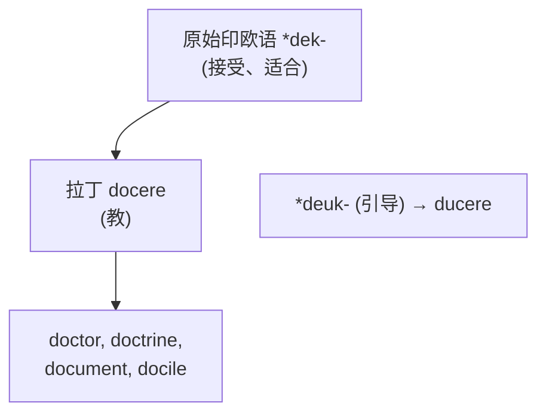
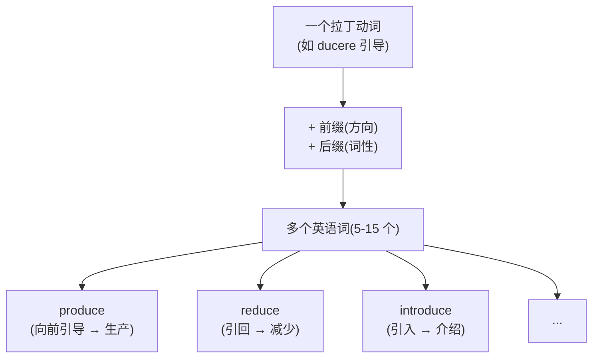

# 第 13 章 拉丁词根速查补遗

> "速查"不是把词根塞进停车场,而是给前面的大章节补一只工具箱。需要哪把扳手,就翻到哪一格。

前面九章(第 4-12 章)我们深讲了拉丁词根的九大家族:specere(看)、ducere(引导)、jacere(投)、capere(抓)、trahere(拉)、cor/mens/animus(心灵)、mors(死)、stare(站)、lex/jus(法律)。

但拉丁词根的世界远不止这九个。这一章把**其他高频拉丁词根**压缩成更紧凑的"故事 + 家族 + 拆词"格式。篇幅瘦身,证据不能跟着缩水;每个词根不再单章展开,核心的【起源故事】和【拆词启示】仍然保留。

> 本章收录约 20 个词根,覆盖 `docere`(教导、说明)、`mittere`(送出、派遣、放行)、`scribere`(书写、记录)、`audire`(听取、聆听)、`venire`(来到、发生)、`pellere` / `puls-`(推动、驱赶)、`fluere`(流动、连续变化)、`frangere`(打破、折断)、`fundere`(倾倒、灌注)、`gradi`(迈步、行进)、`tenere`(持有、保持)、`vendere`(出售)等。

## 怎样阅读本章的“核心含义”

每个词根都分三层理解:

1. **历史动作或概念**,如 *mittere* 的“送出、放行”。
2. **常见引申方向**,如“送走”发展为解散,“让通过”发展为允许。
3. **现代整词义**,如 `dismiss` /dɪsˈmɪs/ 是“解散、驳回”,不能只译成“离开 + 送”。

---

## 13.1 docere / doc- / doct-:教导、说明与传授

先讲个反差:今天你喊 `doctor` /ˈdɑktər/ 的那位,多半穿白大褂、拿听诊器。可这个词最初的岗位是**站在讲台上**的——doctor 的本义是"教导者",跟手术刀毫无关系。

**起源**:拉丁动词 ***docere***(教、指示),通常追溯到原始印欧语 *dek-(接受、合适)。它与 `ducere` 的 *deuk-(引导)不是同一个重建词根。

**核心语义**:`doc-/doct-` 不只表示课堂上的“教”,还包括把知识展示给别人、形成一套教导,以及用材料说明或证明某事。

【代表词】:

- `doctor`(医生、博士):拉丁语本义是"教师、教导者"。中世纪大学把它发展为高级学位称号;英语中的"医生"义来自医学博士这一称号。
- `doctrine` /ˈdɑktrən/(学说):一套被系统传授的教导或理论。
- `document` /ˈdɑkjəmɛnt/(文件):经拉丁 *documentum*“教训、例证、证明”发展为能够说明、证明事实的书面材料,不宜只译成“教具”。
- `docile` /ˈdɑsəl/(温顺的、易驾驭的):早期核心是“容易受教”,后来侧重顺从、容易管理。

【记忆锚点】:**`doc/doct` 的共同点是“把知识或证据展示给人”:doctor 原是教导者,doctrine 是教导体系,document 是说明或证明材料。**

---

## 13.2 mittere / mit- / miss-:送出、派遣与放行

要是罗马开快递公司,商标非 mittere 莫属。信要"送",军队要"派",任务要"交办",连导弹(missile)都是被"射出去"的——全归这一根管。

**起源**:拉丁动词 ***mittere***(送、派遣、放走)。这个词根派生能力很强,前缀经常提示“送、放”的方向或关系:

**核心语义**:*mittere* 的范围包括“送出、派人去、放开、让通过”。`mit-` 多见于动词词形,`miss-` 多见于拉丁分词、名词及其后裔;两者不是可以在现代英语中任意互换的拼写。

| 历史构形 | 方向或关系 | 代表词 | 怎样理解现代词义 |
| -------- | ---------- | ------ | ---------------- |
| `e-` + `mit-` | 向外送 | `emit` /ɪˈmɪt/ | 发出光、热、声音或物质 |
| `trans-` + `mit-` | 送到另一边 | `transmit` /trænzˈmɪt/ | 传送信息、信号或疾病 |
| `sub-` + `mit-` | 放到下面、置于支配之下 | `submit` /səbˈmɪt/ | 提交供审查;也表示屈服 |
| `ad-` + `mit-` | 让其朝向、允许进入 | `admit` /ədˈmɪt/ | 准许进入;进一步表示承认事实 |
| `per-` + `mit-` | 让其通过 | `permit` /pərˈmɪt/ | 允许、许可 |
| `dis-` + `miss-` | 送开、送走 | `dismiss` /dɪsˈmɪs/ | 解散、让离开;也可指驳回意见或案件 |
| `com-` + `mit-` | 托付、使投入其中 | `commit` /kəˈmɪt/ | 承诺、投入、委托;也可指实施某行为 |
| `inter-` + `mit-` | 在中间停止或留下间隔 | `intermittent` /ˌɪntərˈmɪtənt/ | 断断续续的、间歇发生的 |
| `missio` / `mission` /ˈmɪʃən/ | 派遣、被派出的任务 | `mission` | 使命、任务;也指传教或军事行动 |

【代表词故事】:

- `mission`(使命、任务、传教):经拉丁 *missio*“派遣”而来,可以指被派出去完成的任务,也可指执行任务的人员或行动。
- `promise` /ˈprɑməs/(承诺):追溯到拉丁 *promittere*“向前送出、保证”。“把话送出去”可以助记,但现代“承诺”义来自完整拉丁词长期形成的用法。
- `compromise` /ˈkɑmprəˌmaɪz/(妥协):来自拉丁 *compromissum*,原指双方共同承诺把争议交给仲裁并接受裁决,后来发展为通过相互让步达成协议。它不是简单由三个现代英语词块现场拼出的“共同向前送”。

【记忆锚点】:**`mit/miss` 的历史核心是“送、放、派”:transmit 是送过界,permit 是让通过,dismiss 是送走。英语本族词 `miss`(错过)不属于这条拉丁构词链。**

---

## 13.3 scribere / scrib- / scrip-:书写、刻写与记录

别把 scribere 想象成握钢笔的优雅动作。纸普及之前,罗马人写字是拿尖笔**往蜡板上刻**——这根字的骨子里,带着一道划痕。

**起源**:拉丁动词 ***scribere***(写、刻)。在纸张普及前,罗马人写字是用尖笔**在蜡板上刻**,所以 scribere 带有"刻划"的物理感。

**核心语义**:`scrib-/scrip-` 表示把内容写下、刻下或正式记录。`scrib-` 常见于动词词族,`scrip-` 常见于分词、名词词族,现代词义还受法律、出版和行政传统影响。

| 历史构形 | 关系 | 代表词 | 怎样理解现代词义 |
| -------- | ---- | ------ | ---------------- |
| `pre-` + `scrib-` | 预先写下、规定 | `prescribe` /prəˈskraɪb/ | 医生开处方;也可指正式规定 |
| `sub-` + `scrib-` | 在下面签名 | `subscribe` /səbˈskraɪb/ | 签名同意;后来发展出订阅、认购 |
| `de-` + `scrib-` | 写下、描画出来 | `describe` /dɪˈskraɪb/ | 用语言描写事物的特征 |
| `manu-` + `scrip-` | 用手书写 | `manuscript` /ˈmænjəˌskrɪpt/ | 手稿;现代也指尚未出版的书稿 |
| `post-` + `script` | 正文之后所写 | `postscript` /ˈpoʊˌskrɪpt/ | 信件或文章末尾的附言 |

【代表词故事】:

- `script`(脚本):被写下的文字。`scripture` /ˈskrɪptʃər/(经文):专指宗教圣典。
- `scribe` /skraɪb/(抄写员):古代专门负责抄写的人——在印刷术发明前,知识靠 scribe 一笔笔抄。
- `prescribe`(开处方、规定):医生写下用药指示只是常见专业义;这个词也可表示由权威正式规定。
- `proscribe` /proʊˈskraɪb/(禁止、取缔):追溯到拉丁 *proscribere*“公开张贴、公布名单”,后来表示宣布某人为法外之人或正式禁止。它与 `prescribe` 不能只靠 `pre-/pro-` 的现代单字义区分。

【记忆锚点】:**`scrib/scrip` 的共同动作是“把内容留下来”:describe 用文字呈现,subscribe 以签名确认,manuscript 是写成的稿件。**

---

## 13.4 audire / audi- / audit-:听取、聆听与听觉

从一个"听"字能走出多远?走进剧院,你是 audience(听众);走进会计事务所,你在做 audit(审计);甚至走到"服从"——obey /oʊˈbeɪ/ 的字面意思,不过是"朝着某人听"。

**起源**:拉丁动词 ***audire***(听),来自原始印欧语 *au-(感知)。

**核心语义**:`audi-/audit-` 围绕“听见、听取、让人听”展开,由此发展出听众、音频、听觉和审计等词义。

| 历史构形 | 关系 | 代表词 | 怎样理解现代词义 |
| -------- | ---- | ------ | ---------------- |
| `audi-` | 听、声音 | `audio`, `auditory` /ˈɔdɪˌtɔri/ | 音频;听觉的 |
| `audient-` | 正在听、听取 | `audience` /ˈɑdiəns/ | 听众;后来也泛指观看演出或节目的人 |
| 否定 `in-` + `audible` /ˈɑdəbəl/ | 不能被听见 | `inaudible` /ˌɪˈnɔdəbəl/ | 声音太小或不清楚,听不见 |
| `ob-` + `audire` | 朝向某人听取 | `obey` /oʊˈbeɪ/ | 经拉丁、法语路线发展为服从、遵从 |
| `audit-` | 听取、核查 | `audit` /ˈɔdɪt/ | 审计、审核;现已不限于口头听账 |

【代表词故事】:

- `audience`(听众、观众):来自“听取、聆听”词族,先可指听取行为、接见或听众,后来扩大到戏剧、电影和电视节目的观众;不必用“古罗马观众主要靠听”来解释。
- `obey`(服从):经古法语追溯到拉丁 *oboedire*,与 *audire*“听”同族。由“听从”发展为遵从命令。
- `audit`(审计):拉丁 *auditus* 与“听取”有关。账目口头宣读和核查的行政实践有助于理解其专业化,现代审计当然包括书面、数据和系统检查。

【记忆锚点】:**`audi/audit` 从“听取”出发:audience 是来听或观看的人,obey 是听从,audit 是听取并核查。**

---

## 13.5 venire / ven- / vent-:来到、到达与发生

venire 只干一件事:**来**。但"来"能来出花样——来到中间(intervene /ˌɪntərˈvin/)是干预,来到一起(convene /kənˈvin/)是开会,钱"流回来"(revenue)就成了收入。

**起源**:拉丁动词 ***venire***(来),来自原始印欧语 *gʷem-(来)。英语本土的 `come` 也来自同一原始印欧语词根。

**核心语义**:`ven-/vent-` 的基本动作是“来、到达”。抽象化以后,某事“来到”可以表示发生,人“来到一起”可以表示集会或约定,比别人“先到”可以表示阻止。

| 历史构形 | 方向或关系 | 代表词 | 怎样理解现代词义 |
| -------- | ---------- | ------ | ---------------- |
| `inter-` + `ven-` | 来到两者之间 | `intervene` /ˌɪntərˈvin/ | 介入、干预 |
| `con-` + `ven-` | 来到一起 | `convene` /kənˈvin/ | 集合、召集会议 |
| `in-` + `ven-` | 来到、碰到、发现 | `invent` /ɪnˈvɛnt/ | 由发现、构想发展为发明 |
| `ad-` + `vent-` | 朝某处到来 | `advent` /ˈædˌvɛnt/ | 到来、出现 |
| `e-/ex-` + `vent-` | 出现、发生 | `event` | 发生的事情、事件 |
| `re-` + 法语 `venue` /ˈvɛnju/ | 回来、返回 | `revenue` /ˈrɛvəˌnu/ | 原指回流的收益,现指收入 |
| `pro-` + `ven-` | 预先来到、抢先发生 | `prevent` /prɪˈvɛnt/ | 先行阻挡,后来表示预防、阻止 |

【代表词故事】:

- `convention` /kənˈvɛnʃən/(大会、惯例、约定):经拉丁 *conventio* 表示会合、协议;由“共同达成的做法”发展出惯例义。
- `invent`(发明):经拉丁 *invenire*(遇到、发现)及其词族发展而来,后来由"发现、构想"走向"发明"。它与 *venire*(来)同族,但"把创意召唤到现实"只是现代助记。
- `intervene`(介入):`inter-`(中间)+ `venire`(来)= 来到中间——插手别人之间。

【记忆锚点】:**`ven/vent` 的核心是“来到”:intervene 是来到中间,convene 是来到一起,event 是发生、出现的事情。**

---

## 13.6 pellere / pell- / puls-:推动、驱赶与撞击

pellere 是纯出力气的一根:**推**。你的脉搏(pulse)是心脏一下下把血往外推;冲动(impulse /ˈɪmpʌls/)是心里有东西在推你;把人推出门(expel /ɪkˈspɛl/),就是开除。

**起源**:拉丁动词 ***pellere***(推、驱赶),过去分词 ***pulsus**。

**核心语义**:`pell-/puls-` 包含施力推动、把人赶走和反复撞击。物理推力进一步引申为迫使、冲动、脉搏等概念。

| 历史构形 | 方向或力度 | 代表词 | 怎样理解现代词义 |
| -------- | ---------- | ------ | ---------------- |
| `ex-` + `pell/puls` | 向外推 | `expel`, `expulsion` /ɪkˈspʌlʃən/ | 驱逐、排出 |
| `re-` + `pell/puls` | 推回去 | `repel` /rɪˈpɛl/, `repulse` /rɪˈpʌls/ | 击退;也可表示令人反感 |
| 加强作用的 `com-` + `pell` | 用力推动 | `compel` /kəmˈpɛl/ | 强迫某人行动 |
| `pro-` + `pell` | 向前推 | `propel` /prəˈpɛl/ | 推进、驱动 |
| `dis-` + `pell` | 向不同方向推散 | `dispel` /dɪˈspɛl/ | 驱散疑虑、恐惧、烟雾等 |
| `im-` + `puls` | 推入、施加冲击 | `impulse` /ˈɪmpʌls/ | 冲量;引申为促使行动的冲动 |
| `pulsus` | 击打、跳动 | `pulse` /pʌls/ | 脉搏、规律的搏动或脉冲 |

【代表词故事】:

- `compel`(强迫):`com-`(加强)+ `pel`(推)= 用力推。强迫就是"把人推着走"。
- `impulse`(冲动):`im-`(内)+ `pulse`= 内部的推力——欲望、本能推着你行动。
- `repel`(击退):`re-`(回)+ `pel`= 推回去。

【记忆锚点】:**`pell/puls` 是施加推力:propel 向前推,repel 推回,compel 用力迫使,impulse 是推动行动的冲力。**

---

## 13.7 fluere / flu- / flux-:流动、汇入与连续变化

fluere 是水的专用动词。说话流利(fluent /ˈfluənt/),是话像水一样淌出来;多余(superfluous /suˈpɜrfluəs/),是水多到漫出边;而最浪漫的是影响(influence)——中世纪占星家真以为,那是星光"流"进你身体的一股力量。

**起源**:拉丁动词 ***fluere***(流),来自原始印欧语 *bhleug-(流出)。

**核心语义**:`flu-/flux-` 表示液体流动,也可比喻语言、人口、力量或状态持续移动。`flux` /flʌks/ 尤其常表示流量或不断变化的状态。

| 历史构形 | 流动关系 | 代表词 | 怎样理解现代词义 |
| -------- | -------- | ------ | ---------------- |
| `in-` + `flux` | 流入 | `influx` /ˈɪnflʌks/ | 人、资金或事物大量涌入 |
| `in-` + `flu` /flu/ | 流入、施加流体般作用 | `influence` /ˈɪnfluəns/ | 从占星术中的“流入之力”发展为影响 |
| `con-` + `flu` | 一起流动 | `confluence` /ˈkɑnfluəns/ | 河流汇合处;也可指因素汇合 |
| `inter-` + `fluve` | 位于水流之间 | `interfluve` | 两条相邻河流之间的高地 |
| `super-` + `flu` | 流过、溢出 | `superfluous` /suˈpɜrfluəs/ | 超出需要的、多余的 |
| `fluere` 的派生形式 | 容易流动 | `fluid` /ˈfluəd/, `fluent` /ˈfluənt/ | 流体;流畅、流利的 |

【代表词故事】:

- `influence`(影响):`in-`(入)+ `flu`(流)= **流入**。中世纪占星术曾把天体作用设想成“流入”人间的力量;这个概念后来一般化为现代“影响”。
- `fluent`(流利):语言"像水一样流出来"。
- `superfluous`(多余的):`super-`(上)+ `flu`(流)= **流到上面、溢出来**——多余得溢出了。

【记忆锚点】:**`flu/flux` 既可指水的流动,也可指抽象事物连续移动:influx 是流入,fluent 是表达流畅,superfluous 是多到溢出。**

---

## 13.8 其他高频拉丁词根详解速查

前面七位选手已经各自讲完了故事,接下来这十二位就没那么多废话了——它们排成一张大表,像自助餐台一样等你自取。不过别被表格吓退:每一行都藏着一个微型故事,值得你慢慢嚼。

这一表的“核心含义”同时列出物理动作和主要抽象引申。“代表词”给出理解路径,不是要求逐字翻译。

| 词根 | 核心含义与常见引申 | 代表词及理解路径 | 使用边界或记忆锚点 |
| ---- | ------------------ | ---------------- | ------------------ |
| `frangere` / `frag-` / `fract-` | 打破、折断;引申到碎片、裂缝、脆弱和违反规则 | `fraction` /ˈfrækʃən/ 被分出的一部分;`fracture` /ˈfræktʃər/ 断裂;`fragile` /ˈfrædʒəl/ 易碎的;`infringe` /ˌɪnˈfrɪndʒ/ 侵犯、违反 | 共同画面是“完整体被破开”,但 `infringe` 的现代义要按整词记 |
| `fundere` / `fus-` | 倾倒、灌注、熔化;引申到混合、扩散和输送液体 | `infuse` /ɪnˈfjuz/ 注入;`diffuse` /dɪˈfjuz/ 扩散;`transfuse` /trænsˈfjuz/ 输注;`confuse` /kənˈfjuz/ 使混乱 | 可用“液体被倒向不同方向”串联,不要把英语名词 `fund` /fʌnd/“基金”混入此词族 |
| `gradi` / `grad-` / `gress-` | 迈步、行走;引申到前进、后退、阶段和等级 | `progress` 前进;`regress` /rɪˈɡrɛs/ 后退;`congress` /ˈkɑŋɡrəs/ 会合;`grade` /ɡreɪd/ 等级/阶段 | `grad-` 和 `gress-` 是相关历史形式,不是现代英语自由替换规则 |
| `tenere` / `ten-` / `tent-` / `tin-` | 握住、保持、占有;引申到容纳、维持和承担 | `contain` 容纳;`retain` /rɪˈteɪn/ 保留;`sustain` /səˈsteɪn/ 支撑;`tenant` /ˈtɛnənt/ 租用并占有者 | “持有”不限于用手握,也可指空间容纳、法律占有或状态维持 |
| `vendere` / `vend-` | 出售、拿去卖;与商品交易和卖方有关 | `vendor` /ˈvɛndər/ 卖方;`vend` 出售;`vending machine` /ˈvɛndɪŋ/ 自动售货机 | 拉丁 *vendere* 通常分析为与 *venum dare*“拿去出售”有关;不是 `ven-`“来”的普通派生 |
| `vocare` / `voc-` / `vok-` | 呼叫、发声、命名;引申到召唤、撤销和激起 | `invoke` /ˌɪnˈvoʊk/ 援引/祈求;`revoke` /rɪˈvoʊk/ 撤销;`provoke` /prəˈvoʊk/ 激起;`vocal` /ˈvoʊkəl/ 声音的 | 核心是“发出呼唤或声音”,但 `provoke` 已不等于简单的“向前叫” |
| `pangere` / `pact-` | 固定、钉牢;由“固定下来”引申到约定和契约 | `pact` 协定;`compact` /ˈkɑmpækt/ 契约/紧密的;`impact` /ˌɪmˈpækt/ 冲击 | “协议被固定”可作助记,各词还经历了不同的拉丁复合形式 |
| `rapere` / `rap-` / `rapt-` | 抓住、夺走、迅速带走;引申到被强烈情绪攫住 | `rapture` /ˈræptʃər/ 狂喜;`rapacious` /rəˈpæʃɪs/ 贪婪攫取的;`rapid` /ˈræpəd/ 快速的 | `rapture` 的情绪义经宗教和文学发展,不只是“物理抓走” |
| `sequi` / `sequ-` / `secut-` | 跟随、接续;引申到顺序、结果和贯彻执行 | `sequence` /ˈsikwəns/ 依次跟随;`consequence` /ˈkɑnsəkwəns/ 随后而来的结果;`execute` /ˈɛksəˌkjut/ 执行;`pursue` /pərˈsu/ 追求 | “后一个跟着前一个”能串联顺序与结果;执行义来自“跟进到底” |
| `vertere` / `vert-` / `vers-` | 转动、改变方向;引申到转化、反向和不同朝向 | `convert` /kənˈvɜrt/ 转换;`reverse` 反转;`diverse` /daɪˈvɜrs/ 多样的;`universe` /ˈjunəˌvɜrs/ 宇宙 | `vert/vers` 共享“转”义,但 `universe` 应按历史整词理解,不能译成“全部旋转” |
| `pendere` / `pend-` / `pens-` | 悬挂、称量;引申到依赖、权衡、支付 | `suspend` /səˈspɛnd/ 悬挂;`depend` 依赖;`ponder` /ˈpɑndər/ 权衡思考;`expense` /ɪkˈspɛns/ 费用 | 从“挂着”理解依赖,从“称重”理解权衡和支付 |
| `scrutari` / `scrut-` | 翻检、搜寻;引申到仔细检查和审视 | `scrutiny` /ˈskrutəni/ 仔细审查;`scrutinize` /ˈskrutəˌnaɪz/ 细看、详查 | 与拉丁 *scruta*“杂物、废物”有关;重点是彻底翻查,不是普通地看一眼 |

### 几个特别值得记的故事

表格吃完了?那来几道甜点——下面这几个词的身世,比表格里那一行格子能装的要精彩得多。

**`rapture` /ˈræptʃər/(狂喜)** —— 经拉丁 *raptura/raptus* 的“夺走、被攫住”意义进入宗教和文学语境,可指精神被强烈体验带走,后来形成“狂喜”义。`-ture` 在这里属于历史词形,不能当作统一表示“被……”的现代后缀。

**`universe` /ˈjunəˌvɜrs/(宇宙)** —— 经拉丁 *universum*“整体、全体”而来,其中 *uni-* 表示一,*vers-* 与“转”有关。可以用“转合为一体”助记,但不能据此概括成古罗马人关于宇宙的统一哲学定义。

**`expense` /ɪkˈspɛns/(花费)** —— 经拉丁 *expendere*“称出、支付”及法语路线进入英语。金属按重量计价能帮助理解“称量 → 支付”的联系,现代 `expense` 指支出或费用。

**`scrutiny` /ˈskrutəni/(仔细审查)** —— 来自拉丁 *scrutari*“搜寻、翻检”,与 *scruta*“杂物、废物”有关。今天指严密检查;“在杂物中彻底翻找”是较稳妥的记忆画面。

---

## 本章小结

二十来个词根,七段故事加一张大表,像不像一顿自助餐吃到撑?好消息是:你不必一口气消化完,这一章本来就是工具箱,用到哪个翻到哪个就行。

本章集中梳理了第 4-12 章未单独成章的一批高频拉丁词根。这里的目标不是宣称“掌握固定数量的词根就能生成数百词”,而是建立可核验的词族网络:先理解历史核心义,再观察引申方向,最后回到现代整词。

### 一个回顾性的认知

读完整个第 2 卷,你应该建立这样一个心智模型:

> **拉丁词族的实用方法**:前缀常提供历史方向线索。先识别有证据的词根和前缀,再用整词语义核对,不要把相似字母强行拆成语素。

---

### 【思考题】(答案见附录 A)

1. `compromise` /ˈkɑmprəˌmaɪz/ 早期与双方共同承诺接受仲裁有关,它怎样发展出今天“相互让步、达成妥协”的含义?
2. `prescribe` /prəˈskraɪb/ 和 `proscribe` /proʊˈskraɪb/ 都来自“写”词族,为什么一个表示规定/开处方,另一个表示禁止/取缔?
3. `influence` /ˈɪnfluəns/ 的历史构形与“流入”有关,占星术中的“流入之力”怎样发展成现代“影响”?

---

## 第 2 卷结束语

第 2 卷「拉丁之根」到此结束。这一卷你学到的核心:

- 拉丁来源词通过大陆早期接触、基督教传播、法语中介和后期直接借词/古典造词等多条路线进入英语
- 九个主题词根家族(`spec/duc/jac/cap/tract/cor-mens-animus/mort/stat/lex-jus`)的起源故事
- 一批补遗词根(`doc/mit-miss/scrib-scrip/audi/ven/pell-puls/flu-flux` 等)的语义网络
- 变体现象(`cap/capt/cip/cept/ceiv`)的来历和应对
- 前缀常为历史词义提供方向线索,但不能机械推出全部现代词义

**下一卷,我们进入第 3 卷「希腊之光」**——古希腊语给欧洲思想和国际科学术语留下了大量组合形式。我们将同时注意:现代科学词汇也大量使用拉丁语、现代语言、人名和缩略构词,不能把科学语言归结为单一来源。

---

*下一卷 → [第 14 章 希腊语为什么成了"科学语"](../03-希腊之光/第14章-希腊语为什么成了科学语.md)*
