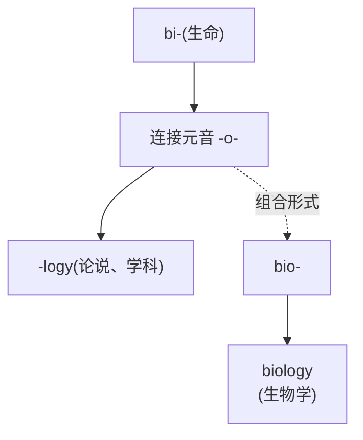
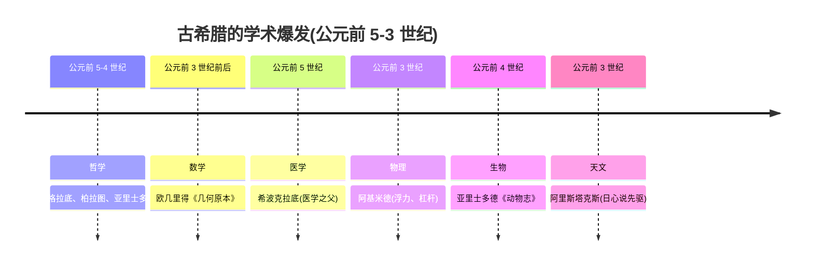
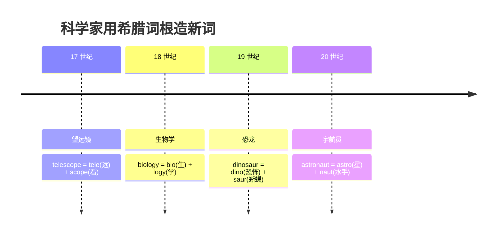

# 第 14 章 希腊语为什么成了科学语

> 公元前 2 世纪,罗马军团踏平了希腊城邦。然后,被征服者的语言,反过来征服了征服者两千年。

欢迎来到第 3 卷——**希腊之光**。

这一卷的开篇,不是定义,不是分类,而是一桩历史级的反讽。

公元前 168 年,罗马将军保卢斯在彼得那战役碾碎了马其顿方阵;再早近三十年(公元前 196 年),将军弗拉米尼努斯还在科林斯地峡当众宣布"希腊人自由了"——当然,这份自由只存在于罗马剑鞘允许的范围之内。军事上,希腊输得干干净净。

可吊诡的事情紧接着发生了。得胜的罗马将军们没有焚毁希腊的图书馆,反而把一船船希腊雕塑、希腊图书、还有会念荷马的希腊奴隶,当成头号战利品运回罗马。罗马贵族家庭很快兴起一门风尚:**重金买一个希腊奴隶,专门教自家孩子读希腊文**。一个罗马少年能不能被同侪高看一眼,标准之一就是他能不能用希腊语背诵《伊利亚特》。会说希腊话,成了"有文化"的硬通货。

诗人贺拉斯后来用一句话,把这个反讽钉死在了历史上:

> ***"Graecia capta ferum victorem cepit"*** ——
> **"被俘的希腊,反过来俘虏了那个野蛮的征服者。"**

军事的征服者,成了文化的被征服者。而这场"反征服",正是希腊语日后爬上科学王座的第一块垫脚石。

所以这一卷真正要回答的问题是:

> **为什么今天 biology、psychology、telephone、astronaut** /ˈæstrəˌnɑt/ **这一大批国际科学术语,偏爱用希腊成分拼装?**

打开任何一本科学杂志,希腊成分排着队来报到:`biology` /baɪˈɑlədʒi/(生物学)、`psychology` /saɪˈkɑlədʒi/(心理学)、`physics` /ˈfɪzɪks/(物理学,希腊 *physis*)、`mathematics` /ˌmæθəˈmætɪks/(数学,希腊 *mathēma*)、`philosophy` /fəˈlɑsəfi/(哲学,希腊 *philosophia*)、`telephone` /ˈtɛləˌfoʊn/(电话,希腊 *tele* + *phone*)、`astronaut` /ˈæstrəˌnɑt/(宇航员,希腊 *astron* + *nautes*)……

答案不是"古希腊人提前发明了所有现代学科"——历史没那么会押题。真相是:一桩两千多年前的文化反征服,加上几场学术传统的接力,让希腊词根成了一代代科学家最顺手的那只"零件箱"。

---

## 14.1 一个根本差异:希腊词根 vs 拉丁词根

在展开希腊故事前,先观察两种常见构词倾向。它们有助于学习,但不是互不相容的硬规则:

| 对比维度 | 拉丁词根(第 2 卷) | 希腊词根(本卷) |
| ------ | ------ | ------ |
| ① 常见形式 | 本书所选例子多为动词词族 specere(看)、ducere(引导)、jacere(投) | 科技术语中常以组合形式(combining form)出现 `bio-`、`geo-`、`philo-`、`-logy`、`-graphy` |
| ② 派生方式 | 靠"前缀 + 词根 + 后缀"派生 in + spect + ion = inspection | 靠"两个词根拼接成复合词" bio + logy = biology |
| ③ 使用方式 | 一个词根派生一串词,各词独立使用 | 可以参与较多现代术语构造,但组合受惯例限制 |

> **提示** **核心认知**:拉丁和希腊都能形成派生词与复合词。科学术语尤其常见希腊组合形式相互结合,但判断实际构造必须逐词核对。

---

## 14.2 希腊语的独特性质:组合形式 + 连接元音

希腊词根还有一个让初学者发愣的小机关:**组合形式(combining form)**。简单说,希腊词根经常两两拼接成复合词,拼接处往往插一个 `-o-` 当"螺丝"——比如 `bio-`(生命)遇上 `-logy`(学科),中间那颗 `-o-` 一拧,就成了 `biology` /baɪˈɑlədʒi/。这只"螺丝"的来历和用法,先用下面两张图看个大概,细节留到 14.4 边拆边讲。

### 什么是连接元音

### 为什么要插这个 -o-

这是初学者最困惑的一点。说穿了,`-o-` 是希腊语自己的构词习惯,顺着历史传进了现代英语,不是每次现编的。看到 `-o-`,你可以把它当成古典组合形式的一处边界记号——但别迷信它能自动切开所有词,有时候那个 `o` 本来就长在词形里。

> **提示** **拆词诀窍**:记组合形式有两条等价的路——要么把 `bio-`、`anthropo-` 当整块记,要么拆成 `bi- + -o-`、`anthrop- + -o-`。两种都对,但同一遍分析里只能选一种,别把 `bio-` 末尾的 `o` 再数一次。

具体的拆词实战,留到后面 14.4"乐高特性"里玩个够。这里先回到主线:希腊语到底怎么爬上科学王座的。

---

## 14.3 故事:希腊语怎么成了"科学语"

希腊语能爬上"科学语"的王座,不是一夜成名,而是一场四棒接力:希腊人造词 → 罗马人搬词 → 文艺复兴挖词 → 近代科学家拼词。下面一段一段讲。

### 第一棒:亚里士多德和欧几里得,第一批"造词人"

回到公元前 5 到前 3 世纪的地中海东岸。那两百年,希腊世界出现了一群把“较真”发展成专业手艺的人——有人有产业,有人收学生,有人靠城邦或宫廷支持,并不是突然冒出一批领固定工资的“人类首届学者”。他们讨论自然、数学、政治和医术,后来被我们统称为哲学家、数学家、医者。

这群人做学问时撞上同一个麻烦:**新概念太多,旧词根本不够用**。怎么办?用他们最顺手的工具——自己的母语希腊语——给这些概念现造名字。于是 *physis*(自然)、*mathēma*(学问)、*psychē*(灵魂)、*philosophia*(爱智慧)……一批希腊词,就这样被钉进了学术话语里。

这是希腊语上桌的第一块筹码:**最早、最系统的一批学术术语,是希腊语造的**。

### 第二棒:罗马的反征服——征服者反倒被征服

但造完词只是开了个头。真正把希腊语抬出希腊、铺满整个西方学术圈的,是开篇那场"反征服"。

公元前 2 世纪,罗马逐步控制希腊世界。按戏剧剧本,征服者似乎该把自己的语言一股脑盖过去;真实历史却没有这么整齐。罗马在各地推动行政与拉丁文化,东部希腊语传统也一直强韧。面对希腊学问,罗马精英更像一边掌权,一边把对方书房搬回家。

得胜的罗马将军们把希腊当成一座搬不空的宝库。公元前 146 年科林斯被毁,罗马权贵们却把希腊的雕塑、绘画、整座整座的图书馆,连人带书运回去。罗马别墅里摆起了希腊名作的复制品;罗马广场上,希腊哲学家开坛讲课,听众挤得水泄不通。

更要命的是"奴隶教师"这门生意。大批被俘的希腊知识分子被卖到罗马,处境却很尴尬:他们身是奴隶,手里却攥着主人做梦都想要的学问。罗马贵族家庭争先恐后买下他们,请这些"奴隶"教自家孩子读希腊文、背荷马、练修辞。**一个罗马少年的体面,有一半压在他讲希腊话的口音上**——口音越纯,越显家世不凡。西塞罗、凯撒这一代精英,没有一个不以能读希腊原典为荣。

而他们写拉丁文著作时,遇到希腊已有的概念,有时借词,有时翻译,有时另造拉丁表达;后世学者又继续从希腊材料里取零件。希腊成分就这样像种子,被埋进了拉丁学术词汇的土里——而拉丁语后来又长期充当西欧学术通用语。

这便是贺拉斯那句讽刺的全部份量:**罗马用剑征服了希腊,希腊用书征服了罗马**。当军事征服者在书房里对着希腊典籍点头哈腰时,希腊语已经悄悄搭上了下一趟顺风车——借罗马的车,去往整个欧洲。

### 第三棒:文艺复兴的造词癖——18 世纪书房里的希腊词典

罗马之后,希腊语没消失,但它和拉丁语也不是从中世纪到近代始终并排坐在“官方语言”双人席上。西欧长期更依赖拉丁语,不少希腊知识经拜占庭保存、阿拉伯语翻译与评注,再译入拉丁语;文艺复兴后,希腊原典学习才在西欧重新升温。

真正的转折在 16 到 18 世纪。地理大发现和科学革命,让欧洲人眼前冒出一大堆**见都没见过的东西**:新大陆的怪兽、显微镜下的微生物、天上的新行星、刚鼓捣出来的机器……每一样都得有个名字。科学家面前摆着两条路:从自家语言(法语、英语、德语)里硬凑,还是去翻那只现成的"零件箱"?

他们几乎本能地选了后者。原因很简单——那只箱子太好用了:希腊词根表意清晰、各国通用,还自带一股"古已有之"的学术权威感。于是——

想象这样一个画面:一位 **19 世纪**的博物学家,坐在书房里,面前摊开一本希腊语词典。他正为一群巨型爬行动物化石发愁——又大又吓人,叫什么好?1842 年,英国解剖学家 **Richard Owen** 用 *deinos*(可怕、惊人)和 *sauros*(蜥蜴)造出 **Dinosauria**;英语 **dinosaur** /ˈdaɪnəˌsɔr/(恐龙)由此而来。隔壁时代的发明家正琢磨一种能隔着老远传声音的装置,又从 *tele*(远)和 *phōnē*(声音)里捞出两个零件:**telephone** /ˈtɛləˌfoʊn/(电话)。研究神经的医生、拍照的化学家、做梦都想着飞天的工程师,前后接力干着同一件事——伸手进希腊词典,捞两个零件,拧在一起。

> **这一组都大量使用希腊成分。** 这不是巧合,而是延续数百年的术语命名习惯;科学词汇里当然也住着拉丁、阿拉伯、现代英语和其他语言的房客。

### 第四棒:19 世纪的会议厅——为什么大家都认 bio、logy

到了 19 世纪,这套零件箱迎来了高光时刻。欧洲各国科学家开始频繁开会、联名发表,他们急需一种**谁都能看懂的命名系统**——法国人写的词,德国人得秒懂;德国人造的词,英国人不能翻译错。

希腊词根因为来自整个欧洲共同尊崇的古典传统,成了天然的最大公约数。无论你是巴黎人还是普鲁士人,都认得 `bio` /ˌbaɪˈoʊ/、`logy`、`tele`、`phone`——谁也不觉得这是"外语"。

| 语言 | "生物学"的写法 |
| ------ | ------ |
| 英语 | biology |
| 法语 | biologie |
| 德语 | Biologie |
| 西语 | biología |
| 意语 | biologia |
| 俄语 | биология (biologiya) |
| 汉语 | 生物学(意译,但概念同源) |

看,这就是最好的证据——"生物学"一词在七种语言里几乎长得一模一样。掌握常见希腊组合形式,等于拿到了一把能撬开大半个科学词典的万能钥匙。

---

## 14.4 希腊词根的"乐高特性"

希腊词根最迷人的地方,是它的**可组合性**——像乐高积木,你可以拿两三个组合形式拼出无穷多的新词。

| 组合形式 | 拼接 | 产物 | 释义 |
| ------ | ------ | ------ | ------ |
| `bio-`(生命) | bio + logy | biology | 生物学 |
| `bio-`(生命) | bio + graphy | biography | 传记:写人生 |
| `bio-`(生命) | bio + metric | biometrics /ˌbaɪoʊˈmɛtrɪks/ | 生物识别 |
| `-logy`(论说、学科) | psych + logy | psychology | 心理学 |

> **提示** **学习秘诀**:这里每类只留几个代表,完整家族放在第 18、19 章。组合形式能帮助你识别词义范围,但不能替代整词学习。`-logy` 也不总能简单译为"学科",具体意义和用法应以整词为准。

---

## 14.5 本卷的章节地图

乐高零件展示完毕,接下来该正式开箱了。后面 5 章,我们逐一展开希腊词根的核心家族,每一章聚焦一个主题:

| 章节 | 标题 |
| ------ | ------ |
| 第 14 章 | 希腊语为什么成了科学语(本章,总论) |
| 第 15 章 | 哲学的诞生：philo, sophia(爱智慧) |
| 第 16 章 | 民主的词根：demos, kratos(人民 + 统治) |
| 第 17 章 | 神话与词汇：普通词、神名和后世命名 |
| 第 18 章 | 学科的词根：-logy, -graphy, -metry的由来 |
| 第 19 章 | 希腊词根速查补遗 |

---

## 14.6 本章小结

1. **拉丁和希腊都有派生与复合**——科学术语中特别常见希腊组合形式,这是一种倾向而非绝对分工。
2. **`-o-` 常是古典连接元音**——可以写 `bi- + -o-`,也可以把 `bio-` 整体记作组合形式,但不能重复计算。
3. **希腊语上桌靠的是一场四棒接力**——希腊人造词、罗马反征服搬词、文艺复兴挖词、近代科学家拼词,再加上 19 世纪国际学界共同认可,希腊组合形式才铺满现代术语。

### 一个最重要的认知

> **常见组合形式是理解术语的入口,不是可以任意造词的乐高说明书。**

---

## 14.7 史实与传说

- **古希腊并非"人类第一次系统做学问"**。埃及、两河流域等文明更早就有系统的数学、天文、医学和书写传统;希腊学术是站在更古老文明的肩膀上爆发的。
- **希腊典籍并未在 1453 年君士坦丁堡陷落前从西欧"消失"**。拜占庭与阿拉伯学术传统一直在保存、抄写、翻译它;文艺复兴扩大了传播,而非凭空唤醒一段失忆。
- **科学命名不是希腊语独占**。拉丁语广泛参与生物分类、解剖、医学命名,现代人名、地名、缩略语也大量进入术语。希腊组合形式之所以受欢迎,主因是已有学术传统 + 便于跨语言复用,不是因为它"更高级"。

---

### 【思考题】(答案见附录 A)

1. 有人说:"现代科学术语几乎都用希腊词根,是因为希腊人最早发明了这些学科,而且希腊语更高级、更精确。"本章至少给了两条理由说明这个解释站不住。是哪两条?那么希腊词根真正胜出的原因是什么?
2. 本章用"`biology` 在英、法、德、西、意、俄六种语言里几乎长得一模一样"来支持一个判断。这个判断是什么?为什么"跨语言几乎同形"能当它的证据?
3. 本章把希腊语登上"科学语"王座解释成一场四棒接力(希腊造词 → 罗马搬词 → 文艺复兴挖词 → 近代拼词)。做个思想实验：如果罗马当年像对付其他被征服者那样把希腊语彻底压下去、只用拉丁,今天的科学术语最可能变成什么样?借这个反事实判断：希腊语成为科学语,更接近"必然"还是"历史偶然"?

---

*下一章 → [第 15 章 哲学的诞生：philo, sophia](./第15章-哲学的诞生：philo,%20sophia.md)*
