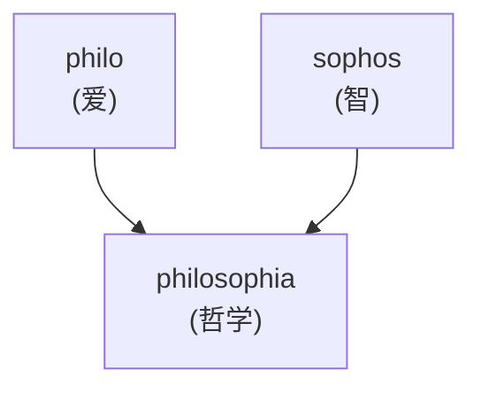
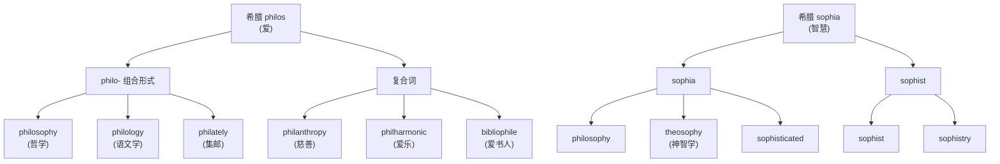
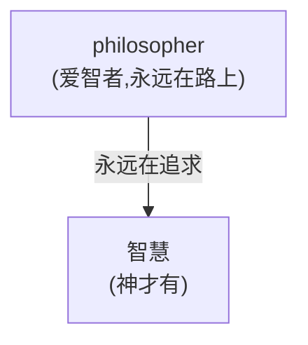
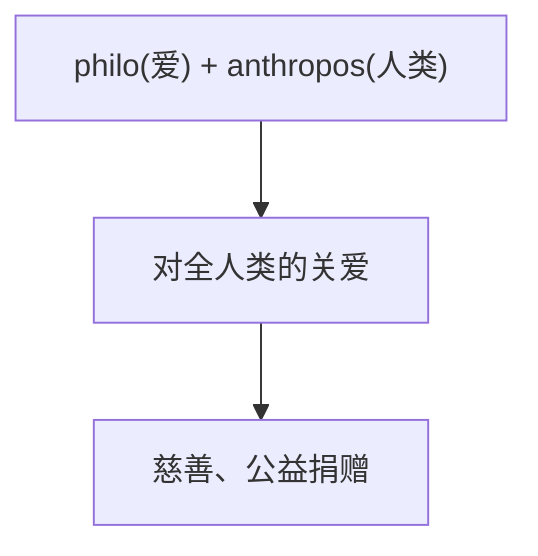
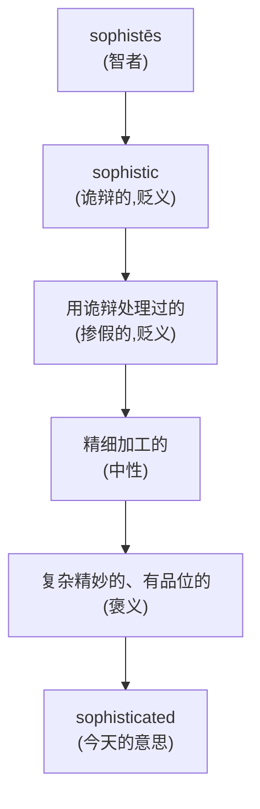
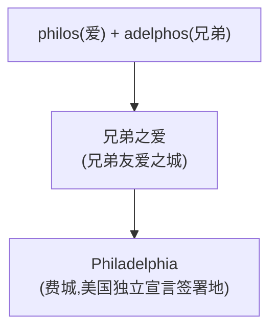

# 第 15 章 哲学的诞生:philo + sophia

> `philosophy` 的字面组合不是"我已经很聪明",而是"我还在追智慧"。这个命名很谦虚,也很适合写在读书拖延清单顶端。

> **词根**:`philo-`(爱)、`soph-`(智慧)
> **含义**:philo- 爱、喜爱;sophia 智慧、深奥
> **起源**:希腊文 ***philos***(爱、亲爱)、***sophia***(智慧)

我们用 `philosophy`(哲学)作为希腊词根的第一个完整案例,因为它很能体现**两个核心特点**:

1. 它是典型的**乐高式复合**——两个希腊组合形式拼出一个新概念
2. 它的命名故事呈现了**古希腊思想的一种自我定位**:"哲学家"如何被理解为追求智慧的人

---

## 【起源故事】哲学这个词是怎么诞生的

### 一个被命名的全新活动

公元前 6 世纪,希腊和小亚细亚沿海冒出一群怪人。他们不写诗,不演戏,不打仗,整天蹲在海边琢磨:"世界到底是什么做的?""太阳为什么每天升起?""灵魂存在吗?"邻居看他们的眼神,大概像今天看在地铁口发传单的人。

这群怪人需要一个名字。最初他们自称 **sophoi**——"智者",听起来相当自信,名片可以印"某某,智者"。

然后,**毕达哥拉斯**(Pythagoras,就是定理那位)登场了。

### 毕达哥拉斯:一个比定理还传奇的人

讲命名故事之前,得先认识这个人。毕达哥拉斯可不止是初中几何课本角落里那张公式——他是个近乎宗教领袖的奇人。*(传说)* 他在南意大利的克罗顿创立了一个学派,与其说是学校,不如说是个教团:成员要守密、要共济互助、要共同素食,还信灵魂转世。学派内部甚至分"内圈"和"外圈",知识分级传授,活脱脱一个古代神秘组织。

这个教团有几条著名戒律。*(传说)* 其中最出名的一条:**禁止吃豆子**。是的,你没看错——豆子。为什么?后人猜了一堆:豆子形状像睾丸、豆子含灵魂、豆子是轮回通道……说法不一,但戒律本身被后世作家反复记载。*(传说)* 还有更戏剧的版本:毕达哥拉斯晚年遭到政敌追杀,逃命途中遇到一片豆田——他宁可被追上,也不肯踩过豆田(因为踩豆子违反戒律)。结果他被抓住,命丧当场。一个为豆子而死的人,这种偏执本身就成了传奇。

### 那场改变命名的对话

回到命名故事。*(传说)* 毕达哥拉斯有次造访某位僭主(tyrannos,希腊城邦的独裁者)的宫廷。僭主恭维他:"您是 sophos(智者),是七贤之一那样的人物吧?"

毕达哥拉斯摆手拒绝。他说:

> *"不,我不是 sophos。除了神,没有人配称 sophos(智慧的)。我只是一个 **philo-sophos**——爱智慧的人。"*

这一摆手,贡献了一个词。**philosophos**:`philo-`(爱)+ `sophos`(智慧)。"我不是聪明的拥有者,我只是聪明的追求者。"

这个姿态一传开,就成了"哲学家"的自我定位:**永远在路上,永远不打包票**。

---

## 【起源故事续】philo- 和 soph- 的两个家族

### philo-(爱)家族

希腊文 ***philos*** 可表示"亲爱的、友好的、喜爱的"。组合形式 `philo-` 出现在许多历史构成的词中,表示"爱好、倾向于":

| philo-(爱)+ X | 产物 | 释义 |
| ------ | ------ | ------ |
| philo + sophia | philosophy | 哲学:爱智慧 |
| philo + logos | philology | 语文学:爱言辞 |
| philo + anthropos | philanthropy | 慈善:爱人类 |
| philo + harmonia | philharmonic | 爱乐的:爱和声 |
| biblion + philo | bibliophile | 爱书人(philo- 也可挪到词尾作 -phile) |

> **提示** 希腊语有 `philia`、`erōs`、`agapē` 等相关词,但把它们固定成"友爱、情欲、无私之爱"三种互斥类型是后来的通俗概括。具体含义取决于时代、作者和语境。

### soph-(智慧)家族

希腊文 ***sophia*** 意为"智慧、技艺、知识"。它的派生词有两面:

| 正面 | sophia = 智慧、深奥知识 |
| ------ | ------ |
| philosophy | 哲学:爱智慧 |
| theosophy | 神智学 |
| sophisticated | 经"诡辩、掺假"义发展为复杂、精密 |

| 负面 | sophistēs = 诡辩者 |
| ------ | ------ |
| sophist | 诡辩家 |
| sophistry | 诡辩 |

### 一个关键故事:为什么 sophia 既有正面也有负面

这背后是一场街头的世纪对决。

公元前 5 世纪的雅典,民主政治正火。公民要在大会上发言、在法庭上辩论、要争取选票——会说话能换钱、换权、换命。于是市场上出现了一批新职业:**智者派(sophistai)**。

这些人,是古代雅典的"明星讲师"。**普罗泰戈拉**(Protagoras)是其中最贵的,他名言"人是万物的尺度",听起来就很会营销。**高尔吉亚**(Gorgias)更绝,他能证明"不存在的东西存在",收费讲学,门徒无数。他们的课程明码标价:教你修辞、辩论、如何把弱的论证说成强的——这在法庭和议事会上简直是超能力。sophist 收费天经地义:知识就是商品,付钱学本事,童叟无欺。

然后,**苏格拉底**(Socrates)出场了。

这位光脚、破袍、长相奇特的老人,对 sophist 那一套嗤之以鼻。他的玩法完全相反——**不收费,不开班,在集市上拽住路人就追问**:

> "你说你是正义的人。那我问你,什么是正义?"
> "……就是还债。"
> "那把借来的刀还给一个发疯的朋友,是正义吗?"
> "呃……"

苏格拉底号称"我唯一知道的,是我一无所知"。他不去教别人怎么赢,而是不断追问别人"你到底知道什么"——问到最后,对方往往恼羞成怒。雅典的权贵被他问得下不来台,日积月累,这笔账要算。最终苏格拉底被控"腐蚀青年""不敬城邦神",判了死刑。

| 苏格拉底(philosopher) | 智者派(sophist) |
| ------ | ------ |
| 承认自己无知 | 自称拥有智慧 |
| 不收费 | 收费教学 |
| 在街头追问"什么是 X" | 在课堂上教授修辞 |
| 把对方问崩溃 | 把对方训练成辩手 |
| 死于民主投票 | 收钱活得好好的 |

### 谁写了历史:柏拉图的笔

这里有个关键反转。苏格拉底自己一个字没写。我们对他的全部印象,几乎都来自他的学生——**柏拉图**(Plato)。而柏拉图写对话录时,把 sophist 全部塑造成反派:虚伪、诡辩、收钱、误人子弟。在他笔下,苏格拉底是追问真理的圣徒,sophist 是兜售话术的江湖骗子。

但真实的高尔吉亚、普罗泰戈拉未必这么不堪——他们观点多样,有人主张相对主义,有人研究语言本身,放在今天都够当一流学者。**只是他们的著作大多散佚,留不下话来辩护。** 而柏拉图的对话录被当作经典流传两千年。于是 **sophist** 这个本来中性的"有技艺的智者",硬是被钉成了"诡辩者"——这是历史上最经典的"胜利者书写历史"的案例之一。

古典哲学论战 + 后世接受史,共同把 **sophist** 从"有智慧的教师"推向了"诡辩者"。所以今天:

- `philosophy`(哲学)= 正面的爱智慧
- `sophistry`(诡辩)= 负面的伪智慧

---

## 【家族树】philo 和 soph 的子孙

---

## 【代表词深讲】四个词的故事

### 词 1:`philosophy`(哲学)

**拆解**:`philo-`(爱)+ `-o-`(连接元音)+ `soph`(智慧)+ `-y`(名词后缀)= 爱智慧

**故事**:

如前所述,philosophy 字面义是"**爱智慧**"。这个词最动人之处在于它的姿态:**不是"拥有智慧",而是"追求智慧"**——就是毕达哥拉斯在僭主宫廷摆手拒绝"智者"称号时立下的姿态。不是神,只是爱智慧的人。

这种"我只在追,不敢说拥有"的谦逊,很适合贴在读书拖延清单顶端——毕竟连毕达哥拉斯都不敢说自己 sophos。

**派生词**:

- `philosopher`(哲学家:爱智慧的人)
- `philosophical`(哲学的、达观的)
- `philosophize`(进行哲学思考)

---

### 词 2:`philanthropy`(慈善)

**拆解**:`philo-`(爱)+ `anthropos`(人类)= 爱人类

**故事**:

`philanthropy` 字面义是"**爱人类**"。

`anthropos` 是希腊文"人",和 philo- 拼接,表示"对人类的关爱"。今天这个词常指**为公共福祉进行的捐赠或公益支持**,参与者不必先通过"富豪资格审查"。

**派生词**:

- `philanthropist`(慈善家)
- `philanthropic`(慈善的)
- `misanthrope`(厌恶人类者:希腊 *misos* "憎恨" + *anthrōpos* "人")

> **提示** **对照记忆**:`philanthropist`(爱人类)vs `misanthrope`(恨人类)。一个爱,一个恨,用同一个 `anthrop` 词根构成完美反义。

---

### 词 3:`sophisticated`(复杂的、精明的)

**历史来源**:经中古拉丁 *sophisticatus*,与 *sophisticare* "用诡辩蒙骗、掺假"有关。

**故事**:

这个词不能按现代英语后缀逐层拆成 `soph + ist + ic + ate + ed`。其早期英语意义包括"掺假、篡改、使不纯",随后发展出"不自然、世故",再进一步形成今天的"复杂、精密、老练"。

**生活场景**:

- `a sophisticated device`(精密的设备)
- `a sophisticated taste`(高雅的品位)
- `a sophisticated argument`(精妙的论证)

---

### 词 4:`bibliophile`(爱书人)

**拆解**:`biblio-`(书)+ `-phile`(爱者)= 爱书的人

**故事**:

注意这里 philo- 变成了 **`-phile`**(作为后缀,表示"爱……的人")。

`biblio-` 是希腊文"书"(biblion)的组合形式。所以 `bibliophile` 就是"**爱书的人**"——藏书家、读书狂。

| -phile 后缀(爱某物的人) | 产物 | 释义 |
| ------ | ------ | ------ |
| biblio + phile | bibliophile | 爱书人 |
| Anglo + phile | Anglophile | 亲英派 |
| Franco + phile | Francophile | 亲法派 |
| pedo + phile | pedophile | 恋童者, 负面 |
| cine + phile | cinephile | 影迷 |

> **提示** `-phile`(爱……者)和 `-phobe`(怕/恨……者)是一对反义后缀:
>
> - `Anglophile`(亲英派)↔ `Anglophobe`(恐英派)
> - `xenophile`(爱外者)↔ `xenophobe`(排外者)
> - `francophile`(亲法派)↔ `francophobe`(恐法派)

---

## 【词源辨正】Philadelphia(费城)和 philo- 同根吗

**答案:是。**

美国城市**费城 Philadelphia** 名字直接来自希腊文,*philos*(爱)+ *adelphos*(兄弟)= **"兄弟之爱"**。

这个名字是 17 世纪贵格会教徒威廉·潘恩起的,寄托了"宗教宽容、兄弟之爱"的理想。

> **提示** **同根兄弟**:
>
> - `philosophy`(爱智)——爱 + 智
> - `philanthropy`(慈善)——爱 + 人类
> - `Philadelphia`(费城)——爱 + 兄弟
> - `philharmonic`(爱乐)——爱 + 音乐
>
> 一个 philo- 词根,串起哲学、慈善、地名、音乐。

---

## 【拆词启示】philo 和 soph 家族如何帮你记忆

| 词 | 拆解 | 推义 |
| ---- | ------ | ------ |
| `philosophy` | philo + soph + y | 爱智慧 → 哲学 |
| `philosopher` | philo + soph + er | 爱智者 → 哲学家 |
| `philanthropy` | philo + anthrop + y | 爱人类 → 慈善 |
| `philanthropist` | philo + anthrop + ist | 爱人者 → 慈善家 |
| `philharmonic` | philo + harmon + ic | 爱和谐 → 爱乐 |
| `philology` | philo + log + y | 爱言辞 → 语文学 |
| `bibliophile` | biblio + phile | 爱书 → 藏书家 |
| `sophist` | soph + ist | 智者(→ 诡辩者) |
| `sophistry` | soph + ist + ry | 智术 → 诡辩 |
| `sophisticated` | soph + ist + ic + ate + ed | 智化 → 复杂精明 |
| `theosophy` | theo(神)+ soph + y | 神智 → 神智学 |
| `sophomore` | soph + more | 希腊 sophos + moros(愚蠢)= 聪明又蠢的 → 大二生 |

> **提示** **`sophomore`(大二生)的妙拆**:`sophos`(智慧)+ `moros`(愚蠢)= "既聪明又愚蠢的人"。大二生自以为懂了很多(聪明),但实际还很幼稚(愚蠢)——这个词源带着对这个年纪的微妙调侃。同一根 soph 也藏在 sophomore 里!

---

## 本章小结

### 你应该带走的三个画面

1. **philosophy = 爱智慧**——姿态是"追求者",不是"拥有者"。这是西方哲学的精神底色。
2. **soph 有两面**——sophia(智慧,正面)vs sophist(诡辩,负面),凝固了苏格拉底和智者派的论战。
3. **-phile 是高频后缀**——bibliophile(爱书)、Anglophile(亲英)、cinephile(影迷)。

### 记忆锚点

> **philo = 爱,soph = 智。philosophy = 爱智,philanthropy = 爱人。**

---

## 避坑提示

本章讲了不少故事,有些是历史,有些是传说,得分清楚:

- **毕达哥拉斯命名 philosophia 的故事来自后世记载**(罗马时代的西塞罗、第欧根尼·拉尔修等),**没有同时代文献证据**。"哲学"概念可能比毕达哥拉斯更早成形;归名给他更多是文化传统的追认,而非史实定论。但这个故事流传最广,定义了"哲学家是追求者而非拥有者"的经典自我定位。
- **毕达哥拉斯学派的戒律**(禁食豆子、灵魂转世等)主要来自后世作家的记载,细节真伪学界有争论。"因不肯踩豆田而被捕"是流传最广的传奇版本,不必当作信史。
- **智者派(sophistai)的负面形象很大程度上来自柏拉图等论敌的著作**。这群教师观点多样,不能简单归结为"苏格拉底厌恶的骗子"。他们的著作大多散佚,留不下话来辩护,这正是"历史由胜利者书写"的典型。
- **希腊思想史的转折值得肯定,但理性观察和系统知识并非希腊独有**。世界其他文明同样有哲学传统的萌芽。
- **`soph-` 词根的褒贬分化**反映古典论战和后世接受史的综合作用,不能只归因于某一个人的态度。

---

### 【思考题】(答案见附录 D)

1. `philanthropist`(慈善家)字面是"爱人类者",想想这个词如何体现富人对社会的责任?
2. 为什么 `sophist` 从"智者"变成"诡辩者"?用苏格拉底的故事解释。
3. `sophomore`(大二生)拆开是 soph + moros(聪明 + 愚蠢),这种命名带着什么微妙的态度?

---

*下一章 → [第 16 章 民主的词根:demos + kratos](./第16章-民主的词根.md)*
