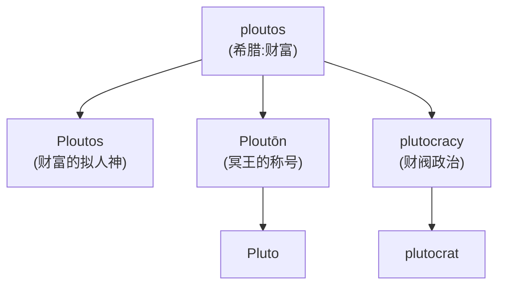
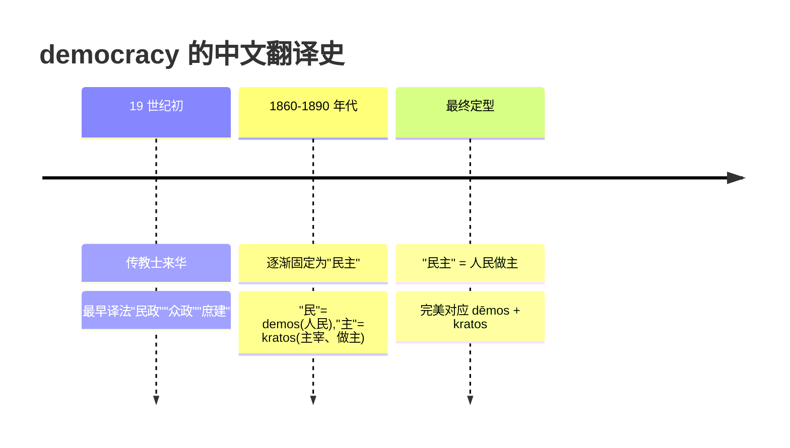

# 第 16 章 民主的词根：demos, kratos

> 把 `demos` 和 `kratos` 拼在一起很容易,让"人民"与"权力"在现实中正确相处却困难得多。词只用了两块乐高,制度建设用了两千多年。

> **词根**:`demo-`(人民)、`crac-` / `crat-`(统治、权力)
> **含义**:demos 人民、平民;kratos 统治、权力、力量
> **起源**:希腊文 ***dēmos***(人民、平民)、***kratos***(统治、力量)

这一章讲**民主(democracy)**这个词的来历。它把古希腊政治词汇中的"公民群体"与"权力"组合在一起,后来成为影响极大的国际政治术语。

`demo-` 和 `crat-` 也**各自发展出一批词**——它们出现在 `epidemic` /ˌɛpəˈdɛmɪk/(流行病)、`demagogue` /ˈdɛməˌɡɑɡ/(煽动者)、`aristocrat` /əˈrɪstəˌkræt/(贵族)、`technocrat` /ˈtɛknəˌkræt/(技术官僚)等词中。不过它们不是见谁都能拼的万能接口,具体构词仍要逐词核对。

---

## 【起源故事】民主在雅典的诞生

### 公元前 508/507 年的关键改革

公元前 508/507 年,雅典出了件大事。政治家**克里斯提尼(Cleisthenes)**推倒重来,把雅典的部落、公民大会和议事机构全部重组——按居住地而非血统划分公民,打破了贵族对权力的世袭垄断。从这一刻起,"你是哪个贵族家的"不再重要,"你是哪个村(demos)的"才重要。权力从少数家门,流向了广场上的普通人。

这就是雅典民主的诞生时刻。当然,得加个限定:当时的"公民"只包括自由成年男性,妇女、奴隶、外邦居民一律 excluded——古代版本距离现代普选,还有一条很长的更新日志。

希腊词 ***dēmokratia*** 正是用来描述这种秩序:*dēmos*(人民)+ *kratos*(统治)= **人民的统治**。

### 陶片放逐法:民主最戏剧的仪式

克里斯提尼改革还留下了一项仪式,可能是历史上最戏剧化的投票——**陶片放逐法(ostracism)** /ˈɑstrəˌsɪzəm/。

每年春天,公民大会先投一次票:"今年要不要放逐人?"如果通过,几周后再来一次正式投票。这一次,**几千名公民聚集在雅典广场(Agora)上,每人手里拿着一块碎陶片(ostrakon)**。

陶片是当时的"废纸"——家家户户的破罐子碎盘子。公民在上面用尖刀刻下一个名字:**政敌的名字**。没有辩方陈述,没有上诉,理由也不用说。你讨厌谁,就刻谁。

计票开始。得票最多的人——走好不送,**流放十年**。财产不没收,十年后照旧是公民,但此刻必须打包滚蛋。

这套机制的设计初衷很妙:防止任何一个人权力大到想当独裁者(僭主)。只要有人冒头、有人开始"功高震主",公民们就用碎陶片把他投出去。**公元前 482 年前后,雅典人把以公正闻名的阿里斯提德(Aristides)投走了**;他的政敌地米斯托克利(Themistocles)则在约公元前 471 年才遭放逐。两个名人、两次陶片投票,别让他们在时间轴上抢同一张船票。民主有时候也挺无情。

这个词根留下了两份遗产:一个是 `ostracism` /ˈɑstrəˌsɪzəm/(放逐、排斥),直接来自那块 ostrakon(碎陶片);另一个是这套仪式本身的画面——**几千人在广场上,用破罐子碎片决定一个人的命运**。

> **提示** 这个词把"公民群体"和"权力、统治"组合起来,体现了雅典政治观念的重大变化。不过古代雅典的 *dēmos* 不等于现代普选意义上的"全体人民"。

### demos(人民)的多义

希腊文 ***dēmos*** 有两层意思:

1. **政治义**:"公民群体、人民"——这是 democracy 里的意思
2. **地域义**:"村落、社区"——希腊城邦由多个 demos(村落)组成

所以 dēmos 既是"地理上的村落",又是"政治上的人民"——这种**地理-政治的双重义**,凝固在希腊人对"民主"的理解里:**民主就是村落里的人共同做主**。

### kratos(力量、权力、统治)

希腊文 ***kratos*** 表示"力量、权力、支配",构词中常译为"统治"。它强调的是"谁掌握力量"——权力的归属,而不是暴力的场面。

**kratos = 力量、权力、支配**(派生词):

| 派生词 | 含义 |
| ------ | ------ |
| `biocrat` | ❌ 不成立 |
| `democrat` /ˈdɛməˌkræt/ | 人民的力量 → 民主派 |
| `aristocrat` /əˈrɪstəˌkræt/ | 最好的力量 → 贵族 |
| `theocrat` | 神的力量 → 神权 |

> **提示** **细微之处**:`kratos`(力量、权力)和希腊词 `archein`(开始、领导、治理)都参与政治制度词。前者突出权力归属,后者与统治、首领和起始相关:
>
> - democracy(dēmos + kratos)= 人民的力量
> - mon-archy(monos + archein)= 一人之治
>
> 这些是历史构词差异,不是评价某种制度温和或暴力的标尺。

---

## 【起源故事续】demo- 和 crat- 的家族

### demo-(人民)家族

**demo-(人民)+ X = 与人民相关的事物**:

| 拆解 | 例词 | 含义 |
| ------ | ------ | ------ |
| `demo` + `cracy` | democracy | 民主:人民统治 |
| `demo` + `graphy` | demography /dɪˈmɑɡrəfi/ | 人口学:描写人民 |
| `demo` + `gogue` | demagogue | 煽动者:带领人民 |
| `epi` + `demic` | epidemic | 在人群中流行的 |
| `pan` + `demic` | pandemic /pænˈdɛmɪk/ | 遍及广泛人群的 |

**几个代表词的故事**:

**`epidemic` /ˌɛpəˈdɛmɪk/(流行的;流行病)** —— 来自希腊 *epidēmios* "在人民中、在本地流行的",由 `epi-` 与 *dēmos* 相关形式构成。重点是"在人群中普遍存在",不是"疾病压在人民头上"。

**`pandemic` /pænˈdɛmɪk/(大流行的;大流行病)** —— `pan-`(全、广泛)+ `dēm-`(人民)+ `-ic`,表示跨越多个国家或大陆、影响广泛人群的流行。它不必字面覆盖"全人类"。

**`demagogue` /ˈdɛməˌɡɑɡ/(煽动者、蛊惑家)** —— `demo`(人民)+ `agogue`(带领)= **带领人民的人**。字面听起来挺正面,像是人民的领路人?但这个词几乎永远带贬义——指用谎言、情绪和空洞承诺煽动民众、谋取权力的政客。希特勒、墨索里尼都是典型的 demagogue。

这个词的经典原型,是雅典的**克里昂(Cleon)**。

克里昂是公元前 5 世纪雅典最著名的民众领袖之一,也成了后世谈“煽动政治”时经常点名的人物。他不是传统贵族出身,家族与制革业有关,演说风格强硬。他主张继续伯罗奔尼撒战争,并支持处死反叛的密提林成年男性。雅典公民大会第一天通过了严厉命令,第二天重新开会;克里昂仍主张执行,狄奥多图斯(Diodotus)则力劝收回。最终大会以微弱多数推翻原决议——不是克里昂忽然良心上线,是投票结果掉了头。

骂他的人排成了队。**历史学家修昔底德**(Thucydides)在《伯罗奔尼撒战争史》里把他写得面目可憎,认为正是这种煽动家把雅典拖进了战争泥潭。**喜剧作家阿里斯托芬**(Aristophanes)更狠——他在喜剧《骑士》(Knights)里,直接把克里昂搬上舞台,演成一个马夫出身的无赖,满嘴跑火车,靠着巴结民众上位。台上台下笑成一团,克里昂本人大概笑不出来。

`demagogue` 的故事没有“一句骂人话当天凝固成词条”那么整齐。希腊语 *dēmagōgos* 本来可以中性地表示“人民的领袖”;随着政治论战和历史书写,它才越来越常带上操纵民意、煽动群众的贬义。克里昂不是这个词的单独发明人,却成了它后来那张坏脸最著名的模特之一。

---

### -cracy / -crat(统治/统治者)家族

demo- 家族讲完了"谁是人民",现在轮到 -cracy 家族来回答"谁说了算"。下面这张表,简直是一部微缩版政治制度史——从人民做主到办公桌做主,人类在"谁来统治"这件事上的想象力,可比造词丰富多了。

**X + -cracy(统治制度)= 某种统治**:

| 拆解 | 例词 | 含义 |
| ------ | ------ | ------ |
| `demo` + `cracy` | democracy | 民主制 |
| `aristo` + `cracy` | aristocracy /ˌɛrəˈstɑkrəsi/ | 贵族制:最好的统治 |
| `pluto` /ˈplutoʊ/ + `cracy` | plutocracy | 财阀制:富人统治 |
| `theo` + `cracy` | theocracy /θiˈɑkrəsi/ | 神权制:神统治 |
| `bureau` /ˈbjʊroʊ/ + `cracy` | bureaucracy /bjʊˈrɑkrəsi/ | 官僚制:办公桌统治 |
| `techno` + `cracy` | technocracy | 技术统治 |
| `merit` /ˈmɛrət/ + `cracy` | meritocracy /ˌmɛrɪˈtɑkrəsi/ | 精英制:能者统治 |

**X + -crat(统治者)= 某种统治者**:

| 例词 | 含义 |
| ------ | ------ |
| `democrat` /ˈdɛməˌkræt/ | 民主派 |
| `aristocrat` /əˈrɪstəˌkræt/ | 贵族 |
| `plutocrat` /ˈplutəˌkræt/ | 财阀 |
| `bureaucrat` /ˈbjʊrəˌkræt/ | 官僚 |
| `technocrat` /ˈtɛknəˌkræt/ | 技术官僚 |

**几个代表词的故事**:

**`aristocracy` /ˌɛrəˈstɑkrəsi/(贵族制)** —— `aristo-`(最好)+ `-cracy`(统治)= **最好的统治**。希腊文 *aristos* 意为"最好的"。所以 aristocracy 字面义是"**让最优秀的人来统治**"——这种制度在雅典民主之前主导希腊,由血统高贵、品德优秀的贵族掌权。

> **提示** **同一根 aristos 的其他派生**:`Aristotle` /ˈærəˌstɑtəl/(亚里士多德,名字字面义"最好的目的")、`aristocrat`(贵族)、`aristocratic` /əˌrɪstəˈkrætɪk/(贵族气的)。

**`plutocracy` /pluˈtɑkrəsi/(财阀制)** —— `pluto-`(财富)+ `-cracy`(统治)= **富人的统治**。希腊文 *ploutos* 意为"财富"。

> **提示** **有趣关联**:`Pluto` 和 `plutocracy` 都与希腊 *ploutos* "财富"相关,但需要区分两位形象:***Ploutos*** 是财富的拟人神,***Ploutōn*** 则是冥王 Hades 的称号,可理解为"富有者",可能与地下蕴藏财富的观念有关。二者后来有联系,但不能直接说财神和冥王是同一个神。

**`bureaucracy` /bjʊˈrɑkrəsi/(官僚制)** —— `bureau`(办公桌,法语借词)+ `-cracy`(统治)= **办公桌统治**。这个词的词源本身就是个微型讽刺剧。`bureau` 原义是法语的"粗羊毛布"(late Latin *bura*,粗糙的羊毛)——因为当年法国官员办公的桌子,就铺着这么一块粗布。后来语义层层漂移:"铺着粗布的桌子" → "办公桌" → "办公的机构" → "层层叠叠的官僚机构"。于是 **bureaucracy 字面义就是"办公桌在统治"**——一桌布,统治了你办事的全过程。这个命名带着辛辣的讽刺:**真正管着你的不是哪个具体的人,而是那套桌子、表格、印章和窗口组成的机器。** 你去办个证要跑五个窗口盖六个章,那就是 bureau 在 cracy(统治)你。

---

## 【家族树】demo 和 crat 的子孙

家族树其实只有两条粗枝:`demo-` 关心人民与人群,`-cracy/-crat` 关心统治制度和统治者。上文已经把每个孩子逐一介绍过,这里不再让他们换成方框重新走一遍红毯。

---

## 【词源辨正】为什么 democracy 翻译成"民主"

中文把 democracy 译成"民主",其实是经过了一番思索的。

> **提示** 中文"民主"这个词古已有之,但本义是"民之主"(即君主,如《尚书》"天命文王民主")。近代用它翻译 democracy,**颠覆了原义**——从"民之主"变成"民为主"。这种词义翻转,本身就是民主思想传播的一个缩影。

---

## 【拆词启示】demo 和 crat 家族如何帮你记忆

| 词 | 拆解 | 推义 |
| ---- | ------ | ------ |
| `democrat` /ˈdɛməˌkræt/ | demo + crat | 人民统治者 → 民主派 |
| `demographic` /ˌdɛməˈɡræfɪk/ | demo + graph + ic | 描写人民的 → 人口的 |
| `demography` /dɪˈmɑɡrəfi/ | demo + graphy | 描写人民 → 人口学 |
| `aristocracy` /ˌɛrəˈstɑkrəsi/ | aristo + cracy | 最好者统治 → 贵族制 |
| `theocracy` /θiˈɑkrəsi/ | theo + cracy | 神统治 → 神权制 |
| `meritocracy` /ˌmɛrɪˈtɑkrəsi/ | merit + cracy | 能者统治 → 精英制 |
| `technocrat` /ˈtɛknəˌkræt/ | techno + crat | 技术统治者 → 技术官僚 |

> **提示** **拆词秘诀**:看到 `-cracy`,想"**什么样的统治**";看到 `-crat`,想"**什么样的统治者**"。前缀告诉你统治的性质。

---

## 本章小结

1. **democracy 字面是"人民的统治"**——克里斯提尼改革把权力从贵族手里推向广场上的普通人。
2. **陶片放逐法是民主最戏剧的仪式**——几千公民在广场上,用碎陶片(ostrakon)刻下政敌的名字,得票最多者流放十年。
3. **-cracy 是个高频后缀**——aristocracy(贵族)、plutocracy(财阀)、bureaucracy(办公桌统治)、theocracy(神权),一个比一个讽刺。
4. **demagogue 带贬义**——克里昂是原型,修昔底德和阿里斯托芬联手把他钉成了"煽动家"。

### 记忆锚点

> **demo = 人民,crat/crac = 权力或统治。epidemic 的历史核心义是"在人群中流行"。bureaucracy = 办公桌在统治。**

---

## 【史实与传说】

- **克里斯提尼本人是否造了 dēmokratia 这个词,没人能证实**。改革是真的,但词的诞生可能迟了好几年。制度和命名不一定同步发货。
- **古代雅典的"民主"是有门槛的**。公民只包括部分自由成年男性,妇女、奴隶、外邦人统统靠边站。拿它直接等同于现代普选,相当于拿毛坯房当精装交付。
- **克里昂、陶片放逐法的细节**主要来自政敌和后世作家的记载。修昔底德和阿里斯托芬都不喜欢克里昂,喜剧里的"马夫无赖"形象不能当纪录片看。同理,demagogue 的贬义也是论战和后世使用共同塑造的,不是这词一出生就带恶意。

---

### 【思考题】(答案见附录 A)

1. `epidemic` 为什么不能解释成"压在人民头上的病"?它的历史核心义是什么?`epi-` 和 `demos` 各自贡献了什么?
2. `demagogue` 字面是"带领人民的人",听着正面,却几乎永远是贬义。这个贬义是怎么来的、由谁塑造的?这跟上一章 `sophist` 的遭遇像不像?
3. `-cracy`(统治)、`-crat`(统治者)是高产后缀。用 `geronto-`(老人)造出"老人统治",再拆一个真实词 `kleptocracy` /klɛpˈtɑkrəsi/(klepto- 偷)。最后回答:本章说 `-cracy` 不是"见谁都能拼的万能接口"(biocrat ❌),那"拼得出"和"真的是个词"差在哪?

---

*下一章 → [第 17 章 神话与词汇：普通词、神名和后世命名](./第17章-神话与词汇：普通词、神名和后世命名.md)*
