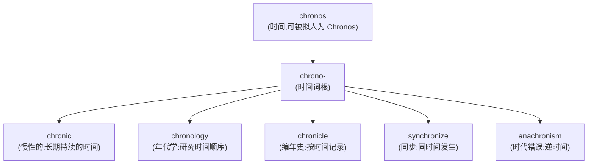
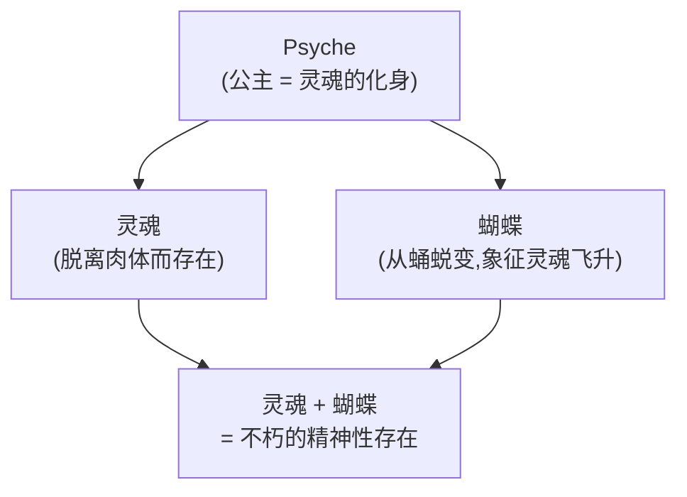
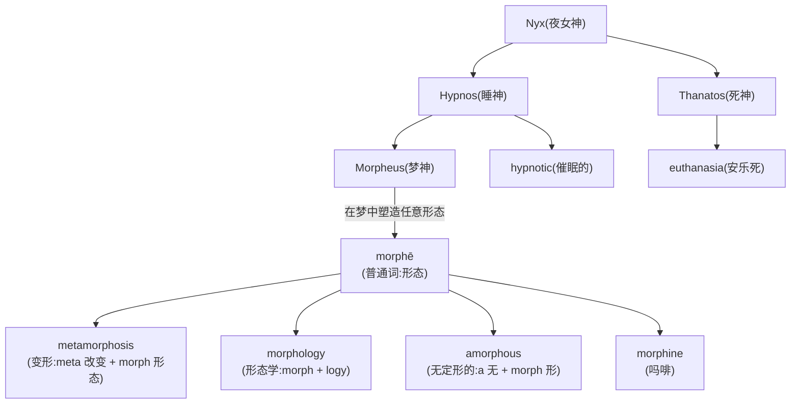

# 第 17 章 神话与词汇:普通词、神名和后世命名

> 欢迎进入词源界的神话片场:时间在吞噬万物,回声在重复台词,阿特拉斯还得继续扛。唯一不能做的,是把好故事直接当成词源证据。

这一章走一条比较浪漫的路线——看看希腊神话如何与英语词汇发生联系。

希腊神话不只是故事,它也保存了古希腊人对自然、情感和宇宙的拟人化表达。但词与神名之间至少有三种不同关系:**普通词产生神名或拟人形象、神名直接产生后世词语、普通词和神名同属一个词族**。不能把它们一律写成"神名变成词根"。

| 词或神名 | 关系 | 英语例词 |
| ------ | ------ | ------ |
| `chronos` | 普通词"时间"被人格化 | chronic, chronology |
| `psyche` | 普通词"灵魂"也是神话人名 | psychology, psychiatry |
| `morphē` | 普通词"形态"产生 Morpheus | morphology; morphine 来自神名 |
| King Atlas | Mercator 题名对象 | atlas(地图集) |
| Nemesis | 报应 | nemesis(宿敌) |
| Echo | 回声 | echo |
| Tantalus | 受折磨 | tantalize |
| Hyacinth | 风信子 | hyacinth |

这一章重点讲五组有代表性的神话词汇关系。众神负责剧情,我们负责把"普通词、神名、后世命名"三条线分清。

---

## 词根 1:`chrono-`(时间)—— 普通名词与时间拟人

### 【起源故事】

希腊文 ***chronos*** 首先是普通名词"时间",英语组合形式 `chrono-` 由这个词而来。希腊及后来的神话传统也把时间人格化为 **Chronos**;这说明神名来自"时间"概念,而不是 `chrono-` 词根来自神名。

Chronos 还经常与泰坦 **Cronus/Kronos** 混同,尤其在后世艺术中形成"时间吞噬万物"的形象。这个神话联想适合记忆,但 `chronic`、`chronology` 的直接词源仍是普通词 *chronos*。记住画面可以,别让两位神在族谱上偷偷换身份证。

### 【代表词深讲】

**`chronic`(慢性的、长期的)** —— 字面义"**与时间相关的**"。医学上指"**长期持续的**病"(慢性病),区别于 acute(急性的)。引申为"长期存在的、积习难改的"——`chronic liar`(老惯骗)。

**`chronology`(年代学)** —— `chrono`(时间)+ `logy`(学科)= **研究时间的学科**。排出历史事件的时间顺序,就是 chronology。

**`synchronize`(同步)** —— `syn-`(共同)+ `chrono`(时间)+ `-ize`= **时间相同**。两个事件在同一时间发生,就是同步。

> **提示** **对照记忆**:
>
> - `synchronous`(同步的)↔ `asynchronous`(异步的);动词还可用 `desynchronize`
> - `chronological`(按时间顺序的)↔ `anachronistic`(时代错误的)
>
> `anachronism`(时代错误)字面义是"**逆时间**"——比如电影里古罗马将军戴手表,就是 anachronism。

---

## 词根 2:`psych-` / `psyche`(灵魂)—— 普通名词与神话人物

### 【起源故事】

这是希腊神话里最动人的爱情故事之一,完整版本保存在罗马作家阿普列尤斯(Apuleius)的《金驴记》里。

先说词:希腊文 ***psychē*** 原本是普通名词,意思是"呼吸、生命、灵魂"——后来也用来指蝴蝶。这个词先于神话存在。然后,罗马时代广为流传的 Cupid 与 Psyche 故事,把 **Psyche** 这个名字塑造成一位凡间公主,同时也成了"灵魂"的拟人形象。

*(神话)* 故事是这样的:

从前有个国王,生了三个女儿,最小的叫 **Psyche**(灵魂)。她美得离谱,美到人们不再去爱神阿芙洛狄忒(Aphrodite,即罗马的维纳斯)的神庙——大家都跑去看 Psyche 了。爱神妒火中烧,命令儿子 **Cupid**(即希腊的 Eros,爱神):去,让你妈的箭戳中这丫头,让她爱上一只怪物。

Cupid 领命而去。可他靠近 Psyche 时,一不小心被自己的箭划了一下——**结果他先爱上了她**。这下计划全乱。Cupid 把 Psyche 带到一座神秘宫殿,每天夜里来看她,但有一个条件:**她绝不能看他的脸**。

Psyche 的两个姐姐嫉妒得发疯,反复挑拨:"你看不到他的脸,他一定是个怪物!趁他睡着,点灯看清楚,拿刀杀了他!"Psyche 终于忍不住。*(神话)* 某天夜里,她偷偷点起油灯,凑近床前——

看到的不是怪物,是爱神本人,美得让她手抖。一滴滚烫的灯油滴在 Cupid 肩上。Cupid 惊醒,勃然大怒:"这就是不信任!没有信任就没有爱!"——振翅而去,宫殿瞬间消失。

Psyche 悲痛欲绝,满世界找他。爱神阿芙洛狄忒趁机刁难,给她布置了一系列不可能完成的任务:分拣混在一起的一堆种子、过死亡之河取金羊毛、下冥界带回一个盒子……每一样 Psyche 都不该能做到,但总有生灵暗中相助——蚂蚁帮她分种子,芦苇告诉她怎么过河。

最后一个任务是:去冥界,向冥后要一盒"美貌",带回途中**绝不能打开**。Psyche 又没忍住——她想留一点美貌给自己。盒子打开的瞬间,里面是死亡的沉睡,她当场倒地。

最终是 Cupid 救了她。他伤已养好,挣脱了母亲的禁锢,找到沉睡的 Psyche,关上了死亡的盒子,带她去见宙斯。宙斯被感动,赐 Psyche 一杯神酒——她喝下后成了不朽的神。**凡间的"灵魂",终于和"爱"在奥林匹斯山上团圆。**

这个故事是寓言:`psychē`(灵魂)想要幸福,必须经历苦难与考验;而"爱"(Eros/Cupid)会在灵魂保持信任时回来。希腊词 psychē 同时是"灵魂"和这位公主的名字——`psychology`(心理学)等词来自这个普通名词,不是来自公主的户籍登记。

### 【代表词深讲】

**`psychology`(心理学)** —— `psych-`(气息、生命、灵魂、心灵)+ `-o-`(连接元音)+ `-logy`(研究、学科)= **心灵之学**。从 Psyche 那个"灵魂"一路演到现代心理学的"心理",意义早已扩容。

**`psychiatry`(精神病学)** —— `psych-`(心灵、精神)+ `-iatry`(医疗)= **灵魂治疗**。今天叫精神医学,精神科医生可别照字面叫"灵魂治疗师"。

**`psyche`(心灵、精神)** —— 直接借自希腊,指人的精神整体。

> **提示** **派生词群**:
>
> - `psychology`(心理学)
> - `psychological`(心理的)
> - `psychiatry`(精神病学)
> - `psychiatrist`(精神科医生)
> - `psychopath`(精神变态者:psycho + path 病)
> - `psychosomatic`(心身的:psycho + somatic 身体)

---

## 词根 3:`morph-`(形态)—— 普通词产生神名

### 【起源故事】

先把梦神的家族谱系摆清楚——这是希腊神话里最"催眠"的一个家族。

*(神话)* 夜女神 **Nyx**(夜)独自生下一对双胞胎儿子:哥哥叫 **Hypnos**(睡神,希腊文 hypnos 就是"睡眠"),弟弟叫 **Thanatos**(死神)。这对兄弟形影不离——在希腊人的想象里,睡眠和死亡本来就是一对:都是闭上眼、离开现世,只是一个明天醒来,一个不再醒来。所以 `hypnotic`(催眠的)、`hypnosis`(催眠状态)来自睡神 Hypnos,而 `euthanasia`(安乐死:eu 好 + thanatos 死)里藏着死神 Thanatos 的名字。

睡神 Hypnos 自己也有儿子,其中最出名的就是**梦神 Morpheus**。Morpheus 的职责,是在人的梦里**塑造形象**——把人或神的模样"演"给睡梦中的人看。所以他的名字由希腊文 ***morphē***(形态)而来:**他是"造形态的人"**。

这就解释了因果方向:是先有普通词 *morphē*(形态),梦神才据它得名。`morphology`(形态学)来自普通词,而 `morphine`(吗啡)才是直接借梦神命名——绕了一圈,终于借到了神。

> **提示** **`morphine`(吗啡)的来历**:1804 年,德国药剂师 Sertürner 从鸦片里分离出一种强效止痛成分。他命名时想到:**这种物质能让人陷入梦境般的沉睡**——就像梦神 Morpheus 在施展力量。于是他把它命名为 **morphine**。所以"吗啡"这个名字,直接来自希腊梦神。

### 【代表词深讲】

**`metamorphosis`(变形、变态)** —— `meta-`(改变)+ `morph`(形态)+ `-osis`(过程)= **形态改变的过程**。卡夫卡的小说《变形记》英文就是 Metamorphosis;生物学里蝴蝶从蛹变蝴蝶也叫 metamorphosis。

**`morphology`(形态学)** —— `morph`(形态)+ `logy`(学科)。语言学里研究词形变化,生物学里研究生物形态,地质学里研究地貌——都叫 morphology。

---

## 词根 4:`atlas`(地图集)—— Mercator 指向哪位 Atlas

### 【起源故事】

*(神话)* 泰坦神族大战(Titanomachy)里,巨人 **Atlas** 站错了队——他帮泰坦对抗宙斯。宙斯赢了,对他下了个狠罚:**永远用双肩扛着天空**。注意,是扛"天空",不是扛"地球"——后来"扛地球"的形象是讹传,但流传太广,如今图库里 Atlas 几乎都顶着个地球仪。

这个罚有多难受?扛天扛了几千年,Atlas 大概只想找个替班。**机会还真来了。**

*(神话)* 大英雄**赫拉克勒斯**(Heracles,罗马名 Hercules)接到第 11 项任务:去圣园摘金苹果。金苹果树由一条百头巨龙和一个仙女姐妹团守着,凡人根本摘不到。赫拉克勒斯很聪明——他去找 Atlas。Atlas 是仙女们的父亲(有的版本说是堂亲),由他出手,女儿们多少会给面子。

赫拉克勒斯开价:"我替你扛天,你去帮我摘金苹果,怎么样?"Atlas 一听,扛了几千年的肩膀终于能歇会儿,立马答应。他放下天空交到赫拉克勒斯肩上,乐颠颠地去摘苹果。

苹果摘回来了。**Atlas 忽然起了坏心思**:扛天多累啊,既然有人顶上了,我不如让他一直扛下去。于是他笑眯眯地说:"苹果我帮你送回去吧,你先扛着。"说完转身要走。

赫拉克勒斯心里骂娘,脸上不动声色:"行啊没问题。不过我肩膀太硌,你帮我垫一下——我把这个狮皮垫肩调整一下,你先接过去扛一会儿。"Atlas 觉得有道理,又把天空接回自己肩上。

**赫拉克勒斯抄起金苹果,头也不回地走了。** Atlas 又被坑回去了。

*(神话)* Atlas 还有另一个结局,出自英雄**珀尔修斯**(Perseus)的故事。Perseus 砍下蛇发女妖美杜莎(Medusa)的头——谁看一眼就变石头。他路过 Atlas 这里,Atlas 想拦他。Perseus 掏出美杜莎的头,Atlas 一看——**当场变成了一座山**。这就是北非的**阿特拉斯山**(Atlas Mountains)的来历,它至今还"扛着"天空。

> 1595 年出版的 Mercator 地图集用 *Atlas* 作标题。序言里把题名对象解释为毛里塔尼亚的**传奇国王 Atlas**——一位天文学家和智者,而非受罚托天的泰坦。后来两位同名 Atlas 的图像与故事经常混在一起,大家也就懒得区分了。

### 【代表词】

**`atlas`(地图集)** —— 作为书名用法来自 Mercator 对传奇国王 Atlas 的致意,随后泛化为"地图集"。把它解释成"扛天巨人的书"是后世容易形成的联想。

**`Atlantic`(大西洋)** —— 来自 Atlas 的形容词形式。希腊人认为大西洋在 Atlas 扛天的山脉(阿特拉斯山)之外,所以叫"Atlas 之海",Atlantic Ocean。

> **提示** **同根延伸**:`Atlantis`(亚特兰蒂斯)——柏拉图虚构的沉没大陆,字面义"Atlas 的岛"。

---

## 词根 5:几个戏剧性的神话词根

### `nemesis`(宿敌、报应)—— 来自报应女神

希腊女神 **Nemesis** 是报应女神,专门惩罚傲慢自大的人。今天英语里 `nemesis` 指"**宿敌**"——那个注定要让你付出代价的人。蝙蝠侠的 nemesis 是小丑。

### `echo`(回声)—— 来自回声女神

这是奥维德(Ovid)《变形记》里最令人心碎的故事。

*(神话)* 仙女 **Echo** 原本是个能说会道的姑娘——其实太能说了,喋喋不休。这给她招来祸端。天后赫拉(Hera)怀疑丈夫宙斯又去山林里和仙女们鬼混,跑来盘问。Echo 被仙女们推出来挡驾,就拉着赫拉东拉西扯、讲个没完,给同伴们争取逃跑的时间。

赫拉不是傻子。她识破后勃然大怒,对 Echo 下了一个毒咒:

> **"你既然这么爱说话,那就剥夺你先开口的权利。从今往后,你只能重复别人最后说的那几个字。"**

Echo 从此再也不能主动表达自己——别人不说,她就开不了口。

偏偏这时候,她遇见了少年 **Narcissus**(纳西索斯,自恋的化身)。Narcissus 美得惊人,但谁都不爱。Echo 一见钟情,想表白,想冲上去说"我喜欢你"——可诅咒让她发不出声音。她只能等。

*(神话)* Narcissus 在林中迷路,大喊:"有人吗?(Is anyone here?)"
Echo 躲在树后,只能跟着重复:"……这里(here)。"
Narcissus 四下张望:"来!(Come!)"
Echo 心跳如鼓,只能应:"……来!(Come!)"——她多么想冲过去,可她说不出"我在这,我来了"。
Narcissus 终于看到一个身影,冷冷地拒绝了她:"我宁可死,也不让你占有我。"
Echo 只能心碎地复述最后几个字:"……占有我(……you may possess me)。"

她羞愧难当,躲进深山,从此不见人。悲伤让她形容枯槁,身体一点点消散——最后只剩下了**声音**。今天山洞里、峡谷中那句重复你话的回声,就是 Echo。她还在那里,等着有人先开口,她才能回应。

`echo`(回声)这个词,就是这位仙女最后的、也是唯一的遗产。

### `tantalize`(逗弄、吊胃口)—— 来自受折磨的国王

*(神话)* 国王 **Tantalus**(坦塔罗斯)的罪,听着就让人不寒而栗。

他是宙斯的儿子,深受众神信任——能和众神同桌吃饭,这种待遇凡人想都不敢想。但 Tantalus 偏偏要作死。他想试探:**众神到底是不是真的全知?**

于是他干了一件骇人的事。*(神话)* 他把自己亲生的儿子 **Pelops**(珀罗普斯)杀了,剁成块,煮成一锅肉,端上餐桌宴请众神。他想看看:众神能不能识破这道菜是什么?

众神当然识破了——他们惊恐地拒绝动筷,只有农业女神得墨忒耳(Demeter)因为正在悲伤中走神,不小心吃了一口肩膀。众神把剩下的碎块重新拼起来,复活了 Pelops(被吃掉的肩膀用象牙补上)。

Tantalus 的下场呢?宙斯把他打入冥界,受一份量身定做的、永远结束不了的折磨:

*(神话)* **Tantalus 站在一条清澈的河水中,水正好没到他的下巴**。他渴得要命,一低头想喝水——水立刻退下去,退到够不着的地方;他一抬头,水又涨回来。**头顶是一棵挂满果实的树,枝条低垂到他伸手就够得到的位置**。他饿了,伸手去摘——一阵风把树枝吹高,他怎么也够不到。

水到下巴,喝不到;果在头顶,摘不到。永远"看得见,够不着"。这就是 **tantalize** 的字面来源——**像 Tantalus 一样受尽诱惑又被剥夺**。今天你用一根肉干在狗面前晃来晃去不给它吃,你就是在 tantalize 它。

> **Tantalus 的折磨(看得见,够不着 = tantalize)**:站在水中,水退到下巴以下;头顶是果树,伸手时风把树枝吹走——永远"看得见,够不着"。

### `panic`(恐慌)—— 来自牧神 Pan

*(神话)* 牧神 **Pan**(潘)是个形象有点滑稽的神:半人半羊,长着山羊腿和两只角,胡子拉碴,在山林和荒野间游荡。他生性好色,见一个追一个,但长相实在抱歉,经常追到一半被吓跑的仙女嫌弃。

但 Pan 有一样可怕的本事。*(神话)* 他午睡被打扰时会发怒,从藏身处发出一种**尖锐可怖的怪叫**。这种声音没人听过却无法形容,会让听见的人**从骨髓里升起一股无名恐惧**,丢盔弃甲、抱头鼠窜——完全不知道自己在怕什么,就是控制不住地想跑。

这种无来由的、群体性的、莫名恐慌,就以 Pan 的名字命名:**panic**。

*(传说)* 希罗多德(Herodotus)记载了一个著名的故事:公元前 490 年马拉松战役前夕,雅典人派传令兵斐迪庇第斯(Pheidippides)去斯巴达求援。*(传说)* 这位传令兵在半路上遇到了牧神 Pan 本人——Pan 对他说:"你们雅典人怎么平时不理我?我其实挺帮你们的。"马拉松战役中,波斯军队果然溃败——*(传说)* 据说波斯人在战场上莫名恐慌、阵脚大乱,正是 Pan 在暗中发威。战后雅典人在雅典卫城脚下给 Pan 修了一座神庙,算是还愿。

`panic` 就这样把一个神的怪癖,凝固成了人类共有的情绪。

---

## 【家族树】词、神名与英语词的关系

| 来源 | 英语词根/词 |
| ------ | ------ |
| chronos(普通词"时间") | `chrono-`;也被人格化为 Chronos |
| psychē(普通词"灵魂") | `psych-`;Psyche 是神话拟人 |
| morphē(普通词"形态") | `morph-`;Morpheus 名字由此形成 |
| Morpheus(梦神) | `morphine` |
| King Atlas(传奇国王) | Mercator 书名 Atlas → 地图集 |
| Nemesis(报应女神) | `nemesis`(宿敌) |
| Echo(回声仙女) | `echo`(回声) |
| Tantalus(受折磨国王) | `tantalize`(吊胃口) |
| Pan(牧神) | `panic`(恐慌) |
| Hyacinthus(风信子少年) | `hyacinth`(风信子) |
| Iris(彩虹女神) | `iris`(虹膜)、`iridescent` |
| Flora(罗马花神) | `flora`(植物群) |
| Mars(罗马战神) | `martial`(尚武的)、`March`(三月) |
| Janus(罗马门神) | `January`(一月:门户之月) |

> **提示** **罗马神的贡献**:不止希腊神,罗马神也给英语留下了大量词根。`January`(一月)来自罗马门神 **Janus**(双面神,看过去也看未来,适合作为新年之首);`March`(三月)来自战神 **Mars**(三月是出征的季节);`martial`(尚武的)也来自 Mars。

---

## 【拆词启示】神话词根如何帮你记忆

| 词 | 神话来源 | 推义 |
| ---- | --------- | ------ |
| `chronic` | chronos 普通词"时间" | 时间长的 → 慢性的 |
| `chronology` | chrono + logy | 时间顺序的论述 → 年代学 |
| `synchronize` | syn + chrono | 使时间一致 → 同步 |
| `psychology` | psychē + logy | 关于心灵的研究 → 心理学 |
| `psychiatry` | psychē + iatry | 心灵治疗 → 精神病学 |
| `metamorphosis` | meta + morphē | 改变形态 → 变形 |
| `morphine` | Morpheus 梦神 | 梦神的药 → 吗啡 |
| `atlas` | Mercator 所指的 King Atlas | 书名 → 地图集 |
| `Atlantic` | Atlas 的 | 扛天神之海 → 大西洋 |
| `nemesis` | Nemesis 报应女神 | 报应者 → 宿敌 |
| `tantalize` | Tantalus 受折磨 | 够不着 → 吊胃口 |
| `panic` | Pan 牧神 | 牧神之惧 → 恐慌 |
| `martial` | Mars 战神 | 战神的 → 尚武的 |
| `January` | Janus 门神 | 门神之月 → 一月 |

---

## 本章小结

### 你应该带走的几个画面

1. **先判断因果方向**——`chronos`、`psychē`、`morphē` 是普通词,相关神名或拟人形象由这些概念产生。
2. **morphine(吗啡)= 梦神的药**——药剂师用梦神 Morpheus 命名,因为它带来梦一般的沉睡;梦神的爹是睡神 Hypnos,Hypnos 的双胞胎弟弟是死神 Thanatos。
3. **Echo 只能复述最后几个字**——赫拉的诅咒,让她无法向 Narcissus 表白,最后只剩声音。
4. **Tantalus 永远"看得见够不着"**——水到下巴喝不到,果在头顶摘不到,这就是 tantalize。
5. **Atlas 被赫拉克勒斯骗回岗位,又被美杜莎的头变成山**——一座山的来历。
6. **罗马神也贡献了大量词**——January(门神 Janus)、March(战神 Mars)、martial(尚武)。

### 记忆锚点

> **神话能强化记忆,但必须区分普通词、神名和后世命名。**

---

## 避坑提示

本章把神话当故事讲了个痛快,但故事归故事,词源归词源,几条限定要记住:

- **`chronos`、`psychē`、`morphē` 是普通词,先于神名存在**。相关神名或拟人形象由这些概念产生,因果方向不能反过来。`psychology`、`morphology`、`chronology` 来自普通词,不是来自神的名字。
- **`morphine` 是直接借神名命名的少数例外**——药剂师 Sertürner 有意用梦神 Morpheus 来命名。
- **`atlas`(地图集)来自 Mercator 对传奇国王 Atlas 的致敬**,而非托天泰坦。两位同名 Atlas 的图像后来混淆,但题名对象是有学问的国王。
- **神话版本众多,本章讲述选取流传最广的版本**(多依据奥维德《变形记》、阿普列尤斯《金驴记》、赫西俄德《神谱》、希罗多德《历史》等)。不同版本细节有出入,比如 Cupid 与 Psyche 的故事是罗马时期的创作,Echo 的诅咒出自奥维德,Tantalus 众说其受罚原因。
- **Tantalus 宴请众神、煮子试探神的故事**是流传最广的版本,但学界对这一传说的来源和象征意义有不同解读。
- **马拉松战役前 Pan 现身助阵的故事**出自希罗多德的记载,属古代传说,非信史。斐迪庇第斯半路遇 Pan 的细节,同样来自希罗多德的转述。
- **蝴蝶与灵魂的象征关系**在古代艺术中确实重要,但"因为观察蝴蝶破蛹所以创造双义"是解释性故事,不宜写成已经证实的词义形成过程。
- **`psychology`、`psychiatry` 等词的古典成分**只反映构词来源,现代学科的对象和方法不能由古希腊 *psychē* 的一个译义直接定义。精神科医生不宜直译成"灵魂治疗师"。

---

### 【思考题】(答案见附录 D)

1. `psychology` 中的 `psych-` 经历了从"气息、生命、灵魂"到"心灵、心理"的语义发展;这种历史同现代心理学的研究对象有什么区别?
2. `morphine`(吗啡)为什么以梦神 Morpheus 命名?(提示:它带来梦般的沉睡)
3. `tantalize`(吊胃口)来自 Tantalus 的折磨,想象一下"看得见够不着"的画面,这种惩罚为什么引申为"逗弄"?

---

*下一章 → [第 18 章 学科的词根:-logy / -graphy / -metry 的由来](./第18章-学科的词根.md)*
