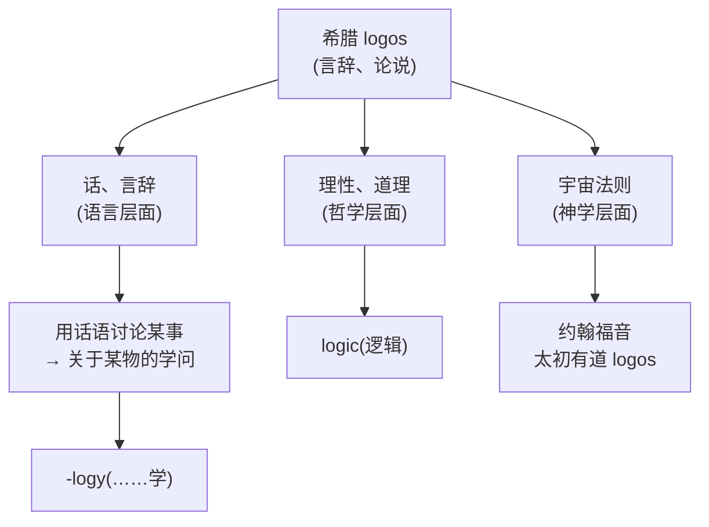
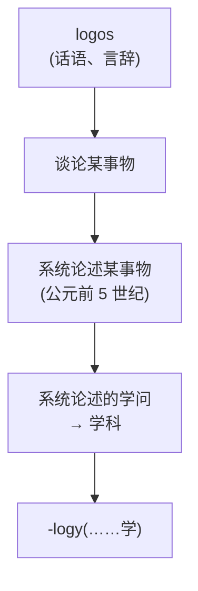
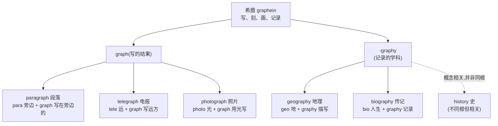
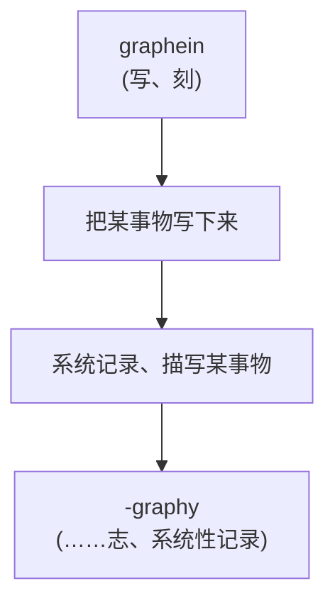
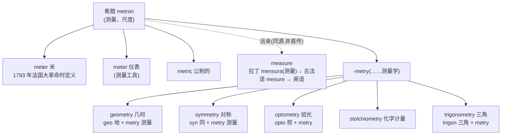
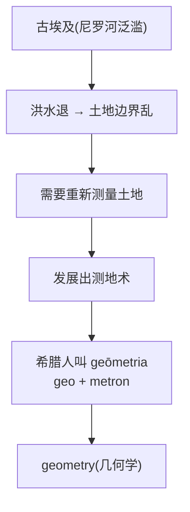

# 第 18 章 学科的词根:-logy / -graphy / -metry 的由来

> 看到 `-logy`、`-graphy`、`-metry`,先别被它们那身学术长袍震住。脱下袍子,你会发现三个朴素的工种:一个负责**研究**,一个负责**记录**,一个负责**测量**——学术世界也得有明确分工。

这一章讲三个常见的希腊来源组合形式。它们参与许多学科名和专业词的构造,但学科命名远不止这三种:

| 后缀 | 含义 | 例词 |
| ------ | ------ | ------ |
| `-logy` | ……学 | biology, psychology, geology |
| `-graphy` | ……志 | geography, biography, photography /fəˈtɑɡrəfi/ |
| `-metry` | ……测量 | geometry /dʒiˈɑmətri/, symmetry /ˈsɪmətri/, optometry /ɑpˈtɑmətri/ |

讲清楚它们的来源,可以帮助识别一批术语;具体词义仍需逐词学习。词尾能给方向,不能替你代修整门课程。

这一章没有宙斯,没有赫拉,没有会说话的鸡——这一家子是希腊词根里的**蓝领派**。它们的本事不靠神迹,靠的是一群泥腿子:在尼罗河泥泞的岸边拽绳子丈地的埃及书吏,在以弗所集市上对路人宣讲"万物皆流"的怪老头,还有 19 世纪蹲在暗房里盯着一块银板发呆的法国人。故事没那么戏剧,但这是离你日常最近的三个后缀——你每一份简历上的 psychology,每一条朋友圈的 photograph /ˈfoʊtəˌɡræf/,每一道几何题的 geometry,都要从这帮人身上找源头。

---

## 后缀 1:`-logy`(……学)

### 【起源故事】

希腊文 ***logos***(λόγος)是古希腊语里语义最膨胀的一个词。它的本义朴素得不能再朴素——**话、言辞、说出来的东西**。可就是这么一个"话",被古希腊人几百年里反复加料、反复升级,最后膨胀成一只塞满"理性、规律、宇宙法则、神圣之道"的大行李箱。把它只翻成一个"逻各斯",往往像把一整只行李箱贴成一张标签。

**【logos 的升格:从"话语"到"宇宙法则"】**

logos 这词的传奇不在于它本义多朴素,而在于**它是怎么从一个"话"一步步升格成"宇宙理性法则"的**。这事的第一推手,是古希腊哲学界有名的怪老头——**赫拉克利特(Heraclitus)**。

公元前 6 世纪到 5 世纪,以弗所(Ephesus,今天土耳其西海岸)。赫拉克利特是个让同时代人头疼的人物:出身贵族却把王位让给兄弟,躲进阿尔忒弥斯神庙附近跟孩子们掷骰子,骂同胞"该被吊死"。他说话从不好好说,专挑格言体——"人不能两次踏入同一条河流""上坡路和下坡路是同一条路"——后人给他起个外号叫"晦涩者"。

*(传说)* 想象一下这个画面:以弗所的集市上,人来人往,卖无花果的吆喝,奴隶抬着轿子穿过人群。赫拉克利特站在某个角落,拽住一个路人,神秘兮兮地讲:

> "听着,万物皆流,万物都在变。但这一切变化的背后,有一套**共同的法则**在支配——这个法则,我把它叫做 ***logos***。它是宇宙的理性,是一切变化的尺度。可大多数人呢?他们天天活在这个 logos 里,却像睡着了一样,根本看不见。"

路人大概一脸懵:你这老头说的 logos 不就是"话"吗?赫拉克利特的意思恰恰是——**它不只是"话"了**。他要让一个本义只是"说出来的言辞"的词,承担起"宇宙运行的内在理性"这种重量级含义。赫拉克利特是西方思想史上**最早赋予 logos 重要哲学地位的思想家之一**。

这一升,后面的事就刹不住了。斯多葛学派接过手,说 logos 是"遍及宇宙的理性原理";到《约翰福音》开篇那句"太初有道,道与神同在",那个"道"用的正是 *Logos*——一个希腊文的"话",被推上了神学的最高位。

而 logos 的另一条血脉,则安分得多——它就停在"谈论、论述某事"这一层,慢慢长成了今天我们要讲的主角:`-logy`(……学)。

> **提示** **logos 是希腊哲学和基督教神学的重要概念**。赫拉克利特和斯多葛学派对它有不同使用;《约翰福音》开篇用 *Logos* 表示"道/Word"。希伯来语和希腊语传统中的"智慧"通常对应 *Sophia*,不能说基督教用 *Logos* 翻译了希伯来语的"智慧"。

### 【-logy 的演变:从"言辞"到"学科"】

`-logy` 从希腊文 logos 演变成今天的"学科后缀",经过了一个清晰的语义漂移:

### 【-logy 家族】

> **X + -logy = 关于 X 的学问**

| 构成 | 单词 | 释义 |
| ------ | ------ | ------ |
| bio + logy | biology | 生物学 |
| psych + logy | psychology | 心理学 |
| geo + logy | geology | 地质学 |
| theo + logy | theology /θiˈɑlədʒi/ | 神学 |
| philo + logy | philology /fɪˈlɑlədʒi/ | 语文学 |
| eco + logy | ecology /ɪˈkɑlədʒi/ | 生态学 |
| socio + logy | sociology /ˌsoʊsiˈɑlədʒi/ | 社会学 |
| anthropo + logy | anthropology /ˌænθrəˈpɑlədʒi/ | 人类学 |
| etymo + logy | etymology /ˌɛtəˈmɑlədʒi/ | 词源学 |

### 【一个特别的词:`etymology` /ˌɛtəˈmɑlədʒi/(词源学)】

`etymology` 本身就是一个有意思的故事。

它来自希腊文 **etymon**(真义、本义)+ **logy**(学科)= **研究词语本义的学科**。

> 希腊文 *etymos* 意为"真、本真"。所以 etymology 字面义是"**研究词语真义的学问**"——这就是为什么你正在读的这本书,本质就是在做 etymology。

---

## 后缀 2:`-graphy`(……志、……记录)

### 【起源故事】

希腊文 ***graphein***(γράφειν)意为"**写、刻、画**"。注意:在纸张普及前,希腊人写字是**在蜡板上用尖笔刻**,所以 graphein 带着强烈的"刻划"感——它不是轻飘飘地蘸墨水,而是一笔一画往蜡上扎。这种"刻划"的肌肉记忆,后来一直留在 graph 这个词根里。

### 【-graphy 的演变:从"写"到"系统记录的学科"】

和 `-logy` 类似,`-graphy` 也经历了一个从动作到学科的演变:

### 【-logy 和 -graphy 的微妙区别:理论派 vs 田野派】

这两个后缀经常成对出现,长得还像,但意思有微妙差别。打个比方:**`-logy` 是"理论派",`-graphy` 是"田野派"**。

`-logy` 的根是 logos,爱谈原理、追问"为什么",坐在书斋里皱着眉头推演;`-graphy` 的根是 graphein,爱动手、爱记录,卷起裤腿下到现场,把看到的一笔一笔"写下来"。一个是**为什么是这样**,一个是**它究竟是什么样**。

| -logy(理论、原理) | -graphy(记录、描写) |
| ------ | ------ |
| geology(地质学):研究"为什么"(成因) | geography(地理学):描写"是什么"(现象) |
| biology(生物学):研究生命的规律 | biography(传记):记录一个人的一生 |

把 geology 和 geography 摆在一起,差别就出来了:geologist 想搞明白**这座山是怎么抬起来的、这条河为什么这样拐弯**;geographer 则忙着把**这座山画进地图、把这条河的走向标注清楚**。一个追问成因,一个负责留档。考古学家去现场挖一锅土回来写报告,那叫 ethnography /ɛθˈnɑɡrəfi/(民族志);社会学家在办公室里建模型分析为什么会这样,那更靠近 sociology(社会学)。

> **提示** **理解关键**:看到 `-logy`,想"**理论研究**";看到 `-graphy`,想"**描写记录**"。

### 【-graphy 家族】

> **X + -graphy = 关于 X 的记录/描写**

| 构成 | 单词 | 释义 |
| ------ | ------ | ------ |
| geo + graphy | geography | 地理学(描写大地) |
| bio + graphy | biography | 传记(记录一生) |
| photo + graphy | photography | 摄影(用光记录) |
| auto + bio + graphy | autobiography /ˌɔtəbaɪˈɑɡrəfi/ | 自传(自己写自己) |
| calli + graphy | calligraphy /kəˈlɪɡrəfi/ | 书法(美的书写) |
| carto + graphy | cartography /kɑrˈtɑɡrəfi/ | 制图学(画地图) |
| ortho + graphy | orthography /ɔrˈθɑɡrəfi/ | 正字法(正确书写) |
| biblio + graphy | bibliography /ˌbɪbliˈɑɡrəfi/ | 参考书目(写书清单) |

### 【一个特别的词:`photograph` /ˈfoʊtəˌɡræf/(照片)——暗房里第一次"用光书写"】

`photograph` 拆解:`photo-`(光)+ `-graph`(写)= **用光来写**。

时间拉到 1839 年,巴黎。法国人**达盖尔(Louis Daguerre)**鼓捣了好些年的"银版摄影术"终于快要成功了——把一块镀银的铜板熏上碘蒸气,曝光后用水银蒸汽显影,再定影,理论上能把眼前的景象"固定"下来。可这套工艺又慢又麻烦又危险,水银蒸汽有毒,曝光要十几分钟,被拍的人得被铁夹子夹住后脑勺保持不动,稍微眨个眼,出来的脸就糊成一团。

*(传说)* 想象那个被反复描述的画面:暗房里,达盖尔把曝光过的银板架在水银蒸汽上方显影。在微弱的灯光下,他屏住呼吸盯着那块金属板——起初什么也没有,只是灰蒙蒙一片。然后,像是有人在金属表面上轻轻一抹,影像**一点一点浮现出来**:窗外的屋顶、街角的灯笼、对面墙上晒着的衣服……都"长"在了这块冰冷的银板上。不是画出来的——是**光自己"写"上去的**。人类第一次不用画笔,就让光替自己留下一份影像。

这门新技术该怎么命名?达盖尔和他的同代人有的是选择。他们可以叫它"光影像""光画""光刻版"——19 世纪的人造词能力一点不比今天差。可最终被大家接受的名字是 **photograph**:**photo(光)+ graph(写)= 用光书写**。

这是一个有分量的选择。它等于在说:**光在这里不只是照明的工具,它升了格,成了"书写者"本身**——光握住了那支看不见的笔,把眼前的世界一笔一笔"写"进银盐里。一句话,光从"仆人"(照亮)变成了"作者"(书写)。

这份浪漫一直留到了今天。你按下手机快门的那一下,本质和 1839 年那间暗房是同一件事:**光,正在替你书写**。

> **photograph 的诗意**
>
> 19 世纪发明摄影术时,人们惊叹于"用光就能记录影像":
> **photo(光)+ graph(写)** —— "光在底片上写下了影像"。
> photograph(照片)= **用光书写**。

这个词体现了 19 世纪科学家的浪漫——他们不叫它"光影像",而叫它"**光写**"(photograph)。光不只是照亮,而是**书写者**。

---

## 后缀 3:`-metry`(……测量、……测量学)

### 【起源故事】

希腊文 ***metron***(μέτρον)意为"**测量、尺度**"。它的动词形式是 *metrein* "测量"。这一组词根没什么花哨的身世——它从诞生那天起就接地气,干的都是"拿尺子量东西"的活。

> **提示** **`measure` /ˈmɛʒər/(测量)和 `-metry` 是亲戚!** `measure` 经过拉丁 mensura → 古法语 mesure → 英语 measure,而 mensura 和希腊 metron **同源于原始印欧语 *me-**(测量)。所以 measure / meter / metry 三个词**都是亲戚**。

### 【-metry 的代表词:geometry——数学的"泥巴味"起点】

**`geometry` /dʒiˈɑmətri/(几何学)** —— `geo`(地)+ `metry`(测量)= **测量土地**。

*geōmetria* 的字面构造确实是"测量土地"。古希腊作者希罗多德把几何知识与埃及尼罗河泛滥后重新丈量土地联系起来;这是重要的古代传统叙事,但不能据此断言几何学只在这一场景中诞生。

但希罗多德讲的那个故事,实在太值得展开——因为它能让你闻到几何学诞生时的**那股泥巴味**。

公元前 5 世纪,希罗多德在《历史》第二卷里写下这么一段:每年夏天,尼罗河准时泛滥,浑浊的洪水漫过两岸的田地,把一切沟渠、田埂、地界统统冲平。等洪水退去——**每个人家那块地的边界全没了**。你家那块麦田和邻居家那块之间本来有条沟,现在沟没了;本来有块石头当界碑,现在石头不知被冲到哪里去了。谁的地往哪儿延伸、应该交多少税、这块地到底算谁的——全乱套了。

*(传说)* 想象一下洪水退去后的尼罗河岸。泥泞还泛着水光,蚊子嗡嗡,空气里一股河泥的腥味。一群**书吏**——古埃及管丈地的官员——赤着脚踩进烂泥里,手里攥着**打了结的绳子**(就是那种按固定长度打好结的测绳,一拉就是一段标准长度)。他们弯着腰,把绳子绷直,两人各拽一头,沿泥地一步步往前量;量完一段,在地上戳个记号,再量下一段。重新把每块地的边界一寸一寸"找回来"。

这种又脏又累、和数学家形象毫不沾边的活儿,被希罗多德称为 ***geōmetria***——**geo(地)+ metron(测量)= 测地**。希腊人后来从埃及人那里学来了这套手艺,慢慢把它从"拽绳子量地"打磨成了一门**关于点、线、面、角的纯粹学问**,最后欧几里得在亚历山大写《几何原本》,把这一切整理成公理体系。

但请你记住:**今天让你头疼的那道几何题,最早是在尼罗河岸边的烂泥里被一步步量出来的**。数学的起点不在象牙塔,而在泥巴里——一个赤脚书吏、一根打结的绳子、一块被洪水冲乱边界的田。这就是 geometry 留给我们的画面。

> **提示** **"几何学"的字面义与测量土地有关**。埃及测地故事能说明实用测量背景,但数学知识的形成涉及多个古代文明和长期发展。

**`symmetry` /ˈsɪmətri/(对称)** —— 来自希腊 *symmetria*,核心义是"共同尺度、相称、比例协调"。现代词义可以指镜像或旋转对称,但原义不只是"左右两边测起来一样大"。

**`trigonometry` /ˌtrɪɡəˈnɑmətri/(三角学)** —— `trigon`(三角形,tri 三 + gon 角)+ `metry`= **测量三角形**。

---

## 【三个后缀的对照记忆】

| 后缀 | 字面义 | 引申义 | 例子 |
| ------ | ------- | -------- | ------ |
| `-logy` | 话语、理性论述 | ……学(理论) | biology, psychology |
| `-graphy` | 写、刻、记录 | ……志(描写) | geography, biography |
| `-metry` | 测量、尺度 | ……测量学 | geometry, symmetry |

> **提示** **拆词方法**:看到包含这些组合形式的术语,先判断它偏向论述、书写记录还是测量,再核对整词在具体学科中的定义。

---

## 【综合案例:拆解几个学科词】

三个后缀各自表演完毕,现在让它们同台合练。下面这张表就是期末考试的预览——放心,开卷,而且你刚刚把答案全看过一遍了。

| 学科词 | 拆解 | 释义 |
| ------ | ------ | ------ |
| anthropology(人类学) | anthrop-(人) + -o-(连接元音) + logy(学) | 研究人类的学问 |
| biography(传记) | bio(生命、人生) + graphy(记录) | 记录人生 |
| cinematography /ˌsɪnɪməˈtɑɡrəfi/(电影摄影) | cinemato(运动) + graphy(记录) | 记录运动 → 电影 |
| astronomy /əˈstrɑnəmi/(天文学) | astr-(星) + -o- + nomy(法则、安排) | 研究星辰法则 |
| cartography(制图学) | carto(地图,chart) + graphy(画) | 画地图 |
| ethnography(民族志) | ethno(民族) + graphy(记录) | 记录民族 |

> **提示** **一个常见组合成分**:`-nomy` 与希腊 *nomos* "惯例、法则"及 *nemein* "分配、管理"词族有关。`astronomy` /əˈstrɑnəmi/ 可联想为"星辰秩序/法则的研究";`economy` /ɪˈkɑnəmi/ 经希腊 *oikonomia* 表示"家庭或产业的管理"。后者是"管理活动/制度",不是"管家"这个人。

**一个有趣的旁支:`economy`(经济)= 古希腊的"管家学"。**

`economy` 拆开是 **eco(房子,希腊 *oikos*)+ nomy(管理)= 管理房子**。是的,你没看错:**"经济"在最古老的意义上,就是"管家"**——管好你那间屋子、那块地、那点家当。

这事有实锤。古希腊作家**色诺芬(Xenophon)**写过一本《经济论》(原文 ***Oeconomicus***),整本书探讨的就是"怎么当好一个庄园主":怎么管奴隶、怎么训练管家婆、怎么把田种好、怎么让妻子把家里打理得井井有条。色诺芬要是穿越到今天,看到各国央行行长研究什么"宏观经济""货币政策",大概会一头雾水——在他眼里,真正的 *oikonomia* 是教你怎么把家里那点橄榄油和麦子管明白。

可就是这样一个朴素的"管家学",两千多年来一路膨胀:**从"管理一间屋子"→"管理一个庄园"→"管理一个城邦的财政"→"管理一国的生产流通"**。词还是同一个 economy,内容却从"老婆怎么管伙食"变成了"GDP 怎么算"。下次你听见经济学家在电视上侃侃而谈"经济形势",可以脑补一下色诺芬站在田埂上、操心他家那点麦子的画面——这就是 economy 最朴素的起点。

---

## 【家族树】三大学科后缀的子孙

最后来一张全家福。logos、graphein、metron 三位老祖宗站在最上面,下面密密麻麻挤满了子孙——你认识的每一门学科,多半能在这棵树上找到自己的枝头。

```mermaid
flowchart TD
    logos["logos(话语)"] --> logy["-logy"]
    graphein["graphein(写)"] --> graphy["-graphy"]
    metron["metron(测量)"] --> metry["-metry"]

    logy --> biology["biology"]
    logy --> psychology["psychology"]
    logy --> geology["geology"]
    logy --> sociology["sociology"]
    logy --> theology["theology"]
    logy --> philology["philology"]
    logy --> ecology["ecology"]
    logy --> anthropology["anthropology"]

    graphy --> geography["geography"]
    graphy --> biography["biography"]
    graphy --> photography["photography"]
    graphy --> calligraphy["calligraphy"]
    graphy --> cartography["cartography"]
    graphy --> bibliography["bibliography"]

    metry --> geometry["geometry"]
    metry --> symmetry["symmetry"]
    metry --> trigonometry["trigonometry"]
    metry --> optometry["optometry"]
    metry --> stoichiometry["stoichiometry"]
```

---

## 本章小结

1. **-logy 来自 logos(话语、理性)**——赫拉克利特在以弗所集市上把一个"话"升格成"宇宙理性",学科是"理性论述",带庄严色彩。它是理论派,爱追问"为什么"。
2. **-graphy 来自 graphein(写、刻)**——所以"传记、地理、摄影"都是"用刻写记录"。它是田野派,爱动手把"是什么样"写下来。其中 photograph(照片)= 用光书写,达盖尔的暗房里,光从"仆人"变成了"作者"。
3. **-metry 来自 metron(测量),geometry 字面与测地有关**——希罗多德记载的尼罗河故事:洪水冲乱田界,书吏赤脚踩在泥里拽绳子重新量地,这就是几何学的泥巴味起点。

### 记忆锚点

> **-logy = 学(理论,赫拉克利特的 logos),-graphy = 志(描写,田野派的 graphein),-metry = 量(测量,尼罗河泥里的 metron)。** 看学科后缀,定学科性质。

---

### 【思考题】(答案见附录 A)

1. `biography` /baɪˈɑɡrəfi/(传记)拆开是 bio + graphy,为什么"记录人生"等于传记?
2. `geometry` /dʒiˈɑmətri/ 的构形与"测地"有关;尼罗河泛滥后重分土地的传统故事能说明什么,又不能单独证明什么?
3. `economy` /ɪˈkɑnəmi/ 经希腊 *oikonomia* 表示家庭或产业管理;它怎样扩展成现代"经济"概念?

---

*下一章 → [第 19 章 希腊词根速查补遗](./第19章-希腊词根速查补遗.md)*
