# 第 19 章 希腊词根速查补遗

> 希腊组合形式很像术语零件盒:`bio-` 管生命,`geo-` 管大地,`tele-` 管远方。零件很多,但说明书仍然不能扔。

前面四章(第 15-18 章)我们深讲了希腊词根的核心:philo/soph(爱/智)、demo/crat(民/治)、神话词根、三大学科后缀。

这一章把其他高频希腊组合形式用紧凑格式补全。识别组合形式能帮助圈定词义范围,但它们不能与任意成分自由拼接,也不能只凭"长得像"就认亲——词根界同样需要核验身份。

> 本章收录约 25 个词根,涵盖 `bio-`(生)、`geo-`(地)、`tele-`(远)、`phone`(声)、`astron`(星)、`photo-`(光)、`therme`(热)、`hydro`(水)、`aero` /ˈɛroʊ/(空气)、`archaios`(古)、`kainos`(新)、`micros`(小)、`macros`(大)、`auto-`(自)、`hetero-`(异)、`homo-`(同)、`neo-`(新)、`pan-`(全)、`poly-`(多)等。

---

## 【自然与物质类】

这一格装的,是希腊人用来命名世界的零件——生命、大地、水、光、热、空气。科学家给新发现起名时,第一个翻的往往就是这个抽屉。

### `bio-`(生命)

希腊文 ***bios***(生命、生活)。它与 **zōē**(生命)在部分语境中有差别,但两者语义会重叠,不宜硬切成两只互不往来的抽屉。下面两个词的构造可以这样记:

- `biology` /baɪˈɑlədʒi/(生物学)用 bios
- `zoology` /zoʊˈɑlədʒi/(动物学)来自希腊 *zōion* "动物",不是 *zōē* "生命"

| 构成 | 单词 | 释义 |
| ------ | ------ | ------ |
| bio + logy | biology | 生物学 |
| bio + graphy | biography | 传记(写一生) |
| bio + chemistry | biochemistry /ˌbaɪoʊˈkɛmɪˌstri/ | 生物化学 |
| bio + diversity | biodiversity /ˌbaɪoʊdaɪˈvɜrsəti/ | 生物多样性 |
| bio + ethics | bioethics /ˌbaɪoʊˈɛθɪks/ | 生命伦理 |
| bio + mass | biomass /ˈbaɪəmæs/ | 生物量 |
| symbio + sis | symbiosis /ˌsɪmbaɪˈoʊsəs/ | 共生(sym 共同 + bio 生) |

### `geo-`(地、地球)

希腊文 ***gē***(地、大地),组合形式为 `geo-`。它通常与表示"大地"的印欧语词族联系,不能从表示"来、走"的 *gʷem- 直接推出。

| 构成 | 单词 | 释义 |
| ------ | ------ | ------ |
| geo + logy | geology | 地质学 |
| geo + graphy | geography | 地理学 |
| geo + metry | geometry | 几何(测地) |
| geo + thermal | geothermal | 地热的 |
| geo + politics | geopolitics | 地缘政治 |
| geo + centric | geocentric | 地心的 |

> **提示** **希腊两个"地"**:gē(地理的地)vs chthōn(地下的地)。所以:
>
> - `geology` /dʒiˈɑlədʒi/(地质学)= 研究地球
> - `autochthon` /ɔˈtɑkθən/(本地人)= 从地里长出来的人(chthōn 地下)

### `hydro-` / `aqua-`(水)

希腊 ***hydōr***(水)→ `hydro-`,对应拉丁 `aqua`(水)。

| 构成 | 单词 | 释义 |
| ------ | ------ | ------ |
| hydro + gen | hydrogen /ˈhaɪdrədʒən/ | 氢(生成水的元素) |
| hydro + dynamic | hydrodynamic /ˌhaɪdroʊdaɪˈnæmɪk/ | 水动力的 |
| hydro + phobia | hydrophobia /ˌhaɪdrəˈfoʊbiə/ | 狂犬病(怕水) |
| hydro + graphy | hydrography /haɪˈdrɑɡrəfi/ | 水文测绘(测量、描述水域) |
| aqua + rium | aquarium /əkˈwɛriəm/ | 水族馆 |
| aqua + tic | aquatic /əkˈwɑtɪk/ | 水生的 |
| aqua + duct | aqueduct | 水道 |

> **提示** **氢(hydrogen)的来历**:18 世纪化学家发现氢气燃烧后生成水,所以用希腊组合形式命名为 hydrogen——**hydr-(水)+ -gen(产生者)= "生成水的"**。

### `photo-`(光)

希腊 ***phōs***(光),属格 ***phōtos***,所以组合形式是 `photo-`。

| 构成 | 单词 | 释义 |
| ------ | ------ | ------ |
| photo + graph | photograph | 照片(用光写) |
| photo + synth | photosynthesis /ˌfoʊtoʊˈsɪnθəsɪs/ | 光合作用 |
| photo + copy | photocopy | 影印 |
| photo + voltaic | photovoltaic /ˌfoʊtoʊvɑlˈteɪɪk/ | 光电池的 |
| photo + phobia | photophobia /ˌfoʊtəˈfoʊbiə/ | 畏光 |

### `therme-`(热)

希腊 ***thermos** /ˈθɜrməs/*(热、温暖)。

| 构成 | 单词 | 释义 |
| ------ | ------ | ------ |
| thermo + meter | thermometer /θərˈmɑmətər/ | 温度计 |
| thermo + stat | thermostat /ˈθɜrməˌstæt/ | 恒温器 |
| thermo + dynamic | thermodynamic /ˌθɜrmoʊdaɪˈnæmɪk/ | 热力学的 |
| thermo + nuclear | thermonuclear /ˌθɜrmoʊˈnukliər/ | 热核的 |

### `aero-`(空气)

希腊 ***aēr***(空气)→ `aero-`。

| 构成 | 单词 | 释义 |
| ------ | ------ | ------ |
| aero + dynamic | aerodynamic /ˌɛroʊdaɪˈnæmɪk/ | 空气动力学的 |
| aero + naut | aeronaut /ˈɛrəˌnɔt/ | 气球驾驶员 |
| aero + bics | aerobics /ɛˈroʊbɪks/ | 有氧运动(用空气/氧) |
| aero + sol | aerosol /ˈɛrəˌsɔl/ | 气雾剂 |

> **注意** `airplane` /ˈɛrˌpleɪn/ 是英语 `air + plane` 的复合词,并非 `aero- + plane`;含 `aero-` 的对应词是 `aeroplane`。

---

## 【大小多少类】

自然界的零件翻完了,下面换一个抽屉。科学要么往小里钻,要么往大里推——希腊人早备好了一整套刻度尺,从 micro(小到看不见)一路排到 mega(大到装不下),比电商的尺码表还齐全。

### `micro-` / `macro-` / `mega-`(微/宏/巨)

| 词根 | 构成 | 单词 | 释义 |
| ------ | ------ | ------ | ------ |
| `micro-`(小) | micro + scope | microscope | 显微镜 |
| `micro-`(小) | micro + wave | microwave | 微波 |
| `micro-`(小) | micro + bio | microbiology /ˌmaɪkroʊbaɪˈɑlədʒi/ | 微生物学 |
| `micro-`(小) | micro + processor | microprocessor /ˌmaɪkroʊˈprɑsɛsər/ | 微处理器 |
| `macro-`(大) | macro + economics | macroeconomics /ˌmækroʊˌɛkəˈnɑmɪks/ | 宏观经济学 |
| `macro-`(大) | macro + cosm | macrocosm /ˈmækroʊˌkɑzəm/ | 宏观世界 |
| `mega-`(巨大,百万) | mega + phone | megaphone /ˈmɛɡəˌfoʊn/ | 扩音器 |
| `mega-`(巨大,百万) | mega + byte | megabyte | 兆字节 |
| `mega-`(巨大,百万) | mega + lopolis | megalopolis /ˌmɛɡəˈlɑpəlɪs/ | 特大城市 |

> **提示** **希腊三尺度**:micro-(小,百万分之一)→ 正常 → macro-(大)→ mega-(巨大)。现代 SI 单位直接用这些希腊词根:micrometer(微米)、megabyte(兆)。

### `poly-` / `multi-`(多)

希腊 ***polys***(多)→ `poly-`,对应拉丁 `multi-`(多)。

| 词根 | 构成 | 单词 | 释义 |
| ------ | ------ | ------ | ------ |
| `poly-`(希腊) | poly + glot | polyglot /ˈpɑliˌɡlɑt/ | 多语者(说多种语言) |
| `poly-`(希腊) | poly + gon | polygon /ˈpɑlɪˌɡɑn/ | 多边形 |
| `poly-`(希腊) | poly + theism | polytheism /ˈpɑliθiˌɪzəm/ | 多神教 |
| `poly-`(希腊) | poly + mer | polymer /ˈpɑləmər/ | 聚合物 |
| `poly-`(希腊) | poly + phony | polyphony /pəˈlɪfəni/ | 复调音乐 |
| `multi-`(拉丁) | multi + media | multimedia /ˌmʌltiˈmidiə/ | 多媒体 |
| `multi-`(拉丁) | multi + national | multinational /ˌmʌltiˈnæʃənəl/ | 跨国 |
| `multi-`(拉丁) | multi + task | multitask /ˈmʌltiˌtæsk/ | 多任务 |

---

## 【时空与运动类】

这一类管的是"多远"和"多久"。tele 把声音和影像甩到千里之外,archa 和 neo 则站在时间轴的两头对望——一个盯着远古,一个追着最新。

### `tele-`(远)

希腊 ***tēle***(远)。这是一个超高频组合形式:

| 构成 | 单词 | 释义 |
| ------ | ------ | ------ |
| tele + phone | telephone | 电话(远 + 声) |
| tele + graph | telegraph /ˈtɛləˌɡræf/ | 电报(远 + 写) |
| tele + vision | television | 电视(远 + 看) |
| tele + scope | telescope | 望远镜(看远) |
| tele + pathy | telepathy /təˈlɛpəθi/ | 心灵感应(远 + 感受) |
| tele + meter | telemetry /təˈlɛmətri/ | 遥测 |

> **提示** **现代科技中的高产成分**:19-20 世纪许多"远程"技术用 `tele-` 命名,如 `telephone` /ˈtɛləˌfoʊn/、`telegraph` /ˈtɛləˌɡræf/、`television` /ˈtɛləˌvɪʒən/;21 世纪的 `telework`、`telemedicine` /ˌtɛləˈmɛdəsɪn/ 继续使用这一组合形式。

### `archaios` / `kainos` / `neo-`(古/新)

希腊三个关于时间的形容词:

| 词根 | 构成 | 单词 | 释义 |
| ------ | ------ | ------ | ------ |
| `archaeo-`(古) | archaeo + logy | archaeology /ˌɑrkiˈɑlədʒi/ | 考古学 |
| `archaeo-`(古) | archaeo + bacteria | archaebacteria /ˌɑrkiˌbækˈtɪriə/ | 古细菌 |
| `ceno-/caeno-`(新) | ceno + zoic | Cenozoic /ˌsinəˈzoʊɪk/ | 新生代 |
| `ceno-/caeno-`(新) | holo + cene | Holocene /ˈhɑləˌsin/ | 全新世 |
| `neo-`(新) | neo + logy | neologism /niˈɑlədʒɪzəm/ | 新词 |
| `neo-`(新) | neo + natal | neonatal /ˌnioʊˈneɪtəl/ | 新生儿的 |
| `neo-`(新) | neo + lithic | neolithic /ˌnioʊˈlɪθɪk/ | 新石器时代 |
| `neo-`(新) | — | neon /ˈniɑn/ | 希腊 neon(新东西),neos"新"的中性形式 |
| `neo-`(新) | neo + liberal | neoliberal /ˌnioʊˈlɪbərəl/ | 新自由主义 |
| `neo-`(新) | neo + phyte | neophyte /ˈniəˌfaɪt/ | 新手(新栽的苗) |

---

## 【同异与自他类】

同还是异,自己还是别人?这几个前缀专管"分门别类"。它们一上场,后面那个词就得当场表态:是一伙的,还是两路的。

### `auto-`(自)

希腊 ***autos***(自己)。

| 构成 | 单词 | 释义 |
| ------ | ------ | ------ |
| auto + bio + graphy | autobiography /ˌɔtəbaɪˈɑɡrəfi/ | 自传 |
| auto + mobile | automobile /ˈɔtəmoʊˌbil/ | 汽车(自移动) |
| auto + cracy | autocracy /ɔˈtɑkrəsi/ | 独裁(自统治) |
| automatos | automatic /ˌɔtəˈmætɪk/ | 自己行动的(不要拆出 mat 词根) |
| auto + graph | autograph /ˈɔtəˌɡræf/ | 亲笔签名 |
| auto + focus | autofocus /ˈɔtoʊˌfoʊkəs/ | 自动对焦 |
| auto + immune | autoimmune /ˌɔtoʊɪˈmjun/ | 自体免疫 |

> **提示** **`automobile` /ˈɔtəmoʊˌbil/(汽车)= 自 + 移动**——19 世纪发明时,人们惊叹于"自己会动"的车。今天我们叫它 car,但 automobile 这个名字记录了它最初带给人的震撼。

### `homo-` / `hetero-`(同/异)

希腊 ***homos***(同)和 ***heteros***(异)。

| 词根 | 构成 | 单词 | 释义 |
| ------ | ------ | ------ | ------ |
| `homo-`(同) | homo + geneous | homogeneous /ˌhoʊməˈdʒiniəs/ | 同质的 |
| `homo-`(同) | homo + phobia | homophobia /ˌhoʊməˈfoʊbiə/ | 恐同 |
| `homo-`(同) | homo + sexual | homosexual /ˌhoʊmoʊˈsɛkʃuəl/ | 同性恋 |
| `homo-`(同) | homo + genize | homogenize /həˈmɑdʒənaɪz/ | 使均质 |
| `homo-`(同) | homo + gram | homogram /ˈhɑməˌɡræm/ | 同形词 |
| `hetero-`(异) | hetero + geneous | heterogeneous /ˌhɛtərəˈdʒiniəs/ | 异质的 |
| `hetero-`(异) | hetero + dox | heterodox /ˈhɛtərəˌdɑks/ | 异端的 |
| `hetero-`(异) | hetero + sexual | heterosexual /ˌhɛtəroʊˈsɛkˌʃuəl/ | 异性恋 |

> **注意** **易混点**:希腊 homo-(同)和拉丁 homo(人,如 Homo sapiens 智人)**不是同一根**。前者来自希腊 homos(同),后者来自拉丁 homo(人)。拼写相同,词源不同!

### `pan-`(全)

希腊 ***pan***(全)。

| 构成 | 单词 | 释义 |
| ------ | ------ | ------ |
| pan + demic | pandemic /pænˈdɛmɪk/ | 大流行(全人民) |
| pan + theon | pantheon /ˈpænθiˌɑn/ | 万神殿(全神) |
| pan + orama | panorama /ˌpænəˈræmə/ | 全景 |
| pan + african | Pan-African | 泛非的 |
| pan + acea | panacea /ˌpænəˈsiə/ | 万灵药(治所有病) |

> **提示** **`panacea` /ˌpænəˈsiə/(万灵药)**:希腊神话里,医神 Asclepius 的女儿叫 Panacea,她的能力是"**治所有病**"。今天 panacea 比喻"包治百病的灵丹妙药",也常带讽刺("世上没有 panacea")。

---

## 【身体与生命类】

前面几格管的是天地万物,这一格终于轮到你自己了。从心到皮,医生查房用的希腊零件全在这里——cardio 管心、neuro 管神经、derm 管皮。下次拿到体检报告看不懂时别慌:那半张纸上写的不是天书,是希腊文。

| 词根 | 含义 | 代表词 |
| ------ | ------ | -------- |
| `cardio-` | 心脏 | cardiology /ˌkɑrdiˈɑlədʒi/(心脏病学)、cardiogram /ˈkɑrdioʊˌɡræm/(心电图) |
| `neuro-` | 神经 | neurology /nʊˈrɑlədʒi/(神经病学)、neuron /ˈnʊrɑn/(神经元) |
| `derm-` | 皮肤 | dermatology /ˌdɜrməˈtɑlədʒi/(皮肤科)、epidermis /ˌɛpəˈdɜrmɪs/(表皮) |
| `osteo-` | 骨 | osteoporosis /ˌɑstiəpəˈroʊsɪs/(骨质疏松) |
| `hemo-` / `haem-` | 血 | hematology /ˌhɛməˈtɑlədʒi/(血液学)、hemorrhage /ˈhɛmərɪdʒ/(出血) |
| `ophthalmo-` | 眼 | ophthalmology /ˌɑfθælˈmɑlədʒi/(眼科) |
| `path-` | 病、感 | pathology /pəˈθɑlədʒi/(病理学)、sympathy /ˈsɪmpəθi/(同情)、telepathy |
| `soma-` / `somat-` | 身体 | psychosomatic /saɪˌkoʊsəˈmætɪk/(心身的)、somatic /soʊˈmætɪk/(躯体的) |

> **提示** **医学术语同时大量使用希腊语和拉丁语资源**。希腊医学文献影响深远,文艺复兴后的解剖学、分类学和临床术语又吸收了大量拉丁词;现代医学还不断使用人名、缩略语和现代语言造词。

---

## 【一个综合拆解练习】

零件盒翻到底了,该验收一下——用本章学到的希腊词根,拆解以下几个词。能秒拆的,恭喜毕业;卡壳的,往上翻翻,零件都还摆在那儿呢。

| 单词 | 拆解 | 释义 |
| ------ | ------ | ------ |
| acrophobia /ˌækrəˈfoʊbiə/(恐高症) | acro(高处) + phobia(恐惧) | 怕高处 |
| claustrophobia /ˌklɔstrəˈfoʊbiə/(幽闭恐惧症) | claustro(封闭) + phobia(恐惧) | 怕封闭空间 |
| xenophobia /ˌzɛnəˈfoʊbiə/(排外) | xeno(外来的) + phobia(恐惧) | 怕外人 |
| hydrophobia(狂犬病) | hydro(水) + phobia(恐惧) | 怕水(狂犬病症状) |

> `-phobia` 可参与许多既有词,但不能与任意词根组合后就当作临床诊断。

> **提示** **`-phobia` 来自希腊普通名词 *phobos* "恐惧、惊慌"**。神话人物 Phobos 是恐惧的拟人化,名字来自这一普通词,而不是 `phobia` /ˈfoʊbiə/ 来自神名。

---

## 【家族总树】希腊词根全景

```mermaid
flowchart TD
    root["希腊词根(组合形式)"]
    root --> ziran["自然界"]
    root --> daxiao["大小多少"]
    root --> shikong["时空运动"]
    root --> tongyi["同异自他"]
    root --> shenti["身体生命"]

    ziran --> z1["bio 生"]
    ziran --> z2["geo 地"]
    ziran --> z3["hydro 水"]
    ziran --> z4["photo 光"]
    ziran --> z5["thermo 热"]
    ziran --> z6["aero 气"]

    daxiao --> d1["micro 小"]
    daxiao --> d2["macro 大"]
    daxiao --> d3["mega 巨"]
    daxiao --> d4["poly 多"]

    shikong --> s1["tele 远"]
    shikong --> s2["archa 古"]
    shikong --> s3["kaino 新"]
    shikong --> s4["neo 新"]
    shikong --> s5["chrono 时"]

    tongyi --> t1["auto 自"]
    tongyi --> t2["homo 同"]
    tongyi --> t3["heter 异"]
    tongyi --> t4["pan 全"]

    shenti --> b1["cardio 心"]
    shenti --> b2["neuro 神"]
    shenti --> b3["derm 皮"]
    shenti --> b4["path 病"]
    shenti --> b5["hema 血"]
    shenti --> b6["ophthal 眼"]
```

二十五个词根,五大类,像不像一家超市的货架导览图?最后来一张全景鸟瞰——如果你能在这棵树上一眼认出大半枝头,本卷的希腊词根就算入库了。

---

## 本章小结

1. **组合形式是识词线索,不是任意拼装规则**——`bio-`、`geo-`、`hydro-`、`tele-` 只能在有历史或现实用例的构词中使用。
2. **氢(hydrogen)= 产生水的元素**——一个元素的名字记录了它的化学性质。
3. **医学术语大量使用希腊语和拉丁语**——cardio(心)、neuro(神经)、derm(皮)、path(病)、hemo(血)是常见希腊组合形式。

---

### 【思考题】(答案见附录 A)

1. **(破除误解)** `homosexual`(同性恋)、`homogeneous`(同质的)里的 `homo-`,和 `Homo sapiens`(智人)里的 `Homo`,拼写一模一样——是同一个词根吗?你怎么避免这类"同形不同源"的坑?
2. **(讲证据)** `-phobia` 来自希腊普通名词 *phobos*(恐惧),神话里也有恐惧的拟人 Phobos。到底是"phobia 来自神名 Phobos",还是反过来?你依据什么判断?这和第 17 章的 morphine/morphology 是不是同一个问题?
3. **(迁移应用)** `television` = tele-(希腊"远")+ vision(拉丁"看"),是希腊拉丁混血词。为什么 19 世纪以后这种混血词能被接受?再判断 `automobile`(auto- 希腊"自" + mobile 拉丁"动")是不是也是混血——这类词能通用,说明造词的标准到底是什么?

---

## 第 3 卷结束语

第 3 卷「希腊之光」到此结束。这一卷你学到的核心:

-  古典组合形式和连接元音的两种一致分析方法
-  哲学(philo + sophia)、民主(demo + cracy)的诞生故事
-  区分普通词产生神名、神名直接命名新词和同族关系
-  三大学科后缀 -logy, -graphy, -metry 的来历
-  25+ 希腊词根组合形式

**下一卷,我们进入第 4 卷「日耳曼之骨」**——古英语留给英语的日常骨架。这部分词你已经会了,但它们的故事同样精彩。

---

*下一卷 → [第 20 章 为什么最常用的词最短：日耳曼词的特性](../04-日耳曼之骨/第20章-为什么最常用的词最短：日耳曼词的特性.md)*
