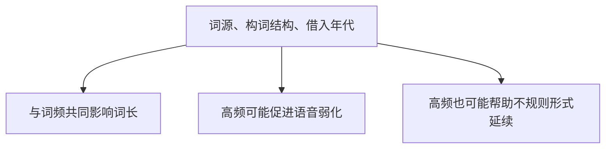
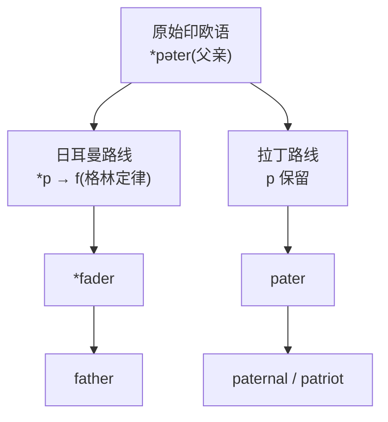

# 第 20 章 为什么最常用的词最短:日耳曼词的特性

> 英语里最忙的一批词往往最短。它们没有拉丁长袍,也不戴希腊学术帽,每天只穿着 `go`、`come`、`eat` 这样的工装到处跑。

欢迎来到第 4 卷——**日耳曼之骨**。

前两卷我们讲的是"楼上的人":拉丁撑起了学术词,希腊点亮了科学词,一个个披袍戴冠,体面得很。这一卷我们下到**最底层**,去看那些光脚、穿粗布、手上沾着泥土的词——古英语(日耳曼语)留下的日常骨架。

先给你一个画面,作为整卷的入场券。

公元 5 世纪,不列颠岛某处一座茅草屋。天还没亮透,一个盎格鲁农民睁开眼。他 **wake**(醒来),**get up**(下床),摸黑穿上衣服,推门走出 **house**(房子)。屋里一口粗粮,**eat**(吃)几口 **bread**(面包),再 **drink**(喝)一瓢 **water**(水)。然后他扛着锄头去 **field**(田里)**work**(干活),抬头 **see**(看)一眼天色——云压得低,怕是要变天。傍晚收工,他走回 **home**(家),蹲在灶前生一堆 **fire**(火),最后蜷进草堆 **sleep**(睡觉)。

wake、get、up、house、eat、bread、drink、water、field、work、see、home、fire、sleep。

数一数:**全是日耳曼词,几乎全是单音节,几乎全是不规则的**。一个 5 世纪农民从早到晚的一整天,就是一场日耳曼词的活化石展览。他没读过书,更不懂语言学,可他嘴里蹦出的每一个词,今天那个坐在曼哈顿写字楼里写 PPT 的白领,照样天天在说。

> **金句**:你说出的 `water`、`house`、`good`,和 5 世纪盎格鲁农民说的是**几乎同一个词**。一千五百年过去,拉丁词换了一茬又一茬,希腊词生了又灭,只有这群短小、粗糙、不爱出风头的日耳曼词,赖在英语里最核心的位置上,谁也请不走。

这就是这一卷要讲的故事——**你天天在用、却从没翻过杯底看产地的那些词**。

这一卷的定位和前两卷不同:

| | 第 2、3 卷(拉丁、希腊) | 第 4 卷(日耳曼) |
| ------ | ------ | ------ |
| 词的特点 | 词难、词长,拆词红利大 | 大量短而高频的核心词,也有复杂派生 |
| 学习方式 | 学词根 = 拆难词 | 学词源 = 听故事 |

日常词的起源故事同样有意思:它们熟悉得像家里的杯子,以至于很少有人翻过杯底看产地。前两卷教你"拆词",这一卷请你**听故事**——一群你以为自己早就认识、其实从未真正认识的词。这一章先讲日耳曼词的**特性**,后面两章再看具体故事。

---

## 20.1 一个常见倾向:高频词往往较短

随便挑一份英语高频词表,你都会发现一件怪事:**排在前面的词,短得离谱**。具体排名会随语料库变化,但短词扎堆的趋势很稳定:

> **一份英语高频词表示意**
>
> the, of, and, a, to, in, is, you, that, it, he, was, for, on, are, as, with, his, they, I, at, be, this, have, from, or, one, had, by, word
>
> 几乎都是单音节,拼写多为 1-5 个字母;多数来自古英语,`they` 来自古诺尔斯语。

具体排名会随语料库、分词方法和书面/口语类型变化,这张表只展示总体倾向,不代表固定不变的"英语前 30"。

这可不是巧合,而是一种跨语言都能观察到的**统计倾向**:

> **高频词平均更短,也更容易保留不规则形式;但词频、词长和历史稳定性之间不是单向因果。**

| 词频 | 词长 | 稳定性 |
| ------ | ------ | ------ |
| 高频词 | 平均较短 | 常保留核心形式,也可能强烈弱化 |
| 低频词 | 平均较长 | 可能消失、被替换或保持旧形 |
| 个别词 | 可偏离趋势 | 需结合具体历史判断 |

### 为什么频繁用 = 短

答案藏在语言使用的**经济原则(principle of economy)**里——说白了就是:**人嘴懒**。

一个词一天被说一万遍,自然会被磨短。想想一枚硬币:刚出厂时棱角分明,花纹精致;可它在市面上流通了五十年,从这只手到那只手,从这只口袋到那只口袋——磨来磨去,就薄了、光秃了、字也糊了。词也一样。`go` 比 `proceed` /prəˈsid/ 短,不是因为 `go` "低级",而是因为高频词被无数张嘴巴优化了上千年——能省的音节早被省掉,能糊的元音早被糊掉,最后只剩下最硬的那个核。

> **沟通效率会使高频意义倾向于由较短形式表达;高频使用也可能促进语音弱化。**

但这里有个关键的反例,得说清楚,免得你把"经济原则"当成万能公式。`house` 并不是从一个已知长形态因高频而缩短成今天的样子;古英语 *hūs* **本来就很短**,一个音节,从落地那天起就没胖过。`house` 与 `residence` /ˈrɛzɪdəns/ 的长度差异同时涉及不同语言来源、借入时期和构词结构,不能只用频率解释——就像你不能说一个农民"矮",是因为他天天干体力活;他生下来就这个身高,职业只是没让他再长高而已。

### 为什么短 = 稳定

短,还往往意味着**老**——而老,往往意味着**稳**。

那群短小的高频词,从 5 世纪活到了今天,音变了几轮、词义漂了几次,却始终没被替换。它们像一条干了几百年没改道的老河:水还在流,河床还是那张河床。但要注意——"稳定"不是"凝固不变"。古英语 *hūs* 与现代 `house` 有清楚的连续关系,可发音早就变了;低频词也并非必然更易变化。稳定,指的是**核心形态连续传承**,不是"原地冻住"。

| 类型 | 古英语 | 现代英语 | 说明 |
| ------ | ------ | ------ | ------ |
| 高频词(稳定) | `hūs` | `house` | 词形连续,发音已变化 |
| 高频词(稳定) | `wæter` | `water` | 词形连续,方言发音多样 |
| 高频词(稳定) | `gōd` | `good` | 词形连续,元音已变化 |
| 低频词(易变) | — | — | 很多低频词已经消失或被借词取代 |

> **提示** **学习启示**:这一卷讲的日耳曼词,虽然你已经会了,但它们的**古老和稳定**本身就是奇迹。你今天随口说出的 `water`、`house`、`good`,和那个 5 世纪农民蹲在灶前、走出茅屋、夸一句好天气时说的是**几乎同一个词**。一千五百年的战乱、瘟疫、王权更替,没能把它们换掉——它们短、它们硬、它们懒得改名。

---

## 20.2 日耳曼词的三大特征

日耳曼词除了"短",还有三个鲜明特征。

### 特征 1:核心词中自由词根很多

还记得那个农民吗?他嘴里蹦出的词有个共同点:**每一个都是独立、完整、能单独站着的词**。`house` 不需要配缀就能用,`water` 不需要前缀就能活——它们是"自由词根"。这也是为什么日耳曼核心词那么好学:你不用先背一堆零件,词本身就是零件。英语的日耳曼核心词里有很多自由词根,如 `house`、`water`、`hand`;同时英语也保留并继续使用 `un-`、`-ness`、`-less`、`-hood` 等日耳曼词缀。

> **日耳曼自由词根**
>
> `house`, `water`, `eat`, `sleep`, `run`, `walk`, `make`, `take`, `give`, `get`, `big`, `small`, `hand`, `foot`, `eye`, `ear`, `heart`
>
> 每一个都是独立单词,不需要配缀。

### 特征 2:常有不规则变化

自由词根够硬核了,但日耳曼词还有一招更让人头大的——不规则变化。如果说特征 1 是"不用拼装就能上岗",特征 2 就是"上了岗还不按规矩来"。

这是日耳曼词最让学习者头疼,也最有故事的特征。

`go-went-gone`、`child-children`、`tooth-teeth`……英语里这群"不讲规则"的家伙,怎么看都是 bug。但它们不是 bug,是 **feature** /ˈfitʃər/。准确说,它们是**古英语屈折变化的化石**——被时光封进了一块叫"高频"的琥珀,千年不腐。古英语本来有一整套动词变位、名词变格的规矩,后来大部分都被磨平了,只剩下最常说的那批词,因为天天用、代代练,反而把古老的形态硬撑到了今天。

现代英语大部分动词加 `-ed`(`walked` /wɔkt/、`talked` /tɔkt/)——这批"乖孩子"其实是**新入行的**,从古英语后期到中古英语才陆续归化到 `-ed` 队伍里。而那些坚持 `sing-sang-sung`、`drink-drank-drunk` 的,是**元老院**:资历最老、地位最稳、规矩最多,谁也别想让他们换制服。

| 类别 | 变化形式 | 来源 |
| ------ | ------ | ------ |
| 动词 | sing – sang – sung | 古英语"元音交替"变位 |
| 动词 | drink – drank – drunk | 古英语元音交替 |
| 动词 | swim – swam – swum | 古英语元音交替 |
| 动词 | drive – drove – driven | 古英语元音交替 |
| 动词 | speak – spoke – spoken | 古英语元音交替 |
| 动词 | write – wrote – written | 古英语元音交替 |
| 动词 | go – went – gone | 更复杂,`went` 来自另一动词 wend /wɛnd/ |
| 名词复数 | child – children | 古英语 `-ren` 复数后缀 |
| 名词复数 | ox – oxen /ˈɑksən/ | 古英语 `-en` 复数后缀 |
| 名词复数 | foot – feet | 古英语元音交替 |
| 名词复数 | tooth – teeth | 古英语元音交替 |
| 名词复数 | man – men | 古英语元音交替 |

> **提示** **为什么高频动词才不规则?** 因为它们**用得太频繁,古英语的变化方式被反复练习,代代相传保留下来**。低频动词反而被规则化(都加 -ed)。这是一个反直觉的现象:**不规则,反而是高频的勋章**——越乱越说明资历深,越乱越说明被说得久。元老院里,从不缺脾气怪的老头。

### 特征 3:自由词根与本族词缀并存

别误以为日耳曼词都是"光杆司令"。不少日耳曼核心词本身就是自由词根,但它们照样能通过复合和本族词缀继续构词——`un-kind-ness` 一样拆得开,只是拆出来的零件是日耳曼的、能独立站着的零件。它与许多拉丁黏着词根的差异是程度上的,不是"有词缀/无词缀"的绝对二分:

| | 日耳曼 | 拉丁 |
| ------ | ------ | ------ |
| 整词 | un-kind-ness | re-cogn-ition(认知) |
| 拆解 | `un-`(否定)+ `kind`(自由词根)+ `-ness`(名词后缀) | `re`(前缀)+ `cogn`(词根)+ `ition`(后缀) |
| 特点 | 三块拼成 | 三块拼成 |

> **提示** 第 4 卷既关注自由词根的整体历史,也关注复合词、元音交替和本族词缀,不能把日耳曼词统一当成"无可拆"。

---

## 20.3 一个关键的认知:日耳曼词和拉丁词的"亲缘对"

我们在第 1 章讲过原始印欧语和格林定律。这里我们要把这个认知具体化——**很多日耳曼词和拉丁词其实是亲戚,只是走了不同的演变路线**。

先看一个最有戏剧性的画面。同一个意思——"父亲的"——在英语里有两个词:`father`(父亲)和 `paternal` /pəˈtɝnəl/(父亲的)。一个短、一个长;一个亲切、一个正式;一个农民说、一个贵族说。这背后是两个阶级、两次征服的故事。*(传说)* 想象同一个下午:田里的农民蹲在垄沟边,被太阳晒得眯起眼,冲自家孩子喊一声 "go to your **father**";而在几里外的石头城堡里,他的诺曼领主正用鹅毛笔签一份文书,落款写着 "my **paternal** estate"。一个泥腿子,一个穿袍子,说的是同一个意思——可那两个词,一个走的是日耳曼土路,一个坐的是拉丁马车,五百多年前就分了家。

这样的"成对词"在英语里有一长串,每一对背后都藏着同一条分裂的血脉:

| 意思 | 日耳曼(英语本土) | 拉丁(借词) |
| ------ | ------ | ------ |
| 父亲 | `father` | `paternal` |
| 心脏 | `heart` | `cordial` /ˈkɔrdʒəl/ |
| 牙齿 | `tooth` | `dental` /ˈdɛntəl/ |
| 三 | `three` | `triple` /ˈtrɪpəl/ |
| 角 | `horn` | `cornucopia` /ˌkɔrnəˈkoʊpiə/ |
| 脚 | `foot` | `pedal` /ˈpɛdəl/ |
| 夜 | `night` | `nocturnal` /nɑkˈtɝnəl/ |
| 新 | `new` | `novel` /ˈnɑvəl/ |

### 格林定律的再次登场

这些"成对词"为什么会一短一长、一 f 一 p?根子就在第 1 章那张神秘的对照表上——**格林定律(Grimm's Law)**。

原始印欧语的 *p / *t / *k,走拉丁路线原样保留(p、t、c),走日耳曼路线却被"偷偷换成了 f、th、h"。所以同源的 `father` 和 `pater`,一个开口说 f,一个闭口说 p——它们是亲兄弟,只是一个在 5 世纪前就改了姓,一个死守着祖姓到今天。

这里有个反差感极强的花絮。雅各布·格林——就是和弟弟威廉合编《格林童话》的那位——白天在书桌前推演这条冰冷的音变定律,把原始印欧语的辅音一个个钉死在坐标轴上;晚上却钻进黑森林边的村庄,采录灰姑娘、白雪公主、会说话的狼。一个写音变定律的语言学家,同时是世界最著名的童话采集人——这种"白天写铁律、晚上听鬼故事"的割裂,本身就是个值得记的故事。也许正因为如此,他比谁都明白:**语言和童话一样,都是老百姓嘴里活下来的东西。**

> **提示** **学习启示**:只有在语音对应和历史记录支持时,才能判定同源。意义相近、一个短一个长并不足以证明亲缘关系。

---

## 20.4 日耳曼词的"隐藏家族"

日耳曼词不靠"前缀+词根"派生,常常被当成没家族的孤词。可它们其实**有家族**——只不过认亲的信物不是前缀,而是**换元音**和**换辅音**。

还记得特征 2 那群"元老院"吗?同一个根,靠着把中间那个元音换来换去,就能既当动词、又当名词、还分时态。这种把元音当"调音旋钮"使的本事,叫**元音交替(ablaut)**——日耳曼词最古老、也最隐蔽的家族密码。

### 元音交替家族

| 词形 | 含义 | 元音 | 语法功能 |
| ------ | ------ | ------ | ------ |
| `sing` | 唱 | -i- | 现在时 |
| `sang` | 唱过 | -a- | 过去时 |
| `sung` | 唱过的 | -u- | 过去分词 |
| `song` | 歌 | -o- | 名词 |

四个词,一个根,通过元音变化分工。唱、唱过、唱过的、歌——全家人长着同一张脸,只是换个表情就换了身份。这就是日耳曼词的"换装术":不动骨头,只换皮。

### 同根派生

日耳曼词还通过加**日耳曼后缀**派生新词——这回不是换元音,而是给词根"戴帽子":`-th` 戴上变抽象名词,`-hood` 戴上变"……的状态",`-ship` 戴上变"……的关系"。

| 后缀 | 功能 | 词根 | 派生词 |
| ------ | ------ | ------ | ------ |
| `-th` | 抽象名词 | `wide` /waɪd/ | `width` /wɪdθ/(宽度) |
| `-th` | 抽象名词 | `broad` | `breadth` /brɛdθ/(广度) |
| `-th` | 抽象名词 | `deep` | `depth` /dɛpθ/(深度) |
| `-th` | 抽象名词 | `grow` /ɡroʊ/ | `growth`(生长) |
| `-th` | 抽象名词 | `true` | `truth`(真理) |
| `-th` | 抽象名词 | `strong` | `strength` /strɛŋkθ/(强度) |
| `-hood` | 状态、时期 | `child` | `childhood` /ˈtʃaɪldˌhʊd/(童年) |
| `-hood` | 状态、时期 | `brother` | `brotherhood` /ˈbrʌðɚˌhʊd/(兄弟情) |
| `-hood` | 状态、时期 | `mother` | `motherhood` /ˈmʌðɚˌhʊd/(母亲身份) |
| `-hood` | 状态、时期 | `knight` /naɪt/ | `knighthood` /ˈnaɪtˌhʊd/(骑士身份) |
| `-ship` | 关系、状态 | `friend` | `friendship` /ˈfrɛndʃɪp/(友谊) |
| `-ship` | 关系、状态 | `member` | `membership` /ˈmɛmbərˌʃɪp/(会员身份) |
| `-ship` | 关系、状态 | `citizen` /ˈsɪtəzən/ | `citizenship` /ˈsɪtəzənˌʃɪp/(公民身份) |

> **提示** **注意**:不同后缀的能产性不同。`-th` 现代能产性较低,但 `-ness`、`-less`、`-ful`、`-ish`、`-er` 等日耳曼来源后缀仍能参与新词构造。不能把日耳曼词族整体称为"封闭家族"。

---

## 20.5 日耳曼词的"双词汇层"预告

日耳曼词最戏剧性的命运,发生在 **1066 年诺曼征服**之后。法语(拉丁后裔)涌入英语,在每一个常见意思上都跟日耳曼词"撞"了一下——结果英语常常**两个都收**:一个短的本族词,一个长的外来词,挤在同一个意思里过日子。下面这些成对词,左边的农民说,右边的领主说:

| 日耳曼(本土,口语) | 拉丁/法语(借入,书面) |
| ------ | ------ |
| `ask` | `inquire` /ɪnˈkwaɪr/ |
| `buy` | `purchase` /ˈpɜrtʃəs/ |
| `begin` | `commence` /kəˈmɛns/ |
| `kingly` /ˈkɪŋli/ | `royal` /ˈrɔɪəl/ / `regal` /ˈriɡəl/ |
| `hearty` /ˈhɑrti/ | `cordial` /ˈkɔrdʒəl/ |
| `freedom` /ˈfridəm/ | `liberty` /ˈlɪbərˌti/ |

特点:日耳曼词短、亲切,像在自家灶台边说话;拉丁/法语词长、正式,像穿着礼服念稿子。同一个意思,穿什么衣服,取决于你站在田埂上还是站在法庭里。

这个现象我们会在**第 5 卷「法语之饰」**详细讲。这里先建立认知:英语有不少来源不同、意义相近但语体或搭配不同的词,并不是每个短词都有一一对应的长词——有些短词穷其一生也没等到一个"贵亲戚"。

---

## 20.6 本章小结

1. **高频词平均较短是一种统计倾向**——就像流通久了的硬币会变薄,词被嘴巴磨了几千年也会变短;但这是概率,不是铁律,`house` 本来就短,不是被磨短的。
2. **日耳曼核心词常见自由词根和不规则变化**——那些让你头疼的 `go-went-gone`、`sing-sang-sung`,不是 bug,是被高频保鲜了一千五百年的古英语化石,是元老院里资历最深的那批老头。
3. **日耳曼词和拉丁词是亲缘对**——`father/paternal`、`heart/cordial`、`tooth/dental` 都来自原始印欧语,因为格林定律分了家:一个换成了 f,一个守着 p;一个农民说,一个领主说。

### 一个最重要的认知

> **第 4 卷不教拆词,教"日常词的起源故事"。** 那个 5 世纪农民从早到晚说的 `wake`、`eat`、`drink`、`work`、`home`、`fire`、`sleep`——你已经会用了,但听过它们的故事后,你会以全新的眼光看待。它们短,是因为被说了太久;它们不规则,是因为太老;它们和拉丁词成对,是因为分家太早。每一个不起眼的短词背后,都藏着一部偷渡进英语的活历史。

---

### 【思考题】(答案见附录 A)

1. 为什么高频词平均更短?为什么这只能称为统计倾向,不能称为铁律?
2. 为什么 `go-went-gone`、`sing-sang-sung` 这些不规则动词**反而最稳定**?(提示:被高频"保鲜"的化石)
3. `father` 和 `paternal` /pəˈtɜrnəl/ 是亲缘对,用格林定律解释它们为什么一个以 f 开头、一个以 p 开头。

---

*下一章 → [第 21 章 维京人留下的词:they / sky / egg](./第21章-维京人留下的词.md)*
