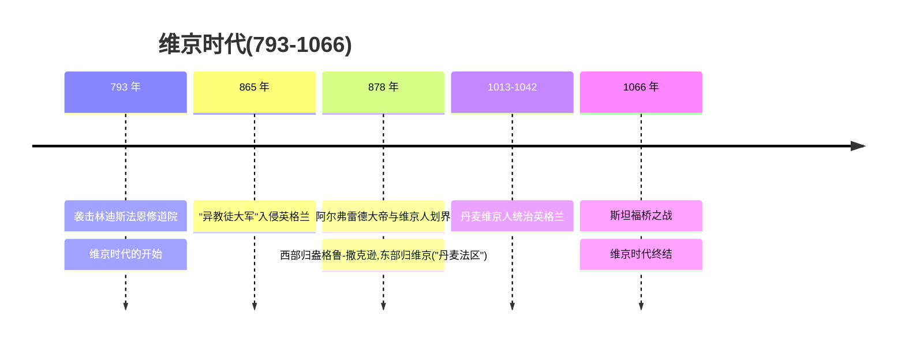
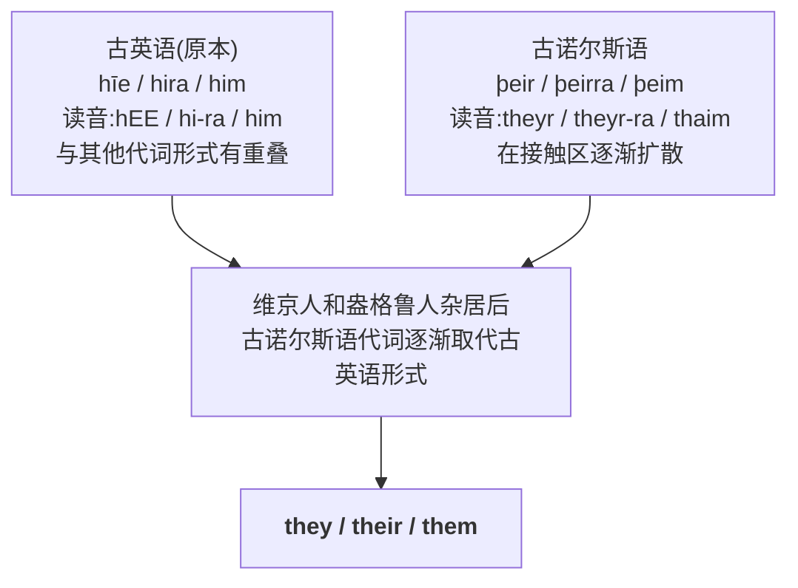
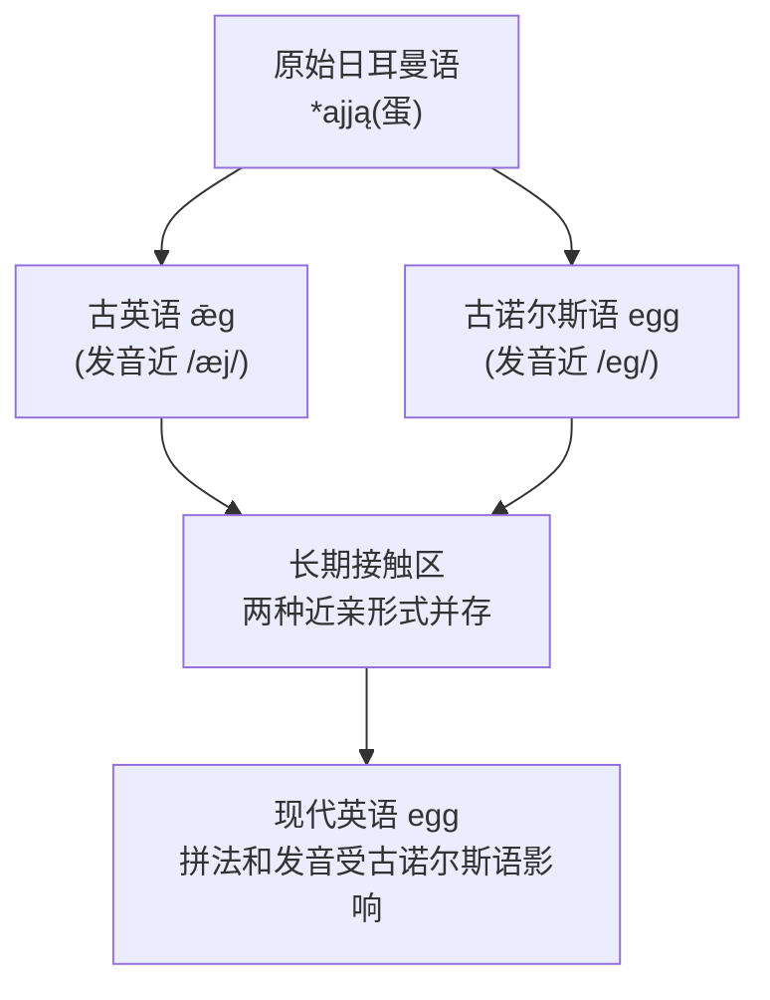

# 第 21 章 维京人留下的词：they, sky, egg

> 维京人留下的不只有长船传说,还有 `they`、`sky`、`take` 这样的日常词。英语把这些借词用得太自然,连海关章都快磨没了。

第 20 章讲了日耳曼词的特性。这一章讲日耳曼词里**最特别的一群**——不是盎格鲁-撒克逊人带来的,而是**维京人带来的**。这些词长得像英语本土词,混在队伍里几乎查不出户口:`they`、`sky`、`take`……一个个全是高频词,一个个全是"外来户"。还有 `egg`、`give` 这种更刁的——古英语本来就有同源形式,但古诺尔斯语的版本硬是挤了进来,到底是"整词替换"还是"同源融合",语言学家吵到现在还没吵完。

这一章要回答一个问题:**古诺尔斯语怎样在长期接触中,把词塞进了英语最日常、最高频的那一层?** 答案不是维京人发过一本官方词表——他们忙着抢劫和定居,没空搞语言规划。真正的答案藏在两群人长达两百多年的同居生活里。

---

## 21.1 维京人是谁

### 793 年,世界末日开场了

公元 793 年 6 月 8 日,英格兰东北海岸一座叫**林迪斯法恩(Lindisfarne)**的小岛上,修士们正按部就班地祈祷。这座修道院是不列颠基督教的圣岛,藏着精美的福音书,藏着一群与世无争的修士——按当时的理解,这里离上帝很近,离世俗的刀剑很远。

然后,地平线上冒出了龙头船。

维京长船的船首雕着狰狞的兽头,修士们远远看见,以为是**世界末日到了**。这不是修辞,是真有人这么写。《盎格鲁-撒克逊编年史》记下了这一笔。远在大陆的学者**阿尔昆(Alcuin)**,收到消息后给英格兰写下了一封几乎是控诉的信:

> *"异教徒亵渎了上帝的圣所,鲜血流在祭坛上。"*

一座修道院被洗劫,圣物被抢,修士被杀或被掳走当奴隶。一个时代就此开始——后人把这一天,算作**维京时代(Viking Age)**的开场炮。从 793 年到 1066 年,整整两个半世纪,北欧的龙头船将反复出现在不列颠、爱尔兰、法兰西、乃至北美的海岸线上。

### 他们到底是什么人

通常所说的**维京人(Vikings)**,是指维京时代来自斯堪的纳维亚、参与远航贸易、劫掠、征服或定居的人群。他们是出色的水手、商人和战士——长船(longships)吃水浅、能逆流上河、能横穿大洋,在那个年代几乎是无敌的机动武器。注意:他们没有影视剧里那种"统一的带角头盔形象",那是 19 世纪歌剧的发明;他们也分丹麦、挪威、瑞典好几拨,各有各的去向和打算。

### 维京人在英格兰的定居

9-10 世纪,大批维京人在英格兰北部和东部定居,建立了**"丹麦法区"(Danelaw)** /ˈdeɪnˌlɔ/。在这片区域,维京人和盎格鲁-撒克逊人**长期杂居**——抢完之后留下来种地、通婚、生儿育女,这才是改变语言的关键。

### 中间插播两个丹麦段子:烤糊的蛋糕,和训海的国王

维京人和英格兰的纠葛里,夹着两位必须提的人物。

第一位是**阿尔弗雷德大帝(Alfred the Great)**——盎格鲁-撒克逊人里唯一一个敢在头衔里加 "the Great" 的。878 年,丹麦维京人大举压境,阿尔弗雷德被追得走投无路,带着几个随从躲进了萨默塞特的沼泽。*(传说)* 在最落魄的日子里,他寄身在一户农妇家。农妇不知这位灰头土脸的客人是国王,出门前交代他:"锅里那块蛋糕给我看着,别烤糊了。"阿尔弗雷德呢,满脑子想的是怎么收复国土、怎么重整军队,把蛋糕忘得一干二净。等农妇回来,厨房里飘出一股焦糊味,劈头盖脸把他骂了一顿——堂堂国王,挨了一个农妇的数落。后来他果然翻盘,在埃丁顿之战击退丹麦人,并和他们划定边界:西部归盎格鲁-撒克逊,东部归丹麦人——这就是丹麦法区的由来。

第二位是**克努特(Cnut)**。11 世纪上半叶,丹麦维京人反过来统治了英格兰,克努特更是建起了一个横跨英格兰、丹麦、挪威的"北海帝国"。*(传说)* 有一天,廷臣们把他捧上了天,说他权力无边,连潮水都得听他的。克努特不傻,知道这是捧杀。于是他把椅子搬到海边,海水正在涨潮,他郑重其事地下令:"潮水,不许打湿我的袍子。"潮水当然没理他——海水照涨,袍子照湿。克努特回头对廷臣说:看见了吧?连国王都奈何不了自然,**只有上帝才是真正的王,我这点权力算什么。** 他这一手,本意是打脸拍马屁的廷臣,却让后人误以为他在"自大"。其实是个反讽高手。

### 为什么维京人的词能融入英语

关键在于:**古英语和古诺尔斯语是近亲**。两者都属于日耳曼语族,共享大量词汇和语法结构。一个盎格鲁农民和一个维京定居者相遇,即便语言不完全相同,也可能凭相似词半听半猜;具体能听懂多少,会随时代、地区和说话人而变。几百年的杂居、通婚、做生意,让两门近亲语言你中有我、我中有你。

---

## 21.2 维京人给英语留下了什么

维京人的古诺尔斯语给英语留下了**约 600-900 个词**,外加满地图的地名。这些词有几个鲜明特征:

1. 最醒目的一批是日常高频词(`they`, `sky`, `egg`, `take`)——不是高雅词,不是术语,是你张嘴就来的那种
2. 和古英语本土词"长得像"(因为本来就是近亲,本来就有一大堆同源词)
3. 很多把古英语的对应词挤下了台
4. 很多带着 `sk-` / `-by` / `-thorpe` 的"出生证",一眼就能认出来历

### 最重要的发现:`they` 是维京词

英语里最常用的代词之一 `they`(他们)和它的所有格 `their`、宾格 `them`——**全部来自古诺尔斯语**。

这件事震撼在哪?代词不是普通词。代词是语言里最顽固、最核心、最不轻易换的零件——你天天说,句句说,几乎没有外语能把它撬走。可维京人的代词硬是把古英语的 `hīe / hira / him` 全赶走了。

> **这个发现最动人的地方**:英语最核心的语法零件,居然是借来的。这从侧面说明维京人和盎格鲁-撒克逊人融合得有多深——他们不止交换名词,连**代词这个语法骨架都换了**。一种语言愿意把"他们"这个词让出去,要么是被征服了,要么是大家已经活成了一家人。在英格兰,后者更接近真相。

---

## 21.3 维京词的代表:高频词与一个彩蛋

### 词 1:`sky`(天空)

古英语原本用 `heofon`(今天的 `heaven` /ˈhɛvən/)表示天空。维京人带来的 `sky`(古诺尔斯语 *ský*)原义是"**云**"。也就是说,维京人抬头指的那朵"云",后来在英语里偷偷升职成了整个"天空"。

### 词 2:`egg`(鸡蛋)

古英语有 `ǣg`,古诺尔斯语有近亲形式 *egg*。两个词本来是亲戚——都从同一个日耳曼祖先那里继承了"蛋"的意思,但口音不同。现代 `egg` 的拼法受到古诺尔斯语的强力影响——一个近亲词在长期接触中占了上风。这就好比你家的表兄弟搬进了你家,你俩本来就长得像,住着住着,全家人开始叫你俩同一个名字,而那个名字碰巧是他的。

### 词 3:`give`(给)

古英语 *giefan* 与古诺尔斯语 *gefa* 是近亲。现代 `give` 的辅音形式受到古诺尔斯语影响。有个有趣细节:现代英语 `give` 的硬 g(发 /ɡ/ 而不是 /j/)正是维京人留下的指纹。古英语的 g 在某些位置会发软软的 /j/ 音,但维京人的 g 一直是硬 /ɡ/——你今天说 `give` 那一嗓子硬朗的 g,其实是斯堪的纳维亚口音。

### 词 4:`take`(拿)

古英语原本用 `niman` 表示"拿、取"(`niman` 后来在 `nimble` /ˈnɪmbəl/ 敏捷的、`benumb` 使麻木里留下痕迹)。维京人的 `taka` 硬生生把它顶替了,变成今天的 `take`。`take` 是个特别"狠"的词——它干掉了本土词,自己却谦逊得几乎察觉不到来历,蹲在每一个英语句子最不起眼的位置上。

### 词 5:`window`(窗户)

这个词的来历最浪漫。古诺尔斯语 *vindauga* 由 `vind`(风)+ `auga`(眼)= **"风眼"**。

> **window = 风眼**
>
> "风"与"眼"组成一个开口意象:`vind`(风)+ `auga`(眼)= `vind-auga`——一个让风和光钻进屋子的开口。北欧的冬天又冷又长,屋子里烧着火,屋顶或墙上必须留个洞排烟透气。维京人管这个洞叫"风眼"——名字朴素得像一首小诗。

### 词 6:`husband`(丈夫)

`husband` 来自古诺尔斯语 *húsbóndi*:`hús`(房子)+ *bóndi*(居住者、主人)= **"房子的主人"**。一个住在自家房子里的男主人,就是 husband。后来这个词义慢慢收窄,从"家主"专化成了"丈夫"。

顺带一提,`husbandry` /ˈhʌzbəndri/ 这个词曾泛指家庭或产业的经营管理,后来才偏向农业和畜牧。所以 `animal husbandry` 是"动物饲养与管理",不是"给动物当丈夫"——虽然有时候养牛养羊确实像伺候老婆。

### 词 7:`law`(法律)

`law` 来自古诺尔斯语 *lagu*——字面是"**被放置的东西**",和 `lay` /leɪ/(放置)同根。维京人的法律传统其实相当发达:他们有议会(thing)、有判例、有调解程序。`law` 把古英语的 *ǣ* 顶替了,成了今天英语法理的根词。法律是"放置好的东西"——这个隐喻有意思:规则不是天上掉下来的,是有人**把它摆在那儿**的。

---

### 词 8:`berserk` /bərˈsɜrk/(狂暴的)——附赠一个维京彩蛋

`berserk` 来自古诺尔斯语 `ber-serkr`:`ber`(熊)+ `serkr`(衫)= **"熊皮衫"**。这不是普通的保暖外套。*(传说)* 维京人里有这么一类叫 *berserker* 的战士,开打前先披上熊皮,跳一段战舞,进入一种叫 **berserkergang**(狂化状态)的 trance——据说刀枪不入、不知疼痛,把自己当成熊,见人就撕。这个状态过去之后人会瘫软半天。"berserk" 后来从"穿熊皮的疯战士"演变成今天"发狂、失控"的通用义。下次你说某个人 go berserk,其实是在引用一段千年前的北欧战场传说。

> **提示** `ber-serkr` 里的 `ber` 也有学者解释为"裸"(bare),即"不穿铠甲上阵"的战士,而非"穿熊皮"。两种说法并存,目前尚无定论。

---

## 21.4 维京词的"识别标志"

很多维京词带着明显的**拼写胎记**,你一眼就能看出它们不是本地人:

1. **硬 `sk-` 开头(sk 而不是 sh)**
   古英语的 sk 在中部英语变成了软软的 `sh`(`ship`, `shall`),但维京词的 sk 死活不改,硬邦邦地留了下来:
   `sky`(天空)、`skin` /skɪn/(皮肤)、`skull` /skʌl/(头骨)、`ski` /ski/(滑雪)、`skirt` /skɜrt/(裙子)、`skill` /skɪl/(技能)——你只要听到这股硬 sk 音,基本可以断定它来自斯堪的纳维亚。

2. **`-by` 结尾的地名(=村镇)**
   `Derby` /ˈdɜrbi/(德比)、`Grimsby`、`Whitby` /ˈwɪtbi/(这些地方都曾是维京人定居的村镇)

3. **`-thorpe` 结尾的地名(=村子、小村)**
   `Scunthorpe`、`Mablethorpe`

4. **`-thwaite` 结尾的地名(=林地、空地)**
   `Applethwaite`、`Braithwaite` /ˈbreɪθˌweɪt/

### 地名是维京人留下的最持久痕迹

英格兰北部和东部的**地图**,至今布满维京地名。一千多年过去了,人换了、语言换了、王朝换了,只有地名像石头一样钉在原地:

| 区域 | 地名后缀 | 代表地名 |
| ---- | ------ | ------ |
| 苏格兰边界 | — | (分界线) |
| 维京定居区 | `-by` 结尾 | Derby, Grimsby |
| 维京定居区 | `-thorpe` | Scunthorpe |
| 维京定居区 | `-thwaite` | 各处 |
| 维京定居区 | `-toft` | Lowestoft |
| 中部、南部(盎格鲁-撒克逊) | `-ton`、`-ham`、`-bury` 结尾 | — |

> 你看一眼英格兰地图就能圈出维京人当年的地盘:东北部 `-by`、`-thorpe` 密集的地方,就是 9-10 世纪丹麦法区的核心区。一千年前的定居者早就化为尘土,可他们给村子起的名字,今天还在高速公路指示牌上闪闪发光。

---

## 21.5 维京词的"双词汇层"现象

因为古英语和古诺尔斯语是近亲,它们经常有**意思几乎一样、拼写略不同**的对应词——就像一家子兄弟,长得像但不是同一个人。维京词进入英语后,常常和古英语本土词**共存**,各自占一块地盘,谁也没消灭谁:

| 古英语 | 古诺尔斯语 | 今天英语同时保留 |
| ------ | ------ | ------ |
| `craft` /kræft/ | `skill` /skɪl/ | 工艺 / 技能 |
| `from` | `fro` /froʊ/ | `from`(常用)/ `fro`(只在 to and fro) |
| `sick` /sɪk/ | `ill` /ɪl/ | 生病的(美式常用 `sick`)/ `ill`(英式) |
| `rear` /rɪr/ | `raise` /reɪz/ | 抚养 / 抬起 |

你看,英语在同一个意思上经常留两套词,这正是近亲语言长期同居的副产品。`craft` 和 `skill` 都活着,`from` 和 `fro` 都活着,只是后来各管一块田。

---

## 21.6 一个总览:维京词清单

> 估计数量因统计口径而异;其中一部分进入高频核心词汇。

| 类别 | 词 |
| ---- | ------ |
| 代词 / 语法 | `they`, `their`, `them`, `both`, `same`, `though` |
| 自然界 | `sky`, `wind`(影响), `fog` /fɑɡ/(可能) |
| 身体 | `skin` /skɪn/, `skull` /skʌl/, `leg` |
| 动作 | `give`, `take`, `get`, `call`, `want`, `die` |
| 日常物 | `egg`, `knife` /naɪf/(可能), `window`, `husband`, `kid` /kɪd/ |
| 法律社会 | `law`, `wrong`, `outlaw` /ˈaʊtˌlɔ/ |
| 形容词 | `happy`, `ugly` /ˈʌɡli/, `loose` /lus/, `low`, `meek` /mik/, `odd`, `rotten` /ˈrɑtən/, `weak` /wik/ |

---

## 21.7 史实与传说

- **古英语和古诺尔斯语不是"同一种话换个口音"**。两者确实是近亲,但"近亲"和"双胞胎"差得远。长期同居、通婚才是造成深层语言融合的原因——别想象成两个人见面就能无障碍聊天,更像是住久了慢慢听懂了。
- **不是所有"维京词"都是入侵式替换**。`they`、`sky` 确实是古诺尔斯语空降兵;但 `give`、`egg` 更像是近亲表兄弟住在一起,慢慢用成了一个人的名字——融合多于接管。
- **克努特训海和阿尔弗雷德烤糊蛋糕都是传说**——好故事,但没有同时代史料背书。克努特本人大概没想到,一千年后自己最出名的事迹是在海边被浪打湿了裤脚。

---

## 21.8 本章小结

1. **古诺尔斯语给英语留下数百词及大量地名**——有些是明确的整词替换,有些是与古英语近亲形式融合或受其影响。维京人没发过词表,是两群人长期同居让词汇自然渗透。
2. **`they/their/them` 是借词**——连英语最核心的代词都被替换了。一种语言肯把"他们"让出去,要么是被征服,要么是大家活成了一家人。在英格兰,后者更接近真相。
3. **英格兰地名是维京人的持久痕迹**——-by、-thorpe、-thwaite 地名密集区,就是当年的丹麦法区。一千年前的定居者化为尘土,他们起的地名还在路牌上闪闪发光。

### 一个最动人的认知

> **window = 风眼(vind-auga)**——北欧的冬天,屋里烧着火,必须有个洞让风和光进来。维京人管这个洞叫"风眼"。今天你推开一扇窗,推开的其实是一千年前斯堪的纳维亚人留下的一个朴素意象。

---

### 【思考题】(答案见附录 A)

1. **(破除误解)** `window` 字面是"风眼"(vind-auga);为什么不能仅凭这个构造断言它"最初一定是屋顶排烟孔"?字面到底告诉了你什么、没告诉你什么?
2. **(讲证据)** 为什么 `they/their/them` 这种最核心的代词也能被借进英语?回答时应考虑哪些语言接触因素?"古诺尔斯代词更清晰"能不能算已证实的原因?
3. **(迁移应用)** 本章说维京借词常保留硬 `sk-`,古英语同源词却腭化成 `sh-`。据此判断-`skirt` 和 `shirt` 这对"双胞胎",哪个是维京借词、哪个是本土词?你还能用哪些线索识别一个词可能来自古诺尔斯语?

---

*下一章 → [第 22 章 日耳曼词根速查：日常词的起源](./第22章-日耳曼词根速查：日常词的起源.md)*
