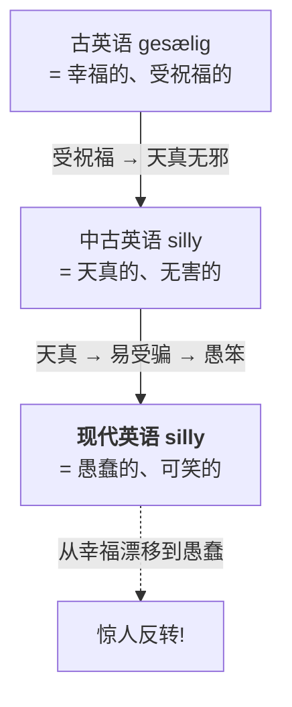
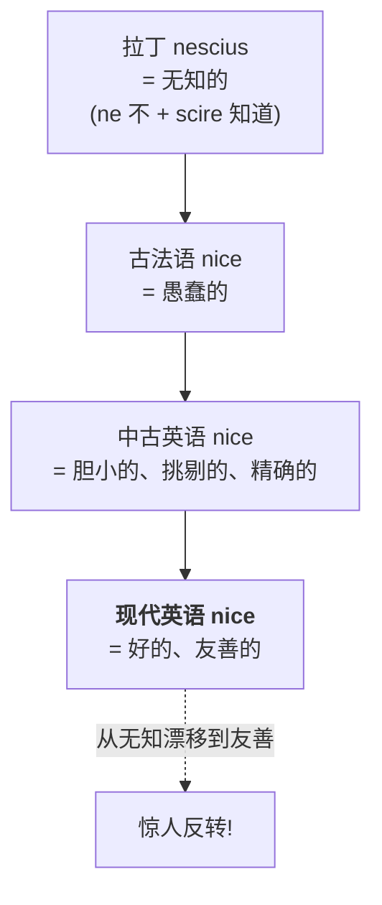
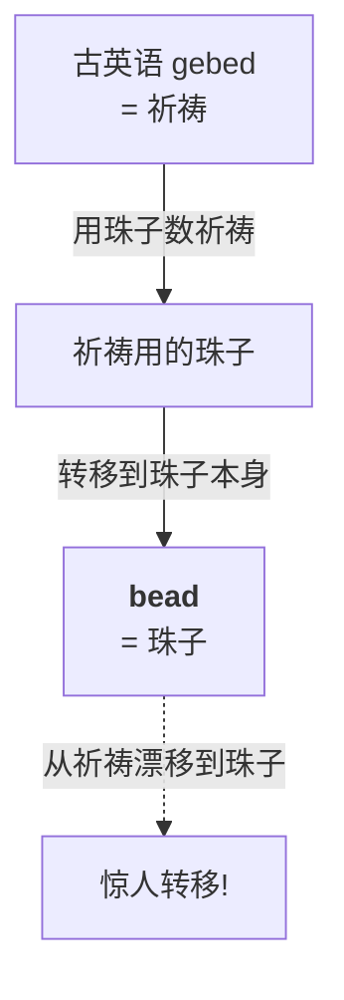
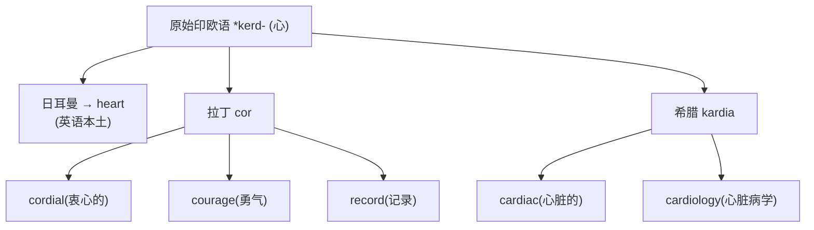
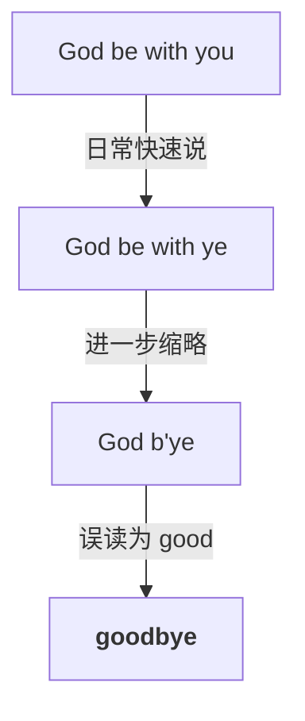

# 第 22 章 日耳曼词根速查：日常词的起源

> 日常词最会伪装:你每天见它几十次,它却从不主动交代自己一千年前叫什么。今天请 `woman`、`silly` /ˈsɪli/、`nice` 和 `bead` /bid/ 依次接受词源问询。

第 21 章讲了古诺尔斯语影响。这一章以古英语日常词为主,也穿插少量后来进入日常层的借词作比较。重点不是"这些词是什么意思",而是它们怎样变成今天的样子。

这些词太常用,常用到你以为它们"出厂就是这样"。其实每一个都带着一份改过很多次的历史档案:

1. 为什么 `woman` 叫 woman?
2. 为什么 `wife` 不再只是"妻子"?
3. 为什么 `silly` 曾经是"幸福的"?
4. 为什么 `nice` 曾经是"无知的"?
5. 为什么 `bead`(珠子)曾经是"祈祷"?

---

## 22.1 五个日常词的惊人起源

### 词 1:`woman`(女人)—— wife + man

**起源故事**:

`woman` 的历史构造大致是"**女性的人**",不是"某个男人的妻子"。现代英语不能按 `wo + man` 现场拆词;那只是历史留下的接缝。

古英语里,*wīfmon*(或 *wīfmann*)由 *wīf*(妻子、女性)+ *mon*(人)= "女性之人"。经过几百年的发音缩略,变成了今天的 `woman`。

> **注意** **不要误连**:`womb` /wum/(子宫、腹部)来自另一个古英语词 *wamb*,与 `woman` 不同源。相似的现代拼写不能作为同源证据。

### 词 2:`wife`(妻子)—— 曾经泛指"女性"

**起源故事**:

古英语 *wīf* **泛指任何成年女性**——不分已婚未婚。后来词义收窄为"**已婚女性(妻子)**"。

> **提示** **残留痕迹**:`midwife` /ˈmɪdˌwaɪf/(接生婆)、`fishwife`(卖鱼妇)、`old wives' tale`(无稽之谈)——这些词里的 wife **都保留着"女性"的古义**,不是"妻子"。所以 `midwife` 字面是"**with-woman**"(和[产妇]在一起的女人),不是"接生妻子"。

### 词 3:`silly` /ˈsɪli/(愚蠢的)—— 曾经是"幸福的"

**起源故事**:

这是全书**词义漂移最戏剧性**的例子之一。

> **提示** **认知震撼**:一个古英语里**最美好的词**(幸福、受祝福),经过一千年的词义漂移,变成了今天的"愚蠢"。这不是个例——很多词都走过这种"由褒到贬"或"由贬到褒"的路。

### 词 4:`nice`(好的)—— 曾经是"无知的"

**起源故事**:

`nice` 的漂移方向和 silly 相反——**从贬义漂移到褒义**。

> **提示** **为什么 nice 漂移这么厉害**?因为它太常被用作**含糊的褒义词**("That's nice"),用着用着,原来的"挑剔、精确"义就被磨平了,只剩一个模糊的"好"。今天 nice 被批评为**最空洞的形容词**——但它曾经是最具体的词之一(无知的)。

### 词 5:`bead` /bid/(珠子)—— 曾经是"祈祷"

**起源故事**:

古英语 *gebed* 意为"**祈祷**"(今天的 `bid` /bɪd/ 命令、`bede` 祈祷还保留着)。中世纪,基督徒用一串珠子来**数祈祷次数**(念珠,rosary /ˈroʊzəri/)。

> **提示** 这就是为什么"数念珠祈祷"的行为叫 `tell one's beads`——`tell` 本义是"数、计算"(今天银行 teller 出纳员也是同根),所以 tell beads 字面是"数珠子",其实是"用珠子数祈祷"。

---

## 22.2 身体词的起源

五个日常词的故事讲完了,现在翻开更大的相册。先从你自己身上开始——身体词是日耳曼词里**最古老、最稳定**的一批,老到你的 `heart` 跟古罗马人的 `cor` 还是亲戚。

| 词 | 古英语 | 起源故事 |
| ---- | -------- | --------- |
| `heart` | heorte | 来自原始印欧语 *kerd-(心),亲戚:拉丁 cor、希腊 kardia |
| `head` | hēafod | 来自 *kauput-(头),亲戚:拉丁 caput(头)→ capital |
| `foot` | fōt | 来自 *ped-(脚),亲戚:拉丁 ped、希腊 pod |
| `hand` | hand | 来源不明,日耳曼独有 |
| `eye` | ēage | 来自 *okw-(看),亲戚:拉丁 oculus |
| `ear` | ēare | 来自 *ous-(耳),亲戚:拉丁 auris |
| `tooth` | tōþ | 来自 *dent-(齿),亲戚:拉丁 dent、希腊 odont |
| `blood` | blōd | 来自 *bhel-(涌、胀),和 bloom、blow 同根 |

### 一个有趣的发现:heart、cordial /ˈkɔrdʒəl/、cardiac /ˈkɑrdiˌæk/ 三兄弟

> **提示** 这就是为什么英语里"心"有三个词:heart(日常)、cordial(情感的)、cardiac(医学的)。**它们是同一个原始印欧语词根的三条分支**,在 21 世纪的英语里重逢。

---

## 22.3 自然词的起源

身体词查完了,再往窗外看看。水、火、日、月、星、夜——这些词你天天挂在嘴边,却几乎从没想过它们有多老。它们大多能一路追到原始印欧语,是英语词汇里最接近"出厂设置"的一批。

| 词 | 古英语 | 起源故事 |
| ---- | -------- | --------- |
| `water` | wæter | 来自 *wed-(湿),亲戚:拉丁 unda(波浪)、希腊 hydōr(水) |
| `fire` | fȳr | 来自 *paewr-(火),亲戚:希腊 pyr(火)→ pyrotechnics /ˌpaɪrəˈtɛknɪks/ |
| `earth` | eorþe | 来自 *er-(土、地) |
| `sun` | sunne | 来自 *sāwel-(太阳),亲戚:拉丁 sol、希腊 helios |
| `moon` | mōna | 来自 *mēns-(月),和 measure(测量月份)同根 |
| `star` | steorra | 来自 *ster-(星),亲戚:拉丁 stella、希腊 aster |
| `day` | dæg | 来自 *degʷh-(烧、发光,白昼是太阳燃烧) |
| `night` | niht | 来自 *nokwt-(夜),亲戚:拉丁 noct、希腊 nykt |

### water / aqua / hydro:同义不等于全部同源

| 语族 | 词 | 衍生词 |
| ---- | ------ | ------ |
| 日耳曼 | `water` | 英语本土 |
| 拉丁 | `aqua` | aquarium, aquatic |
| 希腊 | `hydro` | hydrogen, hydrophobia |

> `water` 与 *hydōr* 通常追溯到同一 `*wed-`"水、湿"词族;`aqua` 则属于另一个常重建为 `*akwa-` 的词族。

---

## 22.4 几个"隐藏故事"的日常词

### `lord`(主人)—— 曾经是"守面包的人"

古英语 *hlāfweard* = *hlāf*(面包、loaf)+ *weard*(守卫)= **"守面包的人"**。

> **提示** **关联**:`lady`(女士)来自古英语 *hlǣfdīge* = *hlāf*(面包)+ *dīge*(揉面者)= **"揉面包的女人"**。所以 lord 和 lady 字面都是"管面包的人"——面包是古代家庭的核心,管面包就是管家。

### `companion` /kəmˈpænjən/(同伴)—— 这个其实拉丁词,但放这里对比

我们在前言讲过:`companion` = com- + pan(面包)= **和你分面包吃的人**。对照 lord/lady(管面包的),你能看到:古代社会**以面包为中心**的人际关系,凝固在词源里。

### `goodbye`(再见)—— 曾经是"上帝与你同在"

`goodbye` 是 **"God be with ye"**(上帝与你同在)的缩略。

> **提示** **类似词**:`morning` 来自古英语 *morgen/morwen* 一组表示"早晨"的形式;`holiday` /ˈhɑləˌdeɪ/ 来自 `holy day`(神圣的日子)。

---

## 22.5 日耳曼词的"隐藏后缀"

别以为日耳曼词全是光杆司令——它们也带装备,只是藏得深。下面这张表就是它们的后备武器库:

| 后缀 | 作用 | 例子 |
| ------ | ------ | ------ |
| `-th` | 抽象名词 | wide → width, true → truth |
| `-hood` | 状态、时期 | child → childhood, mother → motherhood |
| `-ship` | 关系、身份 | friend → friendship, citizen → citizenship |
| `-dom` | 状态、领域 | king → kingdom, free → freedom |
| `-lock` | 古英语 -lāc:行为、状态或活动 | wedlock /ˈwɛdˌlɑk/(婚姻状态) |
| `-en` | 使变成(动词) | wide → widen, strong → strengthen |
| `-ly` | 像……(形容词)→ ……地(副词) | quick → quickly, friend → friendly |
| `-ness` | 状态、性质 | happy → happiness, dark → darkness |
| `-ful` / `-less` | 充满/没有 | hope → hopeful / hopeless |

> **提示** **-hood 和 -ship 的故事**:
>
> - `-hood` 来自古英语 *-hād* "状态、身份",原本是独立词,意为"等级、地位",后来虚化成后缀。
> - `-ship` 来自古英语 *-scipe* "形状、状态",和 shape(形状)同根。

---

## 22.6 日耳曼词的"成对同义词"预告

我们已经在第 20 章预告过:英语中有不少日耳曼短词和法语、拉丁来源词形成语义相近的词对。它们不是一一对应,也不全由 1066 年这一事件直接造成。

这里先给出对照表,建立认知:

> 左列(日耳曼短词)常较日常,右列(法语/拉丁长词)有些语境较正式。

| 日耳曼(短) | 法语 / 拉丁(长) |
| ------ | ------ |
| `ask` | `inquire` /ɪnˈkwaɪr/ |
| `answer` | `reply` /rɪˈplaɪ/ |
| `buy` | `purchase` /ˈpɜrtʃəs/ |
| `begin` | `commence` /kəˈmɛns/ |
| `end` | `terminate` /ˈtɜrməˌneɪt/ |
| `kingly` /ˈkɪŋli/ | `royal` /ˈrɔɪəl/ / `regal` /ˈriɡəl/ |
| `hearty` /ˈhɑrti/ | `cordial` /ˈkɔrdʒəl/ |
| `freedom` /ˈfridəm/ | `liberty` /ˈlɪbərˌti/ |
| `help` | `aid` /eɪd/ |
| `sweat` | `perspire` /pərˈspaɪr/ |

> **提示** **写作启示**:选择词语要看搭配、精确含义和语境。来源和长度只能提示部分语体倾向,不能用"短词亲切、长词正式"机械替换。

---

## 22.7 本章小结

1. **很多日常词有清楚的语义史**——woman = 女性的人、silly 曾表示幸福;nice 则是后来经法语进入的拉丁来源词。
2. **heart / cordial / cardiac 是三兄弟**——日耳曼/拉丁/希腊三个"心"同根。
3. **lord / lady / companion 都和"面包"有关**——古代社会以面包为中心的人际关系。

### 一个最动人的认知

> **最普通的词,藏着最古老的生活。** `window` 是风眼,`lord` 是守面包的人,`goodbye` 是上帝与你同在——你说出这些词时,其实在与千年前的祖先对话。

---

### 【思考题】(答案见附录 A)

1. `silly` 曾是"幸福的",`nice` 曾是"无知的",今天却没人这么用。有人主张"一个词的词源义/本义才是它真正正确的意思"。用 silly、nice 说明这种主张(所谓"词源谬误")错在哪;那词源的用处到底是什么?
2. `heart` / `cordial` / `cardiac` 是三兄弟,分别来自哪条语言路线?你能从词形上用什么线索判断某个"心"词走的是本族、拉丁还是希腊路?
3. `woman`(wīf+man)、`lord`(hlāf-weard)、`goodbye`(God be with ye)都是"磨损复合词",原零件已看不出来。请还原 `daisy` 和 `midwife` 的本义;并说说:这类词提醒你,拿现代拼写现场拆词(如 wo+man)有什么风险?

---

## 第 4 卷结束语

第 4 卷「日耳曼之骨」到此结束。这一卷你学到的核心:

-  日耳曼词的特性:短、稳定、不规则、自由词根
-  维京人给英语留下的 600-900 个高频词(they、sky、egg)
-  日常词的惊人起源(woman、silly、nice、lord、bead)
-  区分真正的同源词、同义借词和仅仅拼写相似的词

**下一卷,我们进入第 5 卷「法语之饰」**——1066 年诺曼征服如何重塑英语词汇,造成今天"双词汇层"的奇观。

---

*下一卷 → [第 23 章 如何重塑英语词汇：1066年的一件事](../05-法语之饰/第23章-如何重塑英语词汇：1066年的一件事.md)*
