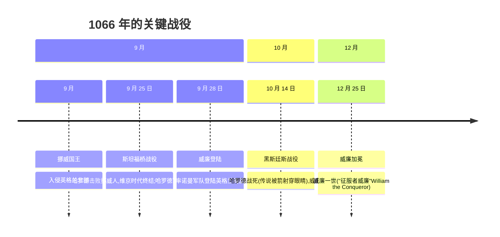
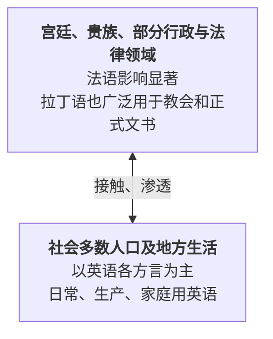
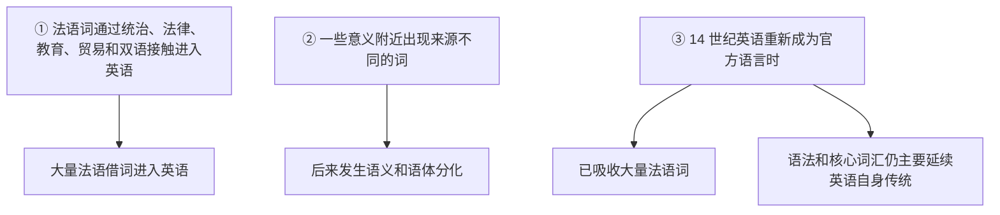
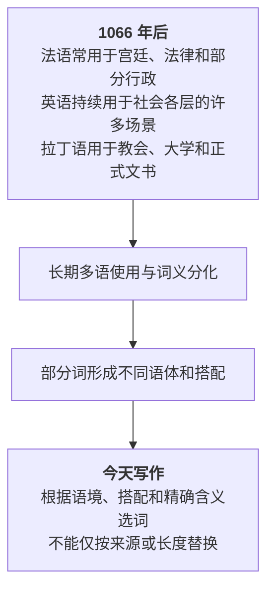

# 第 23 章 1066 年的一件事,如何重塑英语词汇

> 一颗箭,一顶王冠,一场仗。英语没有被法语"卸载",它只是换了一批上层房客——可这批房客带来的家具,够英语收拾五百年。

欢迎来到第 5 卷——**法语之饰**。

前面四卷,英语的祖先从日耳曼森林里走出来,和维京人当了几百年邻居,又从拉丁文里搬回一箱箱学术家当。但所有这些接触,都没有 1066 年那一场仗来得猛烈。那一年,一支讲法语的诺曼军队渡过海峡,打赢了一场决定性的战役——然后,英语的上半身就被换成了法语。

这一天,英语母语的撒克逊人输了战场,法语母语的诺曼人赢了王座:

> **1066 年 10 月 14 日,黑斯廷斯战役(Battle of Hastings)** /ˈheɪstɪŋz/。

这是英语社会史和词汇史最重要的转折点之一。但要先说清楚一件事:战役只打了一天,借词可没这么守时。真正改变英语的,是此后长达三百年里、英语、法语、拉丁语在同一座岛上并存的奇特生态。我们这就回到那片战场。

---

## 23.1 故事:1066 年发生了什么

### 三人争夺英格兰王位

1066 年的开局,像是命运给英格兰精心准备的一场连环劫。

年初,国王"**忏悔者爱德华(Edward the Confessor)**"驾崩,没留下一男半女。王座还没凉,三个男人就同时把手伸了过来——中世纪版的"继承权交接",瞬间从会议模式切换到战役模式。三位竞争者的来头一个比一个硬:

**1066 年王位之争**

| 序号 | 竞争者 | 身份与主张 | 派系 |
| --- | --- | --- | --- |
| ① | 哈罗德·戈德温森(Harold Godwinson) | 英格兰本土贵族,被贤人会议推举为王 | 本土派 |
| ② | 威廉,诺曼底公爵(Duke William of Normandy /ˈnɔrməndi/) | 法国北部诺曼人,声称爱德华曾许诺王位给他 | 诺曼派 |
| ③ | 哈拉尔·哈德拉达(Harald Hardrada) | 挪威国王,维京传统的最后争夺者 | 维京派 |

### 黑斯廷斯战役

### 一年打两仗:哈罗德的死亡三月

先别急着看黑斯廷斯——这一年最折磨人的,是哈罗德的行程表。

王位刚坐稳,**北边先炸了**。9 月,挪威国王**哈拉尔·哈德拉达**——维京时代最后的狠人——率大军在约克附近登陆,声称"这王位我也有份"。哈罗德二话不说,率军从伦敦**急行军北上**,一周内狂奔近 300 公里,在 9 月 25 日的**斯坦福桥战役(Battle of Stamford Bridge)**里把维京人打得全军覆没,哈拉尔战死。这是末代维京人对英格兰的最后一次大规模冲击,维京时代就此画上句号。

*(传说)* 顺便澄清一个流传甚广的乌龙:传说中"中箭穿眼"的那位是哈罗德,但斯坦福桥这边也有一名维京战士据守桥头、独挡英军——那完全是另一个人、另一场仗、另一个传奇。两件事被后人搅在一起,常常张冠李戴。

哈罗德还没来得及喘口气、给士兵发奖金,信使又追上来了,满脸是汗:

> **"大人,威廉公爵在南边苏塞克斯登陆了。"**

打完维京人,又来诺曼人。哈罗德只能带着那支刚拼完命的疲惫之师,**掉头再急行军南下**,几乎一周之内从英格兰这一头赶到另一头。1066 年最残酷的地方就在这里:**北边刚收尾,南边就开场,中间没有一丝喘息。** 等哈罗德的军队在黑斯廷斯的山脊上列阵时,他们已经连续奔波了将近一个月。

### 黑斯廷斯:盾墙、冲锋、和一颗改写历史的箭

10 月 14 日清晨,决战在不列颠南部的**黑斯廷斯(Hastings)**拉开。

地形对防守方有利。哈罗德的撒克逊军队占据山脊,排成著名的**盾墙(shield wall)**——士兵肩并肩、盾挨盾,把整面山坡变成一堵活的城墙。威廉的诺曼军队从坡下往上攻:弓箭手先放箭压阵,然后重装骑兵一波波冲上去。

可盾墙比想象中硬。诺曼骑兵冲锋,被盾墙顶回来;再冲,再被顶回来。战局一度胶着到令人窒息。

*(传说)* 最危急的一刻,诺曼军左翼突然溃退,阵中谣言四起:**"公爵阵亡了!"**——一支正在败退的军队听到主帅已死,基本就只剩逃跑的本能了。就在这千钧一发之际,威廉做了一个决定性的动作:他一把**摘下头盔**,纵马冲到阵前,扯着嗓子狂吼——

> **"看我!我还活着!看看我,我活着!"**(法语: *"Regardez-moi! Je suis vivant!"*)

主将的脸一露,军心立刻稳住,溃兵重新聚拢。这是黑斯廷斯战役的转折点之一。也是这一天最有画面感的一帧:一个摘着头盔的公爵,在乱军之中,用自己的脸证明自己还活着。

战局就此逆转。撒克逊盾墙最终被层层磨损、撕开口子。最后,哈罗德死了。

关于他怎么死的,几百年来最广为流传的说法是:*(传说)* **一支箭贯穿了他的眼睛**。这一幕被绣进了那幅著名的**巴约挂毯(Bayeux Tapestry)** /ˈtæpəstri/——一件将近 70 米长的中世纪刺绣,堪称"用针线记录的连环画",至今保存在法国。挂毯上绣着一个战士被箭贯穿眼部的画面,旁边拉丁文写着"哈罗德国王被杀"(HAROLD REX INTERFECTUS EST)。多数人相信那正是哈罗德(也有学者认为挂毯上另一个人影才是他,学界至今还在争论)。

但有一件事没有争议:**盎格鲁-撒克逊英格兰,在这一天画上了句号。**

### 加冕:法语搬进了城堡

三个月后的圣诞节,**威廉在西敏寺加冕为英王威廉一世**,自此被称为"**征服者威廉(William the Conqueror)** /ˈkɑŋkərər/"。

加冕仪式上有个耐人寻味的细节:*(传说)* 当司仪用法语问在场的诺曼人是否拥戴威廉为王,场内欢呼声过于热烈,外面的诺曼卫兵以为出了乱子,竟动手放火烧了周围的房子——浓烟灌进教堂,惊慌的撒克逊贵族四散奔逃,而威廉强作镇定完成了加冕。这个混乱的开场,像是给接下来三百年定了个基调:**新的统治者说法语,旧的主人说英语,而翻译永远慢半拍。**

从这一天起,讲法语的诺曼贵族坐上了英格兰的统治席位,英语在宫廷和不少权力场合退居次位,却仍在田间、市集和家庭里继续生长。一种奇特的语言生态就此开启——三种语言在同一座岛上并存了将近三百年。它具体长什么样?我们走进下一节的那座城堡去看。

---

## 23.2 后果:数百年的多语接触

### 一个奇特的语言生态:走进城堡的撒克逊农奴

要理解 1066 年之后发生了什么,最好的办法是想象一个具体的人。

假设你是 1080 年一个普通的撒克逊农奴,英语是你的母语。这一天,领主召唤你去城堡——也许是因为你欠了租,也许是因为你想告邻居偷了你的羊。你捏着一顶破帽子走进那座石砌的大门,准备在领主面前辩白。

然后你愣住了。

大厅里,领主在和管家说话——他们说的是**法语**。法官在翻羊皮纸、向书记口述判决——他念的也是**法语**。书记官低着头、用鹅毛笔记录,他写的是**拉丁语**。整个城堡从天花板到地板,没有一句你能听懂的话。你站在原地,嘴巴张着,意识到一件让人脊背发凉的事:

> **这是你出生的国家,可你的母语,在这里成了"下等人"的话。**

你不是被赶出国门,你是被关在自己的语言之外。这就是诺曼征服对普通人最日常、也最不动声色的伤害——它没有取缔英语,却让英语在不少高地位场合失声。

从 1066 年到中世纪后期,英格兰就这样长期并用三种语言。谁说哪种,不取决于一道整齐的"上层/下层"分界线,而取决于**领域、地区、教育和身份**:

### 这种分立造成了什么:三百年后,英语搬家回来了

别误会——英语并没有在这三百年里消失。恰恰相反,它在田间地头、市集酒馆、母亲哄孩子的歌谣里,活得热气腾腾。它只是在许多城堡、法庭和正式公文里相对"失声",像一个被请出客厅的主人,在厨房里继续过日子。

但奇妙的事情发生了:三百年后,当英语在 14 世纪重新成为官方语言、堂而皇之搬回客厅时,它已经不是当年那个被赶出去的英语了。这三百年里,它通过统治、贸易、通婚、法庭传唤、孩子听父母和领主说话时的"夹缝听力"——把法语词一个一个捡了回来。等它再度坐回公文桌前,身上已经挂满了法语的徽章。

具体发生了什么,下图说得很清楚:

> **提示** **关键认知**:1066 年不是"法语取代英语",而是长期接触改变英语。借词数量取决于词典和计数方法;英语词汇量也不能用"超过其他语言"这种不可比的说法衡量。

---

## 23.3 法语渗透的"领域地图":每个房间都被重新装修了一遍

法语词进入英语,不像一场均匀的雨落在整片土地上,而像一支装修队,**一间一间地"重新装修"了英格兰的上层建筑**。哪间屋子被诺曼人接管,哪间屋子的词汇就被换了牌子。

我们走进去看一圈。

**政府办公室**:推开门,满墙挂着法语牌子——`government`、`parliament` /ˈpɑrləmənt/、`council`、`minister`。这些都是诺曼人带来的统治机器零件,撒克逊人祖上 `moot` /mut/(民众大会)之类的旧词,被挤到角落吃灰。

**法院**:这一间被装修得最彻底。法官、陪审团、正义、证据、律师——从坐堂的人到桌上的卷宗,几乎清一色法语。一个撒克逊农奴想打官司,光听这些词就先输了一半:你连自己被告的是什么,都得请人翻译。

**军营**:`army`、`navy` /ˈneɪvi/、`soldier` /ˈsoʊldʒər/、`enemy` /ˈɛnəmi/、`battle` /ˈbætəl/。诺曼贵族是骑士阶层,打仗是他们的本行;撒克逊人原先那套民兵词汇,在这一间里几乎被清空重装。

**宫廷和贵族起居室**:`royal` /ˈrɔɪəl/、`prince` /prɪns/、`princess` /ˈprɪnsɛs/、`duke`、`duchess` /ˈdʌtʃəs/。这一间最讲究排场,词汇也最"镀金"。

**厨房**:这一间是本卷最经典的故事——也是下一章(第 24 章)的主角。同一个动物,活着在田里叫英语,上了餐桌就叫法语。

**艺术与奢侈品**:`art`、`beauty` /ˈbjuti/、`color`、`furniture`、`jewel` /ˈdʒuəl/。这些词带着绸缎和香水的气味,是诺曼贵族精致生活留下的指纹。

**教堂**(这一间要小心):`clergy` /ˈklɜrdʒi/、`sermon` /ˈsɜrmən/、`paradise` /ˈpɛrəˌdaɪs/、`savior` /ˈseɪvjər/。教会高层用法语,但教会本身又是拉丁语的领地——所以这一间的词汇是法语和拉丁语"混装"的,不是法语独占。

把这七间屋子列出来,就是下面这张"领域地图":

**法语借词的领域分布**

| 领域 | 例词 | 背景 |
| --- | --- | --- |
| ① 政府、行政 | `government`, `parliament`, `council`, `minister` | 诺曼人带来的统治机器 |
| ② 法律、司法 | `court`, `judge` /dʒʌdʒ/, `jury` /ˈdʒʊri/, `justice` /ˈdʒʌstəs/, `attorney` /əˈtɜrni/ | 诺曼人带来的法律体系 |
| ③ 战争、军事 | `army`, `navy`, `soldier`, `enemy`, `battle` | 诺曼贵族是骑士阶层 |
| ④ 贵族、宫廷生活 | `royal`, `prince`, `princess`, `duke`, `duchess` | 诺曼人本身就是贵族 |
| ⑤ 烹饪、美食 | `pork` /pɔrk/, `beef`, `mutton` /ˈmʌtən/, `sauce` /sɔs/, `dinner` /ˈdɪnər/ | 诺曼贵族的餐桌 |
| ⑥ 艺术、奢侈 | `art`, `beauty`, `color`, `furniture`, `jewel` | 诺曼人的精致生活 |
| ⑦ 宗教、神学 | `clergy`, `sermon`, `paradise`, `savior` | 教会高层的法语 |

### 双词汇层:阶级差异,凝固成了词汇

这七间屋子里,最值得多看一眼的是**厨房**——它藏着一个诺曼征服留下的、英语词汇史上最经典的指纹:**双词汇层**。

故事是这样的:同一个动物,**活着的时候是英语**(因为养它的是说英语的撒克逊农民),**上了餐桌就变成了法语**(因为吃它的是说法语的诺曼贵族)。`pig` 在猪圈里叫 pig,端上桌就叫 `pork` /pɔrk/;`cow` 在田里哞哞叫时是 cow,切成牛排就叫 `beef` /bif/;`sheep` 在山坡上是 sheep,烤好了端上桌就叫 `mutton` /ˈmʌtən/。

一个社会的阶级差异,**就这样凝固成了词汇的差异**——而且凝固得如此彻底,以至于九百年后,你点猪排时说的还是 `pork`,从没想过这个词的源头是一场战役。

把整个 1066 年后的英格兰浓缩成一句话,大概就是:

> **城堡里说法语,教堂里说拉丁语,田埂上和市集里说英语。**

三种语言各占一块地盘,没有一道整齐的上下阶层边界。法语借词在政治、法律、军事、宫廷和饮食这些领域较密集,但没有任何一个领域是法语的"独占房间"——`king`、`law`、`cook` /kʊk/ 这些反例一直在提醒你:实际的词汇层,始终是混合的。这一节的全部细节,我们留到下一章(第 24 章)展开。

---

## 23.4 法语借词的"识别标志":当一回词源侦探

读到这里,你大概已经接受了"英语里到处是法语词"。但碰到一个生词,你怎么一眼判断它是不是法语来的?

像侦探认嫌疑犯一样——法语借词身上有几个明显的"胎记"。下面四个标志,看一眼就能锁定大半。但记住,这是概率线索,不是 DNA 比对:每个标志都有例外,真正的词源还得查字典确认。

### 标志 1:词尾的 `-tion` / `-sion`

最显眼的胎记。看到一个词以 `-tion` 或 `-sion` 结尾,九成九是法语/拉丁血统:

**法语词尾标志:`-tion` / `-sion`(名词后缀)**

| 后缀 | 例词 | 说明 |
| --- | --- | --- |
| `-tion` / `-sion` | `nation` /ˈneɪʃən/, `government`, `action`, `education`, `situation` | 这些都是法语/拉丁源 |

### 标志 2:`-ous` / `-ance` / `-ence`(形容词/名词后缀)

另一组法式后缀。形容词爱穿 `-ous` 这件外套,名词爱戴 `-ance`/`-ence` 这顶帽子:

| 后缀 | 词性 | 例词 |
| --- | --- | --- |
| `-ous` | 形容词 | `famous` /ˈfeɪməs/, `dangerous` /ˈdeɪndʒərəs/, `serious`, `curious` /ˈkjʊriəs/ |
| `-ance` / `-ence` | 名词 | `importance` /ˌɪmˈpɔrtəns/, `evidence`, `distance`, `innocence` /ˈɪnəsəns/ |

### 标志 3:特定的"法式"音组

有些字母组合,长得就"很法国":

| 音组 | 例词 |
| --- | --- |
| `-oi-` | `choice`, `voice`, `joy` /dʒɔɪ/, `boil` /bɔɪl/(部分) |
| `-ai-` | `rain`, `certain`, `mountain` |

### 标志 4:ch 发 /tʃ/(而不是 /k/)

最后一个,也是最容易踩坑的一个。同样是 `ch` 两个字母,读音不同,身世就不同:

| 读音 | 来源 | 例词 |
| --- | --- | --- |
| `ch` 读 /tʃ/ | 法语源 | `chair`, `chamber` /ˈtʃeɪmbər/, `chase` /tʃeɪs/, `charge`, `change` |
| `ch` 读 /k/ | 希腊/拉丁源 | `choir` /ˈkwaɪər/, `school`, `chemistry` /ˈkɛməstri/ |

> **提示** `ch` 的读音可提供线索,但不能当作百分比规则。`church`、`child`、`much` 等本族词也读 /tʃ/;`choir`、`school` 等词的历史路线又各不相同。

---

## 23.5 一个关键认知:法语词的"正式感"从何而来

读到这里,你可能会发现一个规律:`buy`(买)听着随口,`purchase` /ˈpɜrtʃəs/(购买)听着正式;`ask`(问)是邻居间的口气,`inquire` /ɪnˈkwaɪr/(询问)是律师函的口气。**长的、法的,似乎就比短的、英的"高级"。**

为什么会这样?最直觉的答案是"阶级"——毕竟法语是征服者的语言,理应带着统治者的威严。这个解释不算错,但太省事。真实的答案要复杂得多,涉及借入领域、书面传统、词义分化和长期使用。**1066 年的社会结构是其中一项因素,但不是唯一的原因。**

下面这张图,是这件事的完整因果链:

> **提示** **写作方法**:比较 `buy/purchase`、`ask/inquire` 时,应查真实搭配和语义限制。来源能解释部分差异,不能自动决定文章质量或正式程度。

---

## 23.6 法语借词的三个浪潮(细节):三波客人,三张请柬

最后再补一个关键细节:法语进入英语,不是 1066 年那一天哗啦啦全倒进来的,而是**分三波**,前后跨了五百年。每一波的"客源"不同,带进来的词风味也不同:

**法语借词的三波**

| 波次 | 时间 | 来源 | 特点 | 例词 | 风格 |
| --- | --- | --- | --- | --- | --- |
| 第 1 波 | 1066-1200 | 诺曼底法语(Norman /ˈnɔrmən/ French) | 和诺曼贵族一起进入 | `court`, `war`, `army`, `government` | 最"上层" |
| 第 2 波 | 1200-1400 | 巴黎中部法语(Central French) | 学者、商人、外交带来 | `government`, `religion` /rɪˈlɪdʒən/, `art`, `fashion` /ˈfæʃən/ | 更"精致、文化" |
| 第 3 波 | 16-17 世纪 | 法国文化影响 | 时尚、艺术、外交 | `ballet` /bæˈleɪ/, `cuisine` /kwɪˈzin/, `bouquet` /buˈkeɪ/, `cliché` | "文化借词" |

三波合起来,就是法语在英语里留下的完整家谱:**第 1 波是征服者的脚印,第 2 波是文人的礼物,第 3 波是巴黎的明信片。** 每一波都比上一波更"文化"、更"精致",也越来越像一种主动的文化仰慕,而不是被动的征服遗产。

---

## 23.7 一个有趣的发现:`W` 和 `Gu` 的双形:一对失散的兄弟

法语进入英语时,留下了一个特别有趣的"双胞胎"现象:常常**同一个意思有两个拼写**——一个以 `W` 开头(日耳曼血统),一个以 `Gu` 开头(法语血统)。它俩其实是同一个词,只是当年分了家,一个跟了日耳曼姓,一个跟了罗曼姓:

**W(日耳曼) vs Gu(法语) 双形**

| 法语形(Gu-) | 日耳曼形(W-) | |
| --- | --- | --- |
| `guard` /ɡɑrd/(守卫) | `ward` /wɔrd/(看守) | 亲戚 |
| `guarantee` /ɡˌɛrənˈti/(保证) | `warranty` /ˈwɔrənti/(担保) | 亲戚 |
| `guess`(猜) | `wise` /waɪz/(智慧,远亲) | 远亲 |
| `guild` /ɡɪld/(行会) | `yield` /jild/(产出,远亲) | 远亲 |

这里面的门道是:日耳曼语的 `w-` 这个音,在法语里"翻译"成了 `gu-`。等法语词再借回英语,有的保留 `gu-`,有的又变回 `w-`,于是同一个祖先就在英语里留下了两副面孔。

**这就是为什么 `guard` 和 `ward` 是亲戚**——它们是同一个词,只是在海峡两岸走了不同的拼写路线,九百年后在英语词典里又撞上了。词源学最浪漫的瞬间,莫过于此。

---

## 23.8 本卷的章节地图

接下来 3 章我们具体展开法语借词的故事。本章是这卷的"全景导览",剩下三章分别钻进三个最有趣的房间:

**第 5 卷 · 法语之饰**

1. 第 23 章 1066 年的一件事,如何重塑英语词汇(本章)
2. 第 24 章 厨房里的征服:pig / pork,cow / beef
3. 第 25 章 阶级的烙印:kingly / royal / regal
4. 第 26 章 法语借词与词族速查

---

## 23.9 本章小结

1. **1066 年是重要转折点之一**——此后英格兰长期并用英语、法语和拉丁语,而不是简单的两层语言分立。
2. **法语借词在部分领域高度集中**——政治、法律、军事和饮食尤其明显,但各领域始终是多来源混合。
3. **部分语体差异有历史背景**——借入领域和长期使用共同塑造差异,不能只用阶级解释。

### 记忆锚点

> **记一个年份:1066**——此后英格兰长期三语分工过日子:田里说英语,城堡说法语,教堂和文书写拉丁。

---

## 23.10 史实与传说

- **战役只打了一天,借词却走了三百年。** 1066 年是社会史的重要转折点,但法语词不是当天就涌进英语的,而是在此后数百年里、通过三波不同渠道陆续进入(见 23.6)。把整卷法语借词都归功于"黑斯廷斯那一天",是最常见的过度简化。
- **"阶层叙事"是总体倾向,不是快照。** "城堡里说法语、田埂上说英语"是个好画面,但真实的多语格局没有一道整齐的上下阶层边界——领域、地区、教育、身份都会影响语言选择。`king`、`law`、`cook` /kʊk/ 等本族词一直活在上层领域,说明词汇层始终是混合的。
- **威廉"摘盔高呼我还活着"、加冕时的混乱场面带有传说成分。** 它们可以用作历史记忆的画面,但不作信史引用。

---

### 【思考题】(答案见附录 A)

1. 为什么 `government`、`parliament` /ˈpɑrləmənt/、`court`、`judge` /dʒʌdʒ/ 全是法语源?用 1066 年的历史解释。
2. 哪些因素会让部分法语源词形成较正式的语体?为什么不能只归因于阶级?
3. 写学术论文时,为什么应按精确含义和搭配选词,而不是按词长选词?

---

*下一章 → [第 24 章 厨房里的征服:pig / pork, cow / beef](./第24章-厨房里的征服.md)*
