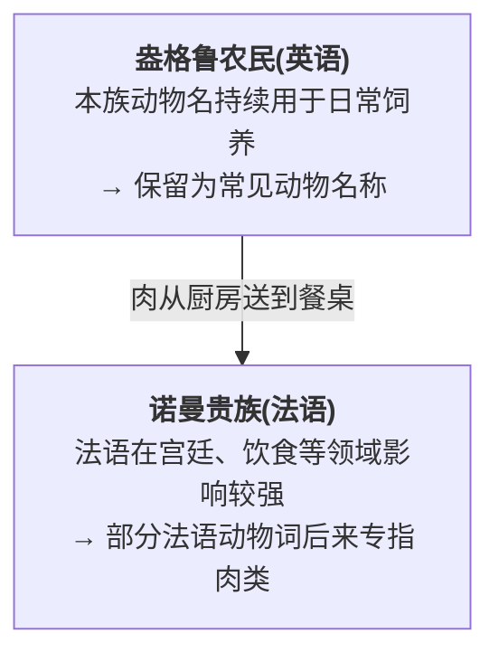
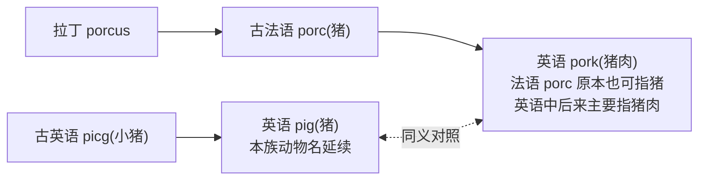
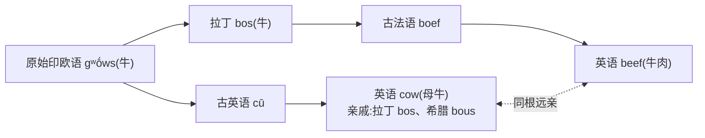
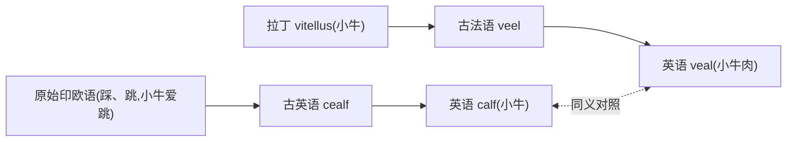
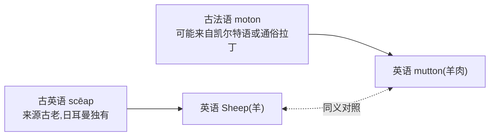
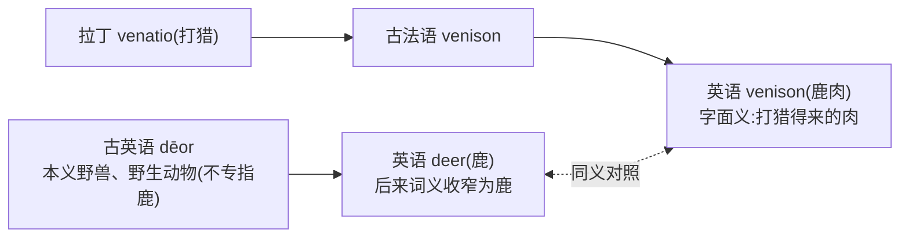
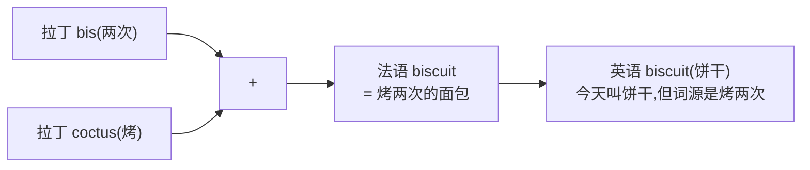
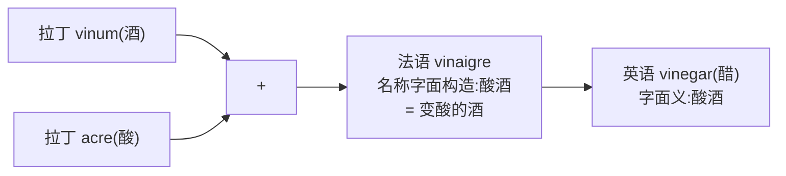

# 第 24 章 厨房里的征服:pig / pork, cow / beef

> 猪在田里叫 `pig`,端上桌却叫 `pork`。动物没有改名申请,变的是说话的人、使用场景和几百年的词义分工。

这一章讲**全书最经典的双词汇层案例**——动物名和肉名的"成对词":

**厨房里的征服**

| 养的动物(英语) | 端上桌的肉(法语) |
| --- | --- |
| `pig`(猪) | `pork`(猪肉) |
| `cow`(牛) | `beef`(牛肉) |
| `calf`(小牛) | `veal`(小牛肉) |
| `sheep`(羊) | `mutton`(羊肉) |
| `deer`(鹿) | `venison`(鹿肉) |

为什么会出现这种动物名与肉名的分化?诺曼征服后的法语接触和社会分工是最常见的故事框架。它很好记——"农民养、贵族吃",几乎是一张现成的漫画。但词义分化实际经历了数百年,远不止这一张餐桌那么简单。这一章我们就先把漫画讲足,再说说它哪些地方是被简化过的。

---

## 24.1 故事:餐桌上的阶级

### 1066 年,一颗箭,一场改写英语命运的仗

要讲厨房里的故事,得先回到 1066 年那片战场。

这一年,**英格兰王位悬空**。撒克逊贵族**哈罗德·戈德温森(Harold Godwinson)**刚刚被推上王位,而海峡对岸的诺曼底公爵**威廉(William)**声称:前任国王曾当面答应把王位传给我,这个哈罗德是个篡位者。

10 月 14 日,两军在**黑斯廷斯(Hastings)**摆开阵势。撒克逊人占据山头,肩并肩结成一面盾墙,诺曼人的骑兵一波波冲上去,又一波波被打下来。战局一度胶着。*(传说)* 决定性的一刻,是哈罗德**中箭,箭矢贯穿了他的眼睛**。这一幕被绣进了那幅著名的**巴约挂毯(Bayeux Tapestry)**——一幅长达 70 米、用刺绣记录整场征服的"中世纪连环画",至今保存在法国,是这件事最直接的可视化史料。国王倒下,盾墙崩溃,威廉自此被称为"**征服者威廉(William the Conqueror)**"。

这一仗的后果,远不止换了个国王。威廉带来的是一整套**讲法语的诺曼贵族**——他们取代了英格兰原有的撒克逊领主,把宫廷、法庭、上层社会整个换成了法语。英语被赶回了田间地头,在那里蛰伏了将近三百年。这就是后世所说的**诺曼征服(Norman Conquest)**,也是英语词汇史上最剧烈的一次外语输入。

### 厨房里的征服:猪倌和小丑的对话

把镜头推进厨房。19 世纪作家**沃尔特·司各特(Walter Scott)**在小说《艾凡赫》(Ivanhoe)里,写过一段流传百年的经典对话——撒克逊猪倌 **Gurth** 和小丑 **Wamba** 边走边聊,话题正是这些动物到底叫什么。*(文学化场景)* 但这段话被当作"1066 年后语言分层"的最佳记忆画面,几乎写进了每一本英语词源书:

> **Wamba**(大意):"奇怪得很。这群牲口在田里跑的时候,我们这些伺候它们的人管它叫 `pig`、`cow`、`calf`、`sheep`——全是英语。可等肉一烤好端到楼上,坐在桌前讲法语的诺曼老爷嘴里,它就变成了 `pork`、`beef`、`veal`、`mutton`。"

潜台词很清楚:**养它的人说英语,吃它的人说法语**。撒克逊猪倌养了一辈子 pig,等它变成肉,名字就被楼上的法语改写了。这是被征服者最日常、也最不动声色的痕迹——语言分层,刻进了一日三餐。

### 统治阶级不说被统治者语言

这种分层不是 Wamba 一人的牢骚,而是真实存在了好几代人的现象。诺曼贵族把法语当母语,英语在他们眼里是仆役和农夫的土话。最极端的例子是**狮心王理查一世(Richard the Lionheart)**——*(传说)* 这位英格兰最传奇的国王,在位十年,**几乎一句英语都不会讲**。他生在法国,长在法国,打仗在法国,死也死在法国,日常说的是法语和奥克语。英格兰对他来说,更像是一片用来收税供养十字军东征的领地,而不是"祖国"。在理查之后,英格兰贵族又过了好几代,才慢慢把英语重新当成日常语言。

### 1066 年后的厨房生态

把这些场景拼起来,厨房里的阶级格局就清楚了:

画面很顺,但要提醒一句:这幅图是一个**简化的总体倾向**,不是当时每个词、每个场合的真实快照。具体的限定,见本章末"避坑提示"。

---

## 24.2 五对动物-肉名详解

### 对 1:pig / pork

最经典的一对。`pig` 是盎格鲁猪倌嘴里的词,`pork` 来自法语 `porc`(猪)。注意一个有趣的反转:法语 `porc` 本来既能指猪、又能指猪肉;是英语借过去之后,才慢慢让它"专指肉"的。

### 对 2:cow / beef —— 这俩居然是亲戚

这一对最反直觉:`cow`(牛)和 `beef`(牛肉),看起来八竿子打不着,其实是**远房亲戚**。它们都来自原始印欧语 `*gʷṓws`(牛)。`cow` 走的是日耳曼路线,一路传到古英语;`beef` 走的是拉丁→法语路线,绕了一大圈才回到英格兰。同一个祖先的子孙,隔着一千年再相见,一个在田里哞哞叫,一个在餐桌上冒着热气。

### 对 3:calf / veal

### 对 4:sheep / mutton

`sheep` 是日耳曼独有的古老词,英语从祖先那里继承下来;`mutton` 来自法语 `moton`,而 `moton` 的来源本身又扑朔迷离,可能借自凯尔特语或通俗拉丁——一个词身上叠了好几层历史。

### 对 5:deer / venison —— 词义一路在缩

`deer` 是个特别会"缩水"的词。在古英语里它泛指**一切野兽**——熊是 deer,狼是 deer,莎士比亚时代 `small deer` 还能指"小动物"。后来它的地盘被一点点蚕食,最后只剩下"鹿"这一小块。这种"宽义 → 窄义"的演变,语言学上叫**词义收窄(narrowing)**。而 `venison` 字面是"打猎得来的肉",来自拉丁 `venatio`(打猎)——能吃上鹿肉的,从来都是打猎的贵族,不是放牧的农夫。

---

## 24.3 这种词义分化有什么特点

**英语的"动物-肉"词对很集中、很醒目**

| 语言 | 动物 / 肉 | 说明 |
| --- | --- | --- |
| 英语(双词汇层) | `pig` / `pork`、`cow` / `beef`、`sheep` / `mutton` | 动物名与肉名分用不同词 |
| 法语(单层) | `porc` / `porc`、`boeuf` / `boeuf`、`mouton` / `mouton` | 同一个词兼指动物和肉 |
| 德语(单层) | `Schwein` / `Schweinefleisch`、`Rind` / `Rindfleisch` | 动物名加 `fleisch`(肉)构成 |

法语干脆——一个 `porc` 既指猪也指猪肉,词不嫌多。德语也省事——`Schwein`(猪)加个 `fleisch`(肉)拼成 `Schweinefleisch`,一目了然。唯独英语,为同一种动物准备了"田间版"和"餐桌版"两套名字。这组词对之所以这么集中,正是法语长期接触留下的指纹。当然,英语并非独此一家——其他语言也会用不同词、派生词或复合词来区分动物和肉,只是没有英语这么成系统。

---

## 24.4 烹饪术语:法语对厨房的全面征服

不止动物和肉。整个厨房——食材、烹饪法、餐具、餐桌——都被法语系统性地渗透过一遍。从你拧开的那瓶 `sauce`,到你坐下来的那把 `chair`,多半都是法货:

**厨房里的法语**

| 分类 | 例词 | 来源/说明 |
| --- | --- | --- |
| 食材 | `sauce`(酱汁) | 法语 |
| 食材 | `soup`(汤) | 法语 |
| 食材 | `salad`(沙拉) | 法语 |
| 食材 | `vinegar`(醋) | 法语 `vinaigre`(vin 酒 + aigre 酸) |
| 食材 | `mustard`(芥末) | 法语 |
| 食材 | `sausage`(香肠) | 法语 |
| 食材 | `biscuit`(饼干) | 法语(cuit 烤 + bis 两次 = 烤两次) |
| 烹饪法 | `boil`(煮) | 法语 |
| 烹饪法 | `fry`(炸) | 法语 |
| 烹饪法 | `roast`(烤) | 法语 |
| 烹饪法 | `stew`(炖) | 法语 |
| 烹饪法 | `cuisine`(烹饪) | 法语 |
| 餐桌 | `dinner`(正餐) | 法语 |
| 餐桌 | `supper`(晚餐) | 法语 |
| 餐桌 | `plate`(盘子) | 法语 |
| 餐桌 | `cup`(杯) | 法语(部分) |
| 餐桌 | `napkin`(餐巾) | 法语 |
| 餐桌 | `table`(桌) | 法语(替代古英语 `bord`) |
| 餐桌 | `chair`(椅) | 法语(替代古英语 `stōl`) |

### 一个有趣细节:biscuit = 烤两次

`biscuit` 字面拆开是 `bis`(两次)+ `cuit`(烤)= **"烤两次"**。古代水手出海,带的干粮得烤两遍——烤去水分,才不会在船舱里发霉,能放上半年不坏。今天你在下午茶里配的那块饼干,祖宗其实是水手们的救命口粮。无独有偶,意大利语 `biscotti`(那种长条形的脆饼干)也是 `bis + cotti` = 烤两次——整个地中海的航海文化,在"饼干"这个词上握了个手。

---

## 24.5 醋(vinegar)= 变酸的酒

`vinegar` 来自法语 `vinaigre`:`vin`(酒)+ `aigre`(酸)= **"酸酒"**。古人酿的酒放久了发酸,他们一尝,得,这酒坏了——可坏了的"酸酒",恰好就是醋。一个朴素的观察,凝固成一个词。当然,从科学上说,醋是醋酸菌在含酒精液体里进行**醋酸发酵**的产物,不是单纯的"酒发酵过头";原料也不限于葡萄酒。但古人哪里知道醋酸菌,他们看到的就只是"这酒变酸了"。

---

## 24.6 一个反差:烹饪用词是法语,但食材原始名是英语

**厨房法语 vs 食材英语**

| 高级烹饪(法语) | 食材本身(英语) |
| --- | --- |
| `cuisine`(烹饪) | `cook`(烹饪;早期经拉丁语进入古英语) |
| `boil`(煮) | `seethe`(古英语煮,已弃用) |
| `fry`(炸) | — |
| `roast`(烤) | `bake`(烤,英语本土) |
| `chef`(主厨) | `cook`(厨子) |
| `recipe`(食谱) | `receipt`(旧用法) |

这里有个微妙的反差。`chef`、`cuisine` 这些法语词,带着专业餐厅、白色高帽的气味;而 `cook`、`bake` 这类词,听着就朴素得多,像家里厨房冒出的烟火气。但别把这种对立绝对化——`cook` 本身其实也是个早期拉丁借词,只是借来得太早,早到大家已经把它当成本族词了。语言的"阶级"是会变的:一个外来词住得够久,慢慢就被当成自己人。

---

## 24.7 避坑提示

本章用"农民养、贵族吃"的画面讲故事,好记,但也容易被夸大。下面这些限定值得记住:

- **阶层叙事是总体倾向,不是快照**。`cow/beef` 的现代分工很适合展示语言接触,但古法语来源词进入英语之初,并非只表示肉。这些词义是在数百年使用中逐渐专化的,不能压缩成 1066 年当天就立好的菜单规则。
- **`cow` 和 `beef` 同根,但不能简化成"字母互换"**。两者都可追溯到原始印欧语 `*gʷṓws`,但经历了复杂的日耳曼音变和罗曼音变,不是简单的 `c ↔ b` 换字母。
- **"动物-肉"词对不是英语独有**。法语用同一个词兼指动物和肉,德语用复合词,其他语言也各有区分方式。英语这组词对只是因为法语接触而格外集中,不是欧洲孤例。
- **`vinegar` 是"酸酒",但制醋不是"酒发酵过头"**。醋是醋酸菌在含酒精液体中进行醋酸发酵的产物,原料也不限于葡萄酒。"酸酒"是古人的朴素命名,不是工艺定义。
- **狮心王理查"不会英语"、哈罗德"中箭穿眼"带有传说成分**。哈罗德中箭有巴约挂毯这一接近同时代的图像史料,但具体细节仍有解读争议;理查不谙英语是流传甚广的说法,史料记载有限。两者都用作历史记忆的画面,不作信史引用。

---

## 24.8 本章小结

### 你应该带走的三个认知

1. **pig/pork、cow/beef 反映长期法语接触和词义分化**——"农民养、贵族吃"的阶层故事是个好画面,但它说明的是总体倾向,不能代替完整的数百年词义史。
2. **cow 和 beef 其实是亲戚**——都来自原始印欧语 *gʷṓws,一个走日耳曼路线,一个绕了拉丁→法语的远路,隔千年在英格兰的餐桌上重逢。
3. **法语深刻影响英语烹饪词汇**——从食材到烹饪法到餐具,法语渗透了一整个厨房。但厨房领域仍混着古英语、早期拉丁借词和其他来源,不是法语的独角戏。

### 一个最生动的认知

> **动物名与肉名的分化,保存了长期语言接触的痕迹。** "`cow` 活着是英语、死后变法语"是个绝佳的记忆画面——只是要记住,这是一幅画在数百年历史上的漫画,不是 1066 年当天贴出的菜单。

---

### 【思考题】(答案见附录 D)

1. `pig/pork` 的分化与诺曼征服后的语言接触有什么关系?为什么不能只用一幅贵族餐桌图解释?
2. `vinegar` 字面是"酸酒";醋酸发酵与普通酒精发酵有什么区别?
3. 为什么英语动物/肉名词对很集中,但仍不能说这种现象是英语独有?

---

*下一章 → [第 25 章 阶级的烙印:kingly / royal / regal](./第25章-阶级的烙印.md)*
