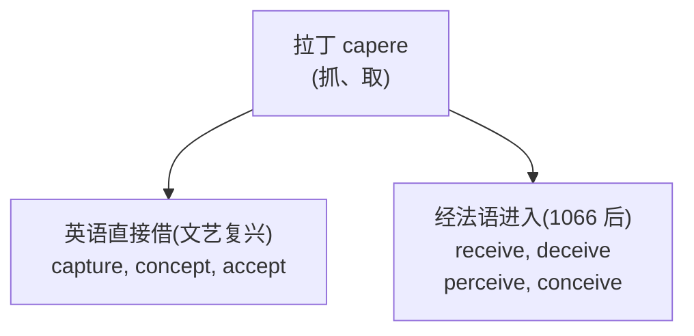
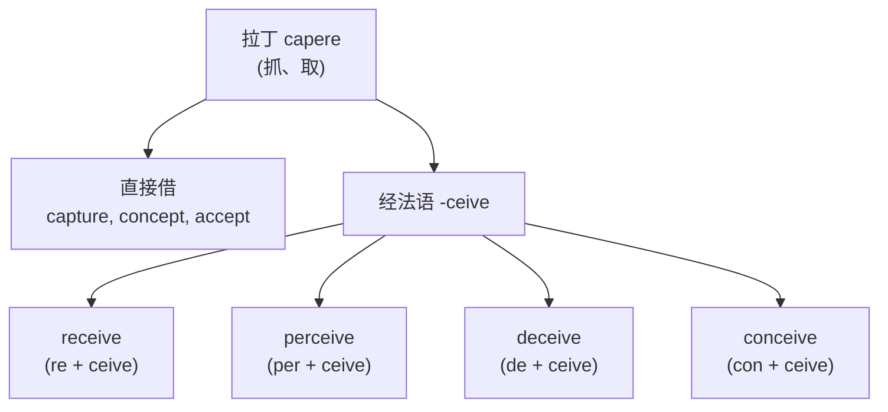
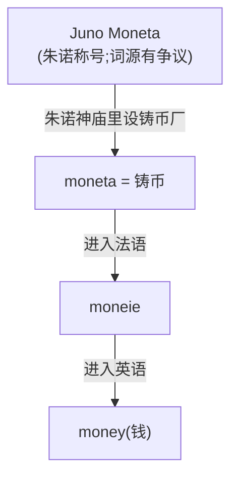
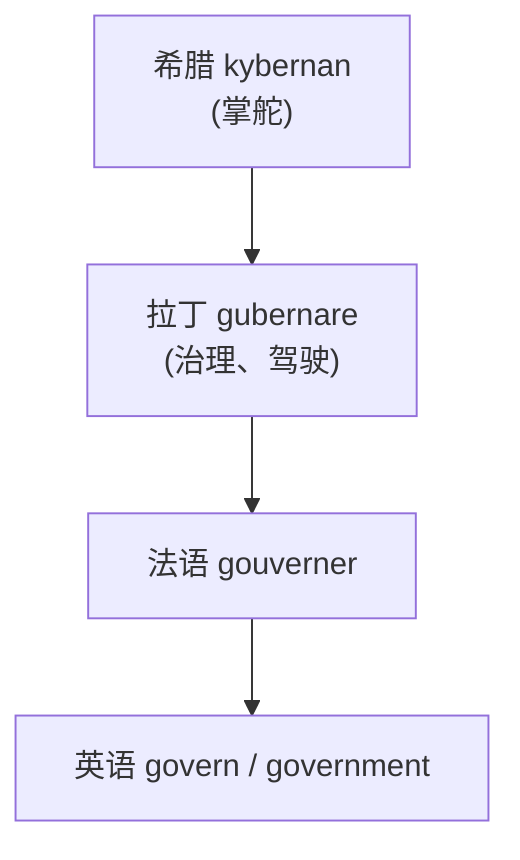
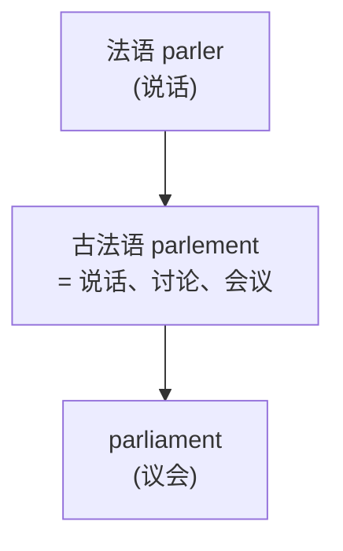
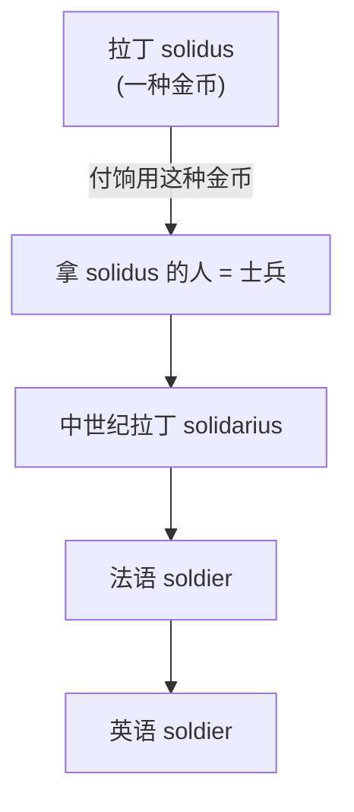
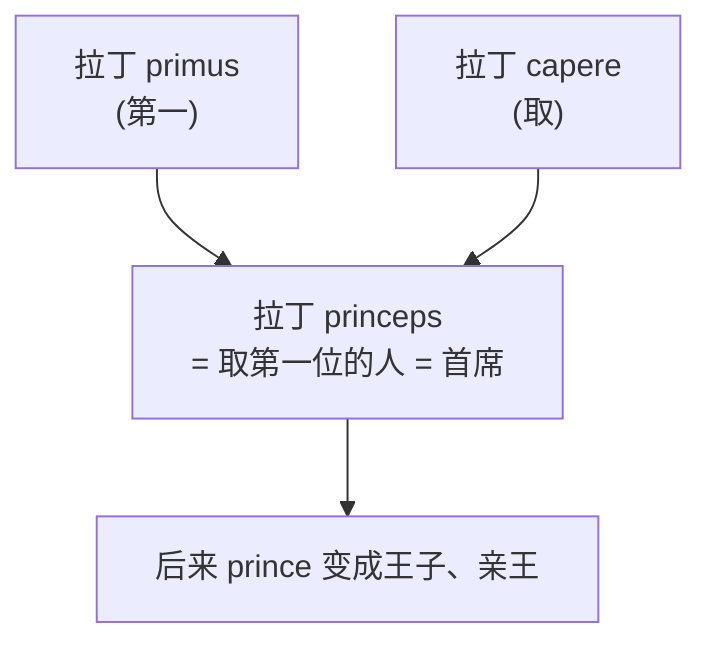
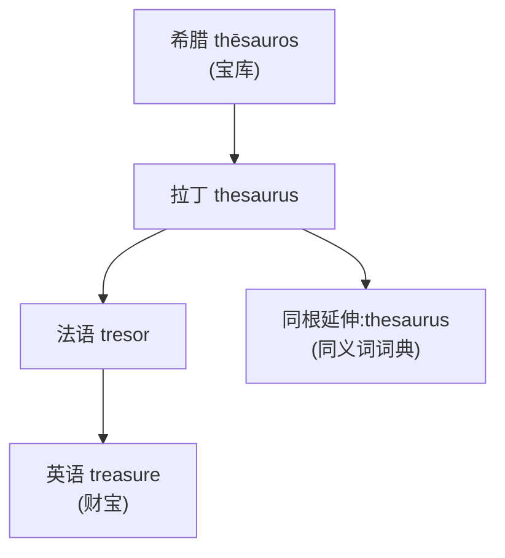

# 第 26 章 法语借词与词族速查

> 法语来源词常带着拉丁祖先的五官,却换过发音、拼写和语义衣柜。认得祖先有帮助,但别拿旧照片直接过人脸识别。

第 23-25 章讲了法语进入英语的历史、厨房阶级、三层词。这一章我们补全**经法语进入英语的高频借词和词族**。

法语来源词的一个特点是:**许多可以追溯到拉丁语**——法语本身由高卢地区的口语拉丁语长期演变而来,英语又从古法语和中古法语等阶段大量借词。所以法语来源成分和拉丁词根**常常重叠**,但经过法语传递后会有自己的音形。

> **提示**:许多法语词追溯到拉丁语,但法语也吸收了日耳曼、凯尔特等来源的成分。法语传递会改变音形,却不能把变化概括成适用于所有词的字母替换公式;语言史不是批量重命名脚本。

---

## 26.1 法语词根的"特征变体"

法语从拉丁语继承了一大批词,却一路给它们改发音、削辅音、换拼写。这一节先看清这些"整容"手法,免得你对着 fait 认不出它爹就是 factum。

### 变体 1:拉丁辅音群在法语中的多种变化

拉丁 `-ct-` 等辅音群进入法语后可能弱化、消失或产生新的元音、拼写,具体结果因词和方言而异,不是统一的 `-ct → -it` 规则:

| 拉丁形式 | 法语结果 | 英语路线 |
| ------ | ------ | ------ |
| factum / factus | fait | fait accompli |
| fructus | fruit | fruit |
| directum | droit | 法语 droit |
| dictus → 意大利语 detto → ditto | ditto | (不是法语例子) |

### 变体 2:`cap-` / `cip-` → `-ceive`(法语化)

### 变体 3:`-tion`(法语化的拉丁 -tionem)

拉丁名词后缀 `-tionem` 进入法语变 `-tion`,进入英语保留:

| 拉丁 | 英语 |
| ------ | ------ |
| actionem | action |
| nationem | nation |
| educationem | education |

---

## 26.2 高频法语借词及词族

下面这几个词,个个都在英语里混成了日常面孔,没人再记得它们是坐着诺曼人的船来的。挨个验一下身份证——court、war、peace、money、art、beauty,全是法国亲戚。

### `court`(宫廷、法庭)

来自古法语 *cort* / *court*,来自拉丁 *cohortem*(庭院、人群)。

| 词 | 含义 |
| ------ | ------ |
| court | 宫廷、法庭 |
| courteous /ˈkɜrtiəs/ | 有礼貌的(宫廷式的) |
| courtesy | 礼貌 |
| courtier /ˈkɔrtiər/ | 朝臣 |
| courtship /ˈkɔrtˌʃɪp/ | 求偶(宫廷式的追求) |

> **提示** **`courteous` /ˈkɜrtiəs/(有礼貌的)字面义是"宫廷式的"**——古法语宫廷被认为是礼仪的典范,所以"宫廷的"= "有礼貌的"。

### `war`(战争)

来自古北法语 *werre*(战争,不同于标准法语的 guerre)。**这个法语方言词成了英语 war**。

| 词 | 含义 |
| ------ | ------ |
| war | 战争 |
| warrior | 战士 |
| warfare | 战争、交战 |
| warsaw? | 地名,无关 |

### `peace`(和平)

来自古法语 *pais*,来自拉丁 *pax*(和平)。

> **提示** `peace` 的历史核心义就是"和平、和约、和解"。`Pax Romana` 是含 *pax* 的历史术语,但不能据此把 `peace` 的字面义改写成"罗马式和平"。

### `money`(钱)

来自古法语 *moneie*,追溯到拉丁 *moneta*。罗马铸币与 Juno Moneta 神庙的联系是这一词义路线的核心;但 **Moneta** 这一称号本身的来源有争议。后人常把它联系到 *monere* "提醒、警告",并配上神庙圣鹅示警的故事,不应把这条完整因果链写成确定事实。

> **提示** 稳妥的记忆路径是:**Juno Moneta 神庙与罗马铸币相连 → moneta 表示铸币/钱币 → 法语 moneie → money**。圣鹅故事可以作为相关传说,不能说 `money` 的字面义就是"警告者"。

### `art`(艺术)

来自古法语 *art*,来自拉丁 *ars*(技艺、艺术)。

| 词 | 含义 |
| ------ | ------ |
| art | 艺术 |
| artist | 艺术家 |
| artisan /ˈɑrtəzən/ | 工匠 |
| artificial | 人造的(art + fic 做) |
| artifice /ˈɑrtəfɪs/ | 巧妙构造 |
| artless | 质朴的(没有 art 的) |

> **提示** **`artificial` /ˌɑrtəˈfɪʃəl/(人造的)字面义是"用技艺做出来的"**——和自然(natural)相对。今天 artificial 多带"虚假"义,但词源是中性的"技艺产物"。

### `beauty` /ˈbjuti/(美)

来自古法语 *beauté*,来自拉丁 *bellus*(美)。

| 词 | 含义 |
| ------ | ------ |
| beauty | 美 |
| beautiful | 美丽的 |
| beautify /ˈbjutəˌfaɪ/ | 美化 |
| belle | 美女(法语保留) |
| belle-lettre | 纯文学 |

---

## 26.3 政治法律类法语词

高频词查完了,现在按领域巡检。先进"政府办公室"——1066 年后这间屋子被诺曼人从门牌到抽屉全换了一遍:

| 词 | 来源 | 故事 |
| ---- | ------ | ------ |
| `government` | 法语 gouverner ← 拉丁 gubernare(掌舵) | 来自希腊 kybernan(掌舵)——治理 = 操舵 |
| `parliament` /ˈpɑrləmənt/ | 古法语 parlement ← parler(说话) | 原指谈话、讨论,后指议会 |
| `council` | 拉丁 concilium(集合) | 咨询会议 |
| `counsel` /ˈkaʊnsəl/ | 同上(同根不同形) | 律师 = 顾问 |
| `minister` | 拉丁 *minister*(侍从、助手、执行者) | 经法语发展出宗教职务和政府官职义 |
| `master` /ˈmæstər/ | 拉丁 magister(首领) | 主人、硕士 |
| `mistress` /ˈmɪstrəs/ | magister 阴性 | 女主人、情妇 |
| `judge` /dʒʌdʒ/ | 拉丁 iudex/iudic- | ius(法、权利)+ dicere(说、裁定) |
| `jury` /ˈdʒʊri/ | 拉丁 jurare(宣誓) | 见第 12 章 |
| `justice` /ˈdʒʌstəs/ | 拉丁 justus(公正) | 见第 12 章 |
| `prison` /ˈprɪzən/ | 拉丁 prehensio(抓住) | 监狱 |
| `arrest` /əˈrɛst/ | 拉丁 ad + restare(留下) | 逮捕 |

### `government` = 掌舵

> "治理国家" = "驾驶船只",这个隐喻来自古希腊。所以 governor(州长)字面是"舵手",cybernetics(控制论)同根。

> **提示** **`cyber-`(网络)** 也来自这个希腊词根!kybernan → 拉丁 gubernare → 英语 govern,但 20 世纪科学家借用希腊原文造了 cybernetics(控制论,研究"控制、驾驶"的学科),后来衍生出 cyberspace(网络空间)、cyberpunk(赛博朋克)。**所以 governor(州长)和 cyberpunk(赛博朋克)是远房亲戚**!

### `parliament` /ˈpɑrləmənt/ = 从谈话、讨论到议会

> `-ment` 在这里构成行为或结果名词,不是表示"地点"的后缀。所以法国国会叫 Assemblée Nationale(国民大会),美国国会叫 Congress(走到一起),英国叫 Parliament(由"谈话、讨论、会议"发展而来)。

---

## 26.4 军事类法语词

政府办公室巡完了,隔壁就是军营。诺曼贵族是骑士阶层,打仗是本行,所以军事词几乎全被换了牌子:

| 词 | 来源 | 故事 |
| ---- | ------ | ------ |
| `army` | 法语 armée ← 拉丁 armare(武装) | 来自 arma(武器) |
| `navy` /ˈneɪvi/ | 古法语 navie ← 拉丁 navis(船) | 船队、海军 |
| `soldier` /ˈsoʊldʒər/ | 拉丁 solidus(金币) | 拿金币饷银的人 |
| `enemy` /ˈɛnəmi/ | 拉丁 inimicus(敌人) | in 不 + amicus 朋友 |
| `battle` /ˈbætəl/ | 拉丁 battuere(打) | 战斗 |
| `defense` /dɪˈfɛns/ | 拉丁 defensus(防御) | de 离开 + fens 打 |
| `siege` /sidʒ/ | 拉丁 sedere(坐) | 围城 = 坐着不走 |
| `retreat` /riˈtrit/ | 拉丁 retrahere(拉回) | 撤退 |

### `soldier` /ˈsoʊldʒər/ = 拿金币的人

> soldier 与一种货币名称有关;salary 与拉丁 salarium 有关,细节有争议。

> **提示** `soldier` 与 *solidus* 货币名称的关系较明确;`salary` /ˈsæləri/ 虽与盐词族有关,但"罗马士兵领盐钱"缺乏可靠古代证据。两者不能并列成两个已经证实的军饷故事。

---

## 26.5 贵族宫廷类法语词

军营出来,进宫廷。这间屋子最有意思:国王和王后的头衔竟然是日耳曼的,而王子、公爵、伯爵全是法语——诺曼人重新装修了贵族等级,却没能把最顶上那两个牌子换掉。

| 词 | 来源 |
| ------ | ------ |
| king | 日耳曼,本土 |
| queen | 日耳曼,本义"妻子" |
| prince | 法语 ← 拉丁 princeps(第一人) |
| princess | prince 的阴性 |
| duke | 法语 ← 拉丁 dux(引导者) |
| duchess | duke 的阴性 |
| count | 伯爵,法语 ← 拉丁 comes(伴侣) |
| countess | count 的阴性 |
| baron | 男爵,法语 ← 拉丁 baro(男人、战士) |
| knight | 日耳曼,本义"男孩" |
| lady | 日耳曼,面包揉制者 |
| lord | 日耳曼,面包守护者 |

### `prince` /prɪns/ = 第一人

> 罗马皇帝 Augustus 自称 princeps(不称 rex 国王,共和名义)。

---

## 26.6 艺术奢侈类法语词

跟"吃"和"打仗"一样,"享受"也是诺曼贵族的专长。凡是和艺术、珠宝、奢华、快活沾边的词,翻出来多半是法语——农民忙着下地,这些词本来也轮不到他们用。

| 词 | 来源 |
| ---- | ------ |
| `art` | 拉丁 ars |
| `beauty` /ˈbjuti/ | 拉丁 bellus |
| `color` | 拉丁 color |
| `furniture` /ˈfɜrnɪtʃər/ | 法语 fournir(装备) |
| `jewel` /ˈdʒuəl/ | 法语 jouel |
| `treasure` /ˈtrɛʒər/ | 拉丁 thesaurus(宝库) |
| `rich` /rɪtʃ/ | 古法语 riche |
| `luxury` /ˈlʌɡʒəri/ | 拉丁 luxus(过剩) |
| `pleasure` /ˈplɛʒər/ | 拉丁 placere(取悦) |
| `joy` /dʒɔɪ/ | 拉丁 gaudia |
| `comfort` /ˈkʌmfərt/ | 拉丁 confortare(加强) |

### `treasure` /ˈtrɛʒər/ = 宝库

> 一本 thesaurus /θɪˈsɔrəs/(如 Roget's)字面义是"词语的宝库"。

> **提示** 所以 `treasure`(财宝)和 `thesaurus` /θɪˈsɔrəs/(同义词词典)**同根**——都来自希腊"宝库"。一本同义词词典,就是"词语的财宝"。

---

## 26.7 法语借词的"识别清单"

最后给一个**法语词识别清单**,帮你在阅读时快速判断:

| 线索 | 例词 |
| ------ | ------ |
| 词尾 `-tion` / `-sion` | nation, action |
| 词尾 `-ment` | government, development |
| 词尾 `-able` / `-ible` | capable, possible |
| 词尾 `-age` | village, courage, damage |
| 词尾 `-ance` / `-ence` | importance, evidence |
| 词尾 `-or` / `-our`(英式) | color/colour, honor/honour |
| 词尾 `-er` / `-re`(英式) | center/centre, theater/theatre |
| ch 读 /tʃ/ | 可能是法语词,也可能是本族词 |
| 词首 gu- | guard, guarantee, guess |

> 这些只能作为线索,必须逐词查证。

---

## 26.8 本章小结

1. **大量法语词有拉丁祖形**——法语传递会改变音形,但不存在通用的 `-ct → -it` 字母公式。
2. **政治、法律、军事、奢侈词多是法语源**——1066 年诺曼人的领域遗产。
3. **几个值得辨析的词源**:`money` 与 Juno Moneta 铸币传统有关,`government` 与掌舵词族有关,`soldier` /ˈsoʊldʒər/ 与 *solidus* 有关。

### 一个最离奇的认知

> **money 的老家是一座神庙**——罗马的铸币厂设在 Juno Moneta 神庙里,女神的名号从此刻进每一枚硬币;至于 Moneta 是不是"警告者",学界还在吵。

---

### 【思考题】(答案见附录 A)

1. `government`(政府)字面是"掌舵",这个隐喻如何体现治理国家的本质?(提示:国家如船,政府操舵)
2. `parliament` /ˈpɑrləmənt/ 为什么更准确地解释为"谈话、讨论、会议",而不是"`-ment` 表地点"?
3. `soldier` /ˈsoʊldʒər/ 与 `salary` /ˈsæləri/ 的证据强度有什么不同?为什么不能把 `salary` 直接译成"盐钱"?

---

## 第 5 卷结束语

第 5 卷「法语之饰」到此结束。这一卷你学到的核心:

-  1066 年以后英语、法语和拉丁语长期接触
-  动物名与肉名在长期接触中的词义分化
-  多来源近义词的意义、搭配和语体差异
-  政治、法律、军事等领域的法语借词及其证据边界

**下一卷,我们进入第 6 卷「词缀的故事」**——前缀和后缀本身也有来历,这一卷讲每个高频词缀的起源。

---

*下一卷 → [第 27 章 否定前缀为什么这么多:un- / in- / dis- / a-](../06-词缀的故事/第27章-否定前缀.md)*
