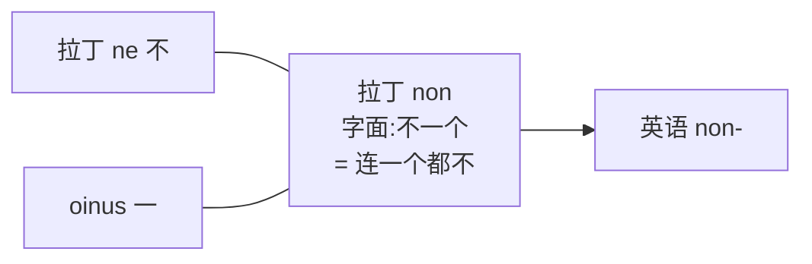
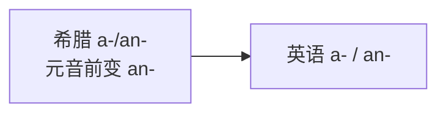

# 第 27 章 否定前缀为什么这么多:un- / in- / dis- / a-

> 英语想说一个"不",打开抽屉一看——好家伙,里面攒了八个前缀:`un-`、`in-`、`dis-`、`non-`、`a-`、`anti-`、`mal-`、`mis-`。否定这件事本该最简单,选哪个前缀却先把人逼出了选择困难症。

欢迎来到第 6 卷——**词缀的故事**。

前 5 卷我们讲的都是**词根**(spec、duc、bio...)。这一卷换个角度——讲**词缀本身**的来历。前缀和后缀不是凭空发明的,每一个都有自己的起源故事、自己的口音、自己的脾气。

我们从最常见的**否定前缀**讲起。它们看似都在摇头,但凑近一听,八个前缀各有各的出身:有的是本土老百姓,有的是渡海来的学者,有的是从希腊文献里走出来的书生。其中最能扛事的两位是 `un-` 和 `in-`——一个代表盎格鲁-撒克逊的日耳曼血统,一个代表罗马教会的拉丁血统,它俩的对峙,就是这一章的主线。

---

## 27.1 一个反常现象:否定前缀为什么有这么多

学英语的人常会困惑:**否定一个词,为什么有这么多前缀?** 问英语,英语两手一摊:"历史遗留,概不统一,不退款。"——上面这张表里那八个家伙,不是哪个委员会商量着发明的,而是日耳曼人、罗马人、希腊人各自带着自己的"不"字,在不同时代陆陆续续搬进英语,谁也没把谁赶走。

要理清这场混乱,得先认准本章的两位主角:**`un-` 和 `in-`**。它俩一个姓日耳曼、一个姓拉丁,在英语里各占山头,背后是一桩 1066 年的大事——诺曼征服。征服之后,朝廷、法院、教会、学校全被说法语、写拉丁的诺曼人把持,拉丁源的前缀 `in-` 也就跟着这帮"上等人"扎了根;而 `un-` 留在田间地头、灶台酒馆,陪着说英语的老百姓过活。前缀和词根,讲究一个**门当户对**——日耳曼词配 `un-`,拉丁词配 `in-`,井水不犯河水。这种阶级分野,直到现代才慢慢被打破:`unacceptable`、`unscientific` 这种"跨来源通婚",是后来的事。

下面先把这八个前缀一字排开,认认脸——

| 词 | 否定前缀 |
| ------ | ------ |
| unhappy | `un-` |
| invisible | `in-` |
| dishonest | `dis-` |
| atypical | `a-` |
| nonsense | `non-` |
| antisocial | `anti-` |
| counter-argue | `counter-` |
| malfunction 等 | `mal-` |

为什么不能统一用一个?词源解释了这些前缀为何同时存在,但现代英语的选择还受既有词形、语义和能产性约束。它们有常见搭配倾向,没有严格互斥的"词源领地"。

---

## 27.2 五个主要否定前缀的来历

### 前缀 1:`un-`(日耳曼源)

先出场的,是英语最亲的家里人——`un-`。它从原始印欧语的否定词根 `*n-` 一路走下来,经日耳曼语、古英语,稳稳当当地活到今天,血统纯正得能查家谱。`un-` 是英语否定前缀里**最高频、最口语、最亲切**的一个:你嘴边那句 `unhappy`、`undo`,用的就是它——短小、利落、不端架子,典型的老百姓做派。

**用法**:加在形容词、副词、名词前

| 词类 | 例词 |
| ------ | ------ |
| 形容词 | unhappy, unable, unclear, unknown |
| 动词 | undo, unfold |
| 名词 | unemployment, unhappiness |

不过这位"本土前缀"如今也不那么古板了——现代英语里,它常常越界,嫁到拉丁或希腊词根那边去:`unacceptable`、`unscientific`、`unconstitutional` 都是这种"跨阶层联姻"的产物。能否成家,看的是实际用得开不开,不是查祖宗三代。

### 前缀 2:`in-` / `im-` / `il-` / `ir-`(拉丁源)

如果说 `un-` 是田间地头的本分汉子,那 `in-` 就是坐着诺曼人的船、捧着圣经和法典渡海来的**学者教会前缀**。它来自拉丁,跟着朝廷、法院、教会、大学一路打进英语,所以你会在那些"听起来就很正式"的词里反复撞见它。`in-` 还有一手 `un-` 羡慕不来的绝活——**同化变形**:根据后面那个辅音的口音,它会换上不同的"马甲"。

**常见于历史形成的拉丁来源词**

| 形式 | 例词 |
| ------ | ------ |
| in- | invisible, incorrect, incomplete |
| im-(同化) | impossible |
| il-(同化) | illegal |
| ir-(同化) | irregular |

### in- 的同化规则(第 4 章讲过,这里复习)

`in-` 的变脸术,是拉丁发音习惯留下的遗产。它跑到双唇音 `b/p/m` 前面,嘴巴得闭上,于是化名 `im-`(`impossible`);撞上 `l`,干脆连名带姓改成 `il-`(`illegal`);碰见 `r`,就翻个面变 `ir-`(`irregular`)。**换的不是身份,是口音**——为了让两个辅音连在一起时嘴巴少受点罪。同样的道理也解释了:为什么 `un-` 不用这套把戏?因为它是日耳曼血统,发音规矩跟拉丁两套,压根没这习惯。

| 后跟 | 同化为 | 例词 |
| ------ | ------ | ------ |
| b / p / m(双唇音) | `im-` | impossible, immortal, immature |
| l | `il-` | illegal, illiterate, illogical |
| r | `ir-` | irregular, irresponsible, irrelevant |
| 其他 | `in-` | invisible, incorrect, incomplete |

### 前缀 3:`dis-`(拉丁源)

`dis-` 也是拉丁来的,但气质和 `in-` 截然不同。它的本义是"**撕成两半、分开**"——所以 `disagree` 不是客客气气地说一句"我不同意",而是**把对方的话一把撕开,甩回他脸上**。`un-` 是冷冷的"不",`dis-` 是带火气的"对着干"。这就是为什么 `disagree` 比 `unhappy` 更冲——前者是立场对立,后者只是心情不好。

**用法**:加在动词、形容词、名词前

| 词类 | 例词 |
| ------ | ------ |
| 动词 | disagree, disappear, disconnect |
| 形容词 | dishonest, disorder |
| 名词 | disadvantage |

### 前缀 4:`non-`(拉丁源)

`non-` 是否定前缀里最佛系的一个,用今天的话说——**摆烂式否定**。它来自拉丁,字面拆开是"不一个",`ne`(不)+ `oinus`(一个),合起来就是"**连一个都不**"。它从不跟谁吵架,也不站队,只是淡淡地把你归类:`non-smoker` 不是"我反对吸烟",而是"我不是吸烟的那一类人"。语气弱、色彩淡,是它最大的特点。

**用法**:加在名词、形容词前

| 例词 | 说明 |
| ------ | ------ |
| nonsense, nonstop, nonprofit | |
| non-violence, non-smoker | |

### 前缀 5:`a-`(希腊源)

`a-` 是从希腊文献里走出来的**书生前缀**。文艺复兴时,学者们直接从希腊文里搬词,这个小小的 `a-` 就跟着 `atheist`(无神论者)、`atom`(原子)一起进了英语。它很挑门第——基本只配希腊词根,不轻易外嫁。元音前面它还会加个 `n`,变成 `an-`(`anonymous` 匿名 = an + onym 名字)。

**用法**:加在希腊源词上(多为形容词)

| 例词 | 说明 |
| ------ | ------ |
| atypical | 非典型的 |
| asymmetric | 不对称的 |
| amoral | 非道德的 |
| anonymous | 匿名的:an + onym |
| apathy | 冷漠:a + path 感受 |

---

## 27.3 来源倾向不等于强制匹配

讲到这里,得给前面那条"门当户对"的主线打个补丁。历史上,前缀确实爱跟同源的词根搭伙:`un-` 配日耳曼词,`in-` 配拉丁词,`a-` 配希腊词——看上去井井有条。但这只是**倾向**,不是**法律**。现代英语早就通了婚:`un-` 跨界去配拉丁词根(`unacceptable`、`unscientific`、`unconstitutional`),`a-` 也跑去配拉丁的 `moral`(`amoral`)。前缀选谁,最终是**既有词形、意义和使用习惯**三方商量着办的,词源只是其中一个发言权较大的顾问。

**常见历史倾向与现代反例**

| 前缀 | 历史倾向 | 例词 |
| ------ | ------ | ------ |
| `un-` | 常见于本族词 | unhappy, unkind, unwise |
| `in-/im-/il-/ir-` | 多见于拉丁形成的既有词 | invisible, dishonest, nonsense |
| `a-/an-` | 多见于希腊形成的既有词 | atypical, amoral, apathetic |

**跨来源构词**:`un-` + acceptable / scientific / constitutional;`a-` + moral

---

## 27.4 几个特殊否定前缀

前面五个是主力,还有三个各带个性的"特勤队员"。它们不光说"不",还自带额外情绪——有的宣战,有的咒骂,有的认错。

### `anti-`(希腊源,反对)

`anti-` 来自希腊,本义就是"**对抗、反对**"。如果说 `dis-` 是嘴上拌两句,`anti-` 就是直接下战书——它一出场,就自带**宣战的姿势**。`disagree` 还只是"我不同意",`antisocial` 可不是"我不爱社交",而是"**我跟这个社会对着干**"。火力等级,一目了然。

| 例词 |
| ------ |
| antisocial, antibody, antifreeze |
| anti-war, anti-aging |

### `mal-`(拉丁源,坏、恶)

`mal-` 是个爱说坏话的前缀,来自拉丁 ***malus***(坏、恶)。它不否定,它直接**骂**——`malfunction` 是"坏功能",`malpractice` 是"坏行医",`malnutrition` 是"坏营养"。最妙的是 `malaria`(疟疾):`mal`(坏)+ `aria`(空气),字面就是"**坏空气**"。

| 例词 | 说明 |
| ------ | ------ |
| malfunction, malnutrition | |
| malformed, malpractice | |
| malaria | 疟疾:mal 坏 + aria 空气,古人以为疟疾由"坏空气"引起 |

*(传说)* 古罗马人有个绕不开的噩梦——沼泽。每逢夏秋,住在沼泽旁的人就开始一阵冷一阵热、打摆子、说倒就倒。他们想破脑袋也找不到病因,只觉得那片水洼子冒出的空气又腥又臭,闻着就让人恶心生病。于是这口锅,就稳稳扣在了"空气"头上:病是"坏空气"惹的,mal'aria,坏空气。直到十九世纪末,人们才揪出真凶——按蚊叮咬传播的疟原虫。可名字已经叫顺了嘴,"坏空气"三个字就这么凝固在 `malaria` 里,替沼泽背了一千多年的黑锅。

### `mis-`(日耳曼源,错、误)

最后出场的 `mis-` 是 `un-` 的老乡,同为日耳曼血统,本义是"**错、误**"。它不是"不",也不是"坏",而是"**搞错了**"——`mistake`(拿错)、`misunderstand`(理解错)、`misspell`(拼错)、`mislead`(带错路)。凡是它插手的,都带着一股"哎呀,搞砸了"的歉意。

| 例词 |
| ------ |
| misunderstand, misspell |
| misfortune, mislead |
| mistake |

---

## 27.5 一个对照表:否定前缀全景

八个前缀讲完,是时候让它们同台亮相了——想象一场"否定选秀",每位选手报上自己的出身、语感和拿手好戏:

**否定前缀全景对照**

| 前缀 | 来源 | 语感 | 例子 |
| ------ | ------ | ------ | ------ |
| `un-` | 日耳曼 | 纯否定 | unhappy, undo |
| `in-` | 拉丁 | 纯否定 | invisible, incorrect |
| `im-/il-/ir-` | 拉丁同化 | 纯否定 | impossible, illegal, irregular |
| `dis-` | 拉丁 | 否定 + 对立 | disagree, dishonest |
| `non-` | 拉丁 | 中性、分类 | nonsmoker, nonsense |
| `a-` | 希腊 | 纯否定 | atypical, amoral |
| `anti-` | 希腊 | 反对、对抗 | antisocial, antibody |
| `mal-` | 拉丁 | 坏、异常 | malfunction, malaria |
| `mis-` | 日耳曼 | 错、误 | mistake, mislead |

---

## 27.6 本章小结

否定这件事,本该最简单——摇摇头就完了。可英语偏偏攒了八个前缀,每个都带着自己出身的口音:日耳曼的 `un-` 亲切实用,拉丁的 `in-` 端着学者的架子、还会换口音,`dis-` 把话撕开扔回去,`non-` 摆烂式地分个类,`a-` 守着希腊的书卷气,`anti-` 一上来就宣战,`mal-` 张口就骂,`mis-` 一脸歉意地认错。它们能并存至今,靠的不是谁统一了谁,而是各自扎下了根。

1. **八个前缀是三股血统的历史叠加**——日耳曼(`un-`、`mis-`)、拉丁(`in-`、`dis-`、`non-`、`mal-`)、希腊(`a-`、`anti-`)在英语里并存,谁也没把谁赶走。其中 `un-` 与 `in-` 的分野,本质是 1066 年后老百姓词与朝廷教会词的阶级之别。
2. **没有强制的同源匹配原则**——来源造成搭配倾向,但 `unacceptable`、`unscientific`、`amoral` 都是跨来源反例;现代英语早就跨阶层通婚了。
3. **几个惊人词源**:malaria(坏空气,沼泽替蚊子背了一千多年的锅)、non-(字面"连一个都不")。

---

## 27.7 避坑提示

八个前缀都认识了,别急着用"一条规则套天下"——以下几个坑,专治想当然:

- **"门当户对"是历史倾向,不是构词法律**。`un-` 配日耳曼词、`in-` 配拉丁词是常见搭配,但 `unacceptable`、`amoral` 都在跨来源通婚。别拿"前缀必须同源"去套新词,英语早就不查户口了。
- **`un-` 不变脸,不是因为它懒**。`in-` 的 `im-/il-/ir-` 是拉丁发音遗产；`un-` 是日耳曼血统,压根没这套规矩——两家人各有各的口音习惯。
- **否定前缀的火力有级别**：`un-`（冷冷的"不"）< `dis-`（撕开甩回去）< `anti-`（直接下战书）。`disagree` 比 `unhappy` 更冲，`antisocial` 比 `disagree` 更硬——别把它们当同义词混着用。
- **`amoral` ≠ `immoral`**。前者"不涉及道德判断"，后者"违反道德"。一个是裁判不在场，一个是裁判举红牌——差别不小。

---

### 【思考题】(答案见附录 A)

1. `unhappy` 和 `invisible` 的前缀选择有何历史背景?为什么不能把这种倾向写成强制规则?
2. `disagree` 比 `unhappy` 更带"对立"色彩,为什么?(提示:dis- 含"相反动作")
3. `malaria` 的来源表达"坏空气",想想旧有病因观念如何凝固在疾病名称里。

---

*下一章 → [第 28 章 com-/con- 家族:拉丁 com-"共同"的同化史](./第28章-com-con家族.md)*
