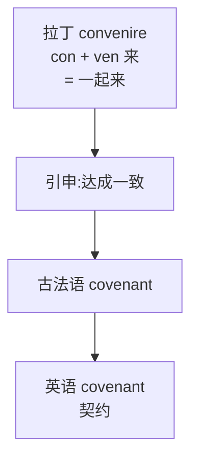

# 第 28 章 com-, con-家族的同化史

> 一个前缀想被接纳,先得学会改口音。`com-` 家族遇见 `l` 就改口叫 `col-`,遇见 `r` 就改口叫 `cor-`——五张脸,全是被发音逼出来的求生欲。

这一章讲一个特别"会做人"的拉丁前缀家族:**com- / con- / co- / col- / cor-**。

它的核心故事,可以叫**"一个前缀的变装史"**。拉丁前缀 ***com-*** 与介词 ***cum***(与……一起)同源,本义是"共同、一起"。但 `com-` 有个难处:它的尾巴是 `m`,一旦后面紧跟着另一个辅音,两个辅音就得打架,嘴巴别扭。于是它练出了一身见风使舵的本事——**遇见 `l` 就把自己换成 `col-`,遇见 `r` 就换成 `cor-`,遇见元音就瘦成 `co-`,其余场合就发成 `con-`**。为被接纳而改口音,为顺嘴而换皮肤,前缀活成了一支换装天团。

需要说明的是,英语里大量老词借入的是这些**已经在拉丁语里换好装**的形式,不是单个 `cum` 漂洋过海到英语海关才临时补办了五张脸。不过现代英语又把 `co-` 单独发展成了能继续造词的前缀,所以 `coauthor`、`coworker` 这类新组合,确实可以在英语里现场搭伙。旧家族和新生产线,要分开看。

> **com- 家族的五种面孔**
>
> `com-` / `con-` / `co-` / `col-` / `cor-`
>
> 为什么变五种?因为同化——为了连续发音时嘴巴少受点罪。

---

## 28.1 com- 与 cum 的共同义

拉丁 ***cum*** 是介词,意为“与……一起、带有”。同源前缀 `com-` 在许多词里保留了“搭伙、凑一块儿”的画面,在另一些老词里却弱化成加强义,甚至已经不能靠现代拆词直接看出来。先把“共同”当作主入口,别把它当成所有后代必须佩戴的校徽。

这个"一起"的画面一旦建立,很多看似无关的词忽然就眉目清楚了:`connect` /kəˈnɛkt/ 是把两段东西**系到一起**,`combine` /ˈkɑmbaɪn/ 是让两样**成双凑一对**,`cooperate` /koʊˈɑpəˌreɪt/ 是几个伙计**一块儿干活**。最妙的是,你能从字面里直接读出动作的味道——

| 词 | 拆解 | 推义 |
| ------ | ------ | ------ |
| `connect` | `con` + `nect`(系) | 系在一起 |
| `combine` | `com` + `bini`(成双) | 成双合在一起 |
| `communicate` /kəˈmjunəˌkeɪt/ | `com` + `mun`(共享)+ `ate` | 共同分享 |
| `cooperate` | `co` + `oper`(工作)+ `ate` | 共同工作 |

> **公式**:`con-`(共同) + 词根 = "一起做某事"

---

## 28.2 com- 的五种同化形

到了本章最像"变装秀"的一幕。`com-` 这一个前缀,把尾巴的 `m` 收放自如,根据后面那个辅音的脾气换装:碰到双唇音就保持 `com-`,碰到 `l` 就化身 `col-`,碰到 `r` 就改名 `cor-`。**换的不是身份,是衣裳**——为了在发音的连续动作里少别扭、少加班(同化原理和第 27 章 in- 的变脸是一回事):

| 前缀 | 同化条件 | 结果 | 例词 |
| ------ | ------ | ------ | ------ |
| `com-` | 在 b/m/p 前(双唇音) | com- | combine(结合), commit(承诺), compose /kəmˈpoʊz/(组成) |
| `col-` | 在 l 前 | col- | collaborate /kəˈlæbəˌreɪt/(合作), collapse /kəˈlæps/(倒塌), collect(收集) |
| `cor-` | 在 r 前 | cor- | correct(正确), correlate /ˈkɔrəˌleɪt/(相关), corrupt /kəˈrʌpt/(腐败) |
| `co-` | 在元音或 h 前 | co- | cooperate(合作), coheir(共同继承人) |
| `con-` | 其他(齿龈音、软腭音) | con- | connect(连接), conflict(冲突), confirm(确认) |

> **基本前缀**:`com-`

---

## 28.3 五种同化形的代表词

下面把五种"换装"的形式各看一组代表词。同一个前缀,五套衣裳,干的全是同一桩活计——"凑到一块儿"。如果你觉得接下来的表格有点多,请把它当成一场换装秀的后台照:每换一套,拍一张定妆照存档。

### com-(在 b/m/p 前)

| 词 | 拆解 | 推义 |
| ------ | ------ | ------ |
| `combine` /ˈkɑmbaɪn/ | com + bini 成双 | 结合 |
| `combat` /ˈkɑmbæt/ | com + bat 打 | 战斗(一起打 = 战斗) |
| `compose` /kəmˈpoʊz/ | com + pose 放 | 组成(放在一起) |
| `commit` /kəˈmɪt/ | com + mit 送 | 承诺(送出自己) |
| `compress` /kəmˈprɛs/ | com + press 压 | 压缩 |
| `compassion` /kəmˈpæʃən/ | com + pass 感受 | 同情(共同感受) |

### col-(在 l 前)

| 词 | 拆解 | 推义 |
| ------ | ------ | ------ |
| `collaborate` /kəˈlæbəˌreɪt/ | col + labor 劳动 | 合作 |
| `collapse` /kəˈlæps/ | col + lapse 滑 | 倒塌 |
| `collect` /kəˈlɛkt/ | col + lect 选 | 收集 |
| `collide` /kəˈlaɪd/ | col + lid 撞 | 碰撞 |
| `colloquial` /kəˈloʊkwiəl/ | col + loqu 说 | 口语的 |

### cor-(在 r 前)

| 词 | 拆解 | 推义 |
| ------ | ------ | ------ |
| `correct` /kəˈrɛkt/ | cor + rect 直 | 正确(使变直) |
| `correlate` /ˈkɔrəˌleɪt/ | cor + relate 关系 | 相关 |
| `corrupt` /kəˈrʌpt/ | cor + rupt 破 | 彻底破坏、败坏 |
| `correspond` /ˌkɔrəˈspɑnd/ | cor + respond 回应 | 通信/对应 |
| `corroborate` /kəˈrɑbəˌreɪt/ | cor + robor 强 | 证实(加强) |

### co-(历史形式,以及现代英语的能产形式)

| 词 | 拆解 | 推义 |
| ------ | ------ | ------ |
| `cooperate` /koʊˈɑpəˌreɪt/ | co + oper 工作 | 合作 |
| `coexist` /ˌkoʊɪɡˈzɪst/ | co + exist 存在 | 共存 |
| `cohabit` /koʊˈhæbɪt/ | co + habit 居住 | 同居 |
| `coordinate` /koʊˈɔrdəˌneɪt/ | co + ordin 顺序 | 协调 |
| `coauthor` /koʊˈɔθər/ | co + author 作者 | 合著(现代英语可直接构成) |

### con-(其他)

| 词 | 拆解 | 推义 |
| ------ | ------ | ------ |
| `connect` /kəˈnɛkt/ | con + nect 系 | 连接 |
| `conflict` /ˈkɑnflɪkt/ | con + flict 撞 | 冲突(一起撞) |
| `confirm` /kənˈfɜrm/ | con + firm 坚 | 确认 |
| `contest` /ˈkɑntɛst/ | con + test 证 | 竞赛(一起作证) |
| `convene` /kənˈvin/ | con + ven 来 | 集合(一起来) |
| `consent` /kənˈsɛnt/ | con + sent 感觉 | 同意(共同感觉) |

---

## 28.4 com-/con- 的"加强用法"

`con-` 在部分拉丁词里还有**加强或完成词义**的作用——它不一定贡献可直接翻成“一起”的现代意义。这里最容易栽跟头:同一个历史前缀,进入整词后可能表示共同,也可能只留下加强作用。下面这些是已经形成的历史词,不是看见 `con-` 就能现场套用的万能公式:

| 词 | 拆解 | 共同义? | 加强义 → 推义 |
| ------ | ------ | ------ | ------ |
| `consume` /kənˈsum/ | con + sum(取、拿) | 不是现代意义的“一起取” | → 取尽、用掉 |
| `complete` /kəmˈplit/ | com + ple(填满) | 不是“一起填” | → 填满、完成 |
| `confirm` /kənˈfɜrm/ | con + firm(使坚固) | 不是“一起坚固” | → 加强、确认 |

---

## 28.5 一个有趣的远亲:`covenant` /ˈkʌvənənt/(契约)

这一节是 `com-` 家族里最有画面感的故事。

`covenant`(契约、圣约)来自古法语 *covenant*,再往上追是拉丁 *convenire*——字面就是"**一起来、走到一起**",和 `convene` /kənˈvin/(集合)是同根亲兄弟。一份契约的最初画面,不是签字盖章,而是**两个人面对面走到一起,谈拢**。

走到"一起"是字面,落到"一致"是引申。中世纪的封君封臣制度,把这个"走到一起"演成了一套庄严的肢体仪式——**臣服礼**。

*(传说)* 附庸(封臣)空着双手来到领主面前,把自己的双手合拢,郑重放进领主摊开的掌心——这个动作叫 *immixtio manuum*,意思是"把手交到对方手里",象征把自己的人身交付出去。接着他口头念诵一段效忠词,发誓忠于领主。作为回报,领主会**递给他一撮土、一根树枝或一片草皮**——象征授予封地。一双手、一撮土、一段誓词,这就是中世纪契约的全部仪式。没有公证处,没有骑缝章,但比今天的合同多一份血肉和泥土的气息。

`covenant` 保存的就是这份原意:**走到一起,达成一致**。它后来在法律、宗教、圣经翻译里成了"圣约、盟约"的固定词。

> **同根三兄弟**:同样源自 `con- + ven-`(一起来)的还有 `convene`(集合,字面"凑到一处")、`covenant`(契约,字面"走到一起"),以及最让人意想不到的 `convenient` /kənˈvinjənt/(方便的)。`convenient` 为什么是"方便"?因为它的字面是"**凑得拢的**"——几个人时间对得上、能凑到一块儿,就是 convenient。从"凑得拢"到"方便",是顺水推舟的引申:大家都方便了,事就办成了。

---

## 28.6 拆词实战

认出 com/con/col/cor/co 的家族关系后,这些词会更容易分析。至于"秒拆",请给语义演变至少留两秒:

| 词 | 拆解 | 推义 |
| ---- | ------ | ------ |
| `combine` /ˈkɑmbaɪn/ | com + bine | 成双 → 结合 |
| `compose` /kəmˈpoʊz/ | com + pose | 放一起 → 组成 |
| `collaborate` /kəˈlæbəˌreɪt/ | col + labor | 一起劳动 → 合作 |
| `collect` /kəˈlɛkt/ | col + lect | 选一起 → 收集 |
| `correct` /kəˈrɛkt/ | cor + rect | 使变直 → 正确 |
| `corrupt` /kəˈrʌpt/ | cor- + rupt | 强化 + 破坏 → 彻底败坏、腐败 |
| `cooperate` /koʊˈɑpəˌreɪt/ | co + oper | 一起工作 → 合作 |
| `connect` /kəˈnɛkt/ | con + nect | 系一起 → 连接 |
| `conflict` /ˈkɑnflɪkt/ | con + flict | 一起撞 → 冲突 |
| `consent` /kənˈsɛnt/ | con + sent | 共同感觉 → 同意 |
| `convene` /kənˈvin/ | con + ven | 一起来 → 集合 |
| `compassion` /kəmˈpæʃən/ | com + pass | 共同感受 → 同情 |

---

## 28.7 本章小结

1. **`com-` 家族是一家子,不是五家人**——`com-/con-/col-/cor-/co-` 是同一个拉丁前缀的历史变体,变装只因发音别扭,变的是衣裳不是身份。
2. **历史换装有规律**:b/m/p 前常见 `com-`,l 前常见 `col-`,r 前常见 `cor-`,元音前可见 `co-`,其余常见 `con-`。这是拉丁词形留下来的遗产,不是给现代人当场改装的拼写规则;现代英语另有能继续造词的 `co-`,如 `coauthor`、`coworker`。
3. **`con-` 有两张脸**:"共同"(consent)和"加强"(consume)——前者拉人搭伙,后者替词根喊麦。

### 记忆锚点

> **看到 `com/con/col/cor/co`,先查是不是这家人;若是,再问它今天表示“共同”还是只剩加强义。衣裳能认脸,不能替整词判性格。**

---

## 28.8 易错辨析

- **五种同化形是拉丁旧衣裳,不是现场裁缝活**。`col-`、`cor-` 是拉丁语定型的成品,英语照搬进来的,不需要你对着新词当场改拼写。
- **不是所有 com/con/col/cor/co 开头的词都属这个家族**。`cone` /koʊn/(圆锥)里的 `con` 跟"共同"毫无关系——认亲之前先查家谱,别只看门牌号。
- **`con-` 的"加强"用法是看出来的,不是算出来的**。如果"共同 + 词根"讲不通(`consume` /kənˈsum/ ≠ 一起取),那它多半是在给词根喊"使劲！彻底！"。
- **`consent` /kənˈsɛnt/ 字面"共同感觉"很浪漫,但现代 `informed consent` 是法律术语**——核心是知情后自愿同意,不是两个人心有灵犀。

---

### 【思考题】(答案见附录 A)

1. `corrupt` 的 `cor-` 为什么应理解为强化形式,而不是"一起"?本章说 con-/com- 有"两张脸",那给你一个 con- 词,你怎么判断它这次是"共同"还是"加强"?
2. `cone`(圆锥)开头也有 `con`,却不属于这个"共同"家族。你怎么判断一个 con-/com- 词到底属不属于?"共同+词根讲不讲得通"是个好办法吗?够不够?
3. `com-` 随后面辅音同化。请拼出正确形式：`com-`+labor、`com-`+rect、`com-`+operate、`com-`+nect,并说明为什么会有这五种"衣裳"。

---

*下一章 → [第 29 章 希腊、拉丁数字前缀：uni-, bi-, tri-, sept-, oct-](./第29章-希腊、拉丁数字前缀：uni-,%20bi-,%20tri-,%20sept-,%20oct-.md)*
