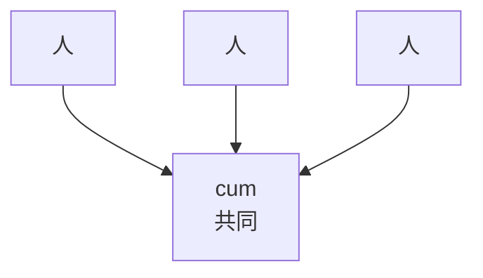
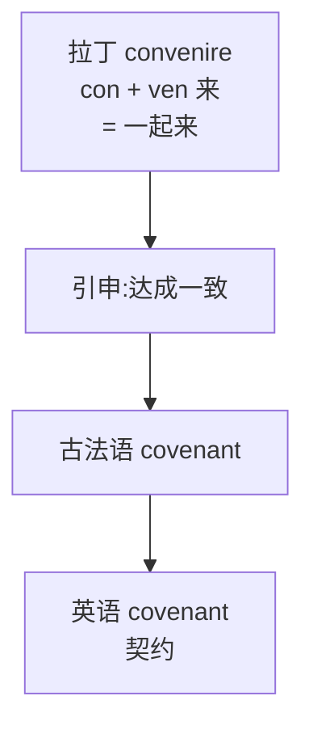

# 第 28 章 com-/con- 家族:拉丁 com-"共同"的同化史

> 一个前缀想被接纳,先得学会改口音。`com-` 家族遇见 `l` 就改口叫 `col-`,遇见 `r` 就改口叫 `cor-`——五张脸,全是被发音逼出来的求生欲。

这一章讲一个特别"会做人"的拉丁前缀家族:**com- / con- / co- / col- / cor-**。

它的核心故事,可以叫**"一个前缀的变装史"**。拉丁前缀 ***com-*** 与介词 ***cum***(与……一起)同源,本义是"共同、一起"。但 `com-` 有个难处:它的尾巴是 `m`,一旦后面紧跟着另一个辅音,两个辅音就得打架,嘴巴别扭。于是它练出了一身见风使舵的本事——**遇见 `l` 就把自己换成 `col-`,遇见 `r` 就换成 `cor-`,遇见元音就瘦成 `co-`,其余场合就发成 `con-`**。为被接纳而改口音,为顺嘴而换皮肤,前缀活成了一支换装天团。

需要说明的是,英语借入的是这些**已经在拉丁语里换好装**的词,不是单个 `cum` 漂洋过海到英语海关才临时补办了五张脸。我们今天看到的五种形式,是拉丁人当年发音顺嘴留下的遗产,英语只是照单全收。

> **com- 家族的五种面孔**
>
> `com-` / `con-` / `co-` / `col-` / `cor-`
>
> 为什么变五种?因为同化——为了连续发音时嘴巴少受点罪。

---

## 28.1 com- 与 cum 的共同义

拉丁 ***cum*** 是介词,意为"**与……一起、带有**"——直白说就是"搭伙、凑一块儿"。同源前缀 `com-` 把这股"凑一堆"的劲儿带进了所有派生词里。先在脑子里钉死这个画面:**两个人(或多人)朝同一个方向使力,呼吸同频,脚步合拍**——这就是 `com-` 的本相。

这个"一起"的画面一旦建立,很多看似无关的词忽然就眉目清楚了:`connect` 是把两段东西**系到一起**,`combine` 是让两样**成双凑一对**,`cooperate` 是几个伙计**一块儿干活**。最妙的是,你能从字面里直接读出动作的味道——

| 词 | 拆解 | 推义 |
| ------ | ------ | ------ |
| `connect` | `con` + `nect`(系) | 系在一起 |
| `combine` | `com` + `bini`(成双) | 成双合在一起 |
| `communicate` | `com` + `mun`(共享)+ `ate` | 共同分享 |
| `cooperate` | `co` + `oper`(工作)+ `ate` | 共同工作 |

> **公式**:`con-`(共同) + 词根 = "一起做某事"

---

## 28.2 com- 的五种同化形

到了本章最像"变装秀"的一幕。`com-` 这一个前缀,把尾巴的 `m` 收放自如,根据后面那个辅音的脾气换装:碰到双唇音就保持 `com-`,碰到 `l` 就化身 `col-`,碰到 `r` 就改名 `cor-`。**换的不是身份,是衣裳**——为了在发音的连续动作里少别扭、少加班(详见第 4 章的同化):

| 前缀 | 同化条件 | 结果 | 例词 |
| ------ | ------ | ------ | ------ |
| `com-` | 在 b/m/p 前(双唇音) | com- | combine(结合), commit(承诺), compose(组成) |
| `col-` | 在 l 前 | col- | collaborate(合作), collapse(倒塌), collect(收集) |
| `cor-` | 在 r 前 | cor- | correct(正确), correlate(相关), corrupt(腐败) |
| `co-` | 在元音或 h 前 | co- | cooperate(合作), coheir(共同继承人) |
| `con-` | 其他(齿龈音、软腭音) | con- | connect(连接), conflict(冲突), confirm(确认) |

> **基本前缀**:`com-`

---

## 28.3 五种同化形的代表词

下面把五种"换装"的形式各看一组代表词。请留意:同一件事——"凑到一块儿"——因为后面那个辅音不同,前缀换了五件衣裳,但干的是同一桩活计。

### com-(在 b/m/p 前)

| 词 | 拆解 | 推义 |
| ------ | ------ | ------ |
| `combine` | com + bini 成双 | 结合 |
| `combat` | com + bat 打 | 战斗(一起打 = 战斗) |
| `compose` | com + pose 放 | 组成(放在一起) |
| `commit` | com + mit 送 | 承诺(送出自己) |
| `compress` | com + press 压 | 压缩 |
| `compassion` | com + pass 感受 | 同情(共同感受) |

### col-(在 l 前)

| 词 | 拆解 | 推义 |
| ------ | ------ | ------ |
| `collaborate` | col + labor 劳动 | 合作 |
| `collapse` | col + lapse 滑 | 倒塌 |
| `collect` | col + lect 选 | 收集 |
| `collide` | col + lid 撞 | 碰撞 |
| `colloquial` | col + loqu 说 | 口语的 |

### cor-(在 r 前)

| 词 | 拆解 | 推义 |
| ------ | ------ | ------ |
| `correct` | cor + rect 直 | 正确(使变直) |
| `correlate` | cor + relate 关系 | 相关 |
| `corrupt` | cor + rupt 破 | 彻底破坏、败坏 |
| `correspond` | cor + respond 回应 | 通信/对应 |
| `corroborate` | cor + robor 强 | 证实(加强) |

### co-(在元音前)

| 词 | 拆解 | 推义 |
| ------ | ------ | ------ |
| `cooperate` | co + oper 工作 | 合作 |
| `coexist` | co + exist 存在 | 共存 |
| `cohabit` | co + habit 居住 | 同居 |
| `coordinate` | co + ordin 顺序 | 协调 |
| `coauthor` | co + author 作者 | 合著 |

### con-(其他)

| 词 | 拆解 | 推义 |
| ------ | ------ | ------ |
| `connect` | con + nect 系 | 连接 |
| `conflict` | con + flict 撞 | 冲突(一起撞) |
| `confirm` | con + firm 坚 | 确认 |
| `contest` | con + test 证 | 竞赛(一起作证) |
| `convene` | con + ven 来 | 集合(一起来) |
| `consent` | con + sent 感觉 | 同意(共同感觉) |

---

## 28.4 com-/con- 的"加强用法"

`con-` 还有第二个隐秘身份:**加强词义**——它不贡献"一起"的意思,纯粹在后面喊"使劲!彻底!"。这是 `com-` 家族最容易让人栽跟头的地方:同一个前缀,既能是"搭伙",也能是"放大音量"。判断它这次扮的是哪个角色,看一眼词义和词根对不对得上就行——

| 词 | 拆解 | 共同义? | 加强义 → 推义 |
| ------ | ------ | ------ | ------ |
| `confection` | con + fect(做) | 不是"一起做",而是"做得充分" | → 精致的糖果 |
| `consume` | con + sum(取) | 不是"一起取",而是"完全取" | → 完全用掉 |
| `confute` | con + fute(倒) | 不是"一起倒",而是"彻底倒" | → 彻底驳倒 |

---

## 28.5 一个有趣的远亲:`covenant`(契约)

这一节是 `com-` 家族里最有画面感的故事。

`covenant`(契约、圣约)来自古法语 *covenant*,再往上追是拉丁 *convenire*——字面就是"**一起来、走到一起**",和 `convene`(集合)是同根亲兄弟。一份契约的最初画面,不是签字盖章,而是**两个人面对面走到一起,谈拢**。

走到"一起"是字面,落到"一致"是引申。中世纪的封君封臣制度,把这个"走到一起"演成了一套庄严的肢体仪式——**臣服礼**。

*(传说)* 附庸(封臣)空着双手来到领主面前,把自己的双手合拢,郑重放进领主摊开的掌心——这个动作叫 *immixtio manuum*,意思是"把手交到对方手里",象征把自己的人身交付出去。接着他口头念诵一段效忠词,发誓忠于领主。作为回报,领主会**递给他一撮土、一根树枝或一片草皮**——象征授予封地。一双手、一撮土、一段誓词,这就是中世纪契约的全部仪式。没有公证处,没有骑缝章,但比今天的合同多一份血肉和泥土的气息。

`covenant` 保存的就是这份原意:**走到一起,达成一致**。它后来在法律、宗教、圣经翻译里成了"圣约、盟约"的固定词。

> **同根三兄弟**:同样源自 `con- + ven-`(一起来)的还有 `convene`(集合,字面"凑到一处")、`covenant`(契约,字面"走到一起"),以及最让人意想不到的 `convenient`(方便的)。`convenient` 为什么是"方便"?因为它的字面是"**凑得拢的**"——几个人时间对得上、能凑到一块儿,就是 convenient。从"凑得拢"到"方便",是顺水推舟的引申:大家都方便了,事就办成了。

---

## 28.6 拆词实战

认出 com/con/col/cor/co 的家族关系后,这些词会更容易分析。至于"秒拆",请给语义演变至少留两秒:

| 词 | 拆解 | 推义 |
| ---- | ------ | ------ |
| `combine` | com + bine | 成双 → 结合 |
| `compose` | com + pose | 放一起 → 组成 |
| `collaborate` | col + labor | 一起劳动 → 合作 |
| `collect` | col + lect | 选一起 → 收集 |
| `correct` | cor + rect | 使变直 → 正确 |
| `corrupt` | cor- + rupt | 强化 + 破坏 → 彻底败坏、腐败 |
| `cooperate` | co + oper | 一起工作 → 合作 |
| `connect` | con + nect | 系一起 → 连接 |
| `conflict` | con + flict | 一起撞 → 冲突 |
| `consent` | con + sent | 共同感觉 → 同意 |
| `convene` | con + ven | 一起来 → 集合 |
| `compassion` | com + pass | 共同感受 → 同情 |

---

## 28.7 本章小结

### 你应该带走的三个认知

1. **`com-` 家族是一家子,不是五家人**——`com-/con-/col-/cor-/co-` 是同一个拉丁前缀的历史变体,变装只因发音别扭,变的是衣裳不是身份。
2. **换装有规律**:b/m/p 前是 `com-`,l 前是 `col-`,r 前是 `cor-`,元音前是 `co-`,其余是 `con-`。这是拉丁词形留下来的遗产,不是给现代人当场改装的拼写规则。
3. **`con-` 有两张脸**:"共同"(consent)和"加强"(consume)——前者拉人搭伙,后者替词根喊麦。

### 记忆锚点

> **看到 `com/con/col/cor/co`,先想"共同",再瞄一眼后面那个辅音,就知道它今天穿了哪件衣裳。**

---

## 28.8 避坑提示

本章为了讲故事,把一些复杂问题简化了:

- **五种同化形是历史词形规律,不是要求现场变形**。`com-` 的末尾鼻音受后一个辅音影响,在 `l`、`r` 前分别写成 `col-`、`cor-`——这是拉丁语已经定型的事,英语只是借入成品,现代学习者不需要对着新词逐个改。
- **不能反过来断言:凡是写成 com/con/col/cor/co 的都属这个前缀**。判断要看整体词源和词根,不是看前几个字母。
- **`consent` 字面可解作"共同感受",但现代 `informed consent` 是法律和医学伦理术语**,核心是当事人在充分知情后自愿同意,不能只靠字面浪漫化为"共同感觉"。
- **`compassion`(共同感受)和 `sympathy`(syn + path)意思相近,走的是不同语言路线**——前者拉丁,后者希腊。
- **`con-` 的"加强"用法是看出来的,不是算出来的**。判断标准是词义和词根是否吻合:如果"共同 + 词根"讲不通,那它多半是加强用法。

---

### 【思考题】(答案见附录 D)

1. `compassion`(同情)字面是"共同感受",想想为什么"共感"等于同情?
2. `consent`(同意)字面是"共同感觉",为什么"共感"引申为"同意"?
3. `corrupt` 中的 `cor-` 为什么应理解为强化形式,而不是"一起"?

---

*下一章 → [第 29 章 希腊、拉丁数字前缀:uni / bi / tri / sept / oct](./第29章-数字前缀.md)*
