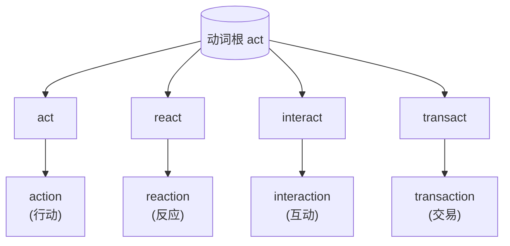

# 第 30 章 -tion的身世：从拉丁名词后缀到英语常见名词后缀

> `-tion` 是英语里最强的"名词信号"。一份政府公文从第一页翻到最后一页,`consideration` /kənˌsɪdəˈreɪʃən/、`investigation` /ɪnˌvɛstəˈɡeɪʃən/、`implementation` /ˌɪmpləmɛnˈteɪʃən/、`communication` /kəˌmjunəˈkeɪʃən/ 轰隆隆地排过去,纸面轰鸣如坦克履带。它不是后缀,它是**诺曼征服带来的学者制服**。

这一章讲英语里最强、最常见、也最"官腔"的名词后缀——`-tion`(还有它那个不太爱抛头露面的兄弟 `-sion`)。

1066 年,诺曼底公爵威廉渡海打进了英格兰。从那天起,法语成了朝廷、法院、教会的语言,拉丁语把持着文书和学问;而说英语的老百姓,被挤到田里去种地。`-tion` 就是跟着这股**权力潮水**一起涌进英语的——它出身拉丁,经法语中介,落地时身上自带一股"我是公家派来的"味道。**正式感,很多时候就是权力距离**。为什么政府公文满纸 `-tion`?因为 `-tion` 一响,听者就得立正——它把每个动词都熨成了一纸红头文件。

但这一章不只想说"-tion 让人正式"。它的来历藏在拉丁语法里,而且有两条截然不同的入英之路。别紧张,本章只追后缀的履历,不举行拉丁语变格突击考试。

---

## 30.1 -tion 的拉丁起源

### 一个名词构词故事

`-tion` 追溯到拉丁名词后缀 ***-tiō***,属格 ***-tiōnis***,后来经法语和拉丁借词进入英语。

罗马人用它干什么?**给动词发一张"我已经是名词了"的工作证**。动词 `educare`(教育)是动作、是过程、是正在发生的事;可你总不能老让它在句子里跑来跑去。于是罗马人往它尾巴上拍一块 `-tiō`,动作就凝固成了 `educatio`——"教育这件事"。`-tiō` 的作用,就是把一个正在进行的动作,定格成一件可以点名、可以归档、可以写进公文的东西:动作、过程、状态、结果,它全收。

这里得先查一次工作证:`-tiō` **不是拉丁动名词、动形词或目的式(supine)**。几位都在动词隔壁上班,工牌却不通用。拉丁动名词是按名词方式使用的动词形式;`agenda` 也不是动名词,而是动形词 *agendum* 的中性复数,字面是“待办的事情”;目的式常见 `-um/-ū`,同样另有编制。它们偶尔都在句子里干点名词的活,不等于可以把四张门禁卡订成一本。

---

## 30.2 -tion 进入英语的两条路

`-tion` 进英语,走的是两条截然不同的路——一条跟着刀剑和权力进来,一条跟着学者和墨水进来。

### 路 1:经法语(1066 年后)

第一条路,是**权力的路**。诺曼征服之后,法语统治了英格兰的朝廷、法院、教会、文书的办公桌长达三百年。说英语的人写不动公文,写公文的人不说英语;而那些带着 `-tion` 的法语词——`nation` /ˈneɪʃən/、`action`、`option` /ˈɑpʃən/——就坐着权力的马车,一辆辆驶进英语的词汇马厩。它们进来时,身上还带着一股法庭和宫廷的味道:正式、严肃、不容置喙。这批早期 `-tion` 词,大多是在中古英语时期经法语这条权力通道进入的:

### 路 2:学术拉丁与后来的造词生产线

第二条路,是**学者的路**。文艺复兴与近代学术扩张后,英国作者频繁去古典仓库进货,一箱箱往英语里搬。不过箱子上的快递单并不相同:`education` 在早期近代英语中兴起,`information` 更早已有法语与拉丁背景,`organization` 则明显晚到。它们今天都穿着 `-tion` 制服站成一排,不代表当年挤在同一辆 16 世纪“直供车”里。

| 进入英语的路线 | 英语词 | 释义 |
| ------ | ------ | ------ |
| 拉丁词族,早期近代英语中发展 | `education` | 教育 |
| 拉丁词族,兼有法语传递背景 | `information` | 信息;路线较早且不是单线直借 |
| 以 `organize` 为基础的较晚形成 | `organization` /ˌɔrɡənəˈzeɪʃən/ | 组织;不是文艺复兴早期同批货物 |

> **提示** 这两条路是地图上的粗线,不是海关的两扇单选门。`civilization` 主要在 18 世纪沿法语 `civilisation` 进入英语,就不肯老实坐进“文艺复兴拉丁直借”那一格。查具体词时,还得翻它自己的车票。

---

## 30.3 -tion 的变体:-sion

`-tion` 有个长得差不多的兄弟,叫 `-sion`。它俩今天都拖着个 `-ion` 的尾巴,前面却一个顶着 `t`、一个顶着 `s`,像是同一个家族的两个房支,各自继承了不同的祖产。

这 `s` 是凭空冒出来的吗?**不是**。`-tion`、`-sion`(以及更朴素的 `-ion`)的分布,继承的是拉丁语名词词干的历史形状,加上后来法语、英语一路传下来的音形变化——是祖上分家时各自搬走的不同物件,**不是现代英语看一眼动词尾巴、临时决定该用 `t` 还是 `s`**。所以别妄想有个"看最后一个字母"的万能口诀;这事儿得认祖:

| 后缀 | 动词/词根 | 名词 | 备注 |
| ------ | ------ | ------ | ------ |
| `-tion` | `educate + tion` | `education` | 标准形 |
| `-tion` | `inform + ation` | `information` | 标准形 |
| `-tion` | `organize + ation` | `organization` /ˌɔrɡənəˈzeɪʃən/ | 标准形 |
| `-sion` | `decide` /ˌdɪˈsaɪd/ | `decision` | ← 拉丁 decidere / decisionem |
| `-sion` | `invade` | `invasion` /ɪnˈveɪʒən/ | ← 拉丁 invadere / invasionem |
| `-sion` | `comprehend + sion` | `comprehension` /ˌkɑmprəˈhɛnʃən/ | 继承另一历史词干 |
| `-sion` | `confuse + sion` | `confusion` /kənˈfjuʒən/ | 继承另一历史词干 |

---

## 30.4 -tion 的"前缀 + 动词 + tion"模板

认识了 `-tion` 的两条入英之路,接下来看它最拿手的团队作战——跟前缀、词根凑成一桌三件套,批量生产"红头文件词"。

`-tion` 还擅长打配合战:它爱和前缀、词根凑成一桌——动词在中间干活,前缀在前面定方向,`-tion` 在尾巴上盖戳,一桌三件套,造出 `action`、`reaction` /riˈækʃən/、`interaction` /ˌɪntərˈækʃən/、`transaction` /trænˈzækʃən/ 这种"一家子动词名"。但要泼盆冷水:这是**高频词族的既成模式,不是给任意动词套用的自动配方**。你不能把 `sleep` 拍个 `-tion` 就指望得到 `sleeption`——英语会当场给你退件。下面这组,都是拉丁来源、有血统可查的:

### 一组对照:动词 vs 名词

| 动词 | 名词 |
| ------ | ------ |
| create | creation |
| educate | education |
| produce | production |
| reduce | reduction |
| introduce | introduction |
| connect | connection |
| direct | direction |
| protect | protection |
| invent | invention |
| prevent | prevention |
| adopt | adoption |

---

## 30.5 -tion 的"复合后缀"

`-tion` 自己能干,还爱拉别的后缀组队,把名词进一步加工成更长的一串——加个 `-al` 可以变形容词(`national`),加个 `-ist` 可以指人(`evolutionist` /ˌɛvəˈluʃənɪst/),加个 `-ary` 可以变成形容词或指人名词(`revolutionary` /ˌrɛvəˈluʃəˌnɛri/)。"革命的"和"革命者"都能穿这件衣服,可不是加上去就自动成立一个派系。相当于它不仅自己盖章,还跟同事串通好,一条流水线把词性从头改到尾:

| 复合后缀 | 词基 + 后缀 | 结果 | 用途 |
| ------ | ------ | ------ | ------ |
| `-ation` | `educate → education` | `education` | 现代学习可看作 -ate 换成 -ation |
| `-ation` | `determine → determination` | `determination` /dɪˌtɜrməˈneɪʃən/ | 现代词形对应,不是 determin 后现场加出动词 -ate |
| `-ation` | `explore → exploration` | `exploration` /ˌɛkspləˈreɪʃən/ | 现代词形对应,历史上承接拉丁词干 |
| `-ition` | `add + ition` | `addition` | 拉丁源词根加 -ition |
| `-ition` | `oppos + ition` | `opposition` /ˌɑpəˈzɪʃən/ | 拉丁源词根加 -ition |
| `-ition` | `posit + ion` | `position` | 拉丁源词根加 -ition |
| `-tion + -al` | `education + al` | `educational` /ˌɛdʒəˈkeɪʃənəl/ | 形容词 |
| `-tion + -al` | `nation + al` | `national` | 形容词 |
| `-tion + -al` | `emotion + al` | `emotional` /ɪˈmoʊʃənəl/ | 形容词 |
| `-ion + -ist` | `abolition + ist` | `abolitionist` /ˌæbəˈlɪʃənɪst/ | 人 |
| `-ion + -ist` | `evolution + ist` | `evolutionist` | 人 |
| `-ion + -ary` | `revolution + ary` | `revolutionary` | 形容词/名词 |

---

## 30.6 一个有趣的发现:英语"名词膨胀"

翻开一篇学术论文,`investigation`、`implementation`、`consideration` 常会抱着文件夹一窝蜂涌出来——这就是英语的**名词膨胀**:`-tion` 把动作装进名词纸箱,句子立刻厚得像政府白皮书。但抽象名词厂不只这一条生产线。日耳曼词走的是老作坊路线:`happy` 加 `-ness` 成了 `happiness`,`grow` 经历史词形变化和 `-th` 构词留下 `growth`。一边机器轰鸣,一边老师傅敲敲打打,最后都把名词送进句子。

为什么学术和公文偏偏独宠 `-tion`?**因为它在"正式感"和"模糊性"之间,精准踩中了那个甜点**。`decide` /ˌdɪˈsaɪd/ 是谁拍板,一目了然;`decision` 听起来更含蓄、更可推诿、更像"集体的"产物。`investigate` /ˌɪnˈvɛstəɡˌeɪt/ 像有人撅着屁股在挖;`investigation` 像一份盖了章的报告。**`-tion` 把动作熨平,把责任稀释,把语气抬高**——这三样,正是正式文体最想要的。

| 来源 | 动词/形容词 | 抽象名词 | 名词化方式 |
| ------ | ------ | ------ | ------ |
| 拉丁源 | `decide` | `decision` | `+ tion/sion` |
| 拉丁源 | `communicate` /kəˈmjunəˌkeɪt/ | `communication` /kəˌmjunəˈkeɪʃən/ | `+ tion/sion` |
| 拉丁源 | `investigate` | `investigation` | `+ tion/sion` |
| 拉丁源 | `contribute` /kənˈtrɪbjut/ | `contribution` /ˌkɑntrəˈbjuʃən/ | `+ tion/sion` |
| 日耳曼源 | `happy` | `happiness` | `+ ness` |
| 日耳曼源 | `grow` | `growth` | 历史词形变化 + `-th` 名词构词 |
| 日耳曼源 | `dark` | `darkness` /ˈdɑrknəs/ | `+ ness` |

---

## 30.7 -tion 的"陷阱":发音变化

`-tion` 还埋了个雷:拼写一模一样,嘴巴却分两种念法。多数时候它温顺地读 `/ʃən/`(像"神"),可一到 `question`、`suggestion` /səɡˈdʒɛstʃən/ 嘴边,它忽然撅嘴读成 `/tʃən/`(像"晨")——同一个后缀,同一身行头,进了不同词的嘴就改了口音:

| 发音 | 读法 | 例词 |
| ------ | ------ | ------ |
| 标准 `/ʃən/` | 读"神" | `nation` /ˈneɪʃən/, `education`, `communication` /kəˌmjunəˈkeɪʃən/ |
| 特殊 `/tʃən/` | 读"晨" | `question`, `suggestion`, `combustion` /kəmˈbʌstʃən/ |

> **规则**:
> - 词根以 `s` 后接 `t` 的,常读 `/tʃən/`;
> - 其余大多读 `/ʃən/`。

---

## 30.8 本章小结

1. **`-tion` 来自拉丁名词后缀 -tiō/-tiōnis**——它是动词的“名词工作证”,但不是拉丁动名词、动形词或目的式。`agenda` 是动形词形式留下的词,目的式则是另一类动词性名词。
2. **`-tion` 是英语里最强的"名词信号"**——但它能指的远不止抽象概念:`nation` /ˈneɪʃən/(群体)、`station`(地点)、`question`(可数的"一个问题"),都是它签发的。
3. **`-sion` 是另一条腿,不是 `-tion` 的拼写事故**——`decide/decision` 里的 `s` 不是英语为发音顺手临时抠掉的 `d`,而是两个词各借入了同一拉丁词族的不同词干。

### 记忆锚点

> **`-tion` 是动词的官员制服:一穿上,动作就变成了公文。** 记住这个"换装盖章"的画面——但请成对地记(`produce/production`、`decide/decision`),别自己拿 `+tion` 去给任意动词现场缝制服,英语海关会退件。

---

## 30.9 易错辨析

- **别自行给任意动词追加 `-tion`**。`produce/production`、`create/creation` 是配好的成品套餐;`sleep` + `-tion` = `sleeption`？英语海关会当场退件,连包装都不拆。
- **`-tion` 和 `-sion` 的分布没有万能口诀**。它们各自继承了不同的拉丁词干,不是看动词最后一个字母就能决定的。`decide/decision` 里的 `s` 是祖传的,不是英语为顺嘴临时抠掉 `d` 换上的。
- **`-tion` 听起来正式,不等于一定更好**。满纸 `investigation` /ɪnˌvɛstəˈɡeɪʃən/、`implementation` /ˌɪmpləmɛnˈteɪʃən/ 的论文,读起来像坦克过马路——有时直接说 `investigate` /ˌɪnˈvɛstəɡˌeɪt/ 反而更清楚。正式感是工具,不是勋章。
- **同样拼 `-tion`,嘴巴分两种**。`nation` 读 `/ʃən/`("神")，`question` 读 `/tʃən/`("晨")——记词时连读音一起记,别让嘴巴替你即兴发挥。

---

### 【思考题】(答案见附录 A)

1. `decide/decision` 为什么不能解释成"为方便发音删掉 d 再加 -sion"?那个 s 到底从哪来?
2. `nation` 读 /ʃən/、`question` 读 /tʃən/,发音为什么不同?这个差异是随机的,还是反映了词的某种结构?
3. 你能不能给 `sleep` 加 `-tion` 造出 `sleeption`?为什么不行?`-tion` 到底能加在什么词上?顺带：满纸 `investigation`、`implementation` 的写作有什么代价,什么时候该改回动词?

---

*下一章 → [第 31 章 -able的身世：从拉丁形容词后缀到英语高产后缀](./第31章--able的身世：从拉丁形容词后缀到英语高产后缀.md)*
