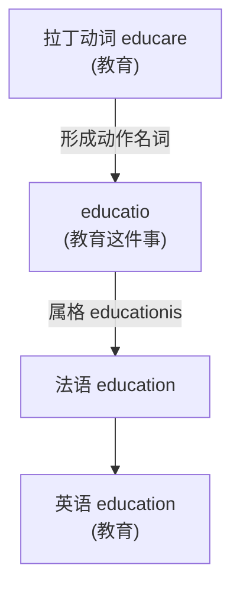
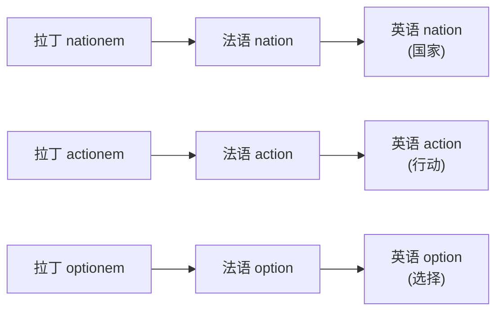
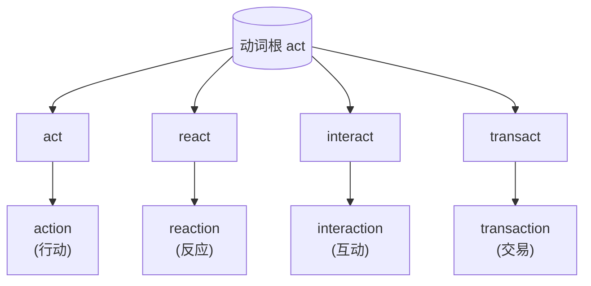

# 第 30 章 -tion 的身世:从拉丁名词后缀到英语常见名词后缀

> `-tion` 是英语里最强的"名词信号"。一份政府公文从第一页翻到最后一页,`consideration`、`investigation`、`implementation`、`communication` 轰隆隆地排过去,纸面轰鸣如坦克履带。它不是后缀,它是**诺曼征服带来的学者制服**。

这一章讲英语里最强、最常见、也最"官腔"的名词后缀——`-tion`(还有它那个不太爱抛头露面的兄弟 `-sion`)。

1066 年,诺曼底公爵威廉渡海打进了英格兰。从那天起,法语成了朝廷、法院、教会的语言,拉丁语把持着文书和学问;而说英语的老百姓,被挤到田里去种地。`-tion` 就是跟着这股**权力潮水**一起涌进英语的——它出身拉丁,经法语中介,落地时身上自带一股"我是公家派来的"味道。**正式感,很多时候就是权力距离**。为什么政府公文满纸 `-tion`?因为 `-tion` 一响,听者就得立正——它把每个动词都熨成了一纸红头文件。

但这一章不只想说"-tion 让人正式"。它的来历藏在拉丁语法里,而且有两条截然不同的入英之路。别紧张,本章只追后缀的履历,不举行拉丁语变格突击考试。

---

## 30.1 -tion 的拉丁起源

### 一个名词构词故事

`-tion` 追溯到拉丁名词后缀 ***-tiō***,属格 ***-tiōnis***,后来经法语和拉丁借词进入英语。

罗马人用它干什么?**给动词发一张"我已经是名词了"的工作证**。动词 `educare`(教育)是动作、是过程、是正在发生的事;可你总不能老让它在句子里跑来跑去。于是罗马人往它尾巴上拍一块 `-tiō`,动作就凝固成了 `educatio`——"教育这件事"。`-tiō` 的作用,就是把一个正在进行的动作,定格成一件可以点名、可以归档、可以写进公文的东西:动作、过程、状态、结果,它全收。

但得说清楚:`-tiō` **不是拉丁动名词,也不是目的分词**。这三个是不同的拉丁家伙,各干各的活——动名词尾巴是 `-nd-`(像 `agenda` 字面就是"待办的事"),目的分词是 `-tum/-tū` 那一系。它们仨长相不同、来历不同,别因为都"长得像名词"就凑成一家人。

---

## 30.2 -tion 进入英语的两条路

`-tion` 进英语,走的是两条截然不同的路——一条跟着刀剑和权力进来,一条跟着学者和墨水进来。

### 路 1:经法语(1066 年后)

第一条路,是**权力的路**。诺曼征服之后,法语统治了英格兰的朝廷、法院、教会、文书的办公桌长达三百年。说英语的人写不动公文,写公文的人不说英语;而那些带着 `-tion` 的法语词——`nation`、`action`、`option`——就坐着权力的马车,一辆辆驶进英语的词汇马厩。它们进来时,身上还带着一股法庭和宫廷的味道:正式、严肃、不容置喙。这批早期 `-tion` 词,大多是在中古英语时期经法语这条权力通道进入的:

### 路 2:文艺复兴直接借(16-17 世纪)

第二条路,是**学者的路**。文艺复兴来了,英国学者一头扎进拉丁古籍,搬词搬得不亦乐乎。*(传说)* 这帮人凑在一起,互相攀比谁造的词更"古典"、更像刚从西塞罗手稿里抠出来的原装货——你搬一个 `civilization`,我就搬一个 `education`,他再补一个 `information`,活像一场拉丁词的军备竞赛。他们懒得再走法语那一道二手工序,直接从拉丁原典里拎词,拍上 `-tion`,就塞进英语。于是这批 16-17 世纪的"直供词"新鲜出炉:

| 拉丁源 | 英语词 | 释义 |
| ------ | ------ | ------ |
| `civilizationem` | `civilization` | 文明 |
| `educationem` | `education` | 教育 |
| `informationem` | `information` | 信息 |
| `organizationem` | `organization` | 组织 |

---

## 30.3 -tion 的变体:-sion

`-tion` 有个长得差不多的兄弟,叫 `-sion`。它俩今天都拖着个 `-ion` 的尾巴,前面却一个顶着 `t`、一个顶着 `s`,像是同一个家族的两个房支,各自继承了不同的祖产。

这 `s` 是凭空冒出来的吗?**不是**。`-tion`、`-sion`(以及更朴素的 `-ion`)的分布,继承的是拉丁语名词词干的历史形状,加上后来法语、英语一路传下来的音形变化——是祖上分家时各自搬走的不同物件,**不是现代英语看一眼动词尾巴、临时决定该用 `t` 还是 `s`**。所以别妄想有个"看最后一个字母"的万能口诀;这事儿得认祖:

| 后缀 | 动词/词根 | 名词 | 备注 |
| ------ | ------ | ------ | ------ |
| `-tion` | `educate + tion` | `education` | 标准形 |
| `-tion` | `inform + ation` | `information` | 标准形 |
| `-tion` | `organize + ation` | `organization` | 标准形 |
| `-sion` | `decide` | `decision` | ← 拉丁 decidere / decisionem |
| `-sion` | `invade` | `invasion` | ← 拉丁 invadere / invasionem |
| `-sion` | `comprehend + sion` | `comprehension` | 继承另一历史词干 |
| `-sion` | `confuse + sion` | `confusion` | 继承另一历史词干 |

---

## 30.4 -tion 的"前缀 + 动词 + tion"模板

认识了 `-tion` 的两条入英之路,接下来看它最拿手的团队作战——跟前缀、词根凑成一桌三件套,批量生产"红头文件词"。

`-tion` 还擅长打配合战:它爱和前缀、词根凑成一桌——动词在中间干活,前缀在前面定方向,`-tion` 在尾巴上盖戳,一桌三件套,造出 `action`、`reaction`、`interaction`、`transaction` 这种"一家子动词名"。但要泼盆冷水:这是**高频词族的既成模式,不是给任意动词套用的自动配方**。你不能把 `sleep` 拍个 `-tion` 就指望得到 `sleeption`——英语会当场给你退件。下面这组,都是拉丁来源、有血统可查的:

### 一组对照:动词 vs 名词

| 动词 | 名词 |
| ------ | ------ |
| create | creation |
| educate | education |
| produce | production |
| reduce | reduction |
| introduce | introduction |
| connect | connection |
| direct | direction |
| protect | protection |
| invent | invention |
| prevent | prevention |
| adopt | adoption |

---

## 30.5 -tion 的"复合后缀"

`-tion` 自己能干,还爱拉别的后缀组队,把名词进一步加工成更长的一串——加个 `-al` 就变形容词(`national`),加个 `-ist` 就指人(`evolutionist`),加个 `-ary` 就成派系(`revolutionary`)。相当于它不仅自己盖章,还跟同事串通好,一条流水线把词性从头改到尾:

| 复合后缀 | 词基 + 后缀 | 结果 | 用途 |
| ------ | ------ | ------ | ------ |
| `-ation` | `educate + ion` | `education` | 动词后加 -ate 再加 -ion |
| `-ation` | `determin + ation` | `determination` | 动词后加 -ate 再加 -ion |
| `-ation` | `explor + ation` | `exploration` | 动词后加 -ate 再加 -ion |
| `-ition` | `add + ition` | `addition` | 拉丁源词根加 -ition |
| `-ition` | `oppos + ition` | `opposition` | 拉丁源词根加 -ition |
| `-ition` | `posit + ion` | `position` | 拉丁源词根加 -ition |
| `-tion + -al` | `education + al` | `educational` | 形容词 |
| `-tion + -al` | `nation + al` | `national` | 形容词 |
| `-tion + -al` | `emotion + al` | `emotional` | 形容词 |
| `-ion + -ist` | `abolition + ist` | `abolitionist` | 人 |
| `-ion + -ist` | `evolution + ist` | `evolutionist` | 人 |
| `-ion + -ary` | `revolution + ary` | `revolutionary` | 形容词/名词 |

---

## 30.6 一个有趣的发现:英语"名词膨胀"

翻开一篇学术论文,你会撞见 `investigation`、`implementation`、`consideration` 一窝蜂涌出来——这就是英语的**名词膨胀**:`-tion` 把动词一个个打包成名词,塞进句子,纸面顿时厚重得像政府白皮书。但英语造抽象名词,从来不止 `-tion` 这一家。日耳曼血统的词走的是另一条更朴实的路——`happy` 变 `happiness`(加 `-ness`)、`grow` 变 `growth`(元音换个位),和拉丁这条 `-tion` 大道并排跑:

为什么学术和公文偏偏独宠 `-tion`?**因为它在"正式感"和"模糊性"之间,精准踩中了那个甜点**。`decide` 是谁拍板,一目了然;`decision` 听起来更含蓄、更可推诿、更像"集体的"产物。`investigate` 像有人撅着屁股在挖;`investigation` 像一份盖了章的报告。**`-tion` 把动作熨平,把责任稀释,把语气抬高**——这三样,正是正式文体最想要的。

| 来源 | 动词/形容词 | 抽象名词 | 名词化方式 |
| ------ | ------ | ------ | ------ |
| 拉丁源 | `decide` | `decision` | `+ tion/sion` |
| 拉丁源 | `communicate` | `communication` | `+ tion/sion` |
| 拉丁源 | `investigate` | `investigation` | `+ tion/sion` |
| 拉丁源 | `contribute` | `contribution` | `+ tion/sion` |
| 日耳曼源 | `happy` | `happiness` | `+ ness` |
| 日耳曼源 | `grow` | `growth` | 元音变换 |
| 日耳曼源 | `dark` | `darkness` | `+ ness` |

---

## 30.7 -tion 的"陷阱":发音变化

`-tion` 还埋了个雷:拼写一模一样,嘴巴却分两种念法。多数时候它温顺地读 `/ʃən/`(像"神"),可一到 `question`、`suggestion` 嘴边,它忽然撅嘴读成 `/tʃən/`(像"晨")——同一个后缀,同一身行头,进了不同词的嘴就改了口音:

| 发音 | 读法 | 例词 |
| ------ | ------ | ------ |
| 标准 `/ʃən/` | 读"神" | `nation`, `education`, `communication` |
| 特殊 `/tʃən/` | 读"晨" | `question`, `suggestion`, `combustion` |

> **规则**:
> - 词根以 `s` 后接 `t` 的,常读 `/tʃən/`;
> - 其余大多读 `/ʃən/`。

---

## 30.8 本章小结

1. **`-tion` 来自拉丁名词后缀 -tiō/-tiōnis**——它是动词的"工作证",不是动名词(那是 `-nd-`)或目的分词(那是 `-tum/-tū`)那一支的。
2. **`-tion` 是英语里最强的"名词信号"**——但它能指的远不止抽象概念:`nation`(群体)、`station`(地点)、`question`(可数的"一个问题"),都是它签发的。
3. **`-sion` 是另一条腿,不是 `-tion` 的拼写事故**——`decide/decision` 里的 `s` 不是英语为发音顺手临时抠掉的 `d`,而是两个词各借入了同一拉丁词族的不同词干。

### 记忆锚点

> **`-tion` 是动词的官员制服:一穿上,动作就变成了公文。** 记住这个"换装盖章"的画面——但请成对地记(`produce/production`、`decide/decision`),别自己拿 `+tion` 去给任意动词现场缝制服,英语海关会退件。

---

## 30.9 避坑提示

`-tion` 是个好员工,但别给它加班加到越界——以下几个坑,专治"万物皆可 -tion"：

- **别自行给任意动词追加 `-tion`**。`produce/production`、`create/creation` 是配好的成品套餐;`sleep` + `-tion` = `sleeption`？英语海关会当场退件,连包装都不拆。
- **`-tion` 和 `-sion` 的分布没有万能口诀**。它们各自继承了不同的拉丁词干,不是看动词最后一个字母就能决定的。`decide/decision` 里的 `s` 是祖传的,不是英语为顺嘴临时抠掉 `d` 换上的。
- **`-tion` 听起来正式,不等于一定更好**。满纸 `investigation`、`implementation` 的论文,读起来像坦克过马路——有时直接说 `investigate` 反而更清楚。正式感是工具,不是勋章。
- **同样拼 `-tion`,嘴巴分两种**。`nation` 读 `/ʃən/`（"神"），`question` 读 `/tʃən/`（"晨"）——记词时连读音一起记,别让嘴巴替你即兴发挥。

---

### 【思考题】(答案见附录 A)

1. `decide/decision` 为什么不能解释成"为方便发音删除 d 再加 -sion"?
2. 为什么学术论文大量用 -tion 名词?(提示:抽象、正式感)
3. `nation` 读 /ʃən/,`question` 读 /tʃən/,为什么发音不同?(提示:词根结构差异)

---

*下一章 → [第 31 章 -able 的身世:从拉丁形容词后缀到英语高产后缀](./第31章-able的身世.md)*
