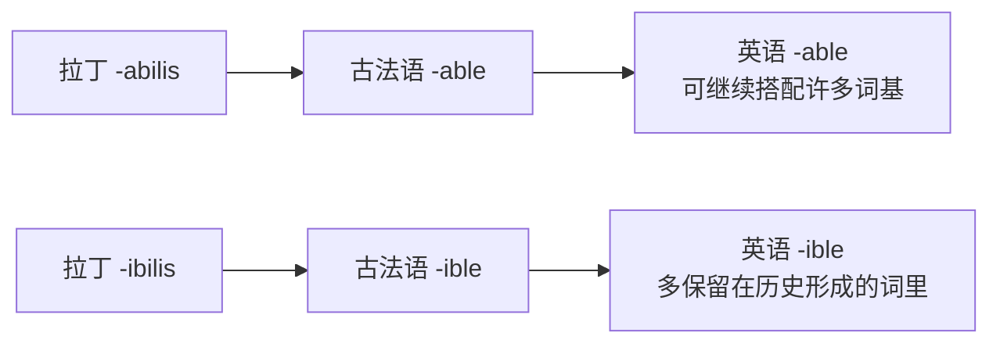

# 第 31 章 -able的身世：从拉丁形容词后缀到英语高产后缀

> 英语后缀界有一位出了名的劳模,叫 `-able`。它是个永不疲倦的盖章员,见谁盖谁——`read`(读)过来盖一下,变 `readable` /ˈridəbəl/(可读的);`drink`(喝)过来盖一下,变 `drinkable` /ˈdrɪŋkəbəl/(可喝的)。整本动词表排着队等它盖章,它从不歇业。

这一章讲的就是这位劳模——**英语中能产性最强的形容词后缀** `-able`,顺便会会它那个长得几乎一模一样、却让人抓狂的孪生兄弟 `-ible`。

`-able` 的派生能力强到什么程度?这么说吧:**英语里几乎每一个动词,身后都蹲着一个被动等待的形容词,平时是隐形的;`-able` 一盖,它就显形**。`readable`、`drinkable`、`predictable` /prɪˈdɪktəbəl/、`unbelievable` /ˌʌnbəˈlivəbəl/……它把动词一个个变成"能被……的"。当然,盖出来的词成不成立,还得看语义和真实用法——劳模偶尔也会盖出没人要的废件。

它的来历要追到拉丁后缀的两种形式。这俩今天听起来几乎一样,拼写却各自死守着祖上的档案——也正是这点,让无数英语学习者在 `a` 和 `i` 之间反复横跳,连母语者都常常拼错。

---

## 31.1 -able vs -ible:两个历史形式

`-able` 和 `-ible` 是一对几千年前就分了家的双胞胎,祖上都来自拉丁。它俩今天长得几乎一模一样,只差第二个字母,却让无数英语学习者对着拼写栏发呆半分钟,最后还是赌一把。

### -able 来自拉丁 -abilis

`-able` 是那个**外向、爱交朋友、至今还在四处接活**的兄弟。它来自拉丁后缀 ***-abilis***,加在动词后,表示"**能被……的、值得被……的**"。

### -ible 来自拉丁 -ibilis

`-ible` 则是那个**宅在家里、不太出门**的兄弟。它来自拉丁 ***-ibilis***,与 `-abilis` 历史同源,但性格保守得多:它主要待在那些从法语、拉丁语传进来的既有词里,名单稳定,临时扩招很少。你今天想自己造个新词去求它盖章?它多半摆摆手——"这不归我管,你去找我哥。"

两条路线不用各拍一张证件照,合在一张图里反而更容易看出区别:

### -able 和 -ible 的区别

| 后缀 | 特点 | 例词 |
| ------ | ------ | ------ |
| `-able` | 可跨来源加在许多动词或词基后 | `read + able`, `love + able`, `pay + able` |
| `-ible` | 多见于历史形成的法语、拉丁来源词 | `vis + ible`, `cred + ible`, `tang + ible` |

一句话总结:**新词找 `-able`,老词逐个记**。这两兄弟长在同一个家谱上,工作风格却南辕北辙——一个满世界盖章,一个守着祖传名单不肯挪窝。

---

## 31.2 -able 的核心义:"与某个动作或性质相关"

`-able` 最常做的事,是给动词**翻一面**——把"做"变成"被做",把"能去做的能力"变成"能被做的可能性"。可以这样想象:**每一个动词里,都暗藏着一个等待激活的形容词,平时是潜伏状态;`-able` 一盖,它就被激活。**

`read`(读)被盖一下,显出 `readable` /ˈridəbəl/(能被读的);`solve` /sɑlv/(解决)被盖一下,显出 `solvable` /ˈsɑlvəbəl/(能被解决的)。**"能被……的"是 `-able` 最常见的一类**——也就是**被动可能性**:

| 动词 | 词基 + able | 形容词 | 释义 |
| ------ | ------ | ------ | ------ |
| `read`(读) | `read + able` | `readable` | 能被读的 |
| `drink`(喝) | `drink + able` | `drinkable` /ˈdrɪŋkəbəl/ | 能被喝的 |
| `predict` /prɪˈdɪkt/(预测) | `predict + able` | `predictable` /prɪˈdɪktəbəl/ | 能被预测的 |
| `solve`(解决) | `solve + able` | `solvable` | 能被解决的 |
| `love`(爱) | `love + able` | `lovable` /ˈlʌvəbəl/ | 能被爱的 |
| `pay`(付) | `pay + able` | `payable` /ˈpeɪəbəl/ | 可支付的 |

### 一个重要的认知:被动 vs 主动

`-able` **绝大多数时候是被动**("能被读"),但也有一小撮词不按常理出牌,**反着来——主动**("能去做……")。这就好比盖了章却盖反了:本来该"被……",结果它自己动起来了:

| 语义类型 | 形容词 | 释义 |
| ------ | ------ | ------ |
| 被动义(大多数) | `readable` /ˈridəbəl/ | 能被读的 |
| 被动义(大多数) | `drinkable` /ˈdrɪŋkəbəl/ | 能被喝的 |
| 主动义(少数) | `comfortable` /ˈkʌmfərtəbəl/ | 令人舒适的(能给人舒适) |
| 主动义(少数) | `agreeable` /əˈɡriəbəl/ | 令人愉快的 |
| 主动义(少数) | `changeable` /ˈtʃeɪndʒəbəl/ | 易变的(自己变) |

大多数 `-able` 词规规矩矩守着被动义,但少数词因长期使用、词义漂移,慢慢"叛变"成了主动义。而且 `-able` 的含义不止"被动可能性"和"主动倾向"两种——它还能表示**"适合、值得、容易、倾向于"**等意义(如 `reliable` /rɪˈlaɪəbəl/ 可靠的、`valuable` /ˈvæljuəbəl/ 有价值的、`fashionable` 流行的)。遇到具体词别光看后缀,还得结合实际用法判断。

---

## 31.3 -able 的"前缀 + 动词 + able"模板

`-able` 不仅自己能干,还擅长**叠 buff**——尤其爱跟否定前缀 `un-` 组队。上一节已经看过它单独接活,这里直接把 `un-` 叠上去:一个负责"能被",一个负责"不",合力造出一大批"打不破、躲不开、信不过"的硬核形容词。

| 拆分 | 形容词 | 释义 |
| ------ | ------ | ------ |
| `un + read + able` | `unreadable` /ʌnˈridəbəl/ | 不可读的 |
| `un + believ + able` | `unbelievable` /ˌʌnbəˈlivəbəl/ | 难以置信的 |
| `un + avoid + able` | `unavoidable` /ˌʌnəˈvɔɪdəbəl/ | 不可避免的 |
| `un + accept + able` | `unacceptable` /ˌʌnəkˈsɛptəbəl/ | 不可接受的 |

`unbreakable` /ʌnˈbreɪkəbəl/(打不破的)、`unbelievable`(难以置信的)——这套"`un-` + 动词 + `-able`"的三件套,是英语里最高频的否定形容词生产线。`un-` 在门口拦一道"不",`-able` 在里头补一句"能被",双 buff 叠满,语气硬到无可辩驳。

---

## 31.4 -able 的几个特殊用法

正经工作讲完了,该翻翻这位劳模的兼职记录。除了本职的"能被……",`-able` 还偷偷接了几份私活,有时表达的意思离"被动可能性"挺远——简直是后缀界的斜杠青年。

下面是它的三份兼职。

### 用法 1:`-able` 表示"倾向、特性"

有些 `-able` 词不强调"能被做",而是形容主语**天生爱干某事**——比如 `changeable` /ˈtʃeɪndʒəbəl/(易变的),说的是它自己老变,不是"能被变":

| 词基 + able | 形容词 | 释义 |
| ------ | ------ | ------ |
| `change + able` | `changeable` | 易变的 |
| `mistake + able` | `mistakable` | 易弄错的 |
| `perish + able` | `perishable` /ˈpɛrɪʃəbəl/ | 易腐坏的 |
| `forget + able` | `forgettable` /fərˈɡɛtəbəl/ | 易忘的 |

### 用法 2:`-able` 表示"值得、配得上"

`-able` 还有一份"颁奖词"的工作——表示"**值得被……的、配得上……的**"。

| 词基 + able | 形容词 | 释义 |
| ------ | ------ | ------ |
| `remark + able` | `remarkable` /rɪˈmɑrkəbəl/ | 值得注意的 |
| `notice + able` | `noticeable` /ˈnoʊtɪsəbəl/ | 值得注意的 |
| `lament + able` | `lamentable` /ˈlæməntəbəl/ | 可悲的 |

这里有个反差萌:**`remarkable`(非凡的)= 值得被谈论的**。`remark` /rɪˈmɑrk/ 是"谈论、评论",`-able` 一盖,就是"值得被评论的"。所以一个 `remarkable` 的人,本意不过是"值得大家谈论的人"——能让人津津乐道,自然就非凡了。

### 用法 3:`-able` 加在名词后(罕见但存在)

`-able` 通常加在动词上,偶尔也跨界到名词后面——这是它的"业余爱好",少见但确实存在:

| 名词 + able | 形容词 | 释义 |
| ------ | ------ | ------ |
| `fashion + able` | `fashionable` /ˈfæʃənəbəl/ | 时尚的 |
| `peace + able` | `peaceable` /ˈpisəbəl/ | 和平的 |
| `companion + able` | `companionable` | 适合做朋友的 |

---

## 31.5 -able 的"复合后缀"

`-able` 还能跟别的后缀**拼成更大的后缀**,把形容词进一步改造成名词、副词。相当于它不仅自己干活,还组团接单:

| 复合后缀 | 词基 + 后缀 | 结果 | 词性/用途 |
| ------ | ------ | ------ | ------ |
| `-ability` | `able + ity` | `ability` /əˈbɪləˌti/ | 名词(能力) |
| `-ability` | `read + ability` | `readability` /ˌridəˈbɪləti/ | 名词(可读性) |
| `-ability` | `port + ability` | `portability` /ˌpɔrtəˈbɪləti/ | 名词(可移植性) |
| `-ably` | `remark + ably` | `remarkably` /rɪˈmɑrkəbli/ | 副词(非凡地) |

`-ability/-ibility` 是最常见的派生,专门把"`-able` 形容词"加工成"性质名词":`portable → portability`(可移植性)、`reliable → reliability`(可靠性)。不过并非每个 `-able` 词都有常用的对应名词,而 `capable → capability` 这种还夹着既有词干的变化。

---

## 31.6 -able 的几个有趣词源

讲到最后,留几个最能体现语义漂移的好故事。这些词的今天和它们的出生时,几乎是两个世界。

### `comfortable` /ˈkʌmfərtəbəl/(舒适的)

`comfortable` 是语义漂移界的经典案例。它来自拉丁 ***confortare***,字面意思是"**大力加强、加固**"——对,你没听错,你屁股底下那张柔软的沙发,祖先竟然是给城墙加固的。它经古法语 *conforter* 进入英语,本义是"**被强化的、铁壁铜墙的**"。

那么,一座堡垒是怎么变成软沙发的?故事的逻辑是:`confortare` 先从"加固"引申出"**给力量、给人支持**",再柔化成"**安慰**";`comfortable` 也就从"被强化的"一路软化为"令人安慰的、舒适的"。这是语义学里一次彻底的"软化手术"——**同一个词,一千年前站得像堵墙,今天躺得像张沙发**。

### `miserable` /ˈmɪzərəbəl/(悲惨的)

`miserable` 来自拉丁 ***miser***——"**悲惨的、可怜的**"。这词在拉丁语里天生就是个叹气的词,自带倒霉气场。它加上 `-abilis` 变成 *miserabilis*,本义是"**值得可怜的**";但语义走着走着就加了码,从"值得可怜"升级到"非常悲惨"。今天你说一个人 `miserable`,语气里那股彻头彻尾的倒霉劲,**和两千年前罗马人嘴里的 *miser* 几乎原汁原味**——这个词像一根接力棒,把人类的"惨"千年不变地传了下来。

### `horrible` /ˈhɔrəbəl/(可怕的)vs `horrid` /ˈhɔrɪd/(恐怖的)

这两个词是一对**失散多年的兄弟**,共同的父亲是拉丁 ***horrere***——"**发抖、毛骨悚然**"。`horrible` 走的是 `horribilis`(`-ibilis` 那条线)的形容词路线,最终长成"可怕的";`horrid` 则从 `horridus` 那边出来,本义偏"粗糙、令人毛骨悚然"。哥俩同根而生,长大后长相有别、性格也略有不同,但你一听就知道是一家人——那种让人脊背发凉的感觉,他们都从父亲那里继承了。

---

## 31.7 一个对照记忆:-able vs -ive

`-able` 和 `-ive` 长在同一片形容词后缀的地里,却性格相反——一个被动、一个主动,记混了容易闹笑话:

| 后缀 | 语义 | 例词 |
| ------ | ------ | ------ |
| `-able` | 能被……的(被动可能性) | `readable` /ˈridəbəl/(能被读的)、`lovable` /ˈlʌvəbəl/(能被爱的) |
| `-ive` | 有……倾向的(主动特性) | `active` /ˈæktɪv/(有行动力的)、`creative` /kriˈeɪtɪv/(有创造力的)、`talkative` /ˈtɔkətɪv/(爱说话的) |

一句话对照:**`-able` 管的是"能不能被做成",`-ive` 管的是"天生爱不爱干"**。前者是被动的能力,后者是主动的脾气。

---

## 31.8 本章小结

1. **`-able` 来自拉丁 -abilis,`-ible` 来自 -ibilis**——一对孪生兄弟,祖上同源,性格迥异:`-able` 开放外向、四处接活,`-ible` 封闭内敛、守着祖传名单。
2. **`-able` 的核心义:"能被……的"**——多数情况是把动词翻成被动可能性(`readable` /ˈridəbəl/ = 能被读)。每一个动词里,都蹲着一个隐形的被动形容词,`-able` 一盖就显形。
3. **`-able` + `un-` = "不可……"**——这套三件套是英语最高频的否定形容词生产线,`unbelievable` /ˌʌnbəˈlivəbəl/、`unacceptable` /ˌʌnəkˈsɛptəbəl/ 都是它的产品。

### 记忆锚点

> **`-able` = 能被……的。** 它是个永不疲倦的盖章员,见谁盖谁;`un-` 一来,再翻一面,变"不可……的"。记住这个盖章的画面,就抓住了 `-able` 的全部。

---

## 31.9 易错辨析

- **`-able` 爱接活,不等于来者不拒**。它比 `-ible` 开放得多,但你随手造的 `sleepable` 不一定有人买账。能不能成词,最终还是英语社区说了算。
- **`-ible` 的拼写没有万能口诀**。它守着一份祖传名单,`visible` /ˈvɪzəbəl/、`flexible`、`credible` /ˈkrɛdəbəl/……试图靠一条规则搞定所有,通常会收到几个例外寄来的投诉信。老老实实逐词记,反而最快。
- **大多数 `-able` 词是被动,但少数会"叛变"**。`comfortable` /ˈkʌmfərtəbəl/ 不是"能被舒适的",而是"令人舒适的"——盖章盖反了,自己动起来了。遇到具体词,结合用法判断,别只看后缀。
- **`-ability` 不能无限套公式**。`readable → readability` 很顺,但并非每个 `-able` 词都有对应名词,`capable → capability` 还夹着词干变化。想当然地补货,英语仓库不一定有存。

---

### 【思考题】(答案见附录 A)

1. **(破除误解)** `-able` 一般表示"能被……的"(被动),可 `comfortable` 却是"令人舒适的"(主动),`readable` 是"能被读的"(被动)。为什么同一个 `-able` 会有两种?这提醒你拆 `-able` 词时不能怎么做?
2. **(讲证据)** `-able` 和 `-ible` 只差一个字母、读音也几乎一样。为什么不能靠一条"什么时候用 a、什么时候用 i"的规则拼对?它俩的分工是怎么来的?拿不准时该怎么办?
3. **(迁移应用)** `remarkable` = remark(谈论)+ able,却意为"非凡"。请解释这条引申(顺便说说 `-able` 除"能被"外还能表什么)。再判断-随手造的 `sleepable` 为什么不一定成词——`-able` 能加在任意动词后吗?

---

*下一章 → [第 32 章 -ism与-ist：希腊名词后缀如何走向世界](./第32章--ism与-ist：希腊名词后缀如何走向世界.md)*
