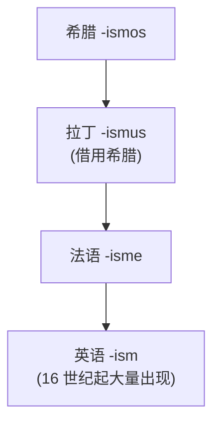
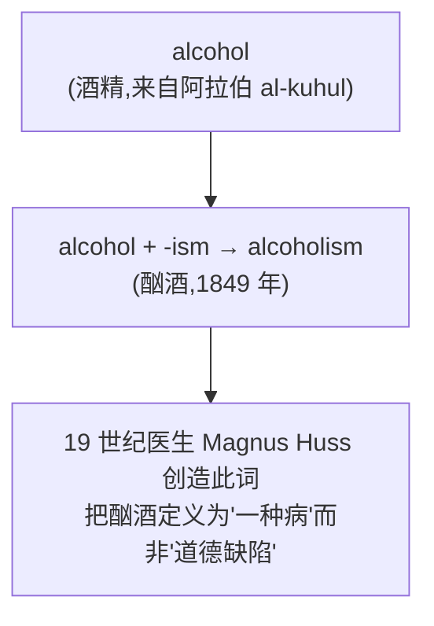
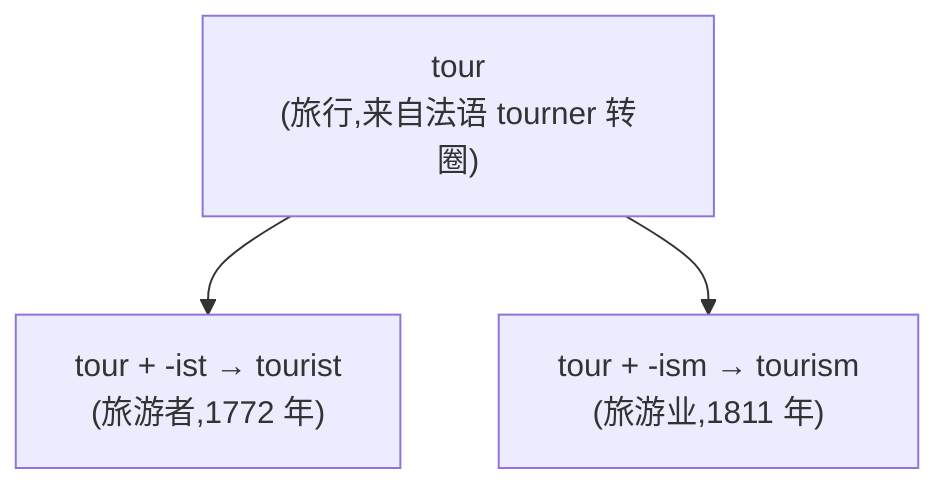

# 第 32 章 -ism与-ist：希腊名词后缀如何走向世界

> 一个希腊小后缀,被借了两千年,在 1789 年之后的欧洲突然被所有人同时想起来。给一种思想加 `-ism`,再给支持者加 `-ist`,像语言在自动批量开账号。

这一章讲**两个相关的希腊后缀**:`-ism`(主义、学说)和 `-ist`(主义者)。

它俩本是希腊语法里一个不起眼的小零件,专门给词根贴"行为、状态"的小标签,安安静静待了两千年。然后 1789 年巴士底狱被攻陷了,整个 19 世纪的政治家、哲学家、社会活动家忽然都急需给自己的主张起名字——于是 `-ism` 从一个安静的词法小标签,被推上风口浪尖,变成了 19-20 世纪最政治化的语言现象。

`socialism` /ˈsoʊʃəˌlɪzəm/、`communism` /ˈkɑmjəˌnɪzəm/、`nationalism` /ˈnæʃənəˌlɪzəm/、`feminism` /ˈfɛməˌnɪzəm/、`capitalism` /ˈkæpətəˌlɪzəm/、`Marxism` /ˈmɑrksɪzəm/、`racism` /ˈreɪˌsɪzəm/、`tourism` /ˈtʊˌrɪzəm/……一对希腊孪生兄弟,被推着走完了从"语法零件"到"政治命名机器"的奇妙旅程。这一章要讲的,就是这场旅程中最有戏剧性的几段路。

---

## 32.1 -ism 的希腊起源

### -ismos:希腊的"行为、状态"小标签

希腊语里有一个很低调的后缀 ***-ismos***(拉丁化写作 -ismus)。它的本职工作是给名词或动词贴一张"行为、状态、学说"的小标签——比如给"浸"(baptizein)贴一张,得到 `baptismos`(洗礼);给"法利赛人"(Pharisaioi)贴一张,得到 `Pharisaismos`(法利赛人的行为)。

最初的 `-ismos` 就这样安静地干着贴标签的杂活,不掺和政治,不上头条。两千多年里,它从希腊借给拉丁(`-ismus`),又从拉丁传到法语(`-isme`),最后在 16 世纪进入英语(`-ism`)——一路借宿、一路改名,可没人在意它。

| 词基来源 | 词根 | `-ismos` 形式 | 含义 |
| ------ | ------ | ------ | ------ |
| baptizein(浸) | `baptizein` | `baptismos` | 洗礼 |
| Pharisaioi(法利赛人) | `Pharisaioi` | `Pharisaismos` | 法利赛人的行为 |

### -ismos → -ismus → -isme → -ism

这个后缀的传播路线很长:

### 1789:一个被叫醒的小后缀

`-ism` 真正的高光时刻,要从 1789 年讲起。那一年巴士底狱被攻陷,法国大革命把整个欧洲的思想界搅成一锅沸水。

接下来的半个多世纪里,`-ism` 像雨后蘑菇一样成片冒出来。`socialism` /ˈsoʊʃəˌlɪzəm/(1832)、`communism` /ˈkɑmjəˌnɪzəm/(1840 前后)、`nationalism` /ˈnæʃənəˌlɪzəm/(1844)、`feminism` /ˈfɛməˌnɪzəm/(1895,但理念早已酝酿)、`capitalism` /ˈkæpətəˌlɪzəm/(1854)、`Marxism` /ˈmɑrksɪzəm/(19 世纪中后期)……几乎每一种新冒出来的政治主张,都争先恐后给自己申请一个 `-ism` 当名字。

为什么这个时代突然需要这么多 `-ism`?原因很现实:**一种政治运动必须先有一个名字,才能被讨论、被拥护、被攻击。** 18 世纪以前当然早有宗教教派、哲学学说和政治争论,人们并不是每天只讨论“该忠于哪个国王”。变化在于革命、报刊、群众政治和工业社会让制度蓝图成批进入公共争论,标签需求猛增。`-ism` 恰好是一个现成、轻便、跨语言好搬运的命名工具,于是从老工具箱里被推到最显眼的工位。

需要说清的是:`-ism` 并非沉睡到 18 世纪才被发明。它早在 16 世纪就随拉丁、法语借入英语了——`baptism` /ˈbæpˌtɪzəm/(洗礼)、`martyrism`(殉道)这些词就是它默默干杂活时留下的旧账。1789 年只是把它从"语法零件"推成"政治命名机器"的转折点,不是它的出生证。

---

## 32.2 -ism 的现代意义:主义、学说、运动

`-ism` 被政治家们叫醒之后,干起了三件差事——而且这三件差事的画风差别之大,足以让你怀疑它们是不是同一个后缀。

第一件,也是最风光的:给**政治/哲学学说**命名。一个主张,贴上 `-ism`,就有了身份证。`capitalism` /ˈkæpətəˌlɪzəm/、`socialism` /ˈsoʊʃəˌlɪzəm/、`communism` /ˈkɑmjəˌnɪzəm/、`feminism`、`liberalism` /ˈlɪbərəˌlɪzəm/、`nationalism` /ˈnæʃənəˌlɪzəm/、`Marxism` /ˈmɑrksɪzəm/——这一票词把 `-ism` 推上了"主义制造机"的王座。

第二件,画风急转直下:给**歧视、偏见**命名。这是 20 世纪 `-ism` 的另一副面孔——`racism`、`sexism` /ˈsɛkˌsɪzəm/、`ageism`、`ableism`。带 `-ism` 的词,在 20 世纪逐渐带上了贬义味儿,因为批判性的词最常被这样造出来:一个不公正的现象被识别出来,被命名,才能被公开反对。可以说,20 世纪的 `-ism` 是民权运动话语的副产物——它把社会里那些原本不被点名的不公,一个一个推上了被告席。

第三件,回归本职:表示**状态、行为**。这部分是 `-ism` 最老实的差事——`tourism` /ˈtʊˌrɪzəm/(旅游业)、`alcoholism` /ˈælkəˌhɔlɪzəm/(酗酒)、`magnetism` /ˈmæɡnəˌtɪzəm/(磁性)、`heroism` /ˈhɛroʊˌɪzəm/(英雄主义)。这一类里也藏着几个本章稍后要细讲的好故事。

三件差事,三副面孔——下面逐个看看 `-ism` 的工作台上都堆着什么货。

### 意义 1:政治/哲学学说

| 词基 | 后缀 | 整词 | 含义 |
| ------ | ------ | ------ | ------ |
| `capital` | `-ism` | `capitalism` /ˈkæpətəˌlɪzəm/ | 资本主义 |
| `social` | `-ism` | `socialism` /ˈsoʊʃəˌlɪzəm/ | 社会主义 |
| `commun` | `-ism` | `communism` /ˈkɑmjəˌnɪzəm/ | 共产主义 |
| `femin` | `-ism` | `feminism` /ˈfɛməˌnɪzəm/ | 女权主义 |
| `liberal` /ˈlɪbərəl/ | `-ism` | `liberalism` /ˈlɪbərəˌlɪzəm/ | 自由主义 |
| `nation` /ˈneɪʃən/ | `-ism` | `nationalism` /ˈnæʃənəˌlɪzəm/ | 民族主义 |
| `Marx` /mɑrks/ | `-ism` | `Marxism` /ˈmɑrksɪzəm/ | 马克思主义 |

### 意义 2:歧视、偏见

| 词基 | 后缀 | 整词 | 含义 |
| ------ | ------ | ------ | ------ |
| `race` | `-ism` | `racism` /ˈreɪˌsɪzəm/ | 种族主义 |
| `sex` | `-ism` | `sexism` /ˈsɛkˌsɪzəm/ | 性别歧视 |
| `age` | `-ism` | `ageism` | 年龄歧视 |
| `able` | `-ism` | `ableism` | 健全中心主义 |

### 意义 3:状态、行为

| 词基 | 后缀 | 整词 | 含义 |
| ------ | ------ | ------ | ------ |
| `tour` /tʊr/ | `-ism` | `tourism` /ˈtʊˌrɪzəm/ | 旅游业 |
| `alcohol` /ˈælkəˌhɑl/ | `-ism` | `alcoholism` /ˈælkəˌhɔlɪzəm/ | 酗酒 |
| `magnet` /ˈmæɡnət/ | `-ism` | `magnetism` /ˈmæɡnəˌtɪzəm/ | 磁性 |
| `hero` /ˈhɪroʊ/ | `-ism` | `heroism` /ˈhɛroʊˌɪzəm/ | 英雄主义 |

---

## 32.3 -ist:主义者、从事者

如果说某个 `-ism` 是一种主张,对应的 `-ist` 常能指支持者,像是主张长出了肉身。但历史上 `-ist` 不是从 `-ism` 身上掰下来的一块“人形后缀”;它有自己的希腊、拉丁和法语传承路线,还广泛表示从业者、专家或实践者。给它一个主张,它可能造出支持者;给它一个行当,它也可能造出从业者。

| 词基 | 后缀 | 整词 | 含义 | 类别 |
| ------ | ------ | ------ | ------ | ------ |
| `capital` | `-ist` | `capitalist` /ˈkæpətəlɪst/ | 资本家 | 主义者 |
| `social` | `-ist` | `socialist` /ˈsoʊʃəlɪst/ | 社会主义者 | 主义者 |
| `femin` | `-ist` | `feminist` /ˈfɛmənɪst/ | 女权主义者 | 主义者 |
| `race` | `-ist` | `racist` /ˈreɪsɪst/ | 种族主义者 | 主义者 |
| `art` | `-ist` | `artist` /ˈɑrtəst/ | 艺术家 | 职业 |
| `piano` /piˈænoʊ/ | `-ist` | `pianist` /piˈænɪst/ | 钢琴家 | 职业 |
| `novel` /ˈnɑvəl/ | `-ist` | `novelist` /ˈnɑvəlɪst/ | 小说家 | 职业 |
| `science` | `-ist` | `scientist` /ˈsaɪəntɪst/ | 科学家 | 职业 |

注意 `-ist` 的两副面孔:在政治/哲学里,它是主张的人格化——`capitalist`(资本家)、`socialist`(社会主义者)、`feminist`(女权主义者)、`racist`(种族主义者);在职业里,它是手艺的持有者——`artist`(艺术家)、`pianist`(钢琴家)、`novelist`(小说家)、`scientist`(科学家)。同一个后缀,既能给人贴"我信什么"的标签,也能给人贴"我干什么"的标签,这就是 `-ist` 的灵活之处。

### -ism / -ist / -ize 的三件套

| 词基 | `-ism`(主义) | `-ist`(者) | `-ize`(化) |
| ------ | ------ | ------ | ------ |
| `capital` | `capitalism` /ˈkæpətəˌlɪzəm/(资本主义) | `capitalist` /ˈkæpətəlɪst/(资本家) | `capitalize` /ˈkæpətəˌlaɪz/(资本化) |
| `modern` | `modernism` /ˈmɑdərˌnɪzəm/(现代主义) | `modernist` /ˈmɑdərnɪst/(现代主义者) | `modernize` /ˈmɑdərˌnaɪz/(现代化) |
| `theory` /ˈθɪri/ | —(通常不说 theorism) | `theorist` /ˈθiərɪst/ | `theorize` /ˈθiəˌraɪz/ |

这套三件套看起来很整齐,像是流水线上的标准套餐:一个主张(`-ism`),一个信徒(`-ist`),一个动作(`-ize`)。可惜语言不是工厂,并非每个词基都老老实实配齐全套——`theory` 就是个明摆着的例子:有 `theorist`(理论家)、有 `theorize`(理论化),却偏偏没人说 `theorism`。一个词基配齐没配齐三件套,得查实际词典,不能想当然地补货。

---

## 32.4 -ism 的"现代膨胀"

到了现代,`-ism` 不仅没退休,反而越干越欢——它现在简直是个想给任何现象都发身份证的盖戳癖。一个新概念冒出来,媒体、评论员、网民第一时间想到的就是:"给这玩意儿加个 `-ism` 吧。"

于是就有了 `Trumpism` 这类标签,也有人临时造出 `Brexitism` 一类形式。它们的流通程度不在同一档:有的进入主流报道和词典,有的只在少量语境里露个脸。这种“`-ism` 万能贴”的能产性,让它在 21 世纪仍很活跃——只不过,造得出来不等于已经通用:

| 词基 | `-ism` 形式 | 是否通用 | 含义 |
| ------ | ------ | ------ | ------ |
| `multicultural` /ˌmʌltiˈkʌltʃərəl/ | `multiculturalism` /ˌmʌltiˈkʌltʃərəˌlɪzəm/ | ✓ | 多元文化主义 |
| `environmental` /ɪnˌvaɪrənˈmɛntəl/ | `environmentalism` /ɪnˌvaɪrənˈmɛntəˌlɪzəm/ | ✓ | 环保主义 |
| `consumer` /kənˈsumər/ | `consumerism` /kənˈsuməˌrɪzəm/ | ✓ | 消费主义 |
| `global` /ˈɡloʊbəl/ | `globalism` | ✓ | 全球主义 |
| `Trump` /trʌmp/ | `Trumpism` | 较常见 | 特朗普主义 |
| `Brexit` | `Brexitism` | 偶见、临时性较强 | 围绕脱欧的主张或风格 |
| `hubris` /ˈhjubrɪs/ | `hubrisism` 等理论上可临时造 | 极少见 | 听者也许能猜,不等于词典里已有固定座位 |

`hubris` 本身已经表示傲慢,再贴 `-ism` 往往显得画蛇添足;可语言里“几乎没人用”也不等于宇宙法庭宣布“不存在”。这正说明 `-ism` 的能产性受语义和习惯约束:听得懂、偶尔有人造、成为稳定词条,是三张不同的通行证。

---

## 32.5 -ism 本身中性,整词可褒可贬

这一节要澄清一个最容易引起的误解。前面我们看到 `racism` /ˈreɪˌsɪzəm/、`sexism` /ˈsɛkˌsɪzəm/ 带着浓重的贬义味儿,容易让人以为:`-ism` 这个后缀本身就带贬义。其实不是。

`-ism` 是中性的构词资源——它只负责"给一种东西命名",不带感情色彩。一个带 `-ism` 的词是褒是贬,取决于它命名的东西本身和说话人的立场。`racism` 是贬义,是因为种族歧视这件事本身就是该被批判的;`feminism` /ˈfɛməˌnɪzəm/、`liberalism` /ˈlɪbərəˌlɪzəm/ 这些词则依语境可褒可贬:

> **`-ism` 的褒贬演变**
>
> **中性或依语境变化**:`liberalism`、`socialism` /ˈsoʊʃəˌlɪzəm/、`feminism`、`modernism` /ˈmɑdərˌnɪzəm/
>
> **明确负面概念**:`racism`、`sexism`、`ageism`(负面来自歧视概念,不是后缀本身)
>
> **修辞性用法**:"It's just an -ism" = 这不过是又一个标签化意识形态

至于"It's just another -ism"这种说法——它确实带着一种轻蔑的口气,但那是修辞层面的贬义(说话人嫌弃"又一个标签"),不是后缀本身发生了贬义化。把后缀和修辞区分开,这一点很重要。

---

## 32.6 几个 -ism 的精彩故事

讲完结构,该讲故事了。这一节挑四个最能说明 `-ism` 威力的故事——其中三个直接来自 `-ism` 家族,还有一个虽然不是 `-ism`,却因为"有造词人和造词日期"而成了词汇史上的明星。

### `racism` /ˈreɪˌsɪzəm/ 一词的诞生:一个词如何改变一场辩论

`racism` 这个词的走红本身,就是 20 世纪民权话语的一部分。

现有词典和语料可把这个词的早期书面记录追到 19 世纪末附近,但“最早记录”会随着新文献被发现而提前,不能把某个年份刻成花岗岩。它在 20 世纪上半叶逐渐进入更广泛的公共讨论。其流行路径很说明问题:不是某天某个语言学家在书斋里把它“发明”出来,然后全社会统一更新词库;而是批判种族主义的讨论需要一个词,来指认、归纳一种长期存在的现象。

这就是 `-ism` 在 20 世纪最隐秘的威力:**当一个不公正的现象被命名,它就开始可以被公开反对。** 在 `racism` 这个词广泛流通之前,种族歧视的行为当然存在,但缺少一个能被反复点名、被辩论、被立法针对的"概念容器"。`-ism` 提供了这个容器——它把分散的、各色各样的歧视行为,收拢进一个可以放进报纸标题、法庭文件、演讲稿里的名词。一个词的走红,本身就是一场社会观念转变的脚印。

### `alcoholism` /ˈælkəˌhɔlɪzəm/(酗酒):把"罪"重新定义为"病"

如果说 `racism` /ˈreɪˌsɪzəm/ 的故事是"命名让事情可被反对",那么 `alcoholism` 的故事就是"命名让事情改变了性质"。

1849 年,瑞典医生 **Magnus Huss** 造出了 `alcoholism` 这个词。在他之前,长期过量饮酒被普遍看作一种**道德缺陷**——一个人喝成这样,是他的意志力有问题,是他的品性有污点,该受的是道德谴责。Huss 这个命名却悄悄换了一套框架:他把长期酗酒定义为**一种病理状态**——一种"病",而不是一种"罪"。

一个词的改变,撬动的是整个社会看待一种行为的方式。一旦酗酒被重新定义为疾病,它就有了被治疗的资格——医生可以介入,医院可以收治,保险可以覆盖,家人可以不再单纯地以"耻辱"对待它。这是 `-ism` 在医学和社会观念史上的一次硬核应用:**它不是给事物贴标签,而是给事物换了一套定性。** 当然,观念的转换从来不是一蹴而就的——Huss 的命名参与并加速了这场转换,而不是在 1849 年那一天单独完成了它。`-ism` 在这里表示的是一种状态、一种病理概念。

### `tourism` /ˈtʊˌrɪzəm/(旅游业):从贵族的"壮游"到全民产业

`tourism` 这个词背后,藏着一段关于"旅行如何变成旅游"的历史。

它的词根 `tour` /tʊr/(旅行)来自法语 *tourner*,本意是"转圈"。18 世纪的英国贵族子弟有一项传统:在完成牛津或剑桥的学业后,由家庭教师陪同,花上一两年时间游历欧洲大陆——法国、意大利、瑞士,看艺术、学语言、长见识。这就是著名的 **Grand Tour**(壮游),被视为贵族教育的最后一道工序。

`tourist` /ˈtʊrəst/(旅游者)这个词在 1772 年出现,`tourism`(旅游业)在 1811 年出现——这两个日期本身就讲完了一个故事:先有人去"转圈"旅游,然后才有人把"旅游这件事"打包成一门产业。`tourism` 诞生的那一刻,旅行从贵族的成年礼,变成了可以被规模化、被经营、被消费的商品。当然,在 `tourist` 出现之前人们也旅行——为贸易、朝圣、求学、外交、探险——但那都是"有目的的出行";`tourist` 标记的是一个新类别:**为了旅游本身而旅游的人。** `-ism` 在这里把一个行为提升成了一种现象、一个产业。

### `serendipity` /ˌsɛrənˈdɪpəti/(机缘巧合):不是 -ism,但有造词人

最后一个故事,虽然不是 `-ism`,却因为"有造词人和造词日期"而在词汇史上格外有名,值得一讲。

1754 年,英国作家 **Horace Walpole** 从一个波斯童话《锡兰三王子》(*The Three Princes of Serendip*)得到灵感:故事里的三位王子,凭偶然的机缘加上敏锐的判断力,发现了他们原本并没有去找的东西。Walpole 据此造出 `serendipity`,核心是"**偶然做出有价值的发现**"——不是单纯坐等好运砸到头上,而是"意外撞见 + 有眼光认出来"两件事缺一不可。

`serendipity` 是英语里极少数能精确说出"谁在什么日子、为什么造了它"的词——Walpole 在 1754 年的一封信里白纸黑字写明了这件事。这一点让它在词源爱好者圈子里成了明星:大多数词像河流,找不到源头;而 `serendipity` 像一口有铭文的井,连挖井人的名字都刻在边上。

---

## 32.7 本章小结

1. **-ism 来自希腊 -ismos,经拉丁 -ismus、法语 -isme 等路线进入英语**——它早已用于宗教、行为和状态词,近代群众政治又让它成为高产标签机。
2. **-ism 可表示学说、实践、行为或状态**——它本身是中性的构词资源,褒贬色彩来自整词和语境,而不是后缀本身。
3. **部分词族有 -ism / -ist / -ize 对应**——但不是每个词基都老老实实配齐全套,要查实际词典,不能机械补货。

### 一个最有趣的认知

> **一个安静的小后缀,被时代推着走了两千年;它真正的力量,不在于造词,而在于让事物"可被命名、可被讨论、可被反对"。**

---

## 32.8 易错辨析

- **`-ism / -ist / -ize` 三件套不能机械补齐**。`theory` /ˈθɪri/ 只有 `theorist` /ˈθiərɪst/ 和 `theorize` /ˈθiəˌraɪz/,没人说 `theorism`——流水线偶尔也会缺货,想当然补齐之前先查词典。
- **`-ism` 能产性强,不等于造出来的词都站得住脚**。`Trumpism` 较常见,`Brexitism` 偶见,`hubrisism` 即使临时造出也未必有人接单——后缀再勤快,也得看原料、语境和使用人数。
- **`-ism` 本身中性,贬义来自整词**。`racism` /ˈreɪˌsɪzəm/ 带贬义是因为种族歧视本身该批判,不是 `-ism` 自带毒性。说"It's just another -ism"带轻蔑口气,那是修辞,不是后缀属性。
- **`alcoholism` /ˈælkəˌhɔlɪzəm/ 的命名撬动了"罪→病"的观念转换,但不是一个词单独完成的**。社会、医学、法律多重力量共同推动,一个词只是其中一块跷跷板。

---

### 【思考题】(答案见附录 A)

1. 为什么 `racism` 的负面意义不能证明 `-ism` 后缀本身是贬义?再举一个中性或褒义的 `-ism` 词支持你的判断。
2. `racism` /ˈreɪˌsɪzəm/ 的"最早记录年代"和"广泛流行年代"有什么区别?为什么谈一个词"什么时候出现"时,这两者必须分开?
3. `-ism / -ist / -ize` 是一套三件套。以 `modern` 为例造出三个词,并说明各自的词性和意思;再想：这三件套是不是任何词根都能套?

---

*下一章 → [第 33 章 -ly的小史：古英语līc身体如何变成副词后缀](./第33章--ly的小史：古英语līc身体如何变成副词后缀.md)*
