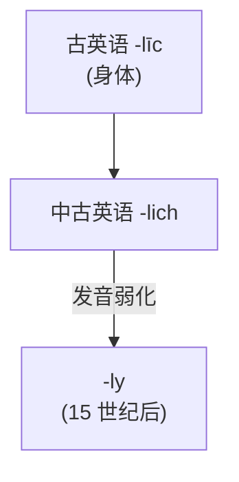

# 第 33 章 -ly 的小史:古英语 līc "身体"如何变成副词后缀

> 今天你嘴里的 `quickly`,一千年前的古英语人如果听到,理解成的字面画面大概是"长着一副快的身体(外形)"——因为 `-ly` 的祖宗就是古英语 `līc`,"身体、形态"。一个有血有肉的词,被时间磨成一具只剩两枚字母的骨架——天天被你念叨,却没人再听得见它曾经的呼吸。

第 6 卷的最后一章,讲英语后缀 `-ly`。它不孤单:德语 `-lich`、荷兰语 `-lijk` 是它的同族兄弟,只是各走各的路、各练各的功夫。

在英语里,`-ly` 是个**出场频率高到没法绕开的副词后缀**:`quickly`、`happily` /ˈhæpəli/、`carefully` /ˈkɛrfəli/、`slowly` /ˈsloʊli/……每一句像样的英语背后,几乎都蹲着它。它还兼职演一批形容词(`friendly` /ˈfrɛndli/、`lovely` /ˈlʌvli/),戏路很宽。

但它的来历,藏着全书最像鬼故事的一个反转:

> **`-ly` 的前身,是古英语 *līc*——"身体"。**

是的,你没看错。今天这副轻飘飘、只剩两枚字母的骨架,一千年前是个有血有肉的词。你每天念叨的 `quickly`,字面曾是"以快的身体做";`friendly` 曾是"长着一副朋友的身板"。一个表示"身体、形态"的词,是怎么一步步缩水、虚化,最终只剩两枚字母?这个故事穿越了一千多年,中途还分了形容词和副词两条岔路——并不是"身体"啪地一声就变成了 `-ly`。

下面,我们就来揭开这具骨架的来历。

---

## 33.1 līc:古英语的"身体"

### līc 的本义

故事的主角登场了:古英语 ***līc***,意为"**身体、形体**"。一个有鼻子有眼、会喘气会流血的词。注意,它跟现代英语 `like`(像)是同根的远房亲戚——这层关系能帮你记,但别把它当成"身体 = 像"的直通车,中间的演变远比这曲折。

### -līc 的原始用法

一千年前的古英语人,看什么都先看"身板"。`-līc` 往词基后头一贴,造出的就是"长着一副……身板的、像……的"形容词——评价一个人的方式,是评价他的身体:

| 词基 | 含义 | `+ līc` | 直译 | 现代义 |
| ------ | ------ | ------ | ------ | ------ |
| `gōd` | 好 | `gōdlic` | 有好的身体 | 美好的 |
| `fūl` | 脏 | `fūllic` | 有脏的身体 | 污秽的 |
| `frēond` | 朋友 | `frēondlic` | 像朋友的 | 友善的 |

一千年后,"身体"这层意思被磨得干干净净,只剩 `-ly` 两枚字母挂在词尾。`gōdlic` 早就没人记得它曾夸人"身板好",`frēondlic` 也没人想到它原本说的是"长得像个朋友"——血肉被时间风化,留下的只有骨架。

---

## 33.2 从"身体"到"方式":语义漂移

### -lic → -lich → -ly 的演变

这具"身体"是怎么一步步被磨成 `-ly` 的?答案简单到有点残忍:**发音弱化**。词尾像被风吹走的沙,`-lic` 那个有血有肉的"身体",一点点被磨平:`c` 先被磨钝成 `-lich` 的气音,再连这点气也散了,最后只剩下两枚字母 `-ly`。一千年风化,一具身体变成一副骨架。

### 形容词 -līc 与副词 -līce

这里埋着全书最容易让人栽跟头的一对双胞胎。古英语里,形容词后缀是 `-līc`,对应的副词形式是 `-līce`(尾巴多一个 `e`)——哥俩本来长得有区别,一眼能分清。可发音弱化这场风沙不认人,把 `-līc` 和 `-līce` 的尾巴一起磨平,最后都坍缩成了同一张脸 `-ly`。一千年前分得清清楚楚的哥俩,一千年后撞成了同一副长相——这就是为什么今天 `friendly` /ˈfrɛndli/(形容词)和 `quickly`(副词)看起来一模一样,干的却是两份截然不同的活。

| 时代 | 形式 | 词性/功能 | 说明 |
| ------ | ------ | ------ | ------ |
| 古英语 | `freondlic` | 形容词 | "像朋友的"→ 描述友善特性 |
| 中古英语 | `freendly` | 形容词 | "像朋友的"已成形容词 |
| 现代英语 | `friendly` | ① 形容词后缀 | `friendly`、`lovely` /ˈlʌvli/ |
| 现代英语 | `quickly` | ② 副词后缀 | `quickly`、`happily` /ˈhæpəli/ |

所以,"身体"是怎么变成"方式"的?路线大致是:`-līc`("长着……身板的")先当形容词 → 它的副词形式 `-līce`("以……的身板去做")负责修饰动作 → 两个尾巴都被磨平成 `-ly` → 最后连"身板"这层意思也褪了色,只剩"以……的方式"。血肉层层剥落,功能却留了下来。

---

## 33.3 -ly 的两个现代功能

风化完成,`-ly` 走进了现代英语,身兼两职——一份副词,一份形容词。认它的诀窍只有一句:**看它贴在谁后面**。

### 功能 1:副词后缀(加在形容词后)

`-ly` 最拿手的活,是把形容词改造成副词——给"快"加上"地",给"快乐"加上"地":

| 形容词 | 后缀 | 副词 | 含义 |
| ------ | ------ | ------ | ------ |
| `quick` /kwɪk/ | `-ly` | `quickly` | 快速地 |
| `happy` | `-ly` | `happily` /ˈhæpəli/ | 快乐地 |
| `careful` /ˈkɛrfəl/ | `-ly` | `carefully` /ˈkɛrfəli/ | 小心地 |
| `slow` | `-ly` | `slowly` /ˈsloʊli/ | 缓慢地 |
| `beautiful` | `-ly` | `beautifully` /ˈbjutəfli/ | 美丽地 |

### 功能 2:形容词后缀(加在名词后)

可别忘了,`-ly` 还留着它的祖传手艺——当形容词。它的本义是"像……的、有……性质的",贴在名词后面照样能干活:

| 名词 | 后缀 | 形容词 | 含义 |
| ------ | ------ | ------ | ------ |
| `friend` | `-ly` | `friendly` /ˈfrɛndli/ | 友善的 |
| `love` | `-ly` | `lovely` /ˈlʌvli/ | 可爱的 |
| `man` | `-ly` | `manly` /ˈmænli/ | 有男子气的 |
| `week` | `-ly` | `weekly` /ˈwikli/ | 每周的 |
| `ghost` /ɡoʊst/ | `-ly` | `ghostly` /ˈɡoʊstli/ | 幽灵般的 |

这一栏的词,长得跟上面那批副词一模一样,可它们是**地地道道的形容词**——这是 `-ly` 派最容易踩的坑。

### 易混点:-ly 形容词 vs -ly 副词

| 例句 | 正误 | 说明 |
| ------ | ------ | ------ |
| "He speaks friendly." | ✗ 错误 | `friendly` /ˈfrɛndli/ 是形容词,不能修饰动词 |
| "He is friendly." | ✓ 正确 | 作表语 |
| "He speaks in a friendly way." | ✓ 正确 | 迂回说法充当方式状语 |

一句话辨认:**贴在名词后 = 形容词(`friendly`、`lovely` /ˈlʌvli/),贴在形容词后 = 副词(`quickly`、`happily` /ˈhæpəli/)**。同脸不同命,全看它站在谁身后。

---

## 33.4 -ly 的"高频副词群"

认完了 `-ly` 的两张面孔,该见识一下它的出场频率了。这么说吧——如果英语句子是一栋楼,`-ly` 副词就是随处可见的门把手,你不注意它的存在,但离了它你哪个房间也进不去。下面是一组常见成员,按分工归类:

| 类别 | 高频 `-ly` 副词 |
| ------ | ------ |
| 程度 | really, very, highly, deeply |
| 方式 | quickly, slowly, carefully, easily |
| 时间 | recently, currently, finally, suddenly |
| 频率 | usually, frequently /ˈfrikwəntli/, rarely, occasionally /əˈkeɪʒənəli/ |

不过别被这阵仗唬住——以为"副词都以 `-ly` 结尾"。`very`、`often`、`well`、`fast`、`soon` 这些老牌副词,没一个挂 `-ly` 的牌子,照样混得风生水起。`-ly` 是主力,不是唯一。

### 一个有趣的对比:古英语 vs 现代英语

最能看出 `-ly` 本事的,是古英语和现代英语的副词系统一对照:

| 方面 | 古英语副词 | 现代英语副词 |
| ------ | ------ | ------ |
| 构成 | 用词尾变化,配合形容词的格变化 | 统一用 `-ly`,形容词 + ly |
| 例词 | `heardlice`(勇敢地)、`swīþe`(非常) | `quickly`、`carefully` /ˈkɛrfəli/ |
| 特点 | 形式多样、随格而变 | 简单清晰 |

古英语人造个副词,得让词尾跟着形容词的格变来变去,`heardlice`、`swīþe` 一大堆各唱各的调,记起来够呛。现代英语一句话解决:形容词 + `-ly`,一把万能钥匙开所有锁——这背后是一场千年的语法大扫除,把满屋子的词尾变化全压成了同一个 `-ly`。

---

## 33.5 -ly 的"特殊派生"

除了本职的"形容词→副词"和祖传的"名词→形容词",`-ly` 还有两个副业:给时间名词加个"每",给序数词加个"第"。

### `-ly` 加在时间名词后(表示"每……")

贴在时间名词后,`-ly` 就化身"周期制造机"——`day` 变 `daily`,`week` 变 `weekly` /ˈwikli/,一个时间单位立刻变成一个轮回:

| 时间名词 | 后缀 | 形容词/副词 | 含义 |
| ------ | ------ | ------ | ------ |
| `hour` | `-ly` | `hourly` /ˈaʊrli/ | 每小时的 |
| `day` | `-ly` | `daily` | 每天的 |
| `week` | `-ly` | `weekly` | 每周的 |
| `month` | `-ly` | `monthly` /ˈmʌnθli/ | 每月的 |
| `year` | `-ly` | `yearly` /ˈjɪrli/ | 每年的 |
| `quarter` /ˈkwɔrtər/ | `-ly` | `quarterly` /ˈkwɔrtərli/ | 每季度的 |

### `-ly` 加在序数词后

贴在序数词后,`-ly` 又变成"列单员",专门给观点排序:

| 序数词 | 后缀 | 序数副词 | 含义 |
| ------ | ------ | ------ | ------ |
| `first` | `-ly` | `firstly` /ˈfɜrstli/ | 首先 |
| `second` | `-ly` | `secondly` /ˈsɛkəndli/ | 其次 |
| `third` | `-ly` | `thirdly` /ˈθɜrdli/ | 第三 |

---

## 33.6 一个对照:-ly 形容词 vs 其他后缀形容词

英语里会造形容词的后缀不止 `-ly` 一个,但每个都有自己的脾气。把这几位拉到一起比一比,你会发现它们出身不同、脾气各异:

| 后缀 | 来源 | 加在什么后 | 例词 |
| ------ | ------ | ------ | ------ |
| `-ly` | 古英语 līc("身体") | 名词后 | `friendly` /ˈfrɛndli/、`lovely` /ˈlʌvli/、`manly` /ˈmænli/ |
| `-ful` | 古英语 full("满") | 名词后 | `beautiful`、`useful` /ˈjusfəl/、`hopeful` /ˈhoʊpfəl/ |
| `-less` | 古英语 leas("无") | 名词后 | `useless` /ˈjusləs/、`hopeless` /ˈhoʊpləs/、`careless` /ˈkɛrləs/ |
| `-ous` | 拉丁源 | 主要在拉丁/法语来源词后 | `dangerous` /ˈdeɪndʒərəs/、`famous` /ˈfeɪməs/、`curious` /ˈkjʊriəs/ |

四个后缀,四种脾气:`-ly` 是土生土长的本地人(日耳曼血统),说的是"像……的、有……身板的";`-ful` 是个"塞满派",张口就是"满满当当的"(hopeful = 满怀希望的);`-less` 是它的对头,一个"清空派",专说"没、缺"(hopeless = 一点希望没有);`-ous` 则是从拉丁借来的外乡客,主要在拉丁/法语来源词后露脸,说的是"有……特性的"。同是造形容词,走的却是四条路。

---

## 33.7 -ly 的"家庭"和未来

回顾 `-ly` 这一千年的家底,有四条值得记:

1. **底子老**:相关形式能追到古英语,已是千年老字号。
2. **手艺精**:高产得很,大批形容词靠它变副词——当然,也不是来者不拒。
3. **主业稳**:本职就是把形容词翻成副词,这是它最显眼的招牌。
4. **身兼两职**:还没丢掉祖传的形容词手艺,贴在名词后照样能干活。

一句话:这具从"身体"磨出来的骨架,至今还硬朗得很,没半点要退休的意思。

---

## 33.8 本章小结

1. **-ly 的更早来源与古英语 līc(身体、形态)同源**——副词后缀直接承接古英语副词形式 `-līce`。
2. **-ly 双重身份**:形容词后缀(名词 + ly,如 friendly)、副词后缀(形容词 + ly,如 quickly)。
3. **friendly, lovely, lonely 是形容词,不是副词**——这是常见混淆。

### 一个最意外的认知

> **-ly 和 like 是同根远亲**——都出自古英语 līc(身体、形体):manly 字面就是"有男人样子的"。一千年磨损,"身体"只剩两个字母。

下次你说 `quickly`,不妨停半秒——想想那具看不见的身体。一千年前的"以快的身体做",磨到今天只剩两枚字母,可它还在干活,还在每一句英语里呼吸。词是有寿命的,也是有尸骨的;`-ly`,就是 *līc* 留给现代英语的一具化石骨架。

---

## 33.9 易错辨析

- **`friendly` /ˈfrɛndli/、`lovely` /ˈlʌvli/、`lonely` /ˈloʊnli/ 是形容词,不是副词**。"He speaks friendly" 是常见错误——想说"友善地",得绕道用 "in a friendly way"。同脸不同命,全看它站在谁身后。
- **`-ly` 很高产,但不等于来者不拒**。`hard` 加了 `-ly` 变 `hardly` /ˈhɑrdli/,意思从"用力"变成"几乎不"——加个后缀,语义直接翻车。动手之前,先查查目的地对不对。
- **"身体"是同源背景,不是字面释义**。`quickly` 的祖先确实跟"身体"沾亲,但你不能真把它翻成"以快的身体做"——那是一千年前的事了,血肉早就风化成了骨架。
- **扁平副词（`drive slow`、`go fast`）不等于 `-ly` 在消亡**。英语一直有不带 `-ly` 的副词,`-ly` 至今仍是高产后缀,没半点要退休的意思。

---

### 【思考题】(答案见附录 A)

1. 古英语形容词 `-līc` 和副词 `-līce` 分别怎样对应现代 `friendly` /ˈfrɛndli/ 与 `quickly`?
2. 为什么 `friendly` 是形容词不是副词?(提示:加在名词 friend 后)
3. 古英语 `-līc` 到现代 `-ly`,从"身体"到"方式"的漂移,说明了语言演变的什么规律?

---

## 第 6 卷结束语

第 6 卷「词缀的故事」到此结束。这一卷你学到的核心:

-  否定前缀为何多源(un-/in-/dis-/a- 来自不同语言)
-  com-/con- 家族的五种同化形(拉丁 com- 与 cum 同源)
-  数字前缀和罗马历法(September = 第 7 月)
-  -tion / -able / -ism / -ly 四大高频后缀的身世

**到这里,全书主体内容(第 1-6 卷)全部完成!** 下一卷是**第 7 卷附录**——词根索引、词缀索引、民间词源辨正、思考题答案。

---

*下一卷 → [附录 A 思考题参考答案](../07-附录/附录A-思考题答案.md)*
