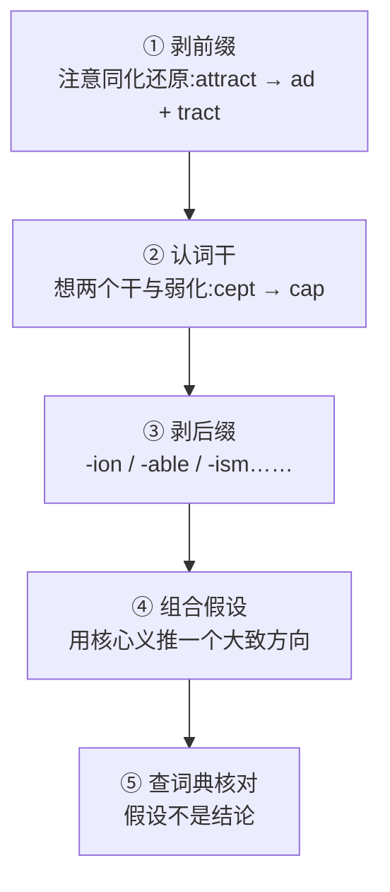

# 附录 E:词形变化规律速查

> 同一个词根在英语里有好几副面孔,不是它爱化妆,而是两千年的旅途上被几个海关各盖了一个章。这一页教你认章,不用认脸。

正文各章讲了几十个词族的故事,词形变化的规律散在其中。本附录把它们收拢成六条,每条给出规律、示例和详讲章节。遇到一个陌生变形,可以按 1 → 6 的顺序提出假设,再回到对应章节核对。

**使用说明**:

- 这六条规律解释的是"词根为什么在不同词里长得不一样",属于历史词源规律。
- 英语自己的拼写调整规则(hope → hoping 去 e、run → running 双写、happy → happiness 的 y → i)属于现代拼写法,不在本书范围内——那是"加后缀时怎么写"的问题,不是"词根为什么长这样"的问题。
- 规律帮你提出假设,不能代替核对。个别词是否真属某词族,以词典的词源栏为准。

---

## 规律 1:拉丁动词借给英语"两个干"(总钥匙)

这是本卷词族里最常用的一把钥匙,正文分散在各词族里讲,这里正面说一次。

拉丁动词在词典里有四个"主要部分",以 capere(抓、取)为例:**capiō, capere, cēpī, captum**。英语借词时,主要取走其中两套词干:

- **现在干**(来自 capere)→ `cap-`
- **分词干**(来自 captum)→ `capt-`

同一个动词的两个干,进入英语后各自开枝散叶——这就是许多拉丁词族总是"成对出现"的统一解释:

| 拉丁动词 | 现在干 → 例词 | 分词干 → 例词 | 详讲 |
| ------ | ------ | ------ | ------ |
| capere(抓) | cap- → capable, capacity | capt- → capture, captive | 第 7 章 |
| ducere(引) | duc- → induce, reduce | duct- → conduct, product | 第 5 章 |
| mittere(送) | mit- → admit, submit | miss- → mission, missile | 第 13 章 |
| scribere(写) | scrib- → describe, scribble | script- → script, description | 第 13 章 |
| videre(看) | vid- → video, evident | vis- → vision, visible | — |
| agere(做、驱动) | ag- → agent, agile | act- → action, actor | — |
| trahere(拉) | (英语借得很少) | tract- → attract, contract | 第 8 章 |

两点提醒:

- **不是所有变体都能塞进这两格**。复合弱化(规律 2)、法语磨损(规律 4)另有来源,第 3 章 §3.7 的限定仍然有效。
- **有的词族几乎只借走了分词干**(如 trahere → 英语派生词绝大多数用 tract-),两格不必都满。

---

## 规律 2:复合词里的元音弱化

拉丁词根进入复合词后,重音位置改变,词根里的短元音常被"压扁":

- **现在干里 a / e → i**:capere → re**cip**ere(recipient);facere → ef**fic**ere(efficient);tenēre → con**tin**ēre(continent);tangere → con**ting**ere(contingent)
- **分词干里 a → e**:captum → ac**cept**um(accept, concept);factum → per**fect**um(perfect, infect)

所以看到 `cip / fic / tin / cept / fect`,先把元音"还原"回 a,再想想它是不是 cap / fac / ten 的复合形。

**详讲**:第 7 章(capere 家族)。

---

## 规律 3:前缀同化——嘴巴偷懒定律

前缀末尾的辅音,会向后面词根的首辅音"靠拢",让连读少动一次舌头。这就是同一个前缀有一堆"马甲"的原因:

| 前缀 | 同化形 | 例词 |
| ------ | ------ | ------ |
| `in-`(否定) | il- / im- / ir- | illegal, impossible, irregular |
| `com-`(共同) | co- / col- / con- / cor- | cooperate, collect, connect, correct |
| `sub-`(下) | suc- / suf- / sup- / sus- | succeed, suffice, support, sustain |
| `ex-`(出) | ef- / e- | effect, emit |

其中同化最凶的是 `ad-`(朝向)——正文没来得及展开,这里补全它的九副面孔:

| ad- 变形 | 跟随辅音 | 例词 |
| ------ | ------ | ------ |
| ac- | c/q | accept, accord, acquire |
| af- | f | affirm, affect |
| ag- | g | aggressive |
| al- | l | allocate, allude |
| an- | n | announce, annex |
| ap- | p | appoint, approach |
| ar- | r | arrive, arrest |
| as- | s | assist, assign |
| at- | t | attract, attend |

**识别技巧**:一个词以"元音 a + 双辅音"开头(att-, aff-, agg-, all-, app-, arr-, ass-, acc-, ann-),先猜 `ad-` 同化——双写的第一个辅音多半是 d 变来的。

**详讲**:第 27 章(in-)、第 28 章(com- 五种同化形)、第 4 章(sub- → su-)。

---

## 规律 4:法语中转站的磨损与"双式词"

经法语进入英语的拉丁词,往往在路上被磨掉了棱角;文艺复兴时又有一批同源词从拉丁语直接借入,保留着完整词形。同一个拉丁词由此在英语里留下两个后代——**双式词(doublet)**:一个圆润,一个方正。

| 拉丁原词 | 经法语(磨损) | 直借拉丁(完整) |
| ------ | ------ | ------ |
| traditionem | treason | tradition |
| regalis | royal | regal |
| securus | sure | secure |
| fragilis | frail | fragile |

看到 `ceiv / roy / sure` 这类圆润的拼法,可以猜"法语路线";看到 `cept / reg / secur` 这类完整拼法,多半是直借。注意:拉丁 `-ct-` 等辅音群在法语里的变化因词而异,**没有统一公式**(见第 26 章)。

**详讲**:第 7 章(ceiv-)、第 23、25、26 章(法语层)。

---

## 规律 5:希腊词的乐高拼装——连接元音

古典复合词里常见连接元音或历史词干元音。希腊组合形式尤其常带 `-o-`:bi(o) + logy → biology,therm(o) + meter → thermometer;一些拉丁复合词里可见 `-i-`,如 carn**i**vore、agr**i**culture,但具体形式受词干、构词年代和传播路线影响,不是“希腊永远用 o、拉丁永远用 i”的边检规定。`magnify` 等词还涉及既成历史词形,不能只凭中间一个 i 就宣布发现了接口。

看到词中间的 o 或 i,可以把“连接元音/词干元音”列入候选,再核对完整历史构形。孤零零一个字母只是敲门声,不是身份证。

**详讲**:第 14 章。

---

## 规律 6:日耳曼底层——格林定律与元音交替

英语本土词与拉丁、希腊借词的"亲缘对",由格林定律解释(简表,全表见第 1 章):

| 原始印欧语 | 日耳曼(英语本土) | 例 |
| ------ | ------ | ------ |
| *p | f | pater / father |
| *t | th | tres / three |
| *k | h | canis / hound |
| *d | t | dent- / tooth |

日耳曼词族内部的"认亲信物"则是**元音交替(ablaut)**:sing – sang – sung – song,同一个根靠换元音分工。

**详讲**:第 1 章、第 20 章。

---

## 拆词五步法:规律怎么用

这套流程和全书反复强调的原则一致:**词根给你的是假设,词典给你的才是结论**。规律越熟,第 ①② 步越快;但第 ⑤ 步永远不能省。

---

## 全书结束语

至此,整本《词根词缀的故事》全部完成——从六千年前的草原到你手里这杯咖啡(coffee,阿拉伯语 *qahwa*,经土耳其语和意大利语辗转进入英语),从宙斯的天空到维京人的风眼,从罗马神鸡的胃口到你碗里那块 beef(它和 cow 是失散千年的远房亲戚)。

希望这本书让你对英语词汇有了**全新的眼光**:每个词不再是一串字母,而是一条需要证据、也允许保留不确定性的历史路径。下次遇到一个精彩词源故事时,愿你既能记住它,也会追问:最早的文献记录在哪?语音变化说得通吗?证据够不够签字画押?

这就是词根词缀本该有的样子——有故事,有证据,偶尔还有一只不肯吃谷子的神鸡。

---

*上一篇 → [附录 D 民间词源辨正清单](./附录D-民间词源辨正清单.md) · 返回 → [全书目录](../README.md)*
