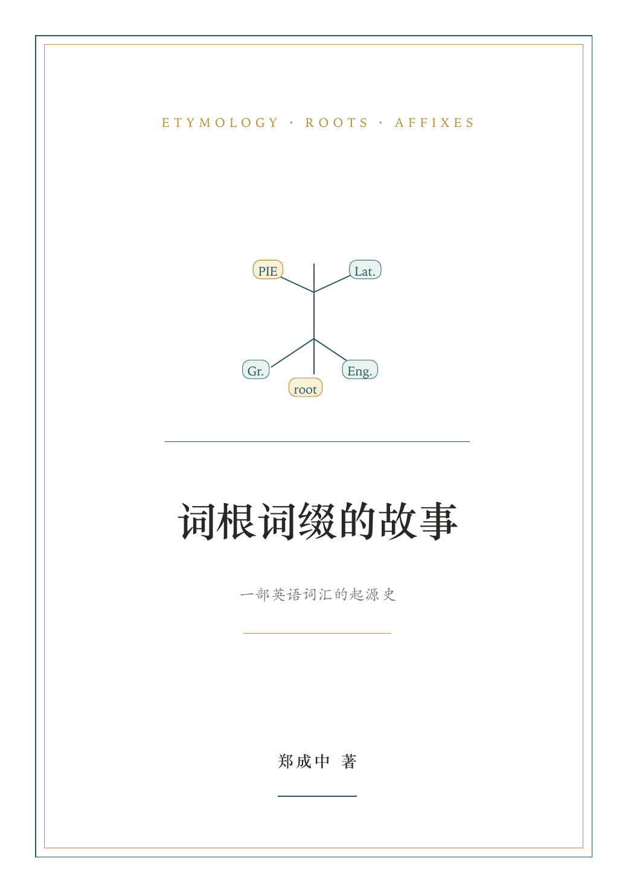
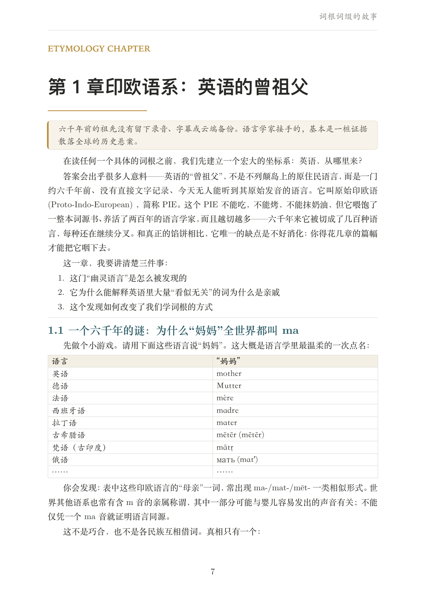
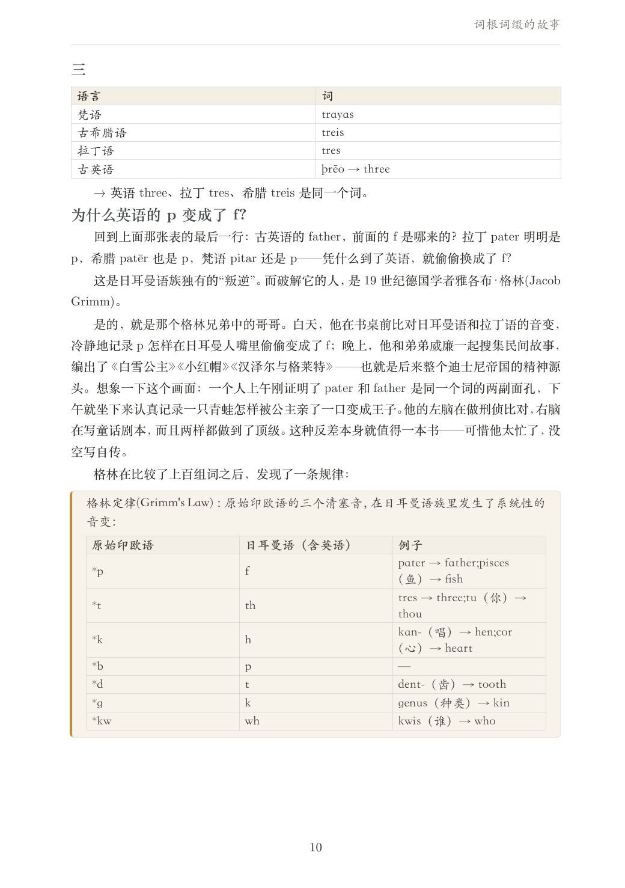
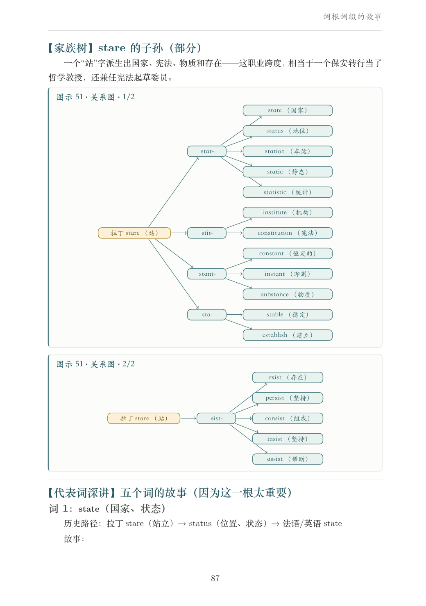
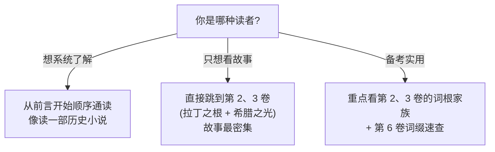

# 词根词缀的故事:一部英语词汇的起源史

> **这不是一本词根词缀的清单,而是一部探究"为什么"的故事书。**
>
> 每一个词根、每一个词缀的引入,都要回答一个问题:
> **它从哪里来?它经历了什么?它为什么长成今天这个样子?**

---

## 预览

<table>
  <tr>
    <td align="center">封面 · 词源树</td>
    <td align="center">章节首页 · 装饰头</td>
  </tr>
  <tr>
    <td></td>
    <td></td>
  </tr>
  <tr>
    <td align="center">同源词对比 · 印欧语三兄弟</td>
    <td align="center">家族树 · 拉丁词根关系图</td>
  </tr>
  <tr>
    <td></td>
    <td></td>
  </tr>
</table>

完整 PDF 见 [Releases](https://github.com/swiftczz/roots-affixes-book/releases)。

---

## 这本书的不同之处

市面上的词根词缀书,大多是**清单**——按字母排序或按语义分组,罗列词根 + 例词,让你背。

但人类的记忆规律告诉我们:**我们记得住故事,记不住清单。**

所以这本书换个写法:

- 不按字母排序
- 不以清单为主要讲述方式——故事负责建立理解和记忆,表格负责复习与归纳
- 不做机械的"前缀+词根+后缀"拆解练习
- **按文明源流分卷**(拉丁、希腊、日耳曼、法语)
- **按起源故事分章**(每章围绕一个主题或一群同源词)
- **每个词根词缀都讲一个故事**——不只是"为什么",还要让你看到画面:罗马占卜官出征前观神鸡决定吉凶(auspice)、威尼斯总督把金戒指扔进大海迎娶亚得里亚海(Doge)、哈罗德在黑斯廷斯传说中箭穿眼(巴约挂毯)、毕达哥拉斯因为不肯踩过豆田而被捕
- **传说、神话、轶事照讲**——无法严格考证的故事用 *(传说)* *(神话)* 标注,但不让学术谨慎把故事憋死;需要补充的可靠性说明,放在相关位置或章末"史实与传说"中
- **大量 Mermaid 图和表格**辅助理解

图中的线条也有固定含义:**实线箭头表示历史派生或明确的发展路线;虚线表示概念关联、意义联想或有争议的关系。** 同源但互不派生的词,从共同词根分别引出,避免把记忆关系画成词源关系。

---

## 词源严谨性原则

本书遵循一条基本原则:

> **真实历史优先;传说、神话、轶事明确标注后照样讲。**

- **主体内容**以历史语言学研究和主流词源词典为依据,词根关系、音变规则、年代都有据可查
- **传说、神话、轶事**(如琼斯法官会 28 种语言、阿尔弗雷德烤糊蛋糕、克努特训海、维京战士狂化)用 *(传说)* *(神话)* *(待考证)* 标注,然后照讲——一个好故事不该因为没法 100% 证实就被憋死
- **学术限定不泼冷水**:有关史实、传说和学术争议的限定,放在相关位置或章末"史实与传说"中;构词和用法上的限制,放在"易错辨析"中。正文仍先把故事讲痛快,严谨性在需要处集中交代
- 对于有多种学术说法的词源(如 `sincere` 的真正来源),列出主流观点,不装确定
- 全书区分**历史词源成分**、**现代英语中仍可产的词缀**和**仅供记忆的切分**,避免把相似拼写都当成语素
- **标音面向约 2500 词汇量**:正文对较可能陌生或容易读错的现代英语词标注宽式美式 IPA;为保证 PDF 翻到任一页都能就近查到读音,同一词跨页或相隔较远时可以重复标注。全书统一用 `/ɜr/` 表示重读卷舌中央元音,用 `/ər/` 表示非重读卷舌元音,不使用带卷舌钩的 `/ɝ/`、`/ɚ/`;基础常用词不逐个标注,拉丁语、希腊语等来源词形也不硬套英语读音
- **引用边界**:当前版本是面向大众学习者的词源读物,不提供逐条学术脚注。需要在论文、课程或正式出版物中引用某条结论时,应根据附录 D 的参考资源继续核对

---

## 全书结构

- **00 · 前言** —— [为什么要从"起源"学词根](00-前言/前言.md)
- **01 · 阅读准备**(必读)
  - [第 1 章 印欧语系:英语的曾祖父](01-阅读准备/第01章-印欧语系.md)
  - [第 2 章 英语词汇的五次关键输入](01-阅读准备/第02章-英语词汇的五次关键输入.md)
- **02 · 拉丁之根**(古罗马留给英语的遗产)
  - [第 3 章 从台伯河到泰晤士河:拉丁语如何进入英语](02-拉丁之根/第03章-拉丁语如何进入英语.md)
  - [第 4 章 罗马人的"看":specere 家族(spec/spic/spect/speci)](02-拉丁之根/第04章-罗马人的看-specere家族.md)
  - [第 5 章 罗马人的"引导":ducere 家族(duc/duct)](02-拉丁之根/第05章-ducere家族.md)
  - [第 6 章 罗马人的"投掷":jacere 家族(ject)](02-拉丁之根/第06章-jacere家族.md)
  - [第 7 章 罗马人的"抓住":capere 家族(cap/capt/cip/cept/ceiv)](02-拉丁之根/第07章-capere家族.md)
  - [第 8 章 罗马人的"拉拽":trahere 家族(tract/treat)](02-拉丁之根/第08章-trahere家族.md)
  - [第 9 章 罗马人的"心灵":cor / mens / animus](02-拉丁之根/第09章-罗马人的心灵.md)
  - [第 10 章 罗马人的"死亡":mors / mortis 家族](02-拉丁之根/第10章-mors家族.md)
  - [第 11 章 罗马人的"站立":stare 家族(stat/stit/stant)](02-拉丁之根/第11章-stare家族.md)
  - [第 12 章 罗马人的"法律":lex / jus(法学词根集群)](02-拉丁之根/第12章-lex-jus家族.md)
  - [第 13 章 拉丁词根速查补遗(其他高频拉丁词根)](02-拉丁之根/第13章-拉丁词根速查补遗.md)
- **03 · 希腊之光**(古希腊留给科学和思想的遗产)
  - [第 14 章 希腊语为什么成了"科学语"](03-希腊之光/第14章-希腊语为什么成了科学语.md)
  - [第 15 章 哲学的诞生:philo-sophia(爱智慧)](03-希腊之光/第15章-哲学的诞生.md)
  - [第 16 章 民主的词根:demos + kratos](03-希腊之光/第16章-民主的词根.md)
  - [第 17 章 神话与词汇:普通词、神名和后世命名](03-希腊之光/第17章-众神的词根.md)
  - [第 18 章 学科的词根(-logy/-graphy/-metry 的由来)](03-希腊之光/第18章-学科的词根.md)
  - [第 19 章 希腊词根速查补遗](03-希腊之光/第19章-希腊词根速查补遗.md)
- **04 · 日耳曼之骨**(古英语留下的日常骨架)
  - [第 20 章 为什么最常用的词最短:日耳曼词的特性](04-日耳曼之骨/第20章-日耳曼词的特性.md)
  - [第 21 章 维京人留下的词:they/sky/egg 的北欧来源](04-日耳曼之骨/第21章-维京人留下的词.md)
  - [第 22 章 日耳曼词根速查(自由词根为主)](04-日耳曼之骨/第22章-日耳曼词根速查.md)
- **05 · 法语之饰**(诺曼征服后的多语接触)
  - [第 23 章 1066 年的一件事,如何重塑英语词汇](05-法语之饰/第23章-诺曼征服重塑英语.md)
  - [第 24 章 厨房里的征服:pig/pork, cow/beef](05-法语之饰/第24章-厨房里的征服.md)
  - [第 25 章 阶级的烙印:kingly/royal/regal](05-法语之饰/第25章-阶级的烙印.md)
  - [第 26 章 法语借词与词族速查](05-法语之饰/第26章-法语词根速查.md)
- **06 · 词缀的故事**(每个词缀都有自己的来历)
  - [第 27 章 否定前缀为什么这么多:un-/in-/dis-/a- 的不同来源](06-词缀的故事/第27章-否定前缀.md)
  - [第 28 章 com-/con- 家族:拉丁 com- "共同"的同化史](06-词缀的故事/第28章-com-con家族.md)
  - [第 29 章 希腊、拉丁数字前缀:uni/bi/tri/sept/oct/nov/dec](06-词缀的故事/第29章-数字前缀.md)
  - [第 30 章 -tion 的身世:从拉丁名词后缀到英语常见名词后缀](06-词缀的故事/第30章-tion的身世.md)
  - [第 31 章 -able 的身世:从拉丁形容词后缀到英语高产后缀](06-词缀的故事/第31章-able的身世.md)
  - [第 32 章 -ism 与 -ist:希腊名词后缀如何走向世界](06-词缀的故事/第32章-ism与ist.md)
  - [第 33 章 -ly 的小史:古英语 līc "身体"如何变成副词后缀](06-词缀的故事/第33章-ly的小史.md)
- **07 · 附录**
  - [A. 思考题参考答案](07-附录/附录A-思考题答案.md)
  - [B. 词根总索引(按字母,标注起源卷+章节)](07-附录/附录B-词根总索引.md)
  - [C. 词缀总索引](07-附录/附录C-词缀总索引.md)
  - [D. 民间词源与流行词源故事辨正清单](07-附录/附录D-民间词源辨正清单.md)
  - [E. 词形变化规律速查(六条规律 + 拆词五步法)](07-附录/附录E-词形变化规律速查.md)

---

## 阅读路线



---

## Typst/PDF 构建

本仓库的内容源文件是各卷各章的 Markdown。修改章节 `.md` 后,需要重新生成 Typst 正文并编译 PDF。

前置工具:

```bash
pandoc --version
typst --version
```

`typst` 建议使用 `0.15.0` 或更新版本。

在仓库根目录执行:

```bash
python3 typst/scripts/build_typst_book.py
typst compile typst/main.typ "typst/词根词缀的故事.pdf"
```

生成关系:

- `typst/scripts/build_typst_book.py`: 从 Markdown 生成 Typst 的构建脚本,需要提交到仓库。
- `typst/main.typ`: Typst 入口文件,需要提交到仓库。
- `typst/template.typ`: 书籍版式模板,需要提交到仓库。
- `typst/body.typ`: 由 Markdown 自动生成,不要手工修改。
- `typst/词根词缀的故事.pdf`: 编译产物,可随时重新生成。

如果只改正文内容,按上面的两条命令重新生成即可。如果改版式,修改 `typst/template.typ` 后也执行同样的两条命令。
